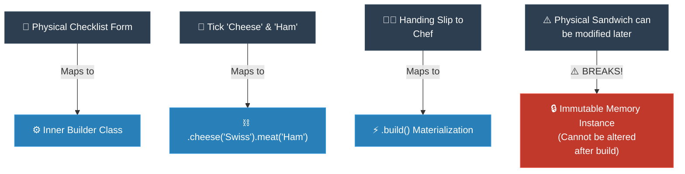

# Analogy Bridge: Builder (ស្ពានប្រៀបធៀបនៃ Builder)

**Author:** ichamrong  
**Date:** 2026-05-18  
**Tags:** #analogy-bridge #mental-mapping #design-patterns #builder #clean-code  
**Category:** Concepts / Analogy Bridge  
**Read Time:** ~6 min  

---

## 📌 មាតិកា (Table of Contents)
- [១. ស្ពានប្រៀបធៀប (The Analogy Bridge)](#១-ស្ពានប្រៀបធៀប-the-analogy-bridge)
- [២. ផែនទីផ្គូផ្គងស្ថាបត្យកម្ម (Structural Mapping)](#២-ផែនទីផ្គូផ្គងស្ថាបត្យកម្ម-structural-mapping)
- [៣. ចំណុចបាក់បែកនៃស្ពានប្រៀបធៀប (Where the Analogy Breaks)](#៣-ចំណុចបាក់បែកនៃស្ពានប្រៀបធៀប-where-the-analogy-breaks)
- [៤. ដ្យាក្រាមលំហូរ (Visual Flowchart)](#៤-ដ្យាក្រាមលំហូរ-visual-flowchart)
- [៥. Related Posts](#៥-related-posts)

---

## ១. ស្ពានប្រៀបធៀប (The Analogy Bridge)

### English
* **Known Domain (Real World):** Imagine walking into a beautiful, artisanal sandwich shop. You are craving the perfect lunch, but you have very specific tastes. If the waiter stood there and aggressively fired 20 questions at you in a row—"Bread type? Toasted? Mayo? Mustard? Tomatoes? Onions?"—you would feel overwhelmed, stressed, and likely forget half of what you wanted.
* **Unknown Domain (Software Architecture):** In code, creating a complex object (like a User Profile or an HTTP Request) by passing 15 parameters into a single constructor feels exactly like that aggressive waiter. It's confusing, error-prone, and a nightmare to read (`new User("John", null, true, false, 25)`). We call this the "Telescoping Constructor Anti-pattern."
* **The Bridge:** To bring joy back to the experience, the sandwich shop hands you a **beautifully designed Paper Checklist (The Builder)**. You sit peacefully at your table, gracefully ticking the exact boxes you care about—"Wheat Bread, please," "Add extra cheese," "Hold the onions." When you are perfectly satisfied, you hand the gentle slip to the chef. The Builder Pattern does exactly this in code. It gives you a clean, fluent step-by-step process (`.bread("Wheat").cheese("Extra").build()`), turning a stressful memory puzzle into an elegant, readable story.

### Khmer
* **ដែនដឹងស្គាល់ (ពិភពពិត):** ស្រមៃថាអ្នកដើរចូលទៅក្នុងហាងនំប៉័ងសាំងវិចដ៏ស្រស់ស្អាតមួយ។ អ្នកកំពុងឃ្លានអាហារថ្ងៃត្រង់ដ៏ឈ្ងុយឆ្ងាញ់ ប៉ុន្តែអ្នកមានចំណូលចិត្តជាក់លាក់ណាស់។ ប្រសិនបើអ្នករត់តុមកឈរពីមុខ ហើយសួរសំណួរចំនួន ២០ ផ្ទួនៗគ្នាដាក់អ្នក—«យកនំប៉័ងអ្វី? អាំងទេ? ដាក់ម៉ាយ៉ូណេសទេ? ដាក់ស្ពៃទេ? ខ្ទឹមបារាំងទេ?»—អ្នកប្រាកដជាមានអារម្មណ៍ថប់ដង្ហើម តានតឹង ហើយប្រហែលជាភ្លេចពាក់កណ្តាលនៃអ្វីដែលអ្នកចង់កម្ម៉ង់ជាមិនខាន។
* **ដែនមិនស្គាល់ (ស្ថាបត្យកម្មកូដ):** នៅក្នុងកូដ ការបង្កើត Object ដ៏ស្មុគស្មាញមួយ (ដូចជា User Profile ឬ HTTP Request) ដោយបញ្ជូនទិន្នន័យ (Parameters) ចំនួន ១៥ ចូលទៅក្នុង Constructor តែមួយ គឺមានអារម្មណ៍ដូចគ្នាបេះបិទទៅនឹងអ្នករត់តុដែលសួរសំណួរសម្រុកនោះអញ្ចឹង។ វាបង្កឱ្យមានការភ័ន្តច្រឡំ ងាយខុស និងពិបាកអានបំផុត (`new User("John", null, true, false, 25)`)។
* **ស្ពានតភ្ជាប់ (The Bridge):** ដើម្បីនាំយកក្តីរីករាយត្រលប់មកវិញ ហាងកាហ្វេបានហុច **ក្រដាសគូសកុម្ម៉ង់ (Checklist) ដ៏ស្រស់ស្អាតមួយ (The Builder)** មកឱ្យអ្នក។ អ្នកអង្គុយយ៉ាងស្ងប់ស្ងាត់នៅតុរបស់អ្នក រួចគូសធីកយ៉ាងថ្នមៗនូវអ្វីដែលអ្នកចង់បានពិតប្រាកដ—«សុំនំប៉័ងស្រូវសាលី», «ថែមឈីស», «មិនយកខ្ទឹមបារាំងទេ»។ នៅពេលដែលអ្នកពេញចិត្តទាំងស្រុងហើយ អ្នកគ្រាន់តែហុចក្រដាសដ៏រៀបរយនោះទៅចុងភៅ។ Builder Pattern ធ្វើរឿងនេះដូចគ្នាបេះបិទនៅក្នុងកូដ។ វាផ្តល់ឱ្យអ្នកនូវដំណើរការដ៏ស្អាតបាត និងជាជំហានៗ (`.bread("Wheat").cheese("Extra").build()`) ដែលប្រែក្លាយបញ្ហាស្មុគស្មាញ ទៅជារឿងរ៉ាវដ៏ស្រស់ស្អាត និងងាយយល់។

---

## ២. ផែនទីផ្គូផ្គងស្ថាបត្យកម្ម (Structural Mapping)

To translate real-world physical operations to JVM runtime object creation, we use this exact bridge:

| Physical Sandwich Checklist Domain | Software Builder Pattern Domain | Architectural Purpose |
| :--- | :--- | :--- |
| **Blank Checklist Form** | `Sandwich.Builder` static inner class | The transient, mutable vehicle containing configurations. |
| **Required Bread choice** | `new Builder("Wheat")` constructor | Enforces mandatory properties that cannot be skipped. |
| **Checking Sauce / Veggie box** | `.sauce("Mayo").veggies(true)` | Fluent method chaining (returning `this` for successive calls). |
| **Pre-filled Default boxes** | `boolean toasted = true;` | Declares sensible defaults so the client doesn't write extra code. |
| **Handing checklist to Chef** | `.build()` | Materializes the final, invariant-validated immutable `Sandwich`. |
| **The Cooked Sandwich** | `Sandwich` instance on heap | The actual immutable product protected from modifications. |

---

## ៣. ចំណុចបាក់បែកនៃស្ពានប្រៀបធៀប (Where the Analogy Breaks)

While the sandwich checklist is an exceptional mental map, the analogy breaks in two critical technical areas:

1. **Sequential Assembly Time Constraints:** In a physical kitchen, the order of assembly is highly constrained by physics (the chef cannot put the sauce *before* the bread). In software, fluent method chaining has zero spatial or temporal constraints; you can call `.toasted(true)` before `.sauce("Mayo")` or vice versa. The compiler doesn't care about order because all configuration data is collected in the builder frame before the final constructor materializes the object on the heap.
2. **Mutations After Build:** In a physical shop, if you receive the sandwich and decide you want to add pepper, you can physically open the bread and sprinkle pepper on it. In a robust software system, the built object is **100% Immutable**. You cannot add attributes after calling `.build()`. If you need a new variation, you must construct a brand-new object from a new builder.

---

## ៤. ដ្យាក្រាមលំហូរ (Visual Flowchart)

---

## ៥. Related Posts

### 🔗 Explore All Viewpoints:
* 📖 **Read the Parable:** [The 47-Question Waiter (អ្នករត់តុសួរ ៤៧ សំណួរ)](../../parables/76-the-overwhelmed-sandwich-shop.md) — The emotional story of a chaotic customer experience.
* 🧠 **Read the First Principles Derivation:** [MIT Professor Strategy: Builder (គោលការណ៍គ្រឹះដំបូងនៃ Builder)](../01-mit-professor/04-builder.md) — Derives the pattern from stack frame layouts and thread safety laws.
* 👶 **Read the Feynman Simplification:** [Feynman Technique: Builder (ការពន្យល់ពី Builder ដោយគ្មានពាក្យបច្ចេកទេស)](../02-feynman-technique/05-builder.md) — Breaks it down using a simple cafe menu checklist.
* 👦 **Read the ELI5 Metaphor:** [ELI5: Builder (ការពន្យល់ពី Builder ដូចក្មេងអាយុ ៥ ឆ្នាំ)](../03-eli5/05-builder.md) — Teaches a five-year-old using Lego spaceship construction books.
* 🌉 **Read the Analogy Bridge:** [Analogy Bridge: Builder (ស្ពានប្រៀបធៀបនៃ Builder)](../04-analogy-bridge/05-builder.md) — Maps real sandwich ticks to fluent Java methods, outlining physical limitations.
* 🧐 **Read the Socratic Discovery:** [Socratic Method: Builder (ការបង្កើត Object ស្មុគស្មាញតាមវិធីសាស្ត្រសូក្រាត)](../05-socratic-method/05-builder.md) — Probes yourself via a mentor-student constructor debate.
* 📰 **Read the Journalist Summary:** [Journalist: Builder (ការបង្កើត Object ស្មុគស្មាញជាជំហានៗ)](../06-journalist-inverted-pyramid/05-builder.md) — Quick news lede, telescoping prevention, and step-by-step assembly validation.
* 🎭 **Read the Storyteller Narrative:** [Storyteller: Builder (វីរបុរស Builder និងសង្គ្រាមប៉ារ៉ាម៉ែត្ររញ៉េរញ៉ៃ)](../07-storyteller-narrative-arc/05-builder.md) — Sopheap's battle against a production parameter bomb catastrophe on Black Friday.
* ⚙️ **Read the Engineer Spec:** [Engineer: Builder (ការបង្កើត Object ស្មុគស្មាញជាជំហានៗ)](../08-engineer-requirements-constraints-solution/01-builder.md) — Read the formal engineering requirements and candidate evaluation table.
* 📊 **Read the Pros & Cons:** [Pros & Cons Compared: Builder (ការប្រៀបធៀបគុណសម្បត្តិ និងគុណវិបត្តិនៃ Builder)](../09-pros-and-cons-compared/02-builder.md) — Full trade-off analysis and decision matrix.
* 🛠️ **Read the Code Implementation:** [Creational Patterns: The Art of Instantiation](../../../clean-code/design-patterns/01-creational-patterns.md#the-builder) — Production-grade Java with fluent chaining and immutable object construction.
