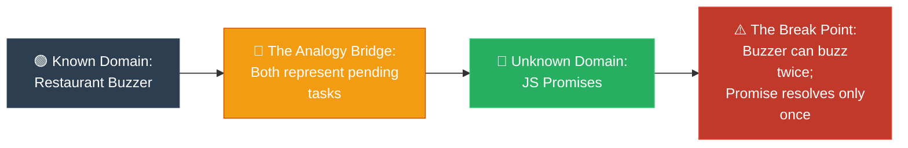

# Strategy 04: The Analogy Bridge (ស្ពានប្រៀបធៀប)

**Author:** ichamrong  
**Date:** 2026-05-18  
**Tags:** #explanation-strategies #analogy-bridge #mental-mapping #learning  
**Category:** Concepts / Explanation Strategies  
**Read Time:** ~5 min  

---

## 📌 មាតិកា (Table of Contents)
- [សេចក្តីផ្តើម (Introduction)](#សេចក្តីផ្តើម-introduction)
- [រូបមន្តនៃការដោះស្រាយ (The Formula)](#រូបមន្តនៃការដោះស្រាយ-the-formula)
- [ដ្យាក្រាមលំហូរ (Visual Flowchart)](#ដ្យាក្រាមលំហូរ-visual-flowchart)
- [ឧទាហរណ៍ជាក់ស្តែង៖ ស្វែងយល់ពី Promises (Practical Example)](#ឧទាហរណ៍ជាក់ស្តែង-ស្វែងយល់ពី-promises-practical-example)
- [មេរៀន និងដែនកំណត់ (When to Use & Limitations)](#មេរៀន-និងដែនកំណត់-when-to-use-limitations)

---

## សេចក្តីផ្តើម (Introduction)

The **Analogy Bridge** is a beautiful, compassionate teaching tool designed for learners stepping into unknown territory. Learning abstract, complex software architecture can often feel isolating and intimidating. Rather than leaving the learner to struggle in the dark, this strategy extends a comforting hand. It builds a strong, familiar bridge originating from a world they already deeply understand (like a cozy cafe or a post office) and gently guides them over to the new, complex concept. Most importantly, it honors their intelligence by carefully pointing out exactly **where the bridge ends**—where the physical metaphor gives way to the magic of virtual computing—ensuring they arrive safely with true technical mastery and confidence.

យុទ្ធសាស្ត្រ **Analogy Bridge (ស្ពានប្រៀបធៀប)** គឺជាឧបករណ៍បង្រៀនដ៏ស្រស់ស្អាត និងប្រកបដោយក្តីមេត្តា ដែលត្រូវបានរចនាឡើងសម្រាប់អ្នកសិក្សាដែលកំពុងបោះជំហានចូលទៅក្នុងដែនដីដែលពួកគេមិនធ្លាប់ស្គាល់។ ការរៀនពីស្ថាបត្យកម្មកូដដ៏អរូបី និងស្មុគស្មាញ ជារឿយៗអាចធ្វើឱ្យយើងមានអារម្មណ៍ឯកោ និងភ័យខ្លាច។ ជំនួសឱ្យការទុកឱ្យអ្នកសិក្សាតស៊ូក្នុងភាពងងឹត វិធីសាស្ត្រនេះបានលូកដៃដ៏កក់ក្តៅមកជួយទាញពួកគេ។ វាកសាងស្ពានដ៏រឹងមាំ និងធ្លាប់ស្គាល់ ដែលចាប់ផ្តើមចេញពីពិភពលោកដែលពួកគេយល់ច្បាស់រួចទៅហើយ (ដូចជាហាងកាហ្វេដ៏កក់ក្តៅ ឬការិយាល័យប្រៃសណីយ៍) ហើយដឹកដៃពួកគេយ៉ាងថ្នមៗឆ្ពោះទៅកាន់គោលគំនិតថ្មីដ៏ស្មុគស្មាញ។ អ្វីដែលសំខាន់បំផុតនោះគឺ វាផ្តល់តម្លៃដល់បញ្ញារបស់ពួកគេ ដោយចង្អុលបង្ហាញយ៉ាងច្បាស់អំពី **ចំណុចដែលស្ពាននេះបញ្ចប់**—ទីតាំងដែលការប្រៀបធៀបរូបវន្តត្រូវផ្តល់ផ្លូវដល់ភាពអស្ចារ្យនៃកុំព្យូទ័រនិម្មិត—ដើម្បីធានាថាពួកគេទៅដល់គោលដៅដោយសុវត្ថិភាព ព្រមទាំងទទួលបានភាពស្ទាត់ជំនាញ និងទំនុកចិត្តពិតប្រាកដ។

---

## រូបមន្តនៃការដោះស្រាយ (The Formula)

```
Formula: Known Concept (in Domain A) maps to Unknown Concept (in Domain B)

1. Identify what the learner already knows deeply (Domain A).
2. Explicitly map it: "Concept X in [Domain A] is exactly like Concept Y in [Domain B] because..."
3. Guide them across the bridge by showing how the properties match.
4. Point out where the analogy breaks: "Where the analogy breaks: Unlike X, Y cannot..."
5. This break is where the actual, precise learning takes place.
```

---

## ដ្យាក្រាមលំហូរ (Visual Flowchart)



---

## ឧទាហរណ៍ជាក់ស្តែង៖ ស្វែងយល់ពី Promises (Practical Example)

### Explaining Promises to a synchronous programmer (English)
> *"You know how a restaurant gives you a buzzer when they take your order? The buzzer is a Promise. Right now it's Pending. When your table or food is ready, it resolves (buzzes). You can chain actions: 'when buzzer fires, go to table, then sit, then order drinks.' If the kitchen closes, the buzzer rejects and you go somewhere else.*
> *Where the analogy breaks: unlike a physical buzzer, a Promise can only resolve OR reject once — it can never buzz or change state twice."*

### ការពន្យល់បែបស្ពានប្រៀបធៀប (Khmer)
> *«អ្នកដឹងទេថា ហាងអាហារខ្លះតែងតែផ្តល់ឧបករណ៍រោទ៍ (Buzzer) ឱ្យអ្នកនៅពេលពួកគេទទួលកម្ម៉ង់? ឧបករណ៍រោទ៍នោះគឺជា Promise។ ឥឡូវនេះវាស្ថិតក្នុងស្ថានភាព Pending (រង់ចាំ)។ នៅពេលដែលតុ ឬអាហាររបស់អ្នករួចរាល់ វានឹង Resolve (រោទ៍)។ អ្នកអាចភ្ជាប់សកម្មភាពបន្តគ្នា៖ 'ពេលឧបករណ៍រោទ៍ ចូរទៅកាន់តុ រួចអង្គុយចុះ រួចកម្ម៉ង់ភេសជ្ជៈ។' ប្រសិនបើផ្ទះបាយបិទ ឧបករណ៍នោះនឹង Reject (ច្រានចោល) ហើយអ្នកត្រូវទៅរកហាងផ្សេង។*
> *ចំណុចដែលការប្រៀបធៀបនេះបាក់៖ ខុសពីឧបករណ៍រោទ៍ពិតប្រាកដ Promise អាច Resolve ឬ Reject បានតែម្តងគត់ — វាមិនអាចរោទ៍ ឬប្តូរស្ថានភាពជាលើកទីពីរបានឡើយ។»*

---

## មេរៀន និងដែនកំណត់ (When to Use & Limitations)

### 📈 Best For (សាកសមបំផុតសម្រាប់)
* **Transitioning Paradigms:** Explaining asynchronous/functional programming to developers solid in synchronous/object-oriented programming.
* **Cross-Disciplinary Learning:** Explaining software engineering concepts to hardware, product, or QA specialists.
* **High-Level Systems Training:** Bridging concrete physical systems (like postal mail) to distributed system architecture (like TCP packets).

### ⚠️ Limitations (ដែនកំណត់)
* **Intellectual Honesty Required:** You *must* explain where the analogy breaks; otherwise, the learner will write bad code based on wrong assumptions.
* **Audience Familiarity:** The bridge only works if the audience actually knows the starting concept deeply.
* **Metaphor Fatigue:** Do not try to carry an analogy too far into the tiny details of implementation.

---

---

## 📚 Implemented Patterns (គំរូស្ថាបត្យកម្មដែលបានអនុវត្ត)

Here are the design patterns explained using the **Analogy Bridge** strategy:

* **[01. Bridge (ស្ពានតភ្ជាប់រវាងការងារពីរដាច់ដោយឡែក)](./01-bridge.md)** — Maps Shape/Color factory molds to decoupled class dimensions, explaining where physical plastic fusion breaks compared to runtime memory references.
* **[02. Proxy (តំណាងគ្រប់គ្រងការដោះស្រាយកិច្ចការជំនួស)](./02-proxy.md)** — Maps a celebrity's manager to a system proxy, explaining where human free will breaks compared to strict code-directed delegation.
* **[03. State (ការគ្រប់គ្រងស្ថានភាពផ្លាស់ប្តូរនៃប្រព័ន្ធ)](./03-state.md)** — Maps a Gumball Vending Machine to state-pattern memory objects, explaining where physical mechanical gears break compared to active runtime garbage collection in JVM.
* **[04. Singleton (ស្ពានប្រៀបធៀបនៃប្រភពពិតតែមួយគត់)](./04-singleton.md)** — Maps a hotel's central front desk to a static memory object, explaining where physical physical queues break compared to concurrent CPU threads.
* **[05. Builder (ស្ពានប្រៀបធៀបនៃ Builder)](./05-builder.md)** — Maps a custom sandwich paper checklist to fluent inner class method chaining, explaining where physical ingredient assembly breaks compared to runtime memory final allocation.
* **[06. Factory Method (ស្ពានប្រៀបធៀបនៃ Factory Method)](./06-factory-method.md)** — Maps national postal hubs (land, air, sea) to virtual creation subclasses, explaining where physical hardware constraints break compared to virtual memory polymorphism.

---

## Related
* [← Back to Concepts](../README.md)
* [Strategy 03: ELI5](../03-eli5/README.md)
* [Strategy 07: The Storyteller](../07-storyteller-narrative-arc/README.md)
