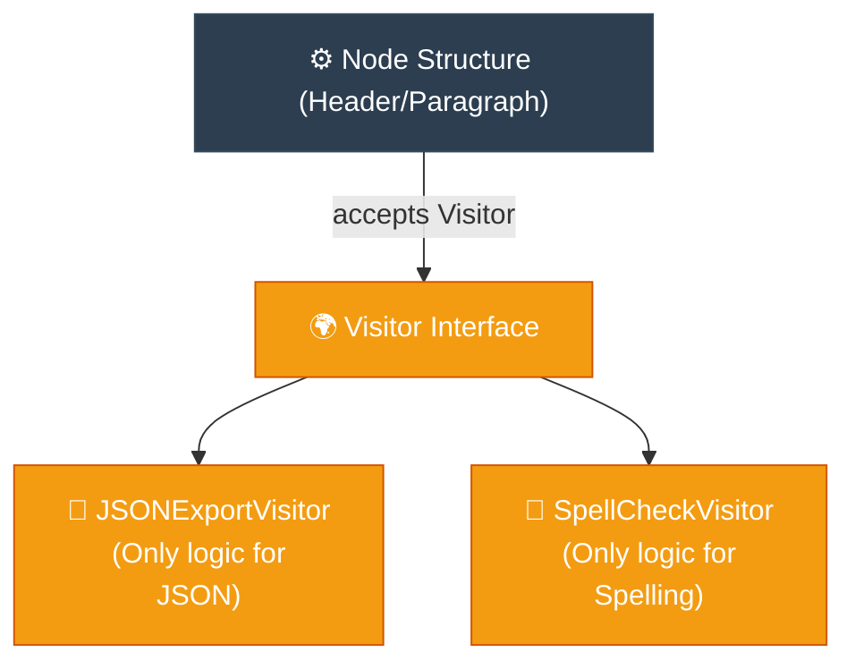

# Socratic Method: Visitor (ការបន្ថែមមុខងារដោយមិនកែប្រែកូដចាស់តាមវិធីសាស្ត្រសូក្រាត)

**Author:** ichamrong  
**Date:** 2026-05-18  
**Tags:** #socratic-method #dialogue #design-patterns #visitor #clean-code  
**Category:** Concepts / Socratic Method  
**Read Time:** ~5 min  

---

## 📌 មាតិកា (Table of Contents)
- [១. កិច្ចសន្ទនាស្វែងរកការពិត (The Socratic Dialogue)](#១-កិច្ចសន្ទនាស្វែងរកការពិត-the-socratic-dialogue)
- [២. សេចក្តីសន្និដ្ឋាននៃស្ថាបត្យកម្ម (Architectural Conclusion)](#២-សេចក្តីសន្និដ្ឋាននៃស្ថាបត្យកម្ម-architectural-conclusion)
- [៣. ដ្យាក្រាមលំហូរ (Visual Flowchart)](#៣-ដ្យាក្រាមលំហូរ-visual-flowchart)
- [៤. Related Posts](#៤-related-posts)

---

## ១. កិច្ចសន្ទនាស្វែងរកការពិត (The Socratic Dialogue)

### English
* **Socrates:** "Glaucon, imagine you have spent months perfectly crafting a complex XML Document structure containing delicate elements: `HeaderNode`, `ParagraphNode`, and `ImageNode`. If the client begs you to add a feature to export this document to JSON, what will you do to your precious nodes?"
* **Glaucon:** "I... I suppose I must tear them open and add an `exportToJSON()` method to every single Node class."
* **Socrates:** "I see. And what if next week, they demand a plain text renderer? And the week after, a spell-checker? Will you keep painfully cutting open your stable, peaceful Node classes to stitch in these unrelated operations?"
* **Glaucon:** "Oh no... My beautiful, clean Node classes will become horribly disfigured! They will swell with hundreds of lines of rendering and spell-checking logic that have absolutely nothing to do with holding data!"
* **Socrates:** "Exactly. And does it not break your heart—and the Open-Closed Principle—to constantly risk breaking your core classes every time a new fad feature is requested?"
* **Glaucon:** "It terrifies me. One small typo in a new spelling function could crash the entire document system that I worked so hard to stabilize."
* **Socrates:** "Then how do we grant these classes new abilities without ever touching their pure source code? What if we invite a 'Guest' to do the work? We define a `Visitor` interface. We add just one permanent, welcoming method to our Nodes called `accept(Visitor v)`. The Node simply opens the door and says to the guest, `v.visit(this)`, trusting the guest to do the right thing."
* **Glaucon:** "Wow... That is beautiful! It is Double Dispatch! If we welcome guests this way, the Node classes are locked and safe forever! If we need a JSON exporter, we just send a `JSONExportVisitor`. If we need spell-checking, we send a `SpellCheckVisitor`! The core structure remains pure, peaceful, and perfectly safe!"
* **Socrates:** "Splendid, Glaucon. You have protected your creation and discovered the Visitor Pattern."

### Khmer
* **សូក្រាត៖** «គ្លូខុន អើយ! ស្រមៃថាអ្នកបានចំណាយពេលរាប់ខែដើម្បីច្នៃប្រឌិតរចនាសម្ព័ន្ធឯកសារ XML ដ៏ស្រស់ស្អាតមួយ ដែលមានធាតុផ្សំយ៉ាងលម្អិតដូចជា៖ `HeaderNode`, `ParagraphNode` និង `ImageNode`។ ប្រសិនបើកូនក្តីអង្វរសុំឱ្យអ្នកបន្ថែមមុខងារនាំចេញឯកសារនេះទៅជា JSON តើអ្នកនឹងធ្វើអ្វីចំពោះ Node ដ៏មានតម្លៃរបស់អ្នក?»
* **គ្លូខុន៖** «ខ្ញុំ... ខ្ញុំប្រហែលជាត្រូវវះកាត់បើកពួកវា ហើយបន្ថែមមុខងារ `exportToJSON()` ចូលទៅក្នុង Class របស់ Node នីមួយៗហើយ។»
* **សូក្រាត៖** «ខ្ញុំយល់ហើយ។ ចុះបើនៅសប្តាហ៍ក្រោយ ពួកគេទាមទារមុខងារបង្ហាញអក្សរធម្មតា? ហើយសប្តាហ៍បន្ទាប់ទៀត ទាមទារការពិនិត្យអក្ខរាវិរុទ្ធ? តើអ្នកនឹងបន្តវះកាត់ Class Node ដ៏ស្ងប់ស្ងាត់របស់អ្នកទាំងឈឺចាប់ ដើម្បីដេរភ្ជាប់កិច្ចការដែលមិនពាក់ព័ន្ធទាំងនេះឬ?»
* **គ្លូខុន៖** «អូទេ... Class Node ដ៏ស្រស់ស្អាតរបស់ខ្ញុំច្បាស់ជាខូចទ្រង់ទ្រាយអស់ហើយ! វានឹងឡើងប៉ោងដោយសារកូដរាប់រយជួរនៃការបកប្រែ និងការពិនិត្យអក្ខរាវិរុទ្ធ ដែលគ្មានពាក់ព័ន្ធអ្វីទាល់តែសោះនឹងការរក្សាទុកទិន្នន័យស្នូល!»
* **សូក្រាត៖** «ពិតប្រាកដណាស់។ ហើយតើវាមិនធ្វើឱ្យអ្នកឈឺចាប់ទេឬ—ព្រមទាំងល្មើសនឹង Open-Closed Principle ផង—ដែលត្រូវប្រថុយប្រកាំងរាល់លើកដែលគេចង់បានមុខងារថ្មីនោះ?»
* **គ្លូខុន៖** «វាពិតជាគួរឱ្យខ្លាចណាស់។ ការវាយអក្សរខុសតែមួយតួនៅក្នុងមុខងារថ្មី អាចនឹងបំផ្លាញប្រព័ន្ធឯកសារទាំងមូលដែលខ្ញុំខំប្រឹងតម្លើងដោយលំបាក។»
* **សូក្រាត៖** «ចុះធ្វើដូចម្តេចទើបយើងអាចផ្តល់សមត្ថភាពថ្មីៗដល់ពួកវា ដោយមិនបាច់ប៉ះពាល់កូដដ៏បរិសុទ្ធរបស់ពួកវាទាល់តែសោះ? ចុះបើ យើងអញ្ជើញ 'ភ្ញៀវ' ឱ្យមកជួយធ្វើការងារនេះ? យើងបង្កើត Interface `Visitor` មួយ។ ហើយយើងគ្រាន់តែបន្ថែមមុខងារស្វាគមន៍អចិន្ត្រៃយ៍តែមួយគត់ទៅក្នុង Node គឺ `accept(Visitor v)`។ Node គ្រាន់តែបើកទ្វារហើយប្រាប់ទៅភ្ញៀវថា `v.visit(this)` ដោយទុកចិត្តឱ្យភ្ញៀវធ្វើការងារនោះ។»
* **គ្លូខុន៖** «អូហូ... នេះពិតជាអស្ចារ្យណាស់! នេះហៅថា Double Dispatch! បើយើងស្វាគមន៍ភ្ញៀវបែបនេះ Class Node នឹងត្រូវបានចាក់សោរយ៉ាងមានសុវត្ថិភាពជារៀងរហូត! បើយើងចង់បាន JSON Exporter យើងគ្រាន់តែបញ្ជូន `JSONExportVisitor` មក។ បើយើងចង់ពិនិត្យអក្ខរាវិរុទ្ធ យើងបញ្ជូន `SpellCheckVisitor` មក! រចនាសម្ព័ន្ធស្នូលនឹងរក្សាបាននូវភាពបរិសុទ្ធ ស្ងប់ស្ងាត់ និងសុវត្ថិភាពបំផុត!»
* **សូក្រាត៖** «ល្អណាស់ គ្លូខុន។ អ្នកបានការពារស្នាដៃរបស់អ្នក និងបានរកឃើញ Visitor Pattern ហើយ។»

---

## ២. សេចក្តីសន្និដ្ឋាននៃស្ថាបត្យកម្ម (Architectural Conclusion)

The Visitor Pattern represents an operation to be performed on the elements of an object structure. It lets you define a new operation without changing the classes of the elements on which it operates, ensuring strict adherence to the Open-Closed and Single Responsibility principles.

Visitor Pattern តំណាងឱ្យប្រតិបត្តិការដែលត្រូវអនុវត្តលើធាតុផ្សំផ្សេងៗនៃរចនាសម្ព័ន្ធ Object។ វាអនុញ្ញាតឱ្យអ្នកបង្កើតប្រតិបត្តិការថ្មីដោយមិនបាច់កែប្រែ Class នៃធាតុផ្សំទាំងនោះឡើយ ដែលធានាការអនុវត្តយ៉ាងតឹងរ៉ឹងនូវគោលការណ៍ Open-Closed និង Single Responsibility។

---

## ៣. ដ្យាក្រាមលំហូរ (Visual Flowchart)

---

## ៤. Related Posts

* 📖 **Read the Parable:** [The Royal Tax Collector (អ្នកប្រមូលពន្ធរាជការ)](../../parables/96-the-royal-tax-collector.md)
* 🛠️ **Read the Code Implementation:** [Behavioral Patterns: The Dynamics of Objects](../../../clean-code/design-patterns/03-behavioral-patterns.md#the-visitor)
