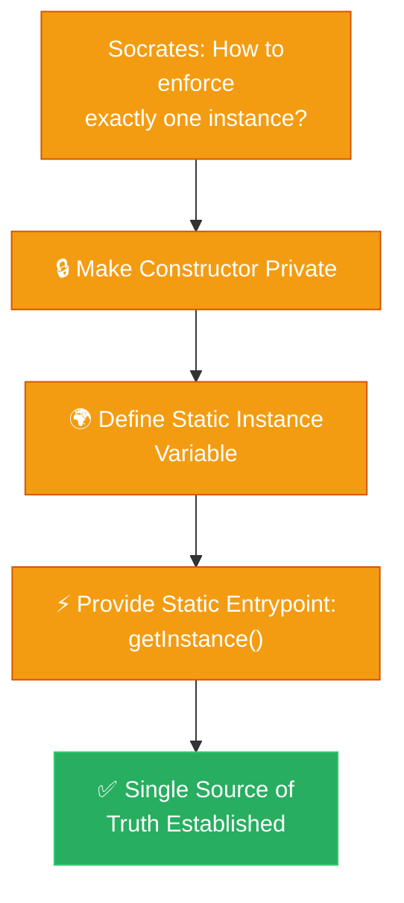

# Socratic Method: Singleton (ការបង្កើតប្រព័ន្ធការពិតតែមួយគត់តាមវិធីសាស្ត្រសូក្រាត)

**Author:** ichamrong  
**Date:** 2026-05-18  
**Tags:** #socratic-method #dialogue #design-patterns #singleton #clean-code  
**Category:** Concepts / Socratic Method  
**Read Time:** ~5 min  

---

## 📌 មាតិកា (Table of Contents)
- [១. កិច្ចសន្ទនាស្វែងរកការពិត (The Socratic Dialogue)](#១-កិច្ចសន្ទនាស្វែងរកការពិត-the-socratic-dialogue)
- [២. សេចក្តីសន្និដ្ឋាននៃស្ថាបត្យកម្ម (Architectural Conclusion)](#២-សេចក្តីសន្និដ្ឋាននៃស្ថាបត្យកម្ម-architectural-conclusion)
- [៣. ដ្យាក្រាមលំហូរ (Visual Flowchart)](#៣-ដ្យាក្រាមលំហូរ-visual-flowchart)
- [៤. Related Posts](#៤-related-posts)

---

## ១. កិច្ចសន្ទនាស្វែងរកការពិត (The Socratic Dialogue)

### English
* **Socrates:** "Glaucon, my friend, when your beautiful web application boots up to serve the world, how do your various hard-working services access their shared global configuration settings?"
* **Glaucon:** "It seems simple, Socrates. Whenever a service—like the busy payment gateway or the diligent emailer—feels it needs a setting, it just creates its very own `ConfigReader` object: `new ConfigReader()`."
* **Socrates:** "I see. And what if the system administrator urgently updates a feature flag to stop a bug? How do all your diligent services hear about this vital update?"
* **Glaucon:** "Oh dear... the service that executed the update only changed its own personal `ConfigReader`! The other poor services are completely blind, still tightly gripping their old, outdated settings!"
* **Socrates:** "So your application is suffering from a split personality? One half thinks the world is safe, while the other half blindly rushes toward disaster?"
* **Glaucon:** "Yes, Socrates! It causes terrible, silent bugs that ruin our users' data. It is a true nightmare."
* **Socrates:** "And what if a storm of 10,000 users visits your site at once? Do you force the server to birth 10,000 completely identical, exhausting copies of the `ConfigReader`?"
* **Glaucon:** "We would. The memory would violently bloat, the poor garbage collector would choke, and our beloved application would collapse under the weight of its own clones."
* **Socrates:** "The tragedy stems from allowing every part of the app to selfishly birth its own isolated truth. How do we lovingly guide them to share a single, unified source of truth?"
* **Glaucon:** "We must stop them from calling `new`! We could lock the door by making the constructor of `ConfigReader` private!"
* **Socrates:** "But Glaucon, if the door is locked from the outside, how does anyone receive the guidance they desperately need?"
* **Glaucon:** "Ah! The class must gently offer the guidance itself! We place a single, beautifully preserved `private static` instance inside the class. Then, we open one perfectly safe window—a `public static getInstance()` method—that hands that exact same, singular object to anyone who asks!"
* **Socrates:** "Precisely, Glaucon. Now there is harmony. All services drink from the exact same well of truth. When the truth changes, everyone instantly knows. You have brought peace to the system by discovering the Singleton."

### Khmer
* **សូក្រាត៖** «គ្លូខុន សម្លាញ់របស់ខ្ញុំ នៅពេលកម្មវិធីដ៏ស្រស់ស្អាតរបស់អ្នកបើកដំណើរការដើម្បីបម្រើពិភពលោក តើ Service ដ៏ឧស្សាហ៍ព្យាយាមរបស់អ្នកចូលទៅមើលការកំណត់រួម (Global Configs) ដោយរបៀបណា?»
* **គ្លូខុន៖** «វាហាក់ដូចជាសាមញ្ញណាស់ សូក្រាត។ នៅពេល Service ណាមួយ — ដូចជា Payment Gateway ដ៏មមាញឹក ឬ Emailer ដ៏ឧស្សាហ៍ — ត្រូវការការកំណត់ ពួកវាគ្រាន់តែបង្កើត Object `ConfigReader` ផ្ទាល់ខ្លួនរបស់វាភ្លាម៖ `new ConfigReader()`។»
* **សូក្រាត៖** «ខ្ញុំយល់ហើយ។ ចុះបើអ្នកគ្រប់គ្រងប្រព័ន្ធត្រូវផ្លាស់ប្តូរការកំណត់បន្ទាន់ដើម្បីបញ្ឈប់បញ្ហាណាមួយ? តើ Service ដ៏កំសត់ទាំងអស់នោះនឹងដឹងពីការផ្លាស់ប្តូរដ៏សំខាន់នេះដោយរបៀបណា?»
* **គ្លូខុន៖** «អូព្រះអើយ... Service ដែលធ្វើការកែប្រែ គឺបានកែប្រែតែលើ `ConfigReader` ផ្ទាល់ខ្លួនរបស់វាប៉ុណ្ណោះ! Service កំសត់ផ្សេងទៀតគឺងងឹតភ្នែកឈឹង ដោយនៅតែកាន់ឱបយ៉ាងតឹងនូវការកំណត់ចាស់ៗដែលហួសសម័យ!»
* **សូក្រាត៖** «ចុះកម្មវិធីរបស់អ្នកកំពុងរងទុក្ខដោយសារជំងឺបែកបាក់បុគ្គលិកលក្ខណៈមែនទេ? ផ្នែកមួយគិតថាពិភពលោកមានសុវត្ថិភាព ចំណែកមួយផ្នែកទៀតកំពុងរត់ទៅរកគ្រោះថ្នាក់ដោយងងឹតងងល់?»
* **គ្លូខុន៖** «ពិតមែនហើយ សូក្រាត! វាបង្កឱ្យមាន Bug ដ៏ស្ងៀមស្ងាត់ដែលបំផ្លាញទិន្នន័យអ្នកប្រើប្រាស់របស់យើង។ វាជាសុបិន្តអាក្រក់ពិតៗ។»
* **សូក្រាត៖** «ចុះបើមានអ្នកប្រើប្រាស់ ១០,០០០ នាក់សម្រុកចូលគេហទំព័ររបស់អ្នកក្នុងពេលតែមួយ? តើអ្នកបង្ខំឱ្យ Server បង្កើត `ConfigReader` ដែលស៊ីកម្លាំង និងស្ទួនគ្នាបេះបិទចំនួន ១០,០០០ ដងមែនទេ?»
* **គ្លូខុន៖** «យើងច្បាស់ជាធ្វើបែបនោះហើយ។ មេម៉ូរីនឹងឡើងប៉ោងយ៉ាងខ្លាំង ប្រព័ន្ធបោសសម្អាតនឹងស្ទះដង្ហើម ហើយកម្មវិធីដ៏ជាទីស្រលាញ់របស់យើងនឹងដួលរលំក្រោមទម្ងន់នៃរូបតំណាងក្លែងក្លាយរបស់វាផ្ទាល់។»
* **សូក្រាត៖** «សោកនាដកម្មនេះកើតឡើងដោយសារយើងបណ្តោយឱ្យផ្នែកនីមួយៗបង្កើតសេចក្តីពិតដ៏ឯកកោរៀងៗខ្លួន។ តើយើងអាចណែនាំពួកគេយ៉ាងថ្នមៗ ឱ្យមកប្រើប្រាស់ប្រភពនៃការពិតតែមួយរួមគ្នាបានដោយរបៀបណា?»
* **គ្លូខុន៖** «យើងត្រូវបញ្ឈប់ពួកគេមិនឱ្យហៅ `new` ទៀត! យើងអាចចាក់សោទ្វារដោយប្តូរ Constructor របស់ `ConfigReader` ឱ្យទៅជា private!»
* **សូក្រាត៖** «ប៉ុន្តែ គ្លូខុន អើយ បើទ្វារត្រូវបានចាក់សោពីខាងក្រៅ តើពួកគេអាចទទួលបានការណែនាំដែលពួកគេកំពុងត្រូវការយ៉ាងខ្លាំងនេះដោយរបៀបណា?»
* **គ្លូខុន៖** «អូហូ! Class នោះត្រូវតែជាអ្នកផ្តល់ការណែនាំដោយខ្លួនឯងយ៉ាងទន់ភ្លន់! យើងបង្កើត Object តែមួយគត់ដែលត្រូវបានថែរក្សាយ៉ាងល្អ (`private static`) នៅក្នុង Class នោះ។ បន្ទាប់មក យើងបើកបង្អួចដ៏មានសុវត្ថិភាពមួយ — គឺមុខងារ `public static getInstance()` — ដើម្បីហុច Object តែមួយគត់នោះទៅឱ្យអ្នកណាដែលត្រូវការវា!»
* **សូក្រាត៖** «ត្រឹមត្រូវហើយ គ្លូខុន។ ពេលនេះភាពសុខដុមរមនាបានកើតមានហើយ។ Service ទាំងអស់ទទួលទានទឹកពីអណ្តូងនៃការពិតតែមួយ។ ពេលការពិតប្រែប្រួល គ្រប់គ្នានឹងដឹងភ្លាមៗ។ អ្នកបាននាំសន្តិភាពមកកាន់ប្រព័ន្ធតាមរយៈការរកឃើញ Singleton ហើយ។»

---

## ២. សេចក្តីសន្និដ្ឋាននៃស្ថាបត្យកម្ម (Architectural Conclusion)

The Singleton Pattern guarantees that a class has only one instance and provides a global point of access to it. It solves the dual problems of state inconsistency (ensuring a single source of truth) and resource exhaustion (preventing expensive, duplicate objects).

Singleton Pattern ធានាថា Class មួយមាន Object ត្រឹមតែមួយគត់ និងផ្តល់នូវចំណុចចូលប្រើប្រាស់ជាសកលទៅកាន់វា។ វាដោះស្រាយបញ្ហាពីរក្នុងពេលតែមួយ៖ បញ្ហាទិន្នន័យមិនស៊ីសង្វាក់គ្នា (ធានាឱ្យមានប្រភពពិតតែមួយគត់) និងការខាតបង់ធនធាន (ការពារការបង្កើត Object ស្ទួនៗគ្នាដែលស៊ីមេម៉ូរីខ្លាំង)។

---

## ៣. ដ្យាក្រាមលំហូរ (Visual Flowchart)

---

## ៤. Related Posts

### 🔗 Explore All Viewpoints:
* 📖 **Read the Parable:** [The Bank's Only Vault (ទូដែកតែមួយគត់របស់ធនាគារ)](../../parables/75-the-banks-only-vault.md) — Explains the emotional core of shared truth.
* 🧠 **Read the First Principles Derivation:** [MIT Professor Strategy: Singleton (គោលការណ៍គ្រឹះដំបូងនៃ Singleton)](../01-mit-professor/01-singleton.md) — Derives the pattern from fundamental computer axioms.
* 👶 **Read the Feynman Simplification:** [Feynman Technique: Singleton (ការពន្យល់ពី Singleton ដោយគ្មានពាក្យបច្ចេកទេស)](../02-feynman-technique/04-singleton.md) — Breaks it down using the central clock tower.
* 👦 **Read the ELI5 Metaphor:** [ELI5: Singleton (ម៉ាស៊ីនខួងខ្មៅដៃតែមួយគត់ក្នុងថ្នាក់រៀន)](../03-eli5/04-singleton.md) — Teaches it to a five-year-old using classroom pencil sharpeners.
* 🌉 **Read the Analogy Bridge:** [Analogy Bridge: Singleton (ស្ពានប្រៀបធៀបនៃប្រភពពិតតែមួយគត់)](../04-analogy-bridge/04-singleton.md) — Maps it to a hotel front desk and shows where physical limits fail compared to code threads.
* 🧐 **Read the Socratic Discovery:** [Socratic Method: Singleton (ការបង្កើតប្រព័ន្ធការពិតតែមួយគត់តាមវិធីសាស្ត្រសូក្រាត)](../05-socratic-method/04-singleton.md) — Guide your self-discovery through mentor-student dialogue.
* 📰 **Read the Journalist Summary:** [Journalist: Singleton (ការធានាឱ្យមានការពិតតែមួយគត់ក្នុងប្រព័ន្ធទាំងមូល)](../06-journalist-inverted-pyramid/04-singleton.md) — Get the high-impact lede, volatile visibility, and thread-safety details first.
* 🎭 **Read the Storyteller Narrative:** [Storyteller: Singleton (អាណាព្យាបាលនៃសេចក្តីពិត និងកងទ័ពក្លូនបង្កចលាចល)](../07-storyteller-narrative-arc/04-singleton.md) — Follow Kiri's heroic journey to vanquish the duplicate logger clone army.
* ⚙️ **Read the Engineer Spec:** [Engineer: Singleton (ការសម្របសម្រួលប្រភពពិតតែមួយគត់ និងទប់ស្កាត់ការខ្ជះខ្ជាយធនធាន)](../08-engineer-requirements-constraints-solution/03-singleton.md) — Read the rigorous engineering specification, DCL performance details, and candidate elimination.
* 📊 **Read the Pros & Cons:** [Pros & Cons Compared: Singleton (ការប្រៀបធៀបគុណសម្បត្តិ និងគុណវិបត្តិនៃ Singleton)](../09-pros-and-cons-compared/01-singleton.md) — Full trade-off analysis and decision matrix.
* 🛠️ **Read the Code Implementation:** [Creational Patterns: The Art of Instantiation](../../../clean-code/design-patterns/01-creational-patterns.md#the-singleton) — Production-grade Java with double-checked locking and thread safety.
