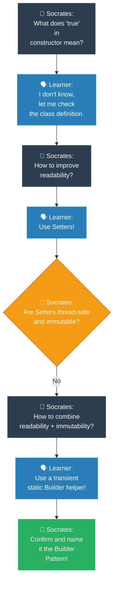

# Socratic Method: Builder (ការបង្កើត Object ស្មុគស្មាញតាមវិធីសាស្ត្រសូក្រាត)

**Author:** ichamrong  
**Date:** 2026-05-18  
**Tags:** #socratic-method #dialogue #design-patterns #builder #clean-code  
**Category:** Concepts / Socratic Method  
**Read Time:** ~6 min  

---

## 📌 មាតិកា (Table of Contents)
- [សេចក្តីផ្តើម (Introduction)](#សេចក្តីផ្តើម-introduction)
- [ការសន្ទនាជាភាសាអង់គ្លេស (Socratic Dialogue - English)](#ការសន្ទនាជាភាសាអង់គ្លេស-socratic-dialogue-english)
- [ការសន្ទនាជាភាសាខ្មែរ (Socratic Dialogue - Khmer)](#ការសន្ទនាជាភាសាខ្មែរ-socratic-dialogue-khmer)
- [ដ្យាក្រាមលំហូរ (Visual Flowchart)](#ដ្យាក្រាមលំហូរ-visual-flowchart)
- [Related Posts](#related-posts)

---

## សេចក្តីផ្តើម (Introduction)

The **Socratic Method** uses interactive dialogue and targeted logical questions to lead the learner to discover technical solutions themselves, rather than delivering statements passively.

វិធីសាស្ត្រ **Socratic Method (វិធីសាស្ត្រសូក្រាត)** ប្រើប្រាស់ការសន្ទនាដេញដោល និងសំណួរតម្រង់ទិស ដើម្បីដឹកនាំអ្នកសិក្សាឱ្យរកឃើញដំណោះស្រាយបច្ចេកទេសដោយខ្លួនឯង ជំនួសឱ្យការប្រាប់ចម្លើយភ្លាមៗបែបអកម្ម។

---

## ការសន្ទនាជាភាសាអង់គ្លេស (Socratic Dialogue - English)

> **Socrates:** *"My dear friend, look closely at this terrifying constructor you've written: `new Invoice(101, "USD", 250.0, null, true, false, true, "TaxExempt")`. Tell me, what does that first `true` represent?"*
> **Learner:** *"I... I honestly have no idea. I would have to dig through the `Invoice` class source code just to check the parameter order."*
> **Socrates:** *"If you, the author, must painfully decipher your own code just to understand it, what will happen when a junior developer reads it under pressure?"*
> **Learner:** *"They will be completely lost! They might accidentally swap the `true` and `false`, and the compiler wouldn't even warn them because they are both just booleans. It's a disaster waiting to happen!"*
> **Socrates:** *"Indeed it is. How can we bring peace to this chaos? What if we simply create a zero-argument constructor and let them set fields one by one using gentle setters, like `invoice.setTaxable(true)`?"*
> **Learner:** *"Ah, that breathes life into it! It becomes beautifully readable: `invoice.setCurrency("USD");`."*
> **Socrates:** *"But pause for a moment. Once you call `new Invoice()`, before you finish calling all those setters, is your invoice complete and legally valid? What if another thread sneaks in and reads it when only the `id` is set?"*
> **Learner:** *"Oh no... It would be in a broken, half-baked state. And anyone could maliciously mutate the invoice later! It would be completely unsafe for multi-threading!"*
> **Socrates:** *"So we are torn: we desperately want the peaceful readability of step-by-step configuration, but we also demand that our final object is rock-solid, 100% valid, and completely immutable from the exact moment it is born. How do we separate the messy building phase from the pure final state?"*
> **Learner:** *"What if we create a patient, temporary 'Checklist' object? We can take our time checking boxes on the checklist step-by-step. And only when we are perfectly ready, we hand that checklist to the `Invoice` constructor to forge a final, unbreakable, read-only invoice!"*
> **Socrates:** *"Brilliant! And what should we proudly name this checklist class that patiently builds our final masterpiece?"*
> **Learner:** *"A Builder! We will create a beautiful inner static `Invoice.Builder`!"*
> **Socrates:** *"Exactly, my friend. You have mastered the Builder pattern."*

---

## ការសន្ទនាជាភាសាខ្មែរ (Socratic Dialogue - Khmer)

> **សូក្រាត៖** *«មិត្តជាទីស្រលាញ់ ចូរសម្លឹងមើល Constructor ដ៏គួរឱ្យខ្លាចដែលអ្នកបានសរសេរនេះ៖ `new Invoice(101, "USD", 250.0, null, true, false, true, "TaxExempt")`។ ប្រាប់ខ្ញុំមើល តើពាក្យ `true` ទីមួយតំណាងឱ្យអ្វី?»*
> **សិស្ស៖** *«ខ្ញុំ... តាមពិតទៅខ្ញុំមិនដឹងទាល់តែសោះ។ ខ្ញុំច្បាស់ជាត្រូវជីកកកាយកូដដើមនៃ Class `Invoice` គ្រាន់តែដើម្បីផ្ទៀងផ្ទាត់លំដាប់ប៉ារ៉ាម៉ែត្រ។»*
> **សូក្រាត៖** *«ប្រសិនបើអ្នកដែលជាអ្នកសរសេរផ្ទាល់ ត្រូវចំណាយពេលបកស្រាយកូដខ្លួនឯងទាំងឈឺក្បាលបែបនេះទៅហើយ តើនឹងមានអ្វីកើតឡើងនៅពេលអ្នកអភិវឌ្ឍន៍ជំនាន់ក្រោយមកអានវាក្នុងស្ថានភាពប្រញាប់ប្រញាល់នោះ?»*
> **សិស្ស៖** *«ពួកគេច្បាស់ជាវង្វេងផ្លូវមិនខាន! ពួកគេអាចនឹងច្រឡំទីតាំង `true` និង `false` ហើយ Compiler នឹងមិនសូម្បីតែព្រមានពួកគេ ព្រោះពួកវាជាប្រភេទ boolean ដូចគ្នា។ វាជាគ្រោះមហន្តរាយដែលកំពុងរង់ចាំផ្ទុះឡើង!»*
> **សូក្រាត៖** *«ពិតប្រាកដណាស់។ តើយើងអាចនាំសន្តិភាពមកកាន់ភាពវឹកវរនេះដោយរបៀបណា? ចុះបើ យើងគ្រាន់តែបង្កើត Constructor គ្មានប៉ារ៉ាម៉ែត្រ រួចអនុញ្ញាតឱ្យពួកគេកំណត់ទិន្នន័យម្តងមួយៗតាមរយៈ Setter ដ៏ទន់ភ្លន់ ដូចជា `invoice.setTaxable(true)`?»*
> **សិស្ស៖** *«អូ! ការធ្វើបែបនេះនាំឱ្យកូដមានដង្ហើមរស់ឡើងវិញ! វាប្រែជាស្រស់ស្អាត និងងាយអាន៖ `invoice.setCurrency("USD");`។»*
> **សូក្រាត៖** *«ប៉ុន្តែឈប់សិន។ នៅពេលអ្នកហៅ `new Invoice()` ភ្លាម មុនពេលអ្នកហៅ Setters ទាំងអស់នោះចប់ តើ Invoice របស់អ្នកពេញលេញ និងស្របច្បាប់ហើយឬនៅ? ចុះបើ thread ផ្សេងទៀតលួចចូលមកអានវានៅពេលដែលមានតែ `id` ត្រូវបានកំណត់នោះ?»*
> **សិស្ស៖** *«អូទេ... វានឹងស្ថិតក្នុងស្ថានភាពមិនពេញលេញ និងខូចខាត។ ហើយនរណាក៏អាចលួចកែប្រែទិន្នន័យ Invoice នោះនៅពេលក្រោយបានដែរ! វានឹងគ្មានសុវត្ថិភាពទាល់តែសោះសម្រាប់ Multi-threading!»*
> **សូក្រាត៖** *«ដូច្នេះយើងស្ថិតក្នុងភាពទាល់ច្រក៖ យើងចង់បានភាពងាយស្រួលអាននៃការកំណត់ទិន្នន័យជាជំហានៗយ៉ាងខ្លាំង ប៉ុន្តែយើងក៏ទាមទារយ៉ាងតឹងរ៉ឹងឱ្យ Object ចុងក្រោយរបស់យើងមានភាពរឹងមាំ ត្រឹមត្រូវ ១០០% និងមិនអាចកែប្រែបានតាំងពីវិនាទីដំបូងដែលវាចាប់កំណើត។ តើយើងអាចបំបែកដំណាក់កាលសាងសង់ដ៏រញ៉េរញ៉ៃ ចេញពីស្ថានភាពចុងក្រោយដ៏បរិសុទ្ធបានដោយរបៀបណា?»*
> **សិស្ស៖** *«ចុះបើ យើងបង្កើត Object 'ក្រដាសកត់បញ្ជី' ដ៏អំណត់ និងបណ្តោះអាសន្នមួយ? យើងអាចចំណាយពេលកំណត់តម្លៃលើក្រដាសបញ្ជីនោះជាជំហានៗដោយមិនប្រញាប់។ ហើយលុះត្រាតែយើងរៀបចំរួចរាល់ឥតខ្ចោះ ទើបយើងហុចក្រដាសបញ្ជីនោះទៅឱ្យ Constructor របស់ `Invoice` ដើម្បីលត់ដុំ Invoice ចុងក្រោយមួយដែលមិនអាចកែប្រែបាន និងរឹងមាំដូចដែកថែប!»*
> **សូក្រាត៖** *«អស្ចារ្យណាស់! តើយើងគួរដាក់ឈ្មោះអ្វីឱ្យ Class ក្រដាសបញ្ជីដ៏គួរឱ្យមានមោទនភាព ដែលអំណត់សាងសង់ស្នាដៃចុងក្រោយរបស់យើងនេះ?»*
> **សិស្ស៖** *«Builder! យើងនឹងបង្កើត Inner static `Invoice.Builder` ដ៏ស្រស់ស្អាតមួយ!»*
> **សូក្រាត៖** *«ពិតប្រាកដណាស់ មិត្តរបស់ខ្ញុំ។ អ្នកបានយល់ច្បាស់ពី Builder Pattern ហើយ។»*

---

## ដ្យាក្រាមលំហូរ (Visual Flowchart)

---

## Related Posts

### 🔗 Explore All Viewpoints:
* 📖 **Read the Parable:** [The 47-Question Waiter (អ្នករត់តុសួរ ៤៧ សំណួរ)](../../parables/76-the-overwhelmed-sandwich-shop.md) — The emotional story of a chaotic customer experience.
* 🧠 **Read the First Principles Derivation:** [MIT Professor Strategy: Builder (គោលការណ៍គ្រឹះដំបូងនៃ Builder)](../01-mit-professor/04-builder.md) — Derives the pattern from stack frame layouts and thread safety laws.
* 👶 **Read the Feynman Simplification:** [Feynman Technique: Builder (ការពន្យល់ពី Builder ដោយគ្មានពាក្យបច្ចេកទេស)](../02-feynman-technique/05-builder.md) — Breaks it down using a simple cafe menu checklist.
* 👦 **Read the ELI5 Metaphor:** [ELI5: Builder (ការពន្យល់ពី Builder ដូចក្មេងអាយុ ៥ ឆ្នាំ)](../03-eli5/05-builder.md) — Teaches a five-year-old using Lego spaceship construction books.
* 🌉 **Read the Analogy Bridge:** [Analogy Bridge: Builder (ស្ពានប្រៀបធៀបនៃ Builder)](../04-analogy-bridge/05-builder.md) — Maps real sandwich ticks to fluent Java methods, outlining physical limitations.
* 🧐 **Read the Socratic Discovery:** [Socratic Method: Builder (ការបង្កើត Object ស្មុគស្មាញតាមវិធីសាស្ត្រសូក្រាត)](../05-socratic-method/05-builder.md) — Probes yourself via a mentor-student constructor debate.
* 📰 **Read the Journalist Summary:** [Journalist: Builder (ការបង្កើត Object ស្មុគស្មាញជាជំហានៗ)](../06-journalist-inverted-pyramid/05-builder.md) — Quick news lede, telescoping prevention, and step-by-step assembly validation.
* 🎭 **Read the Storyteller Narrative:** [Storyteller: Builder (វីរបុរស Builder និងសង្គ្រាមប៉ារ៉ាម៉ែត្ររញ៉េរញ៉ៃ)](../07-storyteller-narrative-arc/05-builder.md) — Sopheap's battle against a production parameter bomb catastrophe on Black Friday.
* ⚙️ **Read the Engineer Spec:** [Engineer: Builder (ការបង្កើត Object ស្មុគស្មាញជាជំហានៗ)](../08-engineer-requirements-constraints-solution/01-builder.md) — Read the formal engineering requirements and candidate evaluation table.
* 📊 **Read the Pros & Cons:** [Pros & Cons Compared: Builder (ការប្រៀបធៀបគុណសម្បត្តិ និងគុណវិបត្តិនៃ Builder)](../09-pros-and-cons-compared/02-builder.md) — Full trade-off analysis and decision matrix.
* 🛠️ **Read the Code Implementation:** [Creational Patterns: The Art of Instantiation](../../../clean-code/design-patterns/01-creational-patterns.md#the-builder) — Production-grade Java with fluent chaining and immutable object construction.
