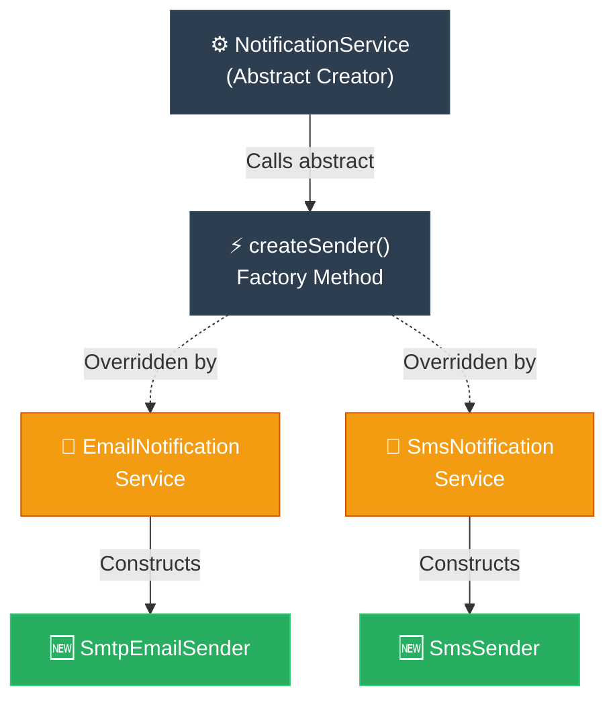

# Socratic Method: Factory Method (ការបង្កើត Object តាមតម្រូវការយឺតយ៉ាវតាមវិធីសាស្ត្រសូក្រាត)

**Author:** ichamrong  
**Date:** 2026-05-18  
**Tags:** #socratic-method #dialogue #mentoring #design-patterns #factory-method #clean-code  
**Category:** Concepts / Socratic Method  
**Read Time:** ~6 min  

---

## 📌 មាតិកា (Table of Contents)
- [១. ការសន្ទនាបែបវិភាគ (The Socratic Dialogue)](#១-ការសន្ទនាបែបវិភាគ-the-socratic-dialogue)
- [២. របកគំហើញគន្លឹះ (Key Discovery)](#របកគំហើញគន្លឹះ-key-discovery)
- [៣. ដ្យាក្រាមលំហូរ (Visual Flowchart)](#៣-ដ្យាក្រាមលំហូរ-visual-flowchart)
- [៤. Related Posts](#៤-related-posts)

---

## ១. ការសន្ទនាបែបវិភាគ (The Socratic Dialogue)

### English
**Socrates:** My friend, I see you are writing a massive class that directly creates another class using the rigid `new` operator. Tell me, is this class you are creating the absolute only one of its kind you will ever, ever need?

**Student:** No, Socrates. Today I only need a simple `SmtpEmailSender`. But tomorrow, our demanding marketing team might ask us to support `SmsSender` or `PushNotificationSender`.

**Socrates:** Ah! And when tomorrow comes, and they demand this new sender, how will you force your precious code to accommodate them?

**Student:** *(Sighs)* I will have to rip open our peaceful `NotificationService` and write a long, ugly `if/else` block inside it. I will check the user's preference and rigidly call `new SmsSender()` or `new PushNotificationSender()`.

**Socrates:** I see. And if they demand a fourth type, and then a fifth, and a sixth? Will you keep returning to this same `NotificationService` class, violently opening its chest, and stitching in new, dangerous branches of code?

**Student:** Yes... it seems I would be forced to. But that breaks my heart, because every time we add a notification provider, we risk breaking the existing ones. We are mutating a core class that already works perfectly!

**Socrates:** Indeed. Tell me, does a pilot of an airplane need to know how the engine was forged in the factory, or do they only need to gently push the throttle and steer?

**Student:** They only need to know how to fly the plane. Knowing the painful engine assembly process is completely irrelevant to their duty.

**Socrates:** Then why does your beautiful `NotificationService` need to know the raw, dirty assembly details of `SmsSender` or `SmtpEmailSender`? Should it not simply and elegantly say: *"Give me a sender, any sender, and I will invoke its `.send()` method"*?

**Student:** Yes! It should only care about the pure, abstract `Sender` interface. But Socrates, someone, somewhere in the dark, *must* call `new` to birth the concrete sender. If not the service, then who?

**Socrates:** Excellent question. What if we gently delegate that heavy creation duty to a special abstract method—let us call it `createSender()`? The main service class elegantly calls `createSender()`, but does *not* implement it. It leaves that heavy lifting abstract.

**Student:** But if it is abstract, who bears the burden of implementation?

**Socrates:** Who extends our service?

**Student:** Ah! The Subclasses do! We could make a dedicated `EmailNotificationService` extend it and proudly override `createSender()` to return `new SmtpEmailSender()`. And a separate `SmsNotificationService` would override it to return `new SmsSender()`!

**Socrates:** Precisely! The main service remains completely pure and unburdened. It only knows about the beautiful abstract `Sender` interface. It never speaks the rigid word `new`. It only calls `createSender()` and trusts its subclasses to do the work. The subclasses make the hard decision of *which* concrete product to create. What have we achieved here?

**Student:** We have completely freed the core service from the dirty work of concrete senders! If we add a new sender, we just peacefully create a new subclass. The original `NotificationService` remains untouched, safe, and eternally locked against bugs!

**Socrates:** You have discovered the true freedom of the **Factory Method Pattern**, my friend.

---

### Khmer
**សូក្រាត៖** មិត្តភក្តិរបស់ខ្ញុំ ខ្ញុំឃើញអ្នកកំពុងសរសេរ Class ដ៏ធំមួយដែលបង្កើត Class មួយទៀតដោយផ្ទាល់តាមរយៈពាក្យគន្លឹះ `new` ដ៏រឹងត្អឹង។ ប្រាប់ខ្ញុំមើល តើ Class ដែលអ្នកកំពុងបង្កើតនេះជាប្រភេទតែមួយគត់ដែលអ្នកត្រូវការក្នុងប្រព័ន្ធទាំងមូលរហូតទៅមែនទេ?

**សិស្ស៖** ទេ លោកគ្រូសូក្រាត។ ថ្ងៃនេះខ្ញុំត្រូវការត្រឹមតែ `SmtpEmailSender` សាមញ្ញមួយប៉ុណ្ណោះ។ ប៉ុន្តែថ្ងៃស្អែក ក្រុមការងារទីផ្សារដ៏តឹងតែង អាចនឹងទាមទារឱ្យយើងគាំទ្រ `SmsSender` ឬ `PushNotificationSender` បន្ថែមទៀត។

**សូក្រាត៖** អា៎! ហើយនៅពេលថ្ងៃស្អែកមកដល់ ហើយពួកគេទាមទារប្រភេទផ្ញើសារថ្មីនេះ តើអ្នកនឹងបង្ខំកូដដ៏មានតម្លៃរបស់អ្នកឱ្យឆ្លើយតបពួកគេដោយរបៀបណា?

**សិស្ស៖** *(ដកដង្ហើមធំ)* ខ្ញុំច្បាស់ជាត្រូវវះកាត់បើក `NotificationService` ដ៏ស្ងប់ស្ងាត់របស់យើង ហើយសរសេរលក្ខខណ្ឌ `if/else` ដ៏វែង និងអាក្រក់មើលនៅខាងក្នុងវាហើយ។ ខ្ញុំនឹងពិនិត្យមើលចំណូលចិត្តរបស់អ្នកប្រើប្រាស់ រួចបង្ខំហៅ `new SmsSender()` ឬ `new PushNotificationSender()`។

**សូក្រាត៖** យល់ហើយ។ ចុះបើពួកគេទាមទារប្រភេទទីបួន ទីប្រាំ និងទីប្រាំមួយ? តើអ្នកនឹងបន្តត្រឡប់មកកែប្រែ Class `NotificationService` ដដែលនេះ បើកទ្រូងវាទាំងហិង្សា រួចដេរលក្ខខណ្ឌថ្មីៗដ៏គ្រោះថ្នាក់បញ្ចូលគ្នាបន្តទៀតមែនទេ?

**សិស្ស៖** បាទ... ហាក់ដូចជាខ្ញុំត្រូវបង្ខំចិត្តធ្វើបែបនោះហើយ។ ប៉ុន្តែវាពិតជាធ្វើឱ្យខ្ញុំឈឺចាប់ណាស់ ព្រោះរាល់ពេលដែលយើងបន្ថែមប្រព័ន្ធផ្ញើសារថ្មី យើងប្រថុយនឹងធ្វើឱ្យខូចមុខងារចាស់ៗ។ យើងកំពុងវះកាត់ Class ស្នូលដែលកំពុងដំណើរការល្អឥតខ្ចោះរួចទៅហើយ!

**សូក្រាត៖** ពិតប្រាកដណាស់។ ប្រាប់ខ្ញុំមើល តើអ្នកបើកបរយន្តហោះម្នាក់ ត្រូវការដឹងពីរបៀបដែលម៉ាស៊ីនត្រូវបានដំឡើងយ៉ាងលំបាកនៅក្នុងរោងចក្រដែរឬទេ ឬពួកគេគ្រាន់តែត្រូវការរុញហ្គែរ និងបញ្ជាចង្កូតយ៉ាងទន់ភ្លន់?

**សិស្ស៖** ពួកគេគ្រាន់តែត្រូវការដឹងពីរបៀបហោះហើរយន្តហោះប៉ុណ្ណោះ។ ការដឹងពីដំណើរការដំឡើងម៉ាស៊ីនដ៏ឈឺក្បាល គឺគ្មានពាក់ព័ន្ធអ្វីទាល់តែសោះនឹងភារកិច្ចរបស់ពួកគេ។

**សូក្រាត៖** ចុះហេតុអ្វីបានជា `NotificationService` ដ៏ស្រស់ស្អាតរបស់អ្នកត្រូវការដឹងពីភាពកខ្វក់នៃការដំឡើង `SmsSender` ឬ `SmtpEmailSender` ធ្វើអ្វី? តើវាមិនគួរគ្រាន់តែនិយាយយ៉ាងសាមញ្ញ និងទន់ភ្លន់ថា៖ *«ហុចអ្នកផ្ញើសារណាមួយក៏បានមកខ្ញុំមក ហើយខ្ញុំនឹងហៅមុខងារ `.send()` របស់វា»* ទេឬ?

**សិស្ស៖** ពិតមែនហើយ! វាគួរតែខ្វល់តែពី Interface អរូបី `Sender` ដ៏បរិសុទ្ធប៉ុណ្ណោះ។ ប៉ុន្តែលោកគ្រូសូក្រាត នរណាម្នាក់ នៅកន្លែងណាមួយដ៏ងងឹត *ត្រូវតែ* ហៅ `new` ដើម្បីផ្តល់កំណើតដល់ Object ពិតប្រាកដ។ បើមិនមែនជា Service នេះទេ តើជានរណា?

**សូក្រាត៖** ជាសំណួរដ៏ល្អបំផុត។ ចុះបើ យើងផ្ទេរភារកិច្ចបង្កើតដ៏ធ្ងន់ធ្ងរនោះទៅឱ្យ Method អរូបីពិសេសមួយដោយក្តីមេត្តា—ចូរហៅវាថា `createSender()`? Class សេវាកម្មចម្បងហៅ `createSender()` យ៉ាងស្រស់ស្អាត ប៉ុន្តែ *មិន* បង្កើតវាឡើយ។ វាទុកការងារដ៏ធ្ងន់នោះជា abstract (អរូបី)។

**សិស្ស៖** ប៉ុន្តែបើវាជា abstract តើនរណាជាអ្នកទទួលបន្ទុកក្នុងការអនុវត្តពិតប្រាកដ?

**សូក្រាត៖** តើនរណាជាអ្នកពង្រីកមុខងារ (extend) របស់ Service យើង?

**សិស្ស៖** អូ! គឺ Subclasses! យើងអាចបង្កើត `EmailNotificationService` ដ៏ស្មោះត្រង់មួយឱ្យពង្រីកមុខងារពីវា ហើយសរសេរលុបលើ (override) `createSender()` ដោយមោទនភាពដើម្បីហុចមកវិញនូវ `new SmtpEmailSender()`។ ហើយ `SmsNotificationService` មួយទៀតនឹងសរសេរលុបលើវាដើម្បីហុចមកវិញនូវ `new SmsSender()`!

**សូក្រាត៖** ត្រឹមត្រូវណាស់! Service ចម្បងនៅតែបរិសុទ្ធ និងគ្មានបន្ទុកទាល់តែសោះ។ វាស្គាល់តែ abstract `Sender` interface ដ៏ស្រស់ស្អាតប៉ុណ្ណោះ។ វាមិនដែលនិយាយពាក្យ `new` ដ៏រឹងត្អឹងឡើយ។ វាគ្រាន់តែហៅ `createSender()` ហើយទុកចិត្តប្រគល់ការងារឱ្យ Subclasses របស់វា។ Subclasses ជាអ្នកធ្វើការសម្រេចចិត្តដ៏លំបាកថាត្រូវបង្កើត Concrete Product មួយណា។ តើយើងសម្រេចបានអ្វីខ្លះនៅទីនេះ?

**សិស្ស៖** យើងបានរំដោះ Service ស្នូលចេញពីការងារកខ្វក់ទាំងស្រុង! ប្រសិនបើយើងបន្ថែម sender ថ្មី យើងគ្រាន់តែបង្កើត subclass ថ្មីមួយដោយសន្តិភាព។ Class `NotificationService` ដើមនៅតែមិនប៉ះពាល់ មានសុវត្ថិភាព និងត្រូវចាក់សោរការពារពីកំហុសកូដជារៀងរហូត!

**សូក្រាត៖** អ្នកបានរកឃើញសេរីភាពពិតប្រាកដនៃ **Factory Method Pattern** ហើយ មិត្តរបស់ខ្ញុំ។

---

## របកគំហើញគន្លឹះ (Key Discovery)

By overriding a single virtual creation method, subclasses dynamically control the concrete type of the object constructed, while the core service orchestrates flow using only the clean, abstract interface.

តាមរយៈការសរសេរលុបលើ (override) creation method និម្មិតតែមួយគត់ Subclasses គ្រប់គ្រងប្រភេទ Concrete Object ដែលត្រូវបង្កើតឡើងដោយស្វ័យប្រវត្តិ ខណៈពេលដែលសេវាកម្មស្នូលដឹកនាំលំហូរការងារដោយប្រើប្រាស់តែ Interface ស្អាតស្អំ និងអរូបីប៉ុណ្ណោះ។

---

## ៣. ដ្យាក្រាមលំហូរ (Visual Flowchart)

---

## ៤. Related Posts

### 🔗 Explore All Viewpoints:
* 📖 **Read the Parable:** [The CEO and the Regional Managers (នាយកប្រតិបត្តិ និងអ្នកគ្រប់គ្រងតំបន់)](../../parables/77-the-ceo-and-regional-managers.md) — The emotional core of delegating local decisions.
* 🧠 **Read the First Principles Derivation:** [MIT Professor Strategy: Factory Method (គោលការណ៍គ្រឹះដំបូងនៃ Factory Method)](../01-mit-professor/02-factory-method.md) — Derives the pattern step-by-step from base interface dependency laws.
* 👶 **Read the Feynman Simplification:** [Feynman Technique: Factory Method (ការពន្យល់ពី Factory Method ដោយគ្មានពាក្យបច្ចេកទេស)](../02-feynman-technique/06-factory-method.md) — Breaks it down using the hotel cleaner recruitment agency.
* 👦 **Read the ELI5 Metaphor:** [ELI5: Factory Method (ការពន្យល់ពី Factory Method ដូចក្មេងអាយុ ៥ ឆ្នាំ)](../03-eli5/06-factory-method.md) — Teaches a five-year-old using the magic toy machine slot.
* 🌉 **Read the Analogy Bridge:** [Analogy Bridge: Factory Method (ស្ពានប្រៀបធៀបនៃ Factory Method)](../04-analogy-bridge/06-factory-method.md) — Maps regional postal transport hubs to virtual methods, outlining physical limitations.
* 🧐 **Read the Socratic Discovery:** [Socratic Method: Factory Method (ការបង្កើត Object តាមតម្រូវការយឺតយ៉ាវតាមវិធីសាស្ត្រសូក្រាត)](../05-socratic-method/06-factory-method.md) — Socrates guides your discovery out of switch block coupling.
* 📰 **Read the Journalist Summary:** [Journalist: Factory Method (ការបំបែកកូដបង្កើត Object ឱ្យមានសេរីភាពសម្រេចចិត្តលើ Subclass)](../06-journalist-inverted-pyramid/06-factory-method.md) — High-impact news lede, OCP compliance, and SRP isolation details first.
* 🎭 **Read the Storyteller Narrative:** [Storyteller: Factory Method (វីរបុរស Factory Method និងការដោះលែងប្រព័ន្ធផ្ញើសារពីរនរក switch)](../07-storyteller-narrative-arc/06-factory-method.md) — Junior developer Dara's battle to vanquish the switch statement monster on Black Friday.
* ⚙️ **Read the Engineer Spec:** [Engineer: Factory Method (ការបំបែកកូដបង្កើត Object តាមរយៈការវាយតម្លៃតម្រូវការ និងឧបសគ្គកំណត់)](../08-engineer-requirements-constraints-solution/04-factory-method.md) — Technical requirements, ADR candidate matrix, and SLA evaluation.
* 📊 **Read the Pros & Cons:** [Pros & Cons Compared: Factory Method (ការប្រៀបធៀបគុណសម្បត្តិ និងគុណវិបត្តិនៃ Factory Method)](../09-pros-and-cons-compared/03-factory-method.md) — Full trade-off analysis and decision matrix.
* 🛠️ **Read the Code Implementation:** [Creational Patterns: The Art of Instantiation](../../../clean-code/design-patterns/01-creational-patterns.md#the-factory-method) — Production-grade Java with subclass dispatch and Open/Closed Principle.
