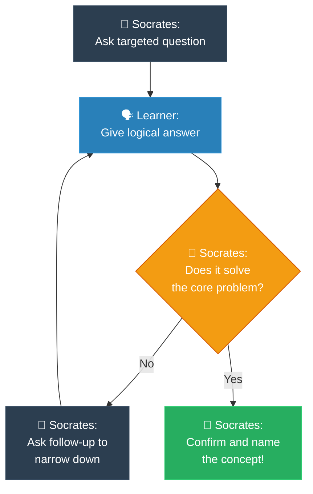

# Strategy 05: The Socratic Method (វិធីសាស្ត្រសូក្រាត)

**Author:** ichamrong  
**Date:** 2026-05-18  
**Tags:** #explanation-strategies #socratic-method #mentoring #discovery-learning  
**Category:** Concepts / Explanation Strategies  
**Read Time:** ~5 min  

---

## 📌 មាតិកា (Table of Contents)
- [សេចក្តីផ្តើម (Introduction)](#សេចក្តីផ្តើម-introduction)
- [រូបមន្តនៃការដោះស្រាយ (The Formula)](#រូបមន្តនៃការដោះស្រាយ-the-formula)
- [ដ្យាក្រាមលំហូរ (Visual Flowchart)](#ដ្យាក្រាមលំហូរ-visual-flowchart)
- [ឧទាហរណ៍ជាក់ស្តែង៖ ការស្វែងរកប្រព័ន្ធ Binary Search (Practical Example)](#ឧទាហរណ៍ជាក់ស្តែង-ការស្វែងរកប្រព័ន្ធ-binary-search-practical-example)
- [មេរៀន និងដែនកំណត់ (When to Use & Limitations)](#មេរៀន-និងដែនកំណត់-when-to-use-limitations)

---

## សេចក្តីផ្តើម (Introduction)

The **Socratic Method** is an ancient dialogue-based technique popularized by the philosopher Socrates. It completely shifts the dynamic from a cold, passive lecture to a warm, active, and guided journey of discovery. By asking patient, highly-targeted questions rather than just dumping facts onto the learner, you walk hand-in-hand with them until they confidently realize the truth themselves. This empathetic learning approach removes technical intimidation, builds immense confidence, and guarantees deep, emotional memory retention because the learner experienced the "Aha!" moment themselves.

យុទ្ធសាស្ត្រ **Socratic Method (វិធីសាស្ត្រសូក្រាត)** គឺជាបច្ចេកទេសសន្ទនាដ៏បុរាណមួយដែលត្រូវបានបង្កើតឡើងដោយទស្សនវិទូ សូក្រាត។ វាផ្លាស់ប្តូរទាំងស្រុងពីការបង្រៀនបែបអកម្មដ៏ត្រជាក់ល្ហឹម មកជាការធ្វើដំណើរស្វែងរកការពិតដ៏កក់ក្តៅ សកម្ម និងមានការណែនាំយ៉ាងយកចិត្តទុកដាក់។ តាមរយៈការចោទសួរដេញដោលប្រកបដោយការអត់ធ្មត់ និងចំគោលដៅ ជំនួសឱ្យការគ្រាន់តែចាក់ចោលទ្រឹស្តីទៅឱ្យអ្នកសិក្សា អ្នកកំពុងដើរកាន់ដៃពួកគេរហូតដល់ពួកគេរកឃើញសេចក្តីពិតដោយភាពជឿជាក់ខ្លួនឯង។ វិធីសាស្ត្រសិក្សាប្រកបដោយការយល់ចិត្តនេះ ជួយលុបបំបាត់ភាពភ័យខ្លាចលើពាក្យបច្ចេកទេស បង្កើនទំនុកចិត្តយ៉ាងអស្ចារ្យ និងធានាបាននូវការចងចាំយ៉ាងជ្រាលជ្រៅក្នុងអារម្មណ៍ ព្រោះអ្នកសិក្សាបានឆ្លងកាត់ការដឹងខ្លួន "អូហូ!" ដោយផ្ទាល់ខ្លួនឯង។

---

## រូបមន្តនៃការដោះស្រាយ (The Formula)

```
1. Ask an initial question whose answer points toward the concept.
2. Accept the learner's answer (correct or incorrect).
3. Ask a logical follow-up question that challenges or refines that answer.
4. With each turn, narrow the possible solution space.
5. Guide the learner to state the final correct solution themselves.
6. Confirm: "Yes! And that's exactly what [Concept X] does."
```

---

## ដ្យាក្រាមលំហូរ (Visual Flowchart)



---

## ឧទាហរណ៍ជាក់ស្តែង៖ ការស្វែងរកប្រព័ន្ធ Binary Search (Practical Example)

### Explaining Binary Search through Dialogue (English)
> **Socrates:** *"You're looking for page 347 in a 700-page book. Do you start from page 1?"*  
> **Learner:** *"No, I'd open the book somewhere near the middle."*  
> **Socrates:** *"Why the middle?"*  
> **Learner:** *"Because if 347 is bigger or smaller than wherever I land, I instantly know which way to go."*  
> **Socrates:** *"And once you know that direction, what happens to the other pages?"*  
> **Learner:** *"I throw away half the book. I don't need to look at them."*  
> **Socrates:** *"Exactly. How many times can you cut a 700-page book in half before you reach exactly one page?"*  
> **Learner:** *"I guess about 10 times."*  
> **Socrates:** *"Yes! That is exactly what we call Binary Search. It takes O(log n) time."*

### ការសន្ទនាបែបវិធីសាស្ត្រសូក្រាត (Khmer)
> **សូក្រាត៖** *«អ្នកកំពុងស្វែងរកទំព័រ ៣៤៧ នៅក្នុងសៀវភៅដែលមាន ៧០០ ទំព័រ។ តើអ្នកចាប់ផ្តើមបើកពីទំព័រទី ១ ទេ?»*  
> **សិស្ស៖** *«ទេ! ខ្ញុំនឹងបើកសៀវភៅនៅចំកណ្តាលតែម្តង។»*  
> **សូក្រាត៖** *«ហេតុអ្វីបានជាបើកចំកណ្តាល?»*  
> **សិស្ស៖** *«ព្រោះបើទំព័រ ៣៤៧ ធំជាង ឬតូចជាងទំព័រដែលខ្ញុំបើកចំបច្ចុប្បន្ន ខ្ញុំអាចដឹងភ្លាមថាត្រូវទៅទិសណា។»*  
> **សូក្រាត៖** *«ហើយនៅពេលដែលអ្នកដឹងពីទិសដៅនោះ តើមានអ្វីកើតឡើងចំពោះទំព័រដែលនៅសល់ផ្សេងទៀត?»*  
> **សិស្ស៖** *«ខ្ញុំអាចបោះចោលពាក់កណ្តាលសៀវភៅនោះភ្លាម។ ខ្ញុំលែងបាច់អានវាទៀតហើយ។»*  
> **សូក្រាត៖** *«ពិតប្រាកដណាស់! តើអ្នកអាចកាត់សៀវភៅ ៧០០ ទំព័រនេះជាពាក់កណ្តាលបានប៉ុន្មានដង មុនពេលអ្នកទៅដល់ទំព័រដែលចង់បាន?»*  
> **សិស្ស៖** *«ប្រហែលជា ១០ ដងប៉ុណ្ណោះ។»*  
> **សូក្រាត៖** *«ត្រឹមត្រូវណាស់! នេះហើយគឺជាអ្វីដែលយើងហៅថា Binary Search ក្នុងកុំព្យូទ័រ ដែលដំណើរការក្នុងកម្រិតល្បឿន O(log n)។»*

---

## មេរៀន និងដែនកំណត់ (When to Use & Limitations)

### 📈 Best For (សាកសមបំផុតសម្រាប់)
* **1-on-1 Mentoring:** Guiding junior developers to debug their own errors without telling them the line to fix.
* **Code Reviews:** Asking questions like *"What happens if this input is null?"* to help them notice edge cases.
* **Technical Interviews:** Evaluating a candidate's problem-solving depth and adaptability.

### ⚠️ Limitations (ដែនកំណត់)
* **Requires Patience:** Takes longer than just telling the answer directly.
* **Interactive Only:** Hard to perform in static, one-way media (like pre-recorded videos), though highly effective in written parables.
* **Risk of Frustration:** If the questions are too vague, the learner may feel interrogated rather than guided. Keep questions friendly, encouraging, and highly targeted.

---

---

## 📚 Implemented Patterns (គំរូស្ថាបត្យកម្មដែលបានអនុវត្ត)

Here are the design patterns explained using the interactive **Socratic Method** dialogue:

* **[01. Command (ការបំប្លែងសំណើការងារទៅជា Object តាមវិធីសាស្ត្រសូក្រាត)](./01-command.md)** — Guides a developer to discover that requests themselves must be treated as independent objects to support undo logs, scheduling, and multi-device triggers easily.
* **[02. Iterator (ការស្វែងរកទិន្នន័យដោយសុវត្ថិភាពតាមវិធីសាស្ត្រសូក្រាត)](./02-iterator.md)** — Guides a developer to discover that they must separate list/tree traversals into polymorphic helper objects (Iterators) to protect class encapsulation.
* **[03. Visitor (ការបន្ថែមមុខងារដោយមិនកែប្រែកូដចាស់តាមវិធីសាស្ត្រសូក្រាត)](./03-visitor.md)** — Guides a developer to discover Double Dispatch, letting them attach unlimited rendering or spell-checking plugins without modifying core document nodes.
* **[04. Singleton (ការបង្កើតប្រព័ន្ធការពិតតែមួយគត់តាមវិធីសាស្ត្រសូក្រាត)](./04-singleton.md)** — Guides a developer to discover that global shared configs or connection pools must be restricted to a single instance inside memory to prevent resource conflicts and state inconsistency.
* **[05. Builder (ការបង្កើត Object ស្មុគស្មាញតាមវិធីសាស្ត្រសូក្រាត)](./05-builder.md)** — Guides a developer to discover that complex object creation must decouple from its representation, creating transient builder checklists to guarantee both compile-time readability and strict immutability.
* **[06. Factory Method (ការបង្កើត Object តាមតម្រូវការយឺតយ៉ាវតាមវិធីសាស្ត្រសូក្រាត)](./06-factory-method.md)** — Guides a developer to discover that coupling to concrete types can be resolved by deferring the implementation of an abstract creation method to specialized subclasses.

---

## Related
* [← Back to Concepts](../README.md)
* [Strategy 01: MIT Professor](../01-mit-professor/README.md)
* [Strategy 02: Feynman Technique](../02-feynman-technique/README.md)
