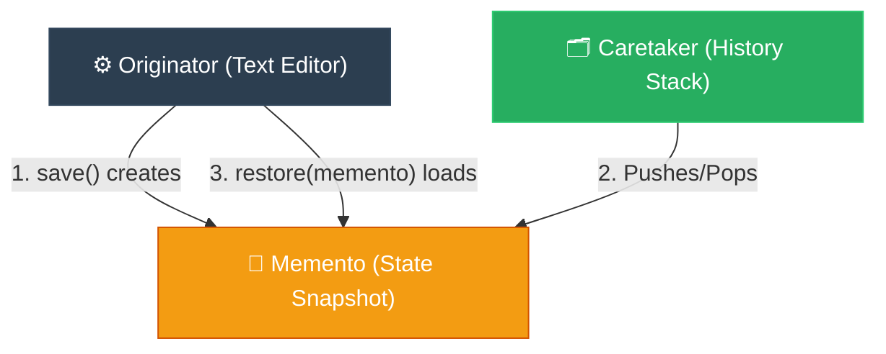

# Journalist: Memento (ការរក្សាទុក និងលុបស្ថានភាពចាស់ដោយសុវត្ថិភាព)

**Author:** ichamrong  
**Date:** 2026-05-18  
**Tags:** #journalist #inverted-pyramid #design-patterns #memento #clean-code  
**Category:** Concepts / Journalist  
**Read Time:** ~5 min  

---

## 📌 មាតិកា (Table of Contents)
- [១. សេចក្តីសង្ខេបព្រឹត្តិការណ៍ (The Lede)](#១-សេចក្តីសង្ខេបព្រឹត្តិការណ៍-the-lede)
- [២. ព័ត៌មានលម្អិតស្នូល (Core Details)](#២-ព័ត៌មានលម្អិតស្នូល-core-details)
- [៣. ដ្យាក្រាមលំហូរ (Visual Flowchart)](#៣-ដ្យាក្រាមលំហូរ-visual-flowchart)
- [៤. Related Posts](#៤-related-posts)

---

## ១. សេចក្តីសង្ខេបព្រឹត្តិការណ៍ (The Lede)

### English
The **Memento Pattern** enables capturing and externalizing an object's internal state so that it can be restored to this exact state later, completely without exposing the object's private structural details or violating encapsulation principles.

### Khmer
**Memento Pattern** អនុញ្ញាតឱ្យយើងកត់ត្រាទុក និងនាំចេញនូវស្ថានភាពផ្ទៃក្នុង (Internal State) របស់ Object មួយ ដើម្បីឱ្យយើងអាចទាញវាត្រឡប់មកស្ថានភាពដើមវិញបាននៅពេលក្រោយ ដោយមិនបាច់បង្ហាញព័ត៌មានលម្អិតឯកជននៃរចនាសម្ព័ន្ធរបស់វា ឬល្មើសនឹងគោលការណ៍លាក់បាំងទិន្នន័យ (Encapsulation) ឡើយ។

---

## ២. ព័ត៌មានលម្អិតស្នូល (Core Details)

### English
* **Three Actors:**
  1. **Originator (ម្ចាស់ស្ថានភាព):** The object that holds the active state. It creates a Memento containing its current state, and uses a Memento to restore itself.
  2. **Memento (ក្រដាសកត់ត្រា):** A value object that stores a snapshot of the Originator's state. It is immutable and completely private to the Originator.
  3. **Caretaker (អ្នកថែរក្សា):** Keeps track of the history of Mementos (like a stack). It never reads, modifies, or inspects the contents of a Memento.
* **The Benefit:** Safe undo/redo operations without coupling the history keeper to the internal state structure of the active object.

### Khmer
* **តួអង្គទាំងបី៖**
  1. **Originator (ម្ចាស់ស្ថានភាព)៖** Object ដែលកំពុងមានស្ថានភាពការងារសកម្ម។ វាជាអ្នកបង្កើត Memento ដែលផ្ទុកស្ថានភាពបច្ចុប្បន្នរបស់វា និងប្រើប្រាស់ Memento ដើម្បីស្តារខ្លួនឯងឡើងវិញ។
  2. **Memento (ក្រដាសកត់ត្រា)៖** Value Object ដែលរក្សាទុកស្ថានភាពមួយខណៈរបស់ Originator។ វាជាទិន្នន័យថេរ (Immutable) និងលាក់បាំងទាំងស្រុងពីខាងក្រៅ ស្គាល់តែ Originator ប៉ុណ្ណោះ។
  3. **Caretaker (អ្នកថែរក្សា)៖** អ្នកតាមដានប្រវត្តិ Mementos (ដូចជា Stack)។ វាគ្រាន់តែរក្សាទុក និងហុចឱ្យវិញប៉ុណ្ណោះ គ្មានសិទ្ធិអាន កែប្រែ ឬពិនិត្យទិន្នន័យក្នុង Memento ឡើយ។
* **អត្ថប្រយោជន៍៖** ដំណើរការសកម្មភាព Undo/Redo ដោយសុវត្ថិភាព ដោយមិនចងប្រវត្តិការងារទៅនឹងរចនាសម្ព័ន្ធស្ថានភាពផ្ទៃក្នុងរបស់ Object សកម្មឡើយ។

---

## ៣. ដ្យាក្រាមលំហូរ (Visual Flowchart)

---

## ៤. Related Posts

* 📖 **Read the Parable:** [The Checkpoint Crystal (គ្រីស្តាល់រក្សាទុកពេលវេល)](../../parables/91-the-checkpoint-crystal.md)
* 🛠️ **Read the Code Implementation:** [Behavioral Patterns: The Dynamics of Objects](../../../clean-code/design-patterns/03-behavioral-patterns.md#the-memento)
