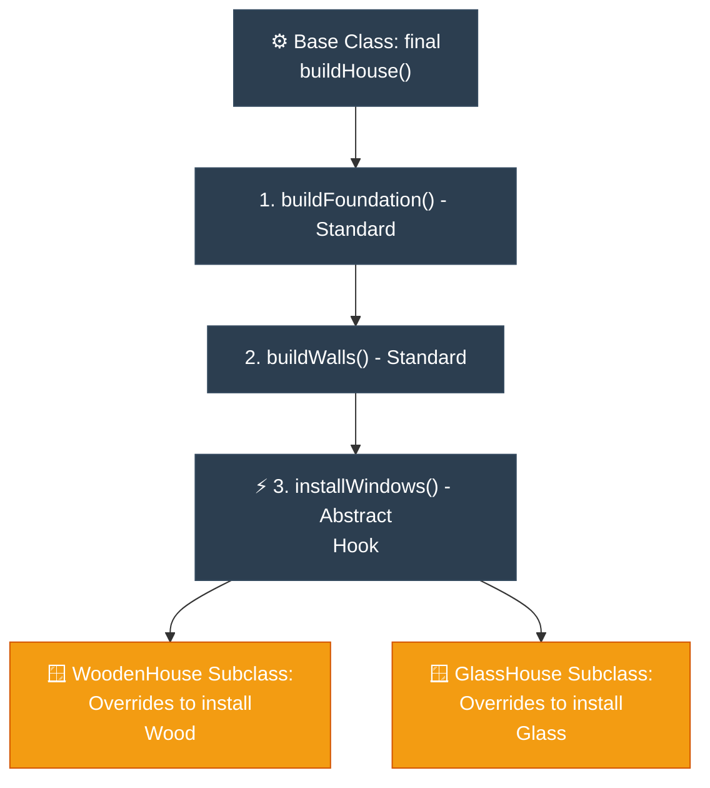

# Journalist: Template Method (ការកំណត់គ្រោងគំរូនៃជំហានការងារ)

**Author:** ichamrong  
**Date:** 2026-05-18  
**Tags:** #journalist #inverted-pyramid #design-patterns #template-method #clean-code  
**Category:** Concepts / Journalist  
**Read Time:** ~5 min  

---

## 📌 មាតិកា (Table of Contents)
- [១. សេចក្តីសង្ខេបព្រឹត្តិការណ៍ (The Lede)](#១-សេចក្តីសង្ខេបព្រឹត្តិការណ៍-the-lede)
- [២. ព័ត៌មានលម្អិតស្នូល (Core Details)](#២-ព័ត៌មានលម្អិតស្នូល-core-details)
- [៣. ដ្យាក្រាមលំហូរ (Visual Flowchart)](#៣-ដ្យាក្រាមលំហូរ-visual-flowchart)
- [៤. Related Posts](#៤-related-posts)

---

## ១. សេចក្តីសង្ខេបព្រឹត្តិការណ៍ (The Lede)

### English
The **Template Method Pattern** defines the rigid skeleton of an algorithm inside a base class method, deferring specific execution steps to subclasses, thereby letting subclasses redefine certain parts of the algorithm without modifying the algorithm's global structure.

### Khmer
**Template Method Pattern** កំណត់គ្រោងឆ្អឹងរឹងមាំនៃជំហានការងារ (Algorithm) នៅក្នុងមុខងាររបស់ Base Class ដោយផ្ទេរជំហានអនុវត្តជាក់ស្តែងមួយចំនួនទៅឱ្យ Subclass។ នេះអនុញ្ញាតឱ្យ Subclass កំណត់ឡើងវិញនូវចំណុចមួយចំនួននៃការងារ ដោយមិនបាច់ប៉ះពាល់ដល់រចនាសម្ព័ន្ធរួមនៃការងារឡើយ។

---

## ២. ព័ត៌មានលម្អិតស្នូល (Core Details)

### English
* **The Structure:** The superclass defines a `final` template method (e.g., `buildHouse()`) containing the step execution order: `buildFoundation()`, `buildWalls()`, `installWindows()`.
* **Subclass Customization:** `buildFoundation()` and `buildWalls()` may be standard, but `installWindows()` is declared `abstract` (or left as an empty hook). Subclasses override only this method to install wood or glass windows.
* **The Hollywood Principle:** *"Don't call us, we'll call you."* Subclasses never control the execution order; they are called by the base class at the correct moment.

### Khmer
* **រចនាសម្ព័ន្ធ៖** Superclass កំណត់មុខងារ `final` មួយ (ដូចជា `buildHouse()`) ដែលមានលំដាប់លំដោយជំហាន៖ `buildFoundation()`, `buildWalls()`, `installWindows()`។
* **ការកែច្នៃរបស់ Subclass៖** ជំហាន `buildFoundation()` និង `buildWalls()` អាចជាកូដស្តង់ដាររួម ប៉ុន្តែ `installWindows()` ត្រូវបានប្រកាសជា `abstract` (ឬជា Hook ទទេ)។ Subclass គ្រាន់តែកែប្រែ (Override) លើមុខងារនេះដើម្បីដាក់បង្អួចឈើ ឬបង្អួចកញ្ចក់តាមចិត្ត។
* **គោលការណ៍ហូលីវូដ (Hollywood Principle)៖** *«កុំខលមកយើង យើងនឹងខលទៅអ្នកវិញ។»* Subclass មិនអាចគ្រប់គ្រងលំដាប់ជំហានការងារឡើយ ពួកវាគ្រាន់តែត្រូវបាន Base Class ហៅឱ្យធ្វើការនៅពេលត្រឹមត្រូវប៉ុណ្ណោះ។

---

## ៣. ដ្យាក្រាមលំហូរ (Visual Flowchart)

---

## ៤. Related Posts

* 📖 **Read the Parable:** [The Master Baker's Recipe (រូបមន្តធ្វើនំរបស់មេចុងភៅ)](../../parables/95-the-master-bakers-recipe.md)
* 🛠️ **Read the Code Implementation:** [Behavioral Patterns: The Dynamics of Objects](../../../clean-code/design-patterns/03-behavioral-patterns.md#the-template-method)
