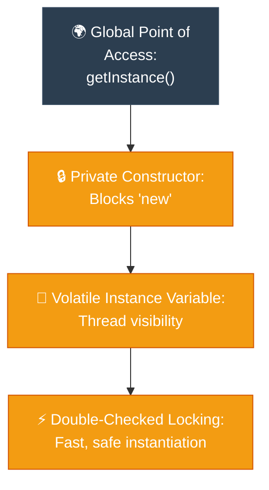

# Journalist: Singleton (ការធានាឱ្យមានការពិតតែមួយគត់ក្នុងប្រព័ន្ធទាំងមូល)

**Author:** ichamrong  
**Date:** 2026-05-18  
**Tags:** #journalist #inverted-pyramid #design-patterns #singleton #clean-code  
**Category:** Concepts / Journalist  
**Read Time:** ~5 min  

---

## 📌 មាតិកា (Table of Contents)
- [១. សេចក្តីសង្ខេបព្រឹត្តិការណ៍ (The Lede)](#១-សេចក្តីសង្ខេបព្រឹត្តិការណ៍-the-lede)
- [២. ព័ត៌មានលម្អិតស្នូល (Core Details)](#២-ព័ត៌មានលម្អិតស្នូល-core-details)
- [៣. ដ្យាក្រាមលំហូរ (Visual Flowchart)](#៣-ដ្យាក្រាមលំហូរ-visual-flowchart)
- [៤. Related Posts](#៤-related-posts)

---

## ១. សេចក្តីសង្ខេបព្រឹត្តិការណ៍ (The Lede)

### English
The **Singleton Pattern** restricts the instantiation of a class to exactly one single instance and provides a global point of access to it. This pattern acts as the absolute coordinator and "single source of truth" for shared resources across an entire application, completely eliminating memory duplication and inconsistent data states.

### Khmer
**Singleton Pattern** កំណត់ការបង្កើត Object ពី Class មួយឱ្យនៅសល់ត្រឹមតែ **មួយគត់ជានិច្ច** និងផ្តល់នូវច្រកចូលប្រើប្រាស់ជាសកលទៅកាន់វា។ គំរូស្ថាបត្យកម្មនេះដើរតួជាអ្នកសម្របសម្រួលដាច់ខាត និងជា «ប្រភពនៃការពិតតែមួយគត់» សម្រាប់ធនធានរួមគ្នាទូទាំងកម្មវិធីទាំងមូល ដោយលុបបំបាត់ទាំងស្រុងនូវការបង្កើត Object ស្ទួនៗគ្នានៅក្នុង Memory និងស្ថានភាពទិន្នន័យមិនស៊ីសង្វាក់គ្នា។

---

## ២. ព័ត៌មានលម្អិតស្នូល (Core Details)

### English
* **The Mechanism:** The class constructor is declared `private` to block direct instantiation via the `new` operator. The single instance is held in a `private static` variable and managed through a `public static` gateway method (usually named `getInstance()`).
* **Lazy Initialization & Thread Safety:** The single instance is created only when it is requested for the first time (Lazy loading). In multi-threaded environments, Double-Checked Locking (DCL) combined with the `volatile` keyword is utilized to guarantee thread safety without incurring heavy synchronization penalties.
* **The Benefit:** It prevents "resource exhaustion" by ensuring that expensive components (such as database connection pools, log file managers, and hardware controllers) are shared efficiently by all callers.

### Khmer
* **យន្តការការងារ៖** Constructor របស់ Class ត្រូវបានកំណត់ជា `private` ដើម្បីទប់ស្កាត់ការបង្កើត Object ផ្ទាល់ខ្លួនពីខាងក្រៅតាមរយៈ `new`។ Object តែមួយគត់នោះត្រូវបានរក្សាទុកក្នុងអថេរ `private static` និងគ្រប់គ្រងតាមរយៈមុខងារ `public static` (ជាទូទៅឈ្មោះថា `getInstance()`)។
* **ការបង្កើតយឺត (Lazy Loading) និងសុវត្ថិភាព Thread៖** Object ត្រូវបានបង្កើតឡើងលុះត្រាតែមានការហៅប្រើប្រាស់ជាលើកដំបូង។ នៅក្នុងប្រព័ន្ធដែលរត់ខ្សែស្រឡាយច្រើន (Multi-threaded) យន្តការចាក់សោពីរជាន់ (Double-Checked Locking) រួមផ្សំនឹងពាក្យគន្លឹះ `volatile` ត្រូវបានប្រើប្រាស់ដើម្បីធានាសុវត្ថិភាពការងារ និងមិនធ្វើឱ្យប្រព័ន្ធដើរយឺត។
* **អត្ថប្រយោជន៍៖** វាការពារកុំឱ្យមានការគាំងធនធានប្រព័ន្ធ (Resource exhaustion) ដោយធានាថាផ្នែកសំខាន់ៗដែលស៊ីមេម៉ូរីខ្លាំង (ដូចជា Database Connection Pool, Config Manager, Log File) ត្រូវបានចែករំលែក និងប្រើប្រាស់រួមគ្នាដោយសន្សំសំចៃបំផុត។

---

## ៣. ដ្យាក្រាមលំហូរ (Visual Flowchart)

---

## ៤. Related Posts

### 🔗 Explore All Viewpoints:
* 📖 **Read the Parable:** [The Bank's Only Vault (ទូដែកតែមួយគត់របស់ធនាគារ)](../../parables/75-the-banks-only-vault.md) — Explains the emotional core of shared truth.
* 🧠 **Read the First Principles Derivation:** [MIT Professor Strategy: Singleton (គោលការណ៍គ្រឹះដំបូងនៃ Singleton)](../01-mit-professor/01-singleton.md) — Derives the pattern from fundamental computer axioms.
* 👶 **Read the Feynman Simplification:** [Feynman Technique: Singleton (ការពន្យល់ពី Singleton ដោយគ្មានពាក្យបច្ចេកទេស)](../02-feynman-technique/04-singleton.md) — Breaks it down using the central clock tower.
* 👦 **Read the ELI5 Metaphor:** [ELI5: Singleton (ម៉ាស៊ីនខួងខ្មៅដៃតែមួយគត់ក្នុងថ្នាក់រៀន)](../03-eli5/04-singleton.md) — Teaches it to a five-year-old using classroom pencil sharpeners.
* 🌉 **Read the Analogy Bridge:** [Analogy Bridge: Singleton (ស្ពានប្រៀបធៀបនៃប្រភពពិតតែមួយគត់)](../04-analogy-bridge/04-singleton.md) — Maps it to a hotel front desk and shows where physical limits fail compared to code threads.
* 🧐 **Read the Socratic Discovery:** [Socratic Method: Singleton (ការបង្កើតប្រព័ន្ធការពិតតែមួយគត់តាមវិធីសាស្ត្រសូក្រាត)](../05-socratic-method/04-singleton.md) — Guide your self-discovery through mentor-student dialogue.
* 📰 **Read the Journalist Summary:** [Journalist: Singleton (ការធានាឱ្យមានការពិតតែមួយគត់ក្នុងប្រព័ន្ធទាំងមូល)](../06-journalist-inverted-pyramid/04-singleton.md) — Get the high-impact lede, volatile visibility, and thread-safety details first.
* 🎭 **Read the Storyteller Narrative:** [Storyteller: Singleton (អាណាព្យាបាលនៃសេចក្តីពិត និងកងទ័ពក្លូនបង្កចលាចល)](../07-storyteller-narrative-arc/04-singleton.md) — Follow Kiri's heroic journey to vanquish the duplicate logger clone army.
* ⚙️ **Read the Engineer Spec:** [Engineer: Singleton (ការសម្របសម្រួលប្រភពពិតតែមួយគត់ និងទប់ស្កាត់ការខ្ជះខ្ជាយធនធាន)](../08-engineer-requirements-constraints-solution/03-singleton.md) — Read the rigorous engineering specification, DCL performance details, and candidate elimination.
* 📊 **Read the Pros & Cons:** [Pros & Cons Compared: Singleton (ការប្រៀបធៀបគុណសម្បត្តិ និងគុណវិបត្តិនៃ Singleton)](../09-pros-and-cons-compared/01-singleton.md) — Full trade-off analysis and decision matrix.
* 🛠️ **Read the Code Implementation:** [Creational Patterns: The Art of Instantiation](../../../clean-code/design-patterns/01-creational-patterns.md#the-singleton) — Production-grade Java with double-checked locking and thread safety.
