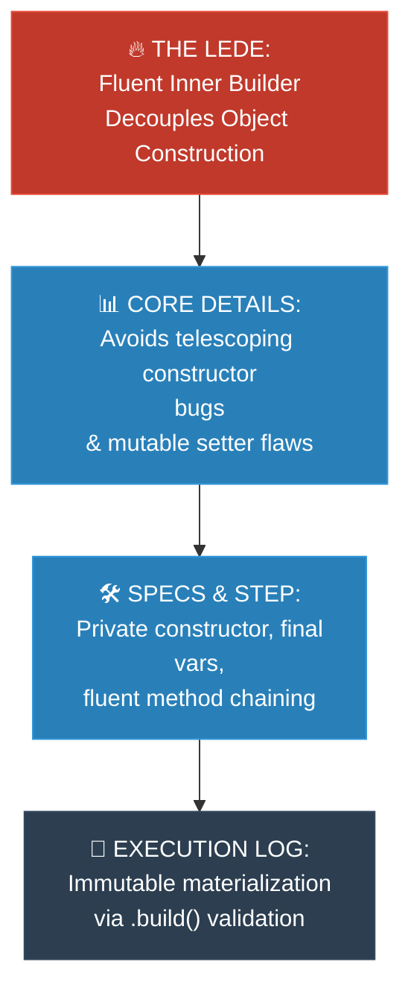

# Journalist: Builder (ការបង្កើត Object ស្មុគស្មាញជាជំហានៗ)

**Author:** ichamrong  
**Date:** 2026-05-18  
**Tags:** #journalist #inverted-pyramid #design-patterns #builder #clean-code  
**Category:** Concepts / Journalist Inverted Pyramid  
**Read Time:** ~5 min  

---

> **"The Builder Pattern isolates complex object construction from its representation, completely preventing compile-time argument transposition errors and telescoping constructor pollution."**

---

## 📌 មាតិកា (Table of Contents)
- [១. របាយការណ៍សង្ខេប (The Lede)](#១-របាយការណ៍សង្ខេប-the-lede)
- [២. ព័ត៌មានលម្អិតស្នូល (Core Details)](#២-ព័ត៌មានលម្អិតស្នូល-core-details)
- [៣. ដំណោះស្រាយ និងបច្ចេកវិទ្យា (Resolution & Specs)](#៣-ដំណោះស្រាយ-និងបច្ចេកវិទ្យា-resolution-specs)
- [៤. កាលវិភាគដំណើរការ (Execution Log & Flowchart)](#៤-កាលវិភាគដំណើរការ-execution-log-flowchart)
- [៥. Related Posts](#៥-related-posts)

---

## ១. របាយការណ៍សង្ខេប (The Lede)

The **Builder Pattern** has emerged as the industry standard for constructing complex, immutable objects containing numerous optional parameters. By replacing error-prone multi-argument telescoping constructors with a fluent, step-by-step nested builder class, it guarantees compile-time type safety and prevents thread-unsafe partially constructed states from reaching the JVM heap.

**Builder Pattern** បានក្លាយជាស្តង់ដារឧស្សាហកម្មសម្រាប់ការបង្កើត Object ដែលមានលក្ខណៈស្មុគស្មាញ មិនអាចកែប្រែបាន (Immutable) និងមានប៉ារ៉ាម៉ែត្រជម្រើសជាច្រើន។ តាមរយៈការជំនួស Constructor ដែលមានប៉ារ៉ាម៉ែត្រច្រើនជាន់ មកជំនួសវិញនូវ Fluent Chaining ជំហានម្តងៗ វាធានាបាននូវសុវត្ថិភាពខ្ពស់នៅពេល Compile និងការពារមិនឱ្យ Object ដែលមានស្ថានភាពមិនពេញលេញ ឬមិនត្រឹមត្រូវហូរចូលទៅក្នុង JVM Heap ឡើយ។

---

## ២. ព័ត៌មានលម្អិតស្នូល (Core Details)

* **The Telescoping Constructor Problem:** When a class contains $10+$ optional parameters, developers often write overloaded constructors. This makes calling code highly unreadable (`new Config(true, 10, false, null, true)`), leading to severe parameter swap bugs.
* **The JavaBean setter Flaw:** Using default constructors and setters (`config.setTimeout(500)`) solves readability but makes objects mutable and highly unstable in concurrent multi-threaded environments.
* **The Builder Solution:** Isolates construction logic inside a static inner helper class (`Builder`). The target object remains private and immutable, materializing only after final validation is passed.

---

## ៣. ដំណោះស្រាយ និងបច្ចេកវិទ្យា (Resolution & Specs)

* **Step 1: Immutable Product Definition:** Declare all fields of the target class as `final`. Make the constructor `private` and only accept the `Builder` as its parameter.
* **Step 2: Static Inner Builder:** Create a static inner class `Builder` containing mutable duplicates of the target fields. Include a constructor with mandatory fields.
* **Step 3: Fluent Setter Methods:** Implement method chaining by returning `this` on each builder setup method (e.g. `public Builder timeout(int t) { this.timeout = t; return this; }`).
* **Step 4: Atomic Materialization:** The `.build()` method triggers absolute validation of business constraints before returning a fresh instance of the immutable product.

---

## ៤. កាលវិភាគដំណើរការ (Execution Log & Flowchart)

---

## ៥. Related Posts

### 🔗 Explore All Viewpoints:
* 📖 **Read the Parable:** [The 47-Question Waiter (អ្នករត់តុសួរ ៤៧ សំណួរ)](../../parables/76-the-overwhelmed-sandwich-shop.md) — The emotional story of a chaotic customer experience.
* 🧠 **Read the First Principles Derivation:** [MIT Professor Strategy: Builder (គោលការណ៍គ្រឹះដំបូងនៃ Builder)](../01-mit-professor/04-builder.md) — Derives the pattern from stack frame layouts and thread safety laws.
* 👶 **Read the Feynman Simplification:** [Feynman Technique: Builder (ការពន្យល់ពី Builder ដោយគ្មានពាក្យបច្ចេកទេស)](../02-feynman-technique/05-builder.md) — Breaks it down using a simple cafe menu checklist.
* 👦 **Read the ELI5 Metaphor:** [ELI5: Builder (ការពន្យល់ពី Builder ដូចក្មេងអាយុ ៥ ឆ្នាំ)](../03-eli5/05-builder.md) — Teaches a five-year-old using Lego spaceship construction books.
* 🌉 **Read the Analogy Bridge:** [Analogy Bridge: Builder (ស្ពានប្រៀបធៀបនៃ Builder)](../04-analogy-bridge/05-builder.md) — Maps real sandwich ticks to fluent Java methods, outlining physical limitations.
* 🧐 **Read the Socratic Discovery:** [Socratic Method: Builder (ការបង្កើត Object ស្មុគស្មាញតាមវិធីសាស្ត្រសូក្រាត)](../05-socratic-method/05-builder.md) — Probes yourself via a mentor-student constructor debate.
* 📰 **Read the Journalist Summary:** [Journalist: Builder (ការបង្កើត Object ស្មុគស្មាញជាជំហានៗ)](../06-journalist-inverted-pyramid/05-builder.md) — Quick news lede, telescoping prevention, and step-by-step assembly validation.
* 🎭 **Read the Storyteller Narrative:** [Storyteller: Builder (វីរបុរស Builder និងសង្គ្រាមប៉ារ៉ាម៉ែត្ររញ៉េរញ៉ៃ)](../07-storyteller-narrative-arc/05-builder.md) — Sopheap's battle against a production parameter bomb catastrophe on Black Friday.
* ⚙️ **Read the Engineer Spec:** [Engineer: Builder (ការបង្កើត Object ស្មុគស្មាញជាជំហានៗ)](../08-engineer-requirements-constraints-solution/01-builder.md) — Read the formal engineering requirements and candidate evaluation table.
* 📊 **Read the Pros & Cons:** [Pros & Cons Compared: Builder (ការប្រៀបធៀបគុណសម្បត្តិ និងគុណវិបត្តិនៃ Builder)](../09-pros-and-cons-compared/02-builder.md) — Full trade-off analysis and decision matrix.
* 🛠️ **Read the Code Implementation:** [Creational Patterns: The Art of Instantiation](../../../clean-code/design-patterns/01-creational-patterns.md#the-builder) — Production-grade Java with fluent chaining and immutable object construction.
