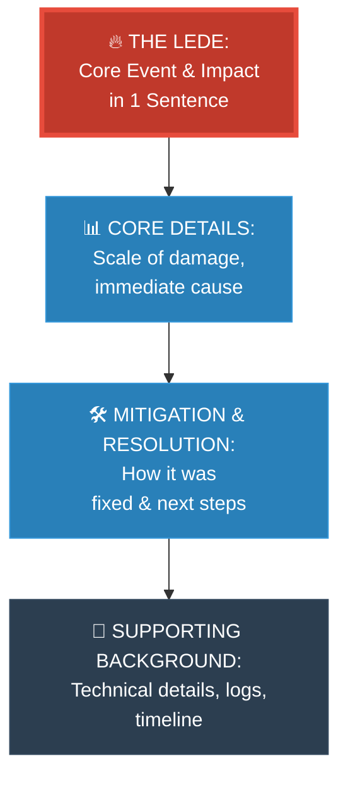

# Strategy 06: The Journalist — Inverted Pyramid (វិធីសាស្ត្រអ្នកសារព័ត៌មាន)

**Author:** ichamrong  
**Date:** 2026-05-18  
**Tags:** #explanation-strategies #journalist #inverted-pyramid #communication #efficiency  
**Category:** Concepts / Explanation Strategies  
**Read Time:** ~5 min  

---

## 📌 មាតិកា (Table of Contents)
- [សេចក្តីផ្តើម (Introduction)](#សេចក្តីផ្តើម-introduction)
- [រូបមន្តនៃការដោះស្រាយ (The Formula)](#រូបមន្តនៃការដោះស្រាយ-the-formula)
- [ដ្យាក្រាមលំហូរ (Visual Flowchart)](#ដ្យាក្រាមលំហូរ-visual-flowchart)
- [ឧទាហរណ៍ជាក់ស្តែង៖ របាយការណ៍បញ្ហាប្រព័ន្ធ (Practical Example)](#ឧទាហរណ៍ជាក់ស្តែង-របាយការណ៍បញ្ហាប្រព័ន្ធ-practical-example)
- [មេរៀន និងដែនកំណត់ (When to Use & Limitations)](#មេរៀន-និងដែនកំណត់-when-to-use-limitations)

---

## សេចក្តីផ្តើម (Introduction)

The **Journalist (Inverted Pyramid)** strategy is built for high-stakes, time-sensitive corporate communication. In professional settings, managers, executives, and on-call engineers are extremely busy. If they read only the first sentence of your message, they must know exactly what happened. The most critical summary (the *lede*) is delivered first, followed by supporting details in descending order of importance.

យុទ្ធសាស្ត្រ **Journalist (Inverted Pyramid - ពីរ៉ាមីតត្រឡប់ក្បាល)** ត្រូវបានបង្កើតឡើងសម្រាប់ការប្រស្រ័យទាក់ទងការងារសាជីវកម្មដែលមានភាពបន្ទាន់ និងតានតឹង។ នៅក្នុងការងារពិតប្រាកដ ប្រធានការងារ ថ្នាក់ដឹកនាំ និងវិស្វករប្រចាំការ មានភាពមមាញឹកខ្លាំង។ ប្រសិនបើពួកគេអានតែប្រយោគដំបូងបង្អស់នៃសាររបស់អ្នក ពួកគេត្រូវតែដឹងភ្លាមថាមានអ្វីកើតឡើង។ សេចក្តីសង្ខេបសំខាន់បំផុត (ហៅថា *Lede*) ត្រូវបានផ្តល់ជូនមុនគេ បន្ទាប់មកទើបជាព័ត៌មានលម្អិតគាំទ្រផ្សេងៗតាមលំដាប់លំដោយពីសំខាន់បំផុតទៅតិចបំផុត។

---

## រូបមន្តនៃការដោះស្រាយ (The Formula)

```
1. Lede (Paragraph 1): The entire event summarized in one high-impact sentence.
2. Core Details (Paragraph 2): Crucial context (what went wrong, scale, current status).
3. Resolution & Mitigation (Paragraph 3): Actions taken to solve and prevent it.
4. Supporting Context (Paragraph 4): Background info and deep technical details.
5. Timeline (Paragraph 5+): Granular step-by-step log (only for specialists).
```

---

## ដ្យាក្រាមលំហូរ (Visual Flowchart)



---

## ឧទាហរណ៍ជាក់ស្តែង៖ របាយការណ៍បញ្ហាប្រព័ន្ធ (Practical Example)

### Explaining a Production Outage (English)
> *"Our payment service was down for 23 minutes from 14:32 to 14:55 UTC, affecting 1,200 transactions and resulting in $87,000 in failed checkouts.*
> *Root cause: a database connection pool exhaustion triggered by a slow query from the new coupon feature deployed at 14:20.*
> *Immediate fix: the coupon query has been indexed; the DB pool size was increased from 10 to 25; and a circuit breaker was applied.*
> *Timeline: At 14:20, feature deployed. At 14:32, first errors observed. At 14:45, on-call paged. At 14:55, rollback completed."*

### របាយការណ៍របស់អ្នកសារព័ត៌មាន (Khmer)
> *«ប្រព័ន្ធទូទាត់ប្រាក់របស់យើងបានគាំងរយៈពេល ២៣ នាទី ចាប់ពីម៉ោង ១៤:៣២ ដល់ ១៤:៥៥ UTC ដែលបង្កផលប៉ះពាល់ដល់ការទូទាត់ចំនួន ១,២០០ ករណី និងខាតបង់ការលក់សរុបចំនួន $៨៧,០០០។*
> *ឫសគល់នៃបញ្ហា៖ ការអស់កន្លែងផ្ទុកការតភ្ជាប់ Database (Connection Pool Exhaustion) ដែលបង្កឡើងដោយ Query យឺតចេញពីមុខងារបញ្ចុះតម្លៃថ្មីដែលបាន Deploy នៅម៉ោង ១៤:២០។*
> *ដំណោះស្រាយភ្លាមៗ៖ Query បញ្ចុះតម្លៃត្រូវបានដាក់ Index; ទំហំ Connection Pool ត្រូវបានតម្លើងពី ១០ ទៅ ២៥; និងបានដាក់ប្រព័ន្ធកាត់ផ្តាច់ (Circuit Breaker)។*
> *កាលវិភាគលម្អិត៖ ម៉ោង ១៤:២០ Deploy មុខងារថ្មី។ ម៉ោង ១៤:៣២ ឃើញ Error លើកដំបូង។ ម៉ោង ១៤:៤៥ ក្រុមការងារទទួលបានការប្រកាសអាសន្ន។ ម៉ោង ១៤:៥៥ ការធ្វើ Rollback ត្រូវបានបញ្ចប់ជាស្ថាពរ។»*

---

## មេរៀន និងដែនកំណត់ (When to Use & Limitations)

### 📈 Best For (សាកសមបំផុតសម្រាប់)
* **Incident Post-Mortems:** Communicating software bugs or service downtime to engineering leaders and business stakeholders.
* **Executive Summaries:** Pitching project status updates in Slack, emails, or quarterly reports.
* **Pull Request (PR) Descriptions:** The first sentence of the PR should state exactly what changes were made.

### ⚠️ Limitations (ដែនកំណត់)
* **Destroys Narrative Suspense:** Do not use this when writing creative parables where curiosity and suspense drive engagement.
* **Specialist Frustration:** Technical experts may need to scroll to the very bottom to find the raw logs and config details they care about.
* **Requires Discipline:** Writers must actively fight the urge to explain the *history* before stating the *result*. Always write the conclusion first.

---

---

## 📚 Implemented Patterns (គំរូស្ថាបត្យកម្មដែលបានអនុវត្ត)

Here are the design patterns explained with high-efficiency summaries first using the **Journalist (Inverted Pyramid)** strategy:

* **[01. Decorator (ការបន្ថែមលក្ខណៈពិសេសលើ Object ដោយមិនប៉ះពាល់កូដចាស់)](./01-decorator.md)** — Delivers a high-impact summary of Decorator as dynamic runtime nesting, followed by class-explosion prevention details and sweet milk coffee wrapping examples.
* **[02. Memento (ការរក្សាទុក និងលុបស្ថានភាពចាស់ដោយសុវត្ថិភាព)](./02-memento.md)** — Delivers a high-impact summary of Memento as safe encapsulation-respecting states, followed by Originator/Caretaker role descriptions and timeline snapshots.
* **[03. Template Method (ការកំណត់គ្រោងគំរូនៃជំហានការងារ)](./03-template-method.md)** — Delivers a high-impact summary of Template Method as concrete superclass skeletons, followed by subclass hook customization details and Hollywood Principle explanation.
* **[04. Singleton (ការធានាឱ្យមានការពិតតែមួយគត់ក្នុងប្រព័ន្ធទាំងមូល)](./04-singleton.md)** — Delivers a high-impact summary of Singleton as an absolute coordinator and single source of truth, followed by double-checked locking mechanism and concurrency visibility rules.
* **[05. Builder (ការបង្កើត Object ស្មុគស្មាញជាជំហានៗ)](./05-builder.md)** — Delivers a high-impact summary of Builder as dynamic step-by-step object construction, followed by telescoping constructor prevention and strict final validation specs.
* **[06. Factory Method (ការបំបែកកូដបង្កើត Object ឱ្យមានសេរីភាពសម្រេចចិត្តលើ Subclass)](./06-factory-method.md)** — Delivers a high-impact summary of Factory Method as decoupled client instantiation, followed by base class orchestrations and subclass dynamic overrides.

---

## Related
* [← Back to Concepts](../README.md)
* [Strategy 07: The Storyteller](../07-storyteller-narrative-arc/README.md)
* [Strategy 08: The Engineer Strategy](../08-engineer-requirements-constraints-solution/README.md)
