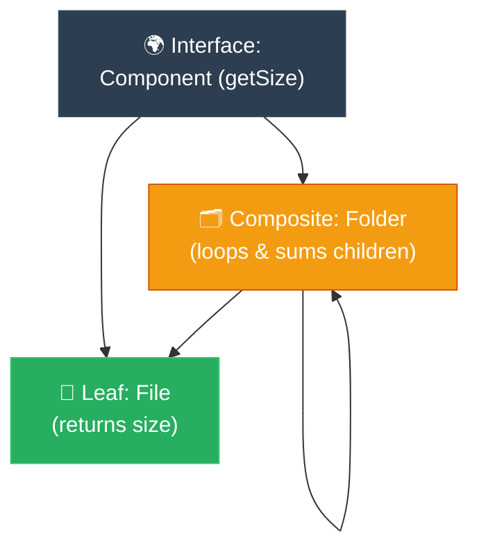

# Storyteller: Composite (ការចាត់ចែងរបស់តូច និងរបស់ធំឱ្យដូចគ្នា)

**Author:** ichamrong  
**Date:** 2026-05-18  
**Tags:** #storyteller #narrative-arc #design-patterns #composite #clean-code  
**Category:** Concepts / Storyteller  
**Read Time:** ~5 min  

---

## 📌 មាតិកា (Table of Contents)
- [១. តួអង្គ និងការតស៊ូ (Hero & Conflict)](#១-តួអង្គ-និងការតស៊ូ-hero-conflict)
- [២. ដំណោះស្រាយសង្គ្រោះស្ថានការណ៍ (The Resolution)](#២-ដំណោះស្រាយសង្គ្រោះស្ថានការណ៍-the-resolution)
- [៣. ដ្យាក្រាមលំហូរ (Visual Flowchart)](#៣-ដ្យាក្រាមលំហូរ-visual-flowchart)
- [៤. Related Posts](#៤-related-posts)

---

## ១. តួអង្គ និងការតស៊ូ (Hero & Conflict)

### English
* **The Hero:** Dara, a junior developer tasked with building a File Explorer system that calculates the total size of files and folders.
* **The Villain:** The silent threat of infinite nesting. A folder can contain files, but it can also contain other folders, which in turn contain more folders and files.
* **The Conflict:** Dara wrote complex nested loops. He checked: `if (item is File) { add size } else if (item is Folder) { loop through files }`. When the client created a folder inside a folder inside a folder, Dara's code crashed with a `NullPointerException` and type-cast errors. The codebase was a spaghetti mess of recursion and type checking.

### Khmer
* **វីរបុរស៖** តារា ជាអ្នកអភិវឌ្ឍន៍សូហ្វវែរម្នាក់ដែលទទួលបានភារកិច្ចសាងសង់ប្រព័ន្ធគ្រប់គ្រងឯកសារ (File Explorer) ដែលត្រូវគណនាទំហំសរុបនៃឯកសារ និងថតឯកសារ (Folders)។
* **មេកំណាច៖** ឧបសគ្គដ៏ធំនៃការដាក់ត្រួតគ្នាមិនចេះចប់ (Infinite Nesting)។ ថតឯកសារអាចផ្ទុកឯកសារ ប៉ុន្តែវាក៏អាចផ្ទុកថតឯកសារផ្សេងទៀត ដែលផ្ទុកថតឯកសារ និងឯកសារបន្តបន្ទាប់ទៀត។
* **ជម្លោះ៖** តារាបានសរសេរកូដ Loop ត្រួតគ្នាដ៏ស្មុគស្មាញ។ គាត់បានឆែកថា៖ `if (item is File) { បូកទំហំ } else if (item is Folder) { រត់លុបលើឯកសារខាងក្នុង }`។ នៅពេលអ្នកប្រើប្រាស់បង្កើតថតឯកសារក្នុងថតឯកសារជាន់ៗគ្នា កូដរបស់តារាបានគាំងដោយសារ `NullPointerException` និងកំហុសបកប្រែប្រភេទជម្រើស (Type-cast errors)។ កូដឡើងរញ៉េរញ៉ៃទាំងស្រុង។

---

## ២. ដំណោះស្រាយសង្គ្រោះស្ថានការណ៍ (The Resolution)

### English
* **The Resolution:** Dara discovered the **Composite Pattern**. Instead of treating Files and Folders differently, he decided to treat them **identically**.
* He created a shared interface called `Component` with a method `getSize()`.
* The `File` (Leaf) implements `getSize()` by returning its own size.
* The `Folder` (Composite) implements `getSize()` by looping through its list of `Component` children, calling `getSize()` on each, and summing the result. It doesn't care if a child is a file or a nested folder!
* The hierarchy became elegant, self-recursive, and completely immune to nesting depth. Dara saved the day and shipped the feature!
* **The Lesson:** Treat individual objects and compositions of objects uniformly through a shared interface.

### Khmer
* **ដំណោះស្រាយ៖** តារាបានរកឃើញ **Composite Pattern**។ ជំនួសឱ្យការចាត់ចែង ឯកសារ (Files) និងថតឯកសារ (Folders) ខុសគ្នា គាត់សម្រេចចិត្តចាត់ចែងពួកវា **ដូចគ្នាទាំងស្រុង**។
* គាត់បង្កើត Interface រួមមួយឈ្មោះថា `Component` ដែលមានមុខងារ `getSize()`។
* `File` (ស្លឹក ឬ Leaf) អនុវត្ត `getSize()` ដោយគ្រាន់តែហុចទំហំផ្ទាល់ខ្លួនរបស់វាវិញ។
* `Folder` (បន្សំ ឬ Composite) អនុវត្ត `getSize()` ដោយគ្រាន់តែរត់លុបលើបញ្ជីកូនៗ `Component` របស់វា រួចហៅ `getSize()` លើកូនម្នាក់ៗ ហើយបូកបញ្ចូលគ្នា។ វាមិនខ្វល់ឡើយថាកូននោះជាឯកសារ ឬជាថតឯកសារជាន់គ្នានោះទេ!
* រចនាសម្ព័ន្ធកូដប្រែជាស្អាត មានរបៀបរៀបរយ និងអាចទ្រទ្រង់ការដាក់ត្រួតគ្នាបានមិនកំណត់។ តារាបានសង្គ្រោះស្ថានការណ៍ និងបញ្ជូនមុខងារនេះទៅកាន់អតិថិជនដោយជោគជ័យ!
* **មេរៀនជាស្នូល៖** ចាត់ចែងរបស់តូចៗ (Individual Objects) និងរបស់ធំៗដែលផ្គុំឡើង (Compositions) ឱ្យដូចគ្នា តាមរយៈការប្រើប្រាស់ Interface រួមតែមួយ។

---

## ៣. ដ្យាក្រាមលំហូរ (Visual Flowchart)

---

## ៤. Related Posts

* 📖 **Read the Parable:** [The Nested Gift Boxes (ប្រអប់កាដូរុំត្រួតគ្នា)](../../parables/84-the-nested-gift-boxes.md)
* 🛠️ **Read the Code Implementation:** [Structural Patterns: The Architecture of Objects](../../../clean-code/design-patterns/02-structural-patterns.md#the-composite)
