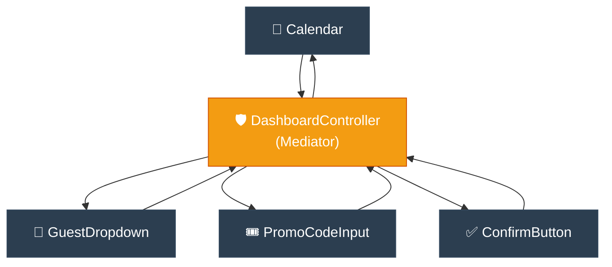

# Storyteller: Mediator (អាជ្ញាកណ្តាលសម្របសម្រួលទំនាក់ទំនង)

**Author:** ichamrong  
**Date:** 2026-05-18  
**Tags:** #storyteller #narrative-arc #design-patterns #mediator #clean-code  
**Category:** Concepts / Storyteller  
**Read Time:** ~5 min  

---

## 📌 មាតិកា (Table of Contents)
- [១. តួអង្គ និងការតស៊ូ (Hero & Conflict)](#១-តួអង្គ-និងការតស៊ូ-hero-conflict)
- [២. ដំណោះស្រាយសង្គ្រោះស្ថានការណ៍ (The Resolution)](#២-ដំណោះស្រាយសង្គ្រោះស្ថានការណ៍-the-resolution)
- [៣. ដ្យាក្រាមលំហូរ (Visual Flowchart)](#៣-ដ្យាក្រាមលំហូរ-visual-flowchart)
- [៤. Related Posts](#៤-related-posts)

---

## ១. តួអង្គ និងការតស៊ូ (Hero & Conflict)

### English
* **The Hero:** Piseth, a frontend architect designing a complex booking dashboard with dozens of interactive elements: a Calendar, a GuestDropdown, a PromoCodeInput, and a ConfirmButton.
* **The Villain:** The "Spider Web" of direct communication ($N \times N$ problem).
* **The Conflict:** Piseth wrote direct connections. The `Calendar` called `GuestDropdown.enable()`. The `GuestDropdown` called `PromoCodeInput.validate()`. The `PromoCodeInput` called `ConfirmButton.toggle()`. The components were tightly bound to each other. When Piseth tried to reuse the `Calendar` component in another simpler page, the code crashed instantly because it was missing `GuestDropdown` and `PromoCodeInput`. The dashboard was a fragile house of cards!

### Khmer
* **វីរបុរស៖** ពិសិដ្ឋ ជាស្ថាបត្យករផ្នែកខាងមុខ (Frontend Architect) ម្នាក់ដែលកំពុងរចនាផ្ទាំង Booking Dashboard ដ៏ស្មុគស្មាញដែលមាន Element អន្តរកម្មរាប់សិប៖ Calendar (ប្រតិទិន), GuestDropdown (បញ្ជីភ្ញៀវ), PromoCodeInput (ប្រអប់កូដបញ្ចុះតម្លៃ) និង ConfirmButton (ប៊ូតុងបញ្ជាក់)។
* **មេកំណាច៖** សំណាញ់សរសៃសត្វពស់ពាក់ព័ន្ធគ្នាដោយផ្ទាល់ ($N \times N$ problem)។
* **ជម្លោះ៖** ពិសិដ្ឋបានសរសេរកូដឱ្យ Element នីមួយៗទាក់ទងគ្នាដោយផ្ទាល់។ `Calendar` ហៅ `GuestDropdown.enable()`។ `GuestDropdown` ហៅ `PromoCodeInput.validate()`។ `PromoCodeInput` ហៅ `ConfirmButton.toggle()`។ គ្រឿងបង្គុំទាំងនេះជាប់គ្នាស្អិត។ នៅពេលពិសិដ្ឋចង់យក `Calendar` ទៅប្រើប្រាស់ឡើងវិញនៅលើទំព័រដ៏សាមញ្ញផ្សេងទៀត កូដបានគាំងភ្លាមៗ ព្រោះវាគ្មាន `GuestDropdown` និង `PromoCodeInput` នៅក្នុងទំព័រថ្មីនោះឡើយ។ ផ្ទាំង Dashboard នេះងាយបាក់បែកខ្លាំងណាស់!

---

## ២. ដំណោះស្រាយសង្គ្រោះស្ថានការណ៍ (The Resolution)

### English
* **The Resolution:** Piseth introduced the **Mediator Pattern**.
* He forbade components from talking to each other directly. Instead, he created a central **Mediator (The DashboardController)**.
* Every component only holds a reference to the Mediator. When something happens (e.g., Calendar date changes), it simply notifies the Mediator: `mediator.notify(this, "dateChanged")`.
* The Mediator contains the logic to coordinate everyone: it tells `GuestDropdown` to enable, `PromoCodeInput` to validate, etc.
* Now, all components are completely decoupled, self-contained, and 100% reusable on any page! Piseth successfully decoupled the interface, making future features a breeze to implement.
* **The Lesson:** Define an object that encapsulates how a set of objects interact. Enforce collaboration only via the central mediator.

### Khmer
* **ដំណោះស្រាយ៖** ពិសិដ្ឋបានសម្រេចចិត្តដាក់បញ្ចូល **Mediator Pattern** ទៅក្នុងប្រព័ន្ធ។
* គាត់ហាមឃាត់មិនឱ្យគ្រឿងបង្គុំទាំងឡាយទាក់ទងគ្នាដោយផ្ទាល់ឡើយ។ ជំនួសមកវិញ គាត់បង្កើត **Mediator កណ្តាល (DashboardController)** មួយ។
* គ្រឿងបង្គុំនីមួយៗរក្សាទុក Reference ទៅកាន់ Mediator តែមួយគត់។ ពេលមានសកម្មភាពកើតឡើង (ដូចជាការប្តូរថ្ងៃលើ Calendar) វានឹងប្រាប់ទៅកាន់ Mediator តែប៉ុណ្ណោះ៖ `mediator.notify(this, "dateChanged")`។
* Mediator គឺជាអ្នកផ្ទុកតក្កវិជ្ជានៅកណ្តាលដើម្បីសម្របសម្រួលគ្រប់គ្នា៖ វាប្រាប់ `GuestDropdown` ឱ្យដំណើរការ ប្រាប់ `PromoCodeInput` ឱ្យត្រួតពិនិត្យជាដើម។
* ពេលនេះ គ្រឿងបង្គុំទាំងអស់ត្រូវបានបំបែកចេញពីគ្នា ឯករាជ្យ និងអាចយកទៅប្រើប្រាស់ឡើងវិញនៅលើទំព័រណាក៏បាន ១០០%! ពិសិដ្ឋបានសម្របសម្រួល UI បានយ៉ាងជោគជ័យ ដែលធ្វើឱ្យការបន្ថែមមុខងារថ្មីៗទៅថ្ងៃមុខងាយស្រួលបំផុត។
* **មេរៀនជាស្នូល៖** បង្កើត Object មួយដែលខ្ចប់នូវរបៀបដែលក្រុមនៃ Object ទាំងឡាយប្រស្រ័យទាក់ទងគ្នា។ បង្ខំឱ្យកិច្ចសហការទាំងអស់ធ្វើឡើងតាមរយៈ Mediator កណ្តាលតែប៉ុណ្ណោះ។

---

## ៣. ដ្យាក្រាមលំហូរ (Visual Flowchart)

---

## ៤. Related Posts

* 📖 **Read the Parable:** [The Air Traffic Controller (អ្នកបញ្ជាចរាចរណ៍ផ្លូវអាកាស)](../../parables/90-the-air-traffic-controller.md)
* 🛠️ **Read the Code Implementation:** [Behavioral Patterns: The Dynamics of Objects](../../../clean-code/design-patterns/03-behavioral-patterns.md#the-mediator)
