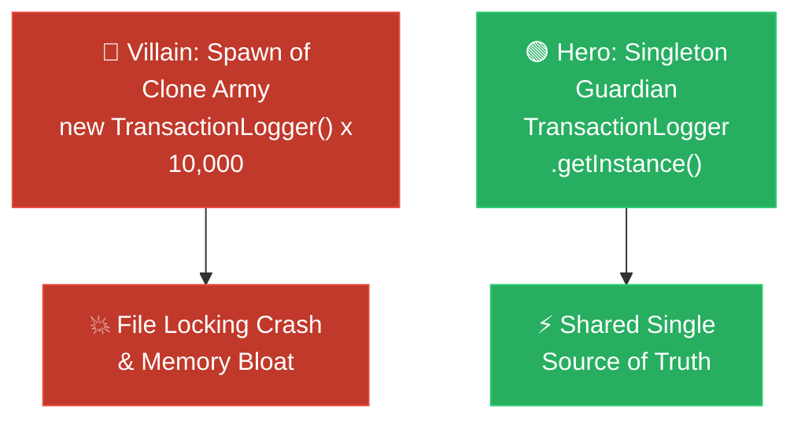

# Storyteller: Singleton (អាណាព្យាបាលនៃសេចក្តីពិត និងកងទ័ពក្លូនបង្កចលាចល)

**Author:** ichamrong  
**Date:** 2026-05-18  
**Tags:** #storyteller #narrative-arc #design-patterns #singleton #clean-code  
**Category:** Concepts / Storyteller  
**Read Time:** ~5 min  

---

## 📌 មាតិកា (Table of Contents)
- [១. តួអង្គ និងការតស៊ូ (Hero & Conflict)](#១-តួអង្គ-និងការតស៊ូ-hero-conflict)
- [២. ដំណោះស្រាយសង្គ្រោះស្ថានការណ៍ (The Resolution)](#២-ដំណោះស្រាយសង្គ្រោះស្ថានការណ៍-the-resolution)
- [៣. ដ្យាក្រាមលំហូរ (Visual Flowchart)](#៣-ដ្យាក្រាមលំហូរ-visual-flowchart)
- [៤. Related Posts](#៤-related-posts)

---

## ១. តួអង្គ និងការតស៊ូ (Hero & Conflict)

### English
* **The Hero:** Kiri, a passionate developer building a high-traffic e-commerce system that writes transaction histories to a shared central Log File.
* **The Villain:** The silent, exponential threat of the **Clone Army of Instances**.
* **The Conflict:** Kiri designed the logger as a simple class. Every time his services (`UserService`, `CartService`, `PaymentService`) needed to log an event, they called `new TransactionLogger()`. Under heavy production load, thousands of concurrent threads spawned their own separate logger objects. They all tried to open and write to the same physical log file on the disk simultaneously. The operating system threw "File Lock Exceptions," threads deadlocked waiting for access, JVM heap memory bloated with identical temporary logger objects, and the server crashed during a peak marketing campaign. Kiri was drowning in chaos.

### Khmer
* **វីរបុរស៖** គិរី ជាអ្នកអភិវឌ្ឍន៍សូហ្វវែរដ៏មានទឹកចិត្តម្នាក់ ដែលកំពុងសាងសង់ប្រព័ន្ធលក់ទំនិញអនឡាញដែលមានចរាចរណ៍ខ្ពស់។ ប្រព័ន្ធនេះត្រូវសរសេរប្រវត្តិនៃការលក់ចូលទៅក្នុងឯកសារ Log រួមគ្នាតែមួយគត់។
* **មេកំណាច៖** គ្រោះថ្នាក់ដ៏ស្ងប់ស្ងាត់នៃការកើនឡើងហួសប្រមាណនៃ **«កងទ័ពក្លូន Object»**។
* **ជម្លោះ៖** គិរីបានរចនាកម្មវិធីកត់ត្រា Log របស់គាត់ជា Class ធម្មតាមួយ។ រាល់ពេលដែល Service ផ្សេងៗ (`UserService`, `CartService`, `PaymentService`) ត្រូវកត់ត្រាព្រឹត្តិការណ៍ ពួកវាតែងតែហៅ `new TransactionLogger()`។ នៅពេលដែលប្រព័ន្ធរត់ក្រោមបន្ទុកដ៏ធ្ងន់ ខ្សែស្រឡាយការងារ (Threads) រាប់ពាន់បានបង្កើត Object Logger ផ្ទាល់ខ្លួនរៀងៗខ្លួន។ ពួកវាទាំងអស់ព្យាយាមបើក និងសរសេរចូលទៅក្នុងឯកសារ Log តែមួយក្នុងពេលតែមួយ។ ប្រព័ន្ធប្រតិបត្តិការ (OS) បានបោះកំហុស "File Lock Exceptions" ខ្សែស្រឡាយជាប់គាំងរង់ចាំគ្នា (Deadlock) មេម៉ូរី JVM ឡើងប៉ោងពេញដោយ Object ស្ទួនៗគ្នា ហើយម៉ាស៊ីនមេ (Server) ក៏បានគាំងទាំងស្រុងក្នុងអំឡុងពេលយុទ្ធនាការលក់ធំបំផុត។ គិរីបានធ្លាក់ក្នុងភាពវឹកវរទាំងស្រុង។

---

## ២. ដំណោះស្រាយសង្គ្រោះស្ថានការណ៍ (The Resolution)

### English
* **The Resolution:** Kiri discovered the **Singleton Pattern**—the ultimate Guardian of Order. 
* He locked the front door of instantiation by declaring the `TransactionLogger` constructor `private`, vanquishing the clone army forever.
* He created a single, static instance inside the logger and opened a guarded, public doorway called `getInstance()`.
* Now, instead of spawning clones, every service was forced to shake hands with the exact same, single Logger instance in memory. 
* Writing to the log file became orderly and perfectly coordinated. The memory usage plummeted to near-zero, file locking conflicts vanished, and the server handled the massive peak load without a single sweat. Kiri saved the system and was hailed as the master architect!
* **The Lesson:** When managing a shared system resource, there must be only one ruler. Multiple coordinators breed absolute chaos.

### Khmer
* **ដំណោះស្រាយ៖** គិរីបានរកឃើញ **Singleton Pattern** — ដែលជាអាណាព្យាបាលដាច់ខាតនៃសេចក្តីពិត និងសណ្តាប់ធ្នាប់។
* គាត់បានចាក់សោទ្វារសាងសង់ Object ដោយកំណត់ Constructor របស់ `TransactionLogger` ឱ្យទៅជា `private` ដោយកម្ចាត់កងទ័ពក្លូនជាដរាប។
* គាត់បានបង្កើត Object static តែមួយគត់នៅខាងក្នុង Logger នោះ រួចបើកច្រកទ្វារដ៏មានសុវត្ថិភាពមួយឈ្មោះថា `getInstance()`។
* ពេលនេះ ជំនួសឱ្យការបង្កើត Object ក្លូនស្ទួនៗគ្នា Service ទាំងអស់ត្រូវបានបង្ខំឱ្យប្រើប្រាស់ Object Logger តែមួយគត់រួមគ្នានៅក្នុង Memory។
* ការសរសេរចូលឯកសារ Log ប្រែជាមានរបៀបរៀបរយ និងសម្របសម្រួលគ្នាយ៉ាងល្អឥតខ្ចោះ។ ការប្រើប្រាស់មេម៉ូរីធ្លាក់ចុះមកស្ទើរតែសូន្យ ការប៉ះទង្គិចឯកសារបានរលាយបាត់ ហើយ Server អាចទ្រទ្រង់បន្ទុកការងារយក្សនោះបានយ៉ាងរលូន។ គិរីបានសង្គ្រោះប្រព័ន្ធ និងត្រូវបានតែងតាំងជាស្ថាបត្យករឆ្នើម!
* **មេរៀនជាស្នូល៖** នៅពេលគ្រប់គ្រងធនធានរួមគ្នានៃប្រព័ន្ធ ត្រូវតែមានអ្នកដឹកនាំតែមួយគត់។ អ្នកសម្របសម្រួលច្រើននឹងបង្កជាចលាចលទាំងស្រុង។

---

## ៣. ដ្យាក្រាមលំហូរ (Visual Flowchart)

---

## ៤. Related Posts

### 🔗 Explore All Viewpoints:
* 📖 **Read the Parable:** [The Bank's Only Vault (ទូដែកតែមួយគត់របស់ធនាគារ)](../../parables/75-the-banks-only-vault.md) — Explains the emotional core of shared truth.
* 🧠 **Read the First Principles Derivation:** [MIT Professor Strategy: Singleton (គោលការណ៍គ្រឹះដំបូងនៃ Singleton)](../01-mit-professor/01-singleton.md) — Derives the pattern from fundamental computer axioms.
* 👶 **Read the Feynman Simplification:** [Feynman Technique: Singleton (ការពន្យល់ពី Singleton ដោយគ្មានពាក្យបច្ចេកទេស)](../02-feynman-technique/04-singleton.md) — Breaks it down using the central clock tower.
* 👦 **Read the ELI5 Metaphor:** [ELI5: Singleton (ម៉ាស៊ីនខួងខ្មៅដៃតែមួយគត់ក្នុងថ្នាក់រៀន)](../03-eli5/04-singleton.md) — Teaches it to a five-year-old using classroom pencil sharpeners.
* 🌉 **Read the Analogy Bridge:** [Analogy Bridge: Singleton (ស្ពានប្រៀបធៀបនៃប្រភពពិតតែមួយគត់)](../04-analogy-bridge/04-singleton.md) — Maps it to a hotel front desk and shows where physical limits fail compared to code threads.
* 🧐 **Read the Socratic Discovery:** [Socratic Method: Singleton (ការបង្កើតប្រព័ន្ធការពិតតែមួយគត់តាមវិធីសាស្ត្រសូក្រាត)](../05-socratic-method/04-singleton.md) — Guide your self-discovery through mentor-student dialogue.
* 📰 **Read the Journalist Summary:** [Journalist: Singleton (ការធានាឱ្យមានការពិតតែមួយគត់ក្នុងប្រព័ន្ធទាំងមូល)](../06-journalist-inverted-pyramid/04-singleton.md) — Get the high-impact lede, volatile visibility, and thread-safety details first.
* 🎭 **Read the Storyteller Narrative:** [Storyteller: Singleton (អាណាព្យាបាលនៃសេចក្តីពិត និងកងទ័ពក្លូនបង្កចលាចល)](../07-storyteller-narrative-arc/04-singleton.md) — Follow Kiri's heroic journey to vanquish the duplicate logger clone army.
* ⚙️ **Read the Engineer Spec:** [Engineer: Singleton (ការសម្របសម្រួលប្រភពពិតតែមួយគត់ និងទប់ស្កាត់ការខ្ជះខ្ជាយធនធាន)](../08-engineer-requirements-constraints-solution/03-singleton.md) — Read the rigorous engineering specification, DCL performance details, and candidate elimination.
* 📊 **Read the Pros & Cons:** [Pros & Cons Compared: Singleton (ការប្រៀបធៀបគុណសម្បត្តិ និងគុណវិបត្តិនៃ Singleton)](../09-pros-and-cons-compared/01-singleton.md) — Full trade-off analysis and decision matrix.
* 🛠️ **Read the Code Implementation:** [Creational Patterns: The Art of Instantiation](../../../clean-code/design-patterns/01-creational-patterns.md#the-singleton) — Production-grade Java with double-checked locking and thread safety.
