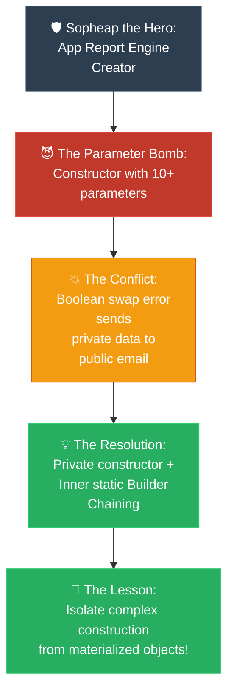

# Storyteller: Builder (វីរបុរស Builder និងសង្គ្រាមប៉ារ៉ាម៉ែត្ររញ៉េរញ៉ៃ)

**Author:** ichamrong  
**Date:** 2026-05-18  
**Tags:** #storyteller #narrative-arc #design-patterns #builder #clean-code  
**Category:** Concepts / Storyteller Narrative Arc  
**Read Time:** ~6 min  

---

## 📌 មាតិកា (Table of Contents)
- [១. តួអង្គវីរបុរស (The Hero)](#១-តួអង្គវីរបុរស-the-hero)
- [២. មេកំណាច៖ គ្រាប់បែកប៉ារ៉ាម៉ែត្រ (The Villain: The Parameter Bomb)](#២-មេកំណាច-គ្រាប់បែកប៉ារ៉ាម៉ែត្រ-the-villain-the-parameter-bomb)
- [៣. ជម្លោះធំ៖ ថ្ងៃបាក់បែក (The Conflict: The Day Everything Broke)](#៣-ជម្លោះធំ-ថ្ងៃបាក់បែក-the-conflict-the-day-everything-broke)
- [៤. ដំណោះស្រាយ៖ ដាវអាគមរបស់ Builder (The Resolution: The Builder's Sword)](#៤-ដំណោះស្រាយ-ដាវអាគមរបស់-builder-the-resolution-the-builders-sword)
- [៥. ដ្យាក្រាមលំហូរ (Visual Flowchart)](#៥-ដ្យាក្រាមលំហូរ-visual-flowchart)
- [៦. Related Posts](#៦-related-posts)

---

## ១. តួអង្គវីរបុរស (The Hero)

### English
Once upon a time in a fast-growing startup, there was a talented software developer named **Sopheap**. Sopheap was the primary guardian of the company’s analytical engine, responsible for generating beautiful, high-performance financial **Reports**.

### Khmer
កាលពីព្រេងនាយ នៅក្នុងក្រុមហ៊ុនទើបបង្កើតថ្មី (Startup) ដ៏លេចធ្លោមួយ មានវិស្វករសូហ្វវែរដ៏មានទេពកោសល្យម្នាក់ឈ្មោះ **សុភាព**។ សុភាព គឺជាអ្នកថែរក្សាប្រព័ន្ធវិភាគដ៏សំខាន់របស់ក្រុមហ៊ុន ដែលទទួលខុសត្រូវលើការបង្កើត **របាយការណ៍ហិរញ្ញវត្ថុ (Reports)** ដ៏ស្រស់ស្អាត និងមានល្បឿនលឿន។

---

## ២. មេកំណាច៖ គ្រាប់បែកប៉ារ៉ាម៉ែត្រ (The Villain: The Parameter Bomb)

### English
Over time, marketing, compliance, and sales requested more options for the reports. 
* *"We need customized headers!"* 
* *"We want PDF, CSV, and Excel formats!"* 
* *"We need signature blocks, page numbers, and custom timestamps!"*

Sopheap accommodated every request by adding parameters to the `Report` constructor. The constructor grew into a terrifying **Parameter Bomb**:
```java
public Report(String title, String type, List<Data> rows, boolean isDraft, boolean includeHeader, boolean includeFooter, int maxPages, boolean secureSign, String themeColor, String timezone)
```
This was the silent villain, hiding inside the codebase, waiting for the perfect moment to trigger a catastrophe.

### Khmer
ពេលវេលាកន្លងផុតទៅ ផ្នែកទីផ្សារ ផ្នែកអនុលោមភាព (Compliance) និងផ្នែកលក់ បានស្នើសុំជម្រើសបន្ថែមជាច្រើនសម្រាប់របាយការណ៍។
* *«យើងត្រូវការប្ដូរ Header តាមចិត្ត!»*
* *«យើងចង់បានទម្រង់ PDF, CSV, និង Excel!»*
* *«យើងត្រូវការប្រអប់ហត្ថលេខា លេខទំព័រ និងម៉ោងជាក់លាក់ផ្ទាល់ខ្លួន!»*

សុភាពបានបំពេញរាល់សំណើទាំងនោះ ដោយបន្ថែមប៉ារ៉ាម៉ែត្រ (Parameters) ទៅក្នុង Constructor របស់ `Report`។ យូរៗទៅ Constructor នោះបានរីកធំធាត់ទៅជា **«គ្រាប់បែកប៉ារ៉ាម៉ែត្រ (Parameter Bomb)»** ដ៏គួរឱ្យខ្លាច៖
```java
public Report(String title, String type, List<Data> rows, boolean isDraft, boolean includeHeader, boolean includeFooter, int maxPages, boolean secureSign, String themeColor, String timezone)
```
នេះគឺជាមេកំណាចដ៏ស្ងៀមស្ងាត់ ដែលលាក់ខ្លួននៅក្នុងកូដ ដោយរង់ចាំពេលវេលាដ៏សាកសមបំផុតដើម្បីបង្កមហន្តរាយ។

---

## ៣. ជម្លោះធំ៖ ថ្ងៃបាក់បែក (The Conflict: The Day Everything Broke)

### English
The catastrophe arrived on Black Friday. A junior developer, trying to generate an urgent report, wrote:
```java
new Report("Sales", "PDF", data, true, false, true, 10, true, "Blue", "UTC")
```

By accident, the junior developer swapped the order of the consecutive boolean parameters: `isDraft`, `includeHeader`, `includeFooter`, and `secureSign`. The compiler saw nothing wrong because all were booleans. 

Instead of a secure, draft-mode internal report, the system sent a **live, non-secure, unsigned document containing raw data to public email addresses!** 

The company lost a key partner, and the development team spent a sleepless night trying to trace the swapped parameters. The stakes were clear: either Sopheap tamed this monster constructor, or a tiny slip-up would sink the startup entirely.

### Khmer
មហន្តរាយបានមកដល់នៅថ្ងៃ Black Friday។ អ្នកអភិវឌ្ឍន៍វ័យក្មេង (Junior Developer) ម្នាក់ដែលព្យាយាមបង្កើតរបាយការណ៍បន្ទាន់មួយ បានសរសេរកូដ៖
```java
new Report("Sales", "PDF", data, true, false, true, 10, true, "Blue", "UTC")
```

ជាយថាហេតុ អ្នកអភិវឌ្ឍន៍វ័យក្មេងរូបនោះបានច្រឡំលំដាប់លំដោយនៃប៉ារ៉ាម៉ែត្រប្រភេទ Boolean ជាប់ៗគ្នា រួមមាន៖ `isDraft`, `includeHeader`, `includeFooter`, និង `secureSign`។ កម្មវិធីបកប្រែកូដ (Compiler) មិនឃើញមានកំហុសអ្វីឡើយ ព្រោះពួកវាទាំងអស់សុទ្ធតែជាប្រភេទ Boolean ដូចគ្នា។ 

ជំនួសឱ្យការផ្ញើរបាយការណ៍ផ្ទៃក្នុងដែលមានសុវត្ថិភាពក្នុងទម្រង់ព្រាង (Draft Mode) ប្រព័ន្ធបែរជាផ្ញើ **ឯកសារផ្លូវការ គ្មានសុវត្ថិភាព គ្មានហត្ថលេខា ដែលមានផ្ទុកទិន្នន័យឆៅ ទៅកាន់អាសយដ្ឋានអ៊ីមែលជាសាធារណៈទៅវិញ!**

ក្រុមហ៊ុនបានបាត់បង់ដៃគូដ៏សំខាន់មួយ ហើយក្រុមការងារអភិវឌ្ឍន៍កូដត្រូវចំណាយពេលមួយយប់ទាល់ភ្លឺដោយគ្មានគេង ដើម្បីតាមដានរកប៉ារ៉ាម៉ែត្រដែលបានច្រឡំគ្នានោះ។ ហានិភ័យគឺច្បាស់ណាស់៖ ប្រសិនបើសុភាពមិនអាចទប់ស្កាត់បិសាច Constructor នេះបានទេ នោះការរអិលម្រាមដៃបន្តិចបន្តួចនឹងធ្វើឱ្យក្រុមហ៊ុន Startup នេះលិចលង់ទាំងស្រុងជារៀងរហូត។

---

## ៤. ដំណោះស្រាយ៖ ដាវអាគមរបស់ Builder (The Resolution: The Builder's Sword)

### English
Sopheap drew the **Builder Pattern** as his ultimate weapon.
1. He locked down the `Report` class, making its constructor `private` and all attributes strictly `final` (immutable). No one could bypass validation again.
2. He created a static inner class: `Report.Builder`.
3. He gave it readable, chainable methods. 

Now, when any developer wanted to build a report, they had to write it clearly:
```java
Report report = new Report.Builder("Sales", "PDF") // Required properties
    .rows(data)
    .isDraft(true)
    .includeHeader(false)
    .secureSign(true)
    .build();
```
There was no more guessing the position of booleans. There was no more incomplete state. Chaining the methods made the code read like a sentence. On Cyber Monday, the reports generated flawlessly, security was preserved, and Sopheap was crowned the champion architect of the codebase.

### Khmer
សុភាពបានដកហូត **Builder Pattern** ធ្វើជាអាវុធចុងក្រោយរបស់គាត់។
១. គាត់បានចាក់សោ Class `Report` ដោយកំណត់ Constructor របស់វាជា `private` និងកំណត់រាល់ Attribute ទាំងអស់ជា `final` (Immutable - មិនអាចកែប្រែបាន)។ គ្មាននរណាម្នាក់អាចរំលងការត្រួតពិនិត្យភាពត្រឹមត្រូវ (Validation) បានទៀតឡើយ។
២. គាត់បានបង្កើត Static Inner Class មួយ៖ `Report.Builder`។
៣. គាត់បានផ្តល់នូវមុខងារ (Methods) ដែលងាយស្រួលអាន និងអាចហៅតៗគ្នាបាន (Chainable Methods)។

ឥឡូវនេះ នៅពេលដែលអ្នកអភិវឌ្ឍន៍ចង់បង្កើតរបាយការណ៍ ពួកគេត្រូវសរសេរវាឱ្យបានច្បាស់លាស់៖
```java
Report report = new Report.Builder("Sales", "PDF") // Required properties
    .rows(data)
    .isDraft(true)
    .includeHeader(false)
    .secureSign(true)
    .build();
```
លែងមានការទស្សន៍ទាយទីតាំងរបស់ប៉ារ៉ាម៉ែត្រ Boolean ទៀតហើយ។ ក៏លែងមានស្ថានភាពបង្កើត Object មិនពេញលេញទៀតដែរ។ ការហៅមុខងារតៗគ្នាធ្វើឱ្យកូដអានទៅដូចជាប្រយោគភាសាធម្មតា។ នៅថ្ងៃ Cyber Monday របាយការណ៍ត្រូវបានបង្កើតឡើងយ៉ាងល្អឥតខ្ចោះ សុវត្ថិភាពត្រូវបានធានា ហើយសុភាពត្រូវបានលើកតម្កើងជាស្ថាបត្យករឆ្នើមការពារកូដរបស់ក្រុមហ៊ុន!

---

## ៥. ដ្យាក្រាមលំហូរ (Visual Flowchart)



---

## ៦. Related Posts

### 🔗 Explore All Viewpoints:
* 📖 **Read the Parable:** [The 47-Question Waiter (អ្នករត់តុសួរ ៤៧ សំណួរ)](../../parables/76-the-overwhelmed-sandwich-shop.md) — The emotional story of a chaotic customer experience.
* 🧠 **Read the First Principles Derivation:** [MIT Professor Strategy: Builder (គោលការណ៍គ្រឹះដំបូងនៃ Builder)](../01-mit-professor/04-builder.md) — Derives the pattern from stack frame layouts and thread safety laws.
* 👶 **Read the Feynman Simplification:** [Feynman Technique: Builder (ការពន្យល់ពី Builder ដោយគ្មានពាក្យបច្ចេកទេស)](../02-feynman-technique/05-builder.md) — Breaks it down using a simple cafe menu checklist.
* 👦 **Read the ELI5 Metaphor:** [ELI5: Builder (ការពន្យល់ពី Builder ដូចក្មេងអាយុ ៥ ឆ្នាំ)](../03-eli5/05-builder.md) — Teaches a five-year-old using Lego spaceship construction books.
* 🌉 **Read the Analogy Bridge:** [Analogy Bridge: Builder (ស្ពានប្រៀបធៀបនៃ Builder)](../04-analogy-bridge/05-builder.md) — Maps real sandwich ticks to fluent Java methods, outlining physical limitations.
* 🧐 **Read the Socratic Discovery:** [Socratic Method: Builder (ការបង្កើត Object ស្មុគស្មាញតាមវិធីសាស្ត្រសូក្រាត)](../05-socratic-method/05-builder.md) — Probes yourself via a mentor-student constructor debate.
* 📰 **Read the Journalist Summary:** [Journalist: Builder (ការបង្កើត Object ស្មុគស្មាញជាជំហានៗ)](../06-journalist-inverted-pyramid/05-builder.md) — Quick news lede, telescoping prevention, and step-by-step assembly validation.
* 🎭 **Read the Storyteller Narrative:** [Storyteller: Builder (វីរបុរស Builder និងសង្គ្រាមប៉ារ៉ាម៉ែត្ររញ៉េរញ៉ៃ)](../07-storyteller-narrative-arc/05-builder.md) — Sopheap's battle against a production parameter bomb catastrophe on Black Friday.
* ⚙️ **Read the Engineer Spec:** [Engineer: Builder (ការបង្កើត Object ស្មុគស្មាញជាជំហានៗ)](../08-engineer-requirements-constraints-solution/01-builder.md) — Read the formal engineering requirements and candidate evaluation table.
* 📊 **Read the Pros & Cons:** [Pros & Cons Compared: Builder (ការប្រៀបធៀបគុណសម្បត្តិ និងគុណវិបត្តិនៃ Builder)](../09-pros-and-cons-compared/02-builder.md) — Full trade-off analysis and decision matrix.
* 🛠️ **Read the Code Implementation:** [Creational Patterns: The Art of Instantiation](../../../clean-code/design-patterns/01-creational-patterns.md#the-builder) — Production-grade Java with fluent chaining and immutable object construction.
