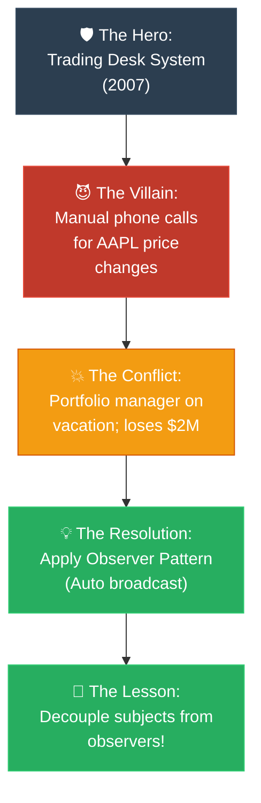

# Strategy 07: The Storyteller — Narrative Arc (អ្នកនិទានរឿង)

**Author:** ichamrong  
**Date:** 2026-05-18  
**Tags:** #explanation-strategies #storyteller #narrative-arc #engagement #communication  
**Category:** Concepts / Explanation Strategies  
**Read Time:** ~5 min  

---

## 📌 មាតិកា (Table of Contents)
- [សេចក្តីផ្តើម (Introduction)](#សេចក្តីផ្តើម-introduction)
- [រូបមន្តនៃការដោះស្រាយ (The Formula)](#រូបមន្តនៃការដោះស្រាយ-the-formula)
- [ដ្យាក្រាមលំហូរ (Visual Flowchart)](#ដ្យាក្រាមលំហូរ-visual-flowchart)
- [ឧទាហរណ៍ជាក់ស្តែង៖ Observer Pattern (Practical Example)](#ឧទាហរណ៍ជាក់ស្តែង-observer-pattern-practical-example)
- [មេរៀន និងដែនកំណត់ (When to Use & Limitations)](#មេរៀន-និងដែនកំណត់-when-to-use-limitations)

---

## សេចក្តីផ្តើម (Introduction)

Humans are biologically wired for stories. When we hear a story, our brain releases Dopamine (driving curiosity) and Oxytocin (fostering empathy), which increases our ability to process and recall information. The **Storyteller (Narrative Arc)** strategy translates highly abstract architectural patterns or code bugs into a human drama. It assigns clear roles: a Hero (the system/team), a Villain (the bug/scale crisis), a Conflict, and a Resolution that saves the day, making the technical lesson unforgettable.

មនុស្សជាតិត្រូវបានបង្កើតឡើងតាមបែបជីវសាស្ត្រដើម្បីស្តាប់ និងចងចាំរឿងរ៉ាវ។ នៅពេលយើងឮសាច់រឿង ខួរក្បាលរបស់យើងបញ្ចេញសារធាតុ Dopamine (បង្កើនការចង់ដឹងចង់ឃើញ) និង Oxytocin (បង្កើនអារម្មណ៍យល់ចិត្ត) ដែលជួយបង្កើនសមត្ថភាពយល់ដឹង និងចងចាំព័ត៌មាន។ យុទ្ធសាស្ត្រ **Storyteller (រចនាសម្ព័ន្ធនិទានរឿង)** បំប្លែងរចនាសម្ព័ន្ធបច្ចេកវិទ្យាដែលអរូបី ឬ Bug ស្មុគស្មាញឱ្យទៅជារឿងភាគរបស់មនុស្ស។ វាបែងចែកតួនាទីច្បាស់លាស់៖ វីរបុរស (ប្រព័ន្ធ ឬក្រុមការងារ) មេកំណាច (Bug ឬវិបត្តិទ្រង់ទ្រាយធំ) ជម្លោះ និងដំណោះស្រាយដែលសង្គ្រោះស្ថានការណ៍ ដែលធ្វើឱ្យមេរៀនបច្ចេកទេសនោះមិនអាចបំភ្លេចបាន។

---

## រូបមន្តនៃការដោះស្រាយ (The Formula)

```
1. Hero: Introduce the system, team, or developer facing a challenge.
2. Villain: Identify the silent threat (scale increase, tech debt, or a hidden bug).
3. Conflict: Show the exact moment everything breaks down and why.
4. Stakes: Outline the painful consequence if this problem is not solved.
5. Resolution: Introduce the pattern, tool, or refactoring that saves the day.
6. The Lesson: Extract the clean architectural principle from the story.
```

---

## ដ្យាក្រាមលំហូរ (Visual Flowchart)



---

## ឧទាហរណ៍ជាក់ស្តែង៖ Observer Pattern (Practical Example)

### Explaining the Observer Pattern (English)
> *"Picture a stock trading desk in 2007. The stock price of AAPL changes. Someone manually has to call the portfolio manager. And the risk desk. And the compliance officer. And the news feed. Every time. For every stock.*
> *Then one day, the portfolio manager is on vacation and doesn't get the call. The desk loses $2M.*
> *The solution: instead of calling everyone manually, every interested party subscribes to the stock. When the price changes, it broadcasts automatically. No one is missed. No one has to remember the list.*
> *That's the Observer pattern. The stock is the Subject. The portfolio manager, risk desk, and compliance officer are Observers."*

### វិធីសាស្ត្រនិទានរឿង (Khmer)
> *«សូមស្រមៃគិតពីតុជួញដូរភាគហ៊ុនមួយក្នុងឆ្នាំ ២០០៧។ ថ្លៃភាគហ៊ុន AAPL បានប្រែប្រួល។ បុគ្គលិកម្នាក់ត្រូវខលទូរស័ព្ទដោយដៃទៅប្រាប់ប្រធានគ្រប់គ្រងមូលនិធិ។ រួចខលទៅផ្នែកហានិភ័យ។ រួចខលទៅមន្ត្រីអនុលោមភាព។ រួចខលទៅផ្នែកព័ត៌មាន។ ត្រូវធ្វើបែបនេះរាល់ពេល និងគ្រប់ភាគហ៊ុនទាំងអស់។*
> *ថ្ងៃមួយ ប្រធានគ្រប់គ្រងមូលនិធិបានទៅដើរលេងសម្រាកលំហែកាយ ហើយមិនទទួលបានការខលទូរស័ព្ទនោះទេ។ តុជួញដូរភាគហ៊ុននោះបានខាតបង់ទឹកប្រាក់អស់ $២ លានដុល្លារ។*
> *ដំណោះស្រាយ៖ ជំនួសឱ្យការខលទៅកាន់មនុស្សគ្រប់គ្នាដោយដៃ ភាគីពាក់ព័ន្ធទាំងអស់គ្រាន់តែចុះឈ្មោះ Subscribe លើភាគហ៊ុននោះ។ ពេលតម្លៃភាគហ៊ុនប្រែប្រួល វានឹងផ្សាយដំណឹង (Broadcast) ដោយស្វ័យប្រវត្តិ។ គ្មាននរណាម្នាក់ត្រូវបានរំលងឡើយ ហើយក៏គ្មាននរណាម្នាក់ចាំបាច់ត្រូវកត់ត្រាបញ្ជីឈ្មោះនោះដោយដៃដែរ។*
> *នេះហើយជា Observer Pattern។ ភាគហ៊ុនគឺជា Subject (ប្រធានបទ)។ ចំណែកឯប្រធានគ្រប់គ្រង ផ្នែកហានិភ័យ និងមន្ត្រីអនុលោមភាព គឺជា Observers (អ្នកតាមដាន)។»*

---

## មេរៀន និងដែនកំណត់ (When to Use & Limitations)

### 📈 Best For (សាកសមបំផុតសម្រាប់)
* **Conference Presentations:** Keeping an audience of hundreds fully awake and highly engaged.
* **Engineering Blog Posts:** Writing narrative, highly memorable technical breakdowns.
* **Team Retrospectives:** Analyzing how a legacy system was built and why certain decisions were made.

### ⚠️ Limitations (ដែនកំណត់)
* **Wordy:** Requires paragraphs of setup, which is not suitable for quick Slack chats or urgent alerts.
* **Accuracy Trade-off:** The story must simplify details to keep the narrative moving.
* **Audience Patience:** If the story takes too long to get to the point, busy professionals will close the page. Keep the introduction fast and high-stakes.

---

---

## 📚 Implemented Patterns (គំរូស្ថាបត្យកម្មដែលបានអនុវត្ត)

Here are the design patterns explained using high-stakes narrative conflict via the **Storyteller (Narrative Arc)** strategy:

* **[01. Composite (ការចាត់ចែងរបស់តូច និងរបស់ធំឱ្យដូចគ្នា)](./01-composite.md)** — Narrates junior developer Dara's struggle with infinite nested file tree calculations, resolved by treating files and folders identically.
* **[02. Chain of Responsibility (ខ្សែសង្វាក់នៃការទទួលខុសត្រូវ)](./02-chain-of-responsibility.md)** — Narrates Sophy's battle against a massive nested API gateway validation controller, resolved by linking single-responsibility handlers in a chain.
* **[03. Mediator (អាជ្ញាកណ្តាលសម្របសម្រួលទំនាក់ទំនង)](./03-mediator.md)** — Narrates Piseth's fight against a complex coupled UI dashboard web, resolved by routing all events through a central dashboard controller mediator.
* **[04. Singleton (អាណាព្យាបាលនៃសេចក្តីពិត និងកងទ័ពក្លូនបង្កចលាចល)](./04-singleton.md)** — Narrates developer Kiri's battle against a massive clone army of transaction loggers causing file locks, resolved by enforcing a single guardian instance of the logger in memory.
* **[05. Builder (វីរបុរស Builder និងសង្គ្រាមប៉ារ៉ាម៉ែត្ររញ៉េរញ៉ៃ)](./05-builder.md)** — Narrates developer Sopheap's battle against a massive production parameter bomb catastrophe on Black Friday, resolved by implementing the static inner builder.
* **[06. Factory Method (វីរបុរស Factory Method និងការដោះលែងប្រព័ន្ធផ្ញើសារពីរនរក switch)](./06-factory-method.md)** — Narrates junior developer Dara's struggle to free his notification service from a highly coupled 2,000-line switch statement, resolved by deferring creation to specialized subclasses.

---

## Related
* [← Back to Concepts](../README.md)
* [Strategy 04: The Analogy Bridge](../04-analogy-bridge/README.md)
* [Strategy 09: The Parable](../../parables/README.md)
