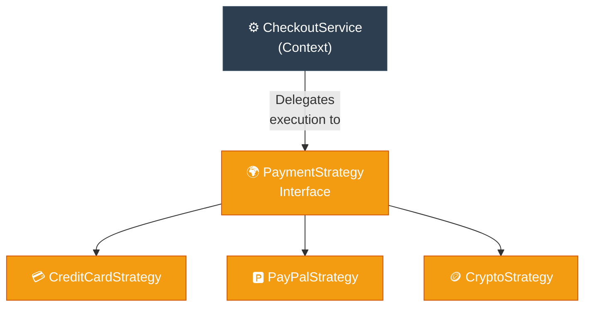

# Engineer: Strategy (ការបំប្លែងក្បួនដោះស្រាយតាមកាលៈទេសៈ)

**Author:** ichamrong  
**Date:** 2026-05-18  
**Tags:** #engineer #requirements-constraints #design-patterns #strategy #clean-code  
**Category:** Concepts / The Engineer  
**Read Time:** ~5 min  

---

## 📌 មាតិកា (Table of Contents)
- [១. តម្រូវការបច្ចេកទេស (Requirements)](#១-តម្រូវការបច្ចេកទេស-requirements)
- [២. ឧបសគ្គកំណត់ (Constraints)](#២-ឧបសគ្គកំណត់-constraints)
- [៣. ជម្រើសដោះស្រាយ និងការលុបចោល (Candidates & Elimination)](#៣-ជម្រើសដោះស្រាយ-និងការលុបចោល-candidates-elimination)
- [៤. ដំណោះស្រាយដែលបានជ្រើសរើស (Chosen Solution)](#៤-ដំណោះស្រាយដែលបានជ្រើសរើស-chosen-solution)
- [៥. ដ្យាក្រាមលំហូរ (Visual Flowchart)](#៥-ដ្យាក្រាមលំហូរ-visual-flowchart)
- [៦. Related Posts](#៦-related-posts)

---

## ១. តម្រូវការបច្ចេកទេស (Requirements)

We need to support multiple interchangeable algorithms or behaviors (e.g., different payment methods like Credit Card, PayPal, Crypto; or different file compression formats like ZIP, RAR, GZIP). The system must be able to swap these algorithms dynamically at runtime without modifying the client code, adhering strictly to the Open-Closed Principle.

យើងត្រូវគាំទ្រក្បួនដោះស្រាយ (Algorithms) ឬឥរិយាបថជាច្រើនដែលអាចផ្លាស់ប្តូរគ្នាបាន (ដូចជាវិធីសាស្ត្រទូទាត់ប្រាក់ផ្សេងៗគ្នា៖ កាតឥណទាន, PayPal, គ្រីបតូ ឬទម្រង់បង្រួមឯកសារផ្សេងគ្នា៖ ZIP, RAR, GZIP)។ ប្រព័ន្ធត្រូវតែអាចដោះដូរក្បួនដោះស្រាយទាំងនេះដោយស្វ័យប្រវត្តិនៅពេលដំណើរការ (Runtime) ដោយមិនបាច់កែប្រែកូដរបស់កូនកូដឡើយ ដើម្បីអនុវត្តតាមគោលការណ៍ Open-Closed Principle។

---

## ២. ឧបសគ្គកំណត់ (Constraints)

1. **Anti-Conditional:** We must avoid using massive `if-else` or `switch` blocks inside the client class to select the algorithm.
2. **Dynamic Swappability:** We must be able to change the behavior of an object at runtime without destroying and recreating the client context.
3. **Decoupled Code:** The business logic (e.g., Checkout processing) must be completely decoupled from the specific implementation details of the algorithms (e.g., credit card PIN validation details).

---

## ៣. ជម្រើសដោះស្រាយ និងការលុបចោល (Candidates & Elimination)

| Candidate Solution | Requirements Met? | Constraints Met? | Status / Elimination Reason |
| :--- | :--- | :--- | :--- |
| **1. Mega Conditional Blocks** | Yes | No (Violates Open-Closed; massive conditional bloat) | **❌ Eliminated** |
| **2. Subclass Inheritance** | Yes | No (Locked at compile-time; cannot swap payment methods dynamically) | **❌ Eliminated** |
| **3. Strategy Pattern** | **Yes (Fully decoupled)** | **Yes (Dynamic swaps, no conditionals)** | **✅ Selected** |

---

## ៤. ដំណោះស្រាយដែលបានជ្រើសរើស (Chosen Solution)

The **Strategy Pattern** is selected. 
* We extract the algorithms into a separate, dedicated interface (e.g., `PaymentStrategy`) containing a single method: `pay(amount)`.
* We implement concrete strategies for each algorithm: `CreditCardStrategy`, `PayPalStrategy`.
* The client context (`CheckoutService`) merely holds a reference pointer to `PaymentStrategy` and delegates execution to it: `strategy.pay(amount)`.
* We expose a setter method on the client context, enabling instant, runtime strategy swaps.

### ដំណោះស្រាយបែបវិស្វករ (Khmer)
**Strategy Pattern** ត្រូវបានជ្រើសរើស។
* យើងបំបែកក្បួនដោះស្រាយទៅជា Interface ដាច់ដោយឡែកមួយ (ដូចជា `PaymentStrategy`) ដែលមានមុខងារតែមួយគត់គឺ `pay(amount)`។
* យើងអនុវត្តក្បួនដោះស្រាយជាក់ស្តែងសម្រាប់វិធីសាស្ត្រនីមួយៗ៖ `CreditCardStrategy`, `PayPalStrategy`។
* កូនកូដ (`CheckoutService`) គ្រាន់តែរក្សាប៊ូតុងចង្អុលទៅកាន់ `PaymentStrategy` ហើយបញ្ជូនការងារទៅឱ្យវាចាត់ចែង៖ `strategy.pay(amount)`។
* យើងផ្តល់នូវ Setter Method នៅលើកូនកូដ ដែលអនុញ្ញាតឱ្យផ្លាស់ប្តូរក្បួនដោះស្រាយបានភ្លាមៗនៅពេលដំណើរការ។

---

## ៥. ដ្យាក្រាមលំហូរ (Visual Flowchart)

---

## ៦. Related Posts

* 📖 **Read the Parable:** [The Three Transport Tickets (សំបុត្រធ្វើដំណើរទាំងបី)](../../parables/89-the-three-transport-tickets.md)
* 🛠️ **Read the Code Implementation:** [Behavioral Patterns: The Dynamics of Objects](../../../clean-code/design-patterns/03-behavioral-patterns.md#the-strategy)
