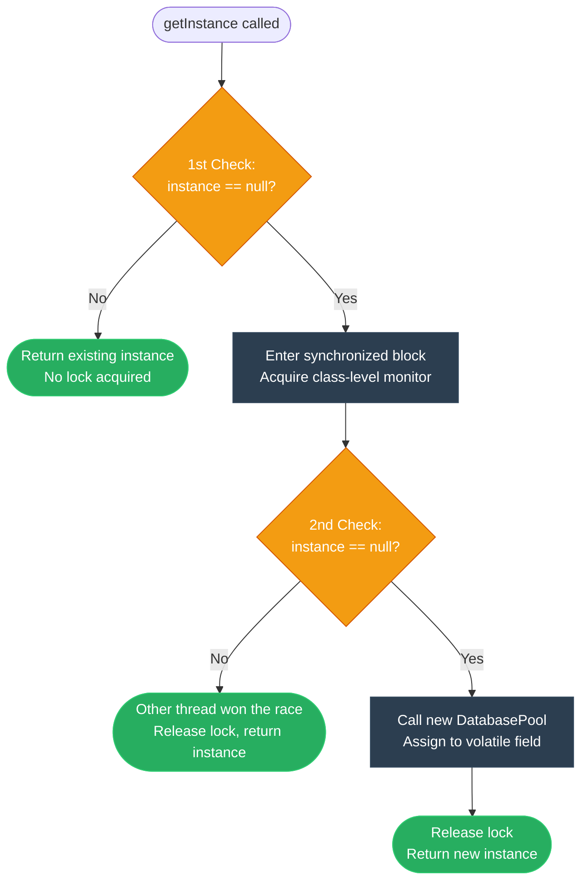

# Engineer: Singleton (ការសម្របសម្រួលប្រភពពិតតែមួយគត់ និងទប់ស្កាត់ការខ្ជះខ្ជាយធនធាន)

**Author:** ichamrong  
**Date:** 2026-05-18  
**Tags:** #engineer #requirements-constraints #design-patterns #singleton #clean-code  
**Category:** Concepts / The Engineer  
**Read Time:** ~5 min  

---

## 📌 មាតិកា (Table of Contents)
- [១. តម្រូវការបច្ចេកទេស (Requirements)](#១-តម្រូវការបច្ចេកទេស-requirements)
- [២. ឧបសគ្គកំណត់ (Constraints)](#២-ឧបសគ្គកំណត់-constraints)
- [៣. ជម្រើសដោះស្រាយ និងការលុបចោល (Candidates & Elimination)](#៣-ជម្រើសដោះស្រាយ-និងការលុបចោល-candidates-elimination)
- [៤. ដំណោះស្រាយដែលបានជ្រើសរើស (Chosen Solution)](#៤-ដំណោះស្រាយដែលបានជ្រើសរើស-chosen-solution)
- [៥. ដ្យាក្រាមលំហូរ (Visual Flowchart)](#៥-ដ្យាក្រាមលំហូរ-visual-flowchart)
- [៦. Related Posts](#៦-related-posts)

---

## ១. តម្រូវការបច្ចេកទេស (Requirements)

We need to manage a system resource (such as a database connection pool, feature flag registry, or hardware driver) where having multiple instances leads to severe memory exhaustion, network socket depletion, operating system file locking conflicts, or inconsistent states across different application modules.

យើងត្រូវគ្រប់គ្រងធនធានរួមគ្នានៃប្រព័ន្ធ (ដូចជា Database Connection Pool, Feature Flag Registry ឬ Hardware Driver) ដែលការបង្កើត Object ច្រើននឹងបណ្តាលឱ្យហៀរមេម៉ូរី (Memory Exhaustion) គាំងរន្ធតភ្ជាប់បណ្តាញ (Socket Depletion) បង្កជម្លោះចាក់សោឯកសារលើប្រព័ន្ធប្រតិបត្តិការ ឬស្ថានភាពទិន្នន័យមិនស៊ីសង្វាក់គ្នារវាងម៉ូឌុលនីមួយៗ។

---

## ២. ឧបសគ្គកំណត់ (Constraints)

1. **Guaranteed Uniqueness:** We must physically restrict and prevent external modules from utilizing the `new` operator.
2. **Thread Safety:** The instance creation must be perfectly thread-safe, supporting heavy parallel requests without double-allocation or race conditions.
3. **Lazy Initialization:** The resource must only be initialized when requested for the first time, preventing early startup delays and unnecessary memory footprint.
4. **Clean API Entry:** Accessing the shared resource must be simple and consistent across all calling contexts.

---

## ៣. ជម្រើសដោះស្រាយ និងការលុបចោល (Candidates & Elimination)

| Candidate Solution | Requirements Met? | Constraints Met? | Status / Elimination Reason |
| :--- | :--- | :--- | :--- |
| **1. Public Global Variable** | No (Cannot prevent calling `new`) | Yes (Easy API Entry) | **❌ Eliminated** |
| **2. Static Utility Class** | Yes (No instantiation) | No (No interface inheritance/polymorphism; eager load only) | **❌ Eliminated** |
| **3. Basic Lazy Singleton** | Yes (One Instance) | No (Not thread-safe; race conditions will allocate duplicate instances) | **❌ Eliminated** |
| **4. DCL Singleton (Volatile)** | **Yes (Only One Instance)** | **Yes (Thread-safe, Lazy loading, highly efficient)** | **✅ Selected** |

---

## ៤. ដំណោះស្រាយដែលបានជ្រើសរើស (Chosen Solution)

The **Double-Checked Locking (DCL) Singleton** with a private constructor is the optimal engineering solution.
* By making the constructor `private`, we enforce compile-time prevention of the `new` operator.
* By using a `volatile` static instance field, we ensure that changes made to the instance reference are immediately visible to all threads (preventing CPU instruction reordering and half-constructed object leaks).
* The outer `if (instance == null)` check allows fast paths without acquiring a synchronized lock, while the inner null check inside the synchronized block handles the rare initialization race condition safely.

### ដំណោះស្រាយបែបវិស្វករ (Khmer)
**Double-Checked Locking (DCL) Singleton** រួមផ្សំនឹង Constructor ជា `private` គឺជាដំណោះស្រាយវិស្វកម្មដ៏ល្អបំផុត។
* តាមរយៈការកំណត់ Constructor ជា `private` យើងទប់ស្កាត់ការប្រើប្រាស់ពាក្យគន្លឹះ `new` តាំងពីដំណាក់កាល Compile-time។
* តាមរយៈការប្រើប្រាស់អថេរ `volatile` static យើងធានាថាការផ្លាស់ប្តូរតម្លៃ Object ត្រូវបានមើលឃើញភ្លាមៗដោយគ្រប់ Thread ទាំងអស់ (ការពារការរៀបលំដាប់កូដឡើងវិញរបស់ CPU និងកំហុសទាញយក Object ដែលមិនទាន់សាងសង់រួចរាល់)។
* ការឆែកលក្ខខណ្ឌដំបូង `if (instance == null)` ជួយឱ្យ Thread ដំណើរការលឿនដោយមិនបាច់រង់ចាំ Lock ចំណែកឯការឆែកលក្ខខណ្ឌទីពីរនៅក្នុងប្លុក `synchronized` ជួយធានាសុវត្ថិភាពការងារ និងដោះស្រាយជម្លោះបង្កើត Object ស្ទួនគ្នា។

---

## ៥. ដ្យាក្រាមលំហូរ (Visual Flowchart)

---

## ៦. Related Posts

### 🔗 Explore All Viewpoints:
* 📖 **Read the Parable:** [The Bank's Only Vault (ទូដែកតែមួយគត់របស់ធនាគារ)](../../parables/75-the-banks-only-vault.md) — Explains the emotional core of shared truth.
* 🧠 **Read the First Principles Derivation:** [MIT Professor Strategy: Singleton (គោលការណ៍គ្រឹះដំបូងនៃ Singleton)](../01-mit-professor/01-singleton.md) — Derives the pattern from fundamental computer axioms.
* 👶 **Read the Feynman Simplification:** [Feynman Technique: Singleton (ការពន្យល់ពី Singleton ដោយគ្មានពាក្យបច្ចេកទេស)](../02-feynman-technique/04-singleton.md) — Breaks it down using the central clock tower.
* 👦 **Read the ELI5 Metaphor:** [ELI5: Singleton (ម៉ាស៊ីនខួងខ្មៅដៃតែមួយគត់ក្នុងថ្នាក់រៀន)](../03-eli5/04-singleton.md) — Teaches it to a five-year-old using classroom pencil sharpeners.
* 🌉 **Read the Analogy Bridge:** [Analogy Bridge: Singleton (ស្ពានប្រៀបធៀបនៃប្រភពពិតតែមួយគត់)](../04-analogy-bridge/04-singleton.md) — Maps it to a hotel front desk and shows where physical limits fail compared to code threads.
* 🧐 **Read the Socratic Discovery:** [Socratic Method: Singleton (ការបង្កើតប្រព័ន្ធការពិតតែមួយគត់តាមវិធីសាស្ត្រសូក្រាត)](../05-socratic-method/04-singleton.md) — Guide your self-discovery through mentor-student dialogue.
* 📰 **Read the Journalist Summary:** [Journalist: Singleton (ការធានាឱ្យមានការពិតតែមួយគត់ក្នុងប្រព័ន្ធទាំងមូល)](../06-journalist-inverted-pyramid/04-singleton.md) — Get the high-impact lede, volatile visibility, and thread-safety details first.
* 🎭 **Read the Storyteller Narrative:** [Storyteller: Singleton (អាណាព្យាបាលនៃសេចក្តីពិត និងកងទ័ពក្លូនបង្កចលាចល)](../07-storyteller-narrative-arc/04-singleton.md) — Follow Kiri's heroic journey to vanquish the duplicate logger clone army.
* ⚙️ **Read the Engineer Spec:** [Engineer: Singleton (ការសម្របសម្រួលប្រភពពិតតែមួយគត់ និងទប់ស្កាត់ការខ្ជះខ្ជាយធនធាន)](../08-engineer-requirements-constraints-solution/03-singleton.md) — Read the rigorous engineering specification, DCL performance details, and candidate elimination.
* 📊 **Read the Pros & Cons:** [Pros & Cons Compared: Singleton (ការប្រៀបធៀបគុណសម្បត្តិ និងគុណវិបត្តិនៃ Singleton)](../09-pros-and-cons-compared/01-singleton.md) — Full trade-off analysis and decision matrix.
* 🛠️ **Read the Code Implementation:** [Creational Patterns: The Art of Instantiation](../../../clean-code/design-patterns/01-creational-patterns.md#the-singleton) — Production-grade Java with double-checked locking and thread safety.
