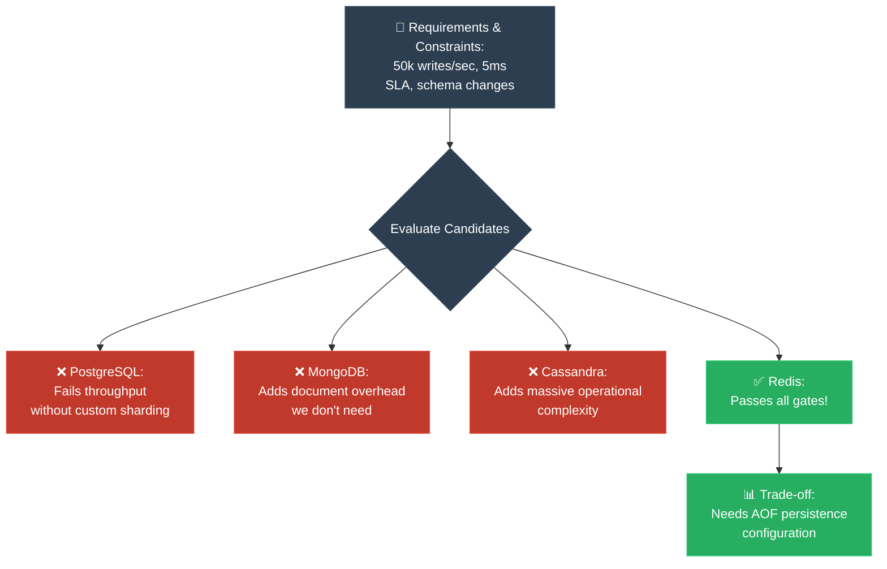

# Strategy 08: The Engineer (តម្រូវការ → ឧបសគ្គ → ដំណោះស្រាយ)

**Author:** ichamrong  
**Date:** 2026-05-18  
**Tags:** #explanation-strategies #engineer #requirements #constraints #adr  
**Category:** Concepts / Explanation Strategies  
**Read Time:** ~5 min  

---

## 📌 មាតិកា (Table of Contents)
- [សេចក្តីផ្តើម (Introduction)](#សេចក្តីផ្តើម-introduction)
- [រូបមន្តនៃការដោះស្រាយ (The Formula)](#រូបមន្តនៃការដោះស្រាយ-the-formula)
- [ដ្យាក្រាមលំហូរ (Visual Flowchart)](#ដ្យាក្រាមលំហូរ-visual-flowchart)
- [ឧទាហរណ៍ជាក់ស្តែង៖ ជ្រើសរើសរវាង SQL និង NoSQL (Practical Example)](#ឧទាហរណ៍ជាក់ស្តែង-ជ្រើសរើសរវាង-sql-និង-nosql-practical-example)
- [មេរៀន និងដែនកំណត់ (When to Use & Limitations)](#មេរៀន-និងដែនកំណត់-when-to-use-limitations)

---

## សេចក្តីផ្តើម (Introduction)

The **Engineer (Requirements → Constraints → Solution)** strategy is the ultimate logical framework for technical decision-making and architectural defense. Senior engineers do not choose tools or patterns based on hype or personal favoritism. Instead, they prove that a chosen solution is the *inevitable, logical outcome* of requirements and constraints, systematically eliminating candidates that fail these gates until only the correct choice remains.

យុទ្ធសាស្ត្រ **Engineer (តម្រូវការ → ឧបសគ្គ → ដំណោះស្រាយ)** គឺជាក្របខ័ណ្ឌតក្កវិជ្ជាដ៏ល្អបំផុតសម្រាប់ការសម្រេចចិត្តបច្ចេកទេស និងការពារស្ថាបត្យកម្មប្រព័ន្ធ។ វិស្វករជាន់ខ្ពស់មិនជ្រើសរើសឧបករណ៍ ឬគំរូកូដដោយផ្អែកលើការពេញនិយម ឬចំណូលចិត្តផ្ទាល់ខ្លួនឡើយ។ ផ្ទុយទៅវិញ ពួកគេបង្ហាញថា ដំណោះស្រាយដែលបានជ្រើសរើសគឺជា *លទ្ធផលតក្កវិជ្ជាដែលមិនអាចចៀសផុត* ដែលទាញចេញពីតម្រូវការ និងឧបសគ្គកំណត់ ដោយកាត់ចោលជាប្រព័ន្ធនូវរាល់ជម្រើសណាដែលមិនឆ្លងកាត់លក្ខខណ្ឌ រហូតដល់សល់តែជម្រើសត្រឹមត្រូវតែមួយគត់។

---

## រូបមន្តនៃការដោះស្រាយ (The Formula)

```
1. Requirements: State what MUST be true (e.g., SLA, throughput, durability).
2. Constraints: State the limits (e.g., budget, team skill, legacy systems).
3. Candidate Solutions: List all viable choices.
4. Systematic Elimination: Pass each candidate through requirements and constraints.
5. Chosen Solution: The remaining candidate is declared correct by elimination.
6. Trade-offs: Be transparent about the minor weaknesses of the chosen tool.
```

---

## ដ្យាក្រាមលំហូរ (Visual Flowchart)



---

## ឧទាហរណ៍ជាក់ស្តែង៖ ជ្រើសរើសរវាង SQL និង NoSQL (Practical Example)

### Explaining a Database Choice (English)
> *"Requirements: store user sessions with O(1) read/write. Constraints: 50,000 writes/sec peak, 5ms SLA, schema may change.*
> *Candidates: PostgreSQL (relational), Redis (key-value), MongoDB (document), Cassandra (wide-column).*
> *PostgreSQL fails the write throughput constraint at this scale without massive sharding complexity.*
> *Redis satisfies all requirements but has persistence trade-offs if not configured correctly.*
> *MongoDB satisfies writes but adds document overhead we don't need for key-value access.*
> *Cassandra satisfies writes but adds operational complexity disproportionate to the problem.*
> *Redis is the correct choice — with AOF persistence enabled for durability."*

### ការពន្យល់បែបវិស្វករ (Khmer)
> *«តម្រូវការស្នូល៖ រក្សាទុក User Sessions ជាមួយនឹងល្បឿនអាន/សរសេរ O(1)។ ឧបសគ្គកំណត់៖ ចំនួនសរសេរខ្ពស់បំផុត ៥០,០០០ ដង/វិនាទី, ឆ្លើយតបលឿនជាង ៥ មីលីវិនាទី (5ms SLA), និងទម្រង់ទិន្នន័យ (Schema) អាចផ្លាស់ប្តូរបាន។*
> *បេក្ខភាពជ្រើសរើស៖ PostgreSQL (Relational), Redis (Key-Value), MongoDB (Document), Cassandra (Wide-Column)។*
> *PostgreSQL ធ្លាក់លើឧបសគ្គចំនួនសរសេរនៅកម្រិត Scale នេះ លើកលែងតែយើងធ្វើ Sharding ដ៏ស្មុគស្មាញ។*
> *Redis ឆ្លងកាត់គ្រប់លក្ខខណ្ឌទាំងអស់ ប៉ុន្តែមានការលះបង់លើភាពធន់នៃទិន្នន័យ (Durability Trade-off) បើយើងមិនកំណត់រចនាសម្ព័ន្ធឱ្យត្រឹមត្រូវ។*
> *MongoDB ឆ្លងកាត់លក្ខខណ្ឌសរសេរ ប៉ុន្តែបន្ថែមបន្ទុកលើសទម្ងន់នៃឯកសារ (Document Overhead) ដែលយើងមិនត្រូវការសម្រាប់ការទាញយកបែប Key-Value ធម្មតា។*
> *Cassandra ឆ្លងកាត់លក្ខខណ្ឌសរសេរ ប៉ុន្តែបន្ថែមភាពស្មុគស្មាញដល់ប្រតិបត្តិការប្រព័ន្ធខ្លាំងពេក ប្រៀបធៀបនឹងទំហំបញ្ហា។*
> *Redis គឺជាជម្រើសដ៏ត្រឹមត្រូវតែមួយគត់ — ដោយដំណើរការ AOF Persistence ដើម្បីធានាភាពធន់នៃទិន្នន័យ។»*

---

## មេរៀន និងដែនកំណត់ (When to Use & Limitations)

### 📈 Best For (សាកសមបំផុតសម្រាប់)
* **Architecture Decision Records (ADRs):** Documenting long-term software design choices.
* **RFCs and Technical Design Docs:** Getting alignment from security, operations, and development teams.
* **Senior Tech Interviews:** Proving your system design architectural competency.

### ⚠️ Limitations (ដែនកំណត់)
* **Highly Analytical:** Zero room for emotional storytelling or entertaining analogies.
* **Requires Deep Knowledge:** You cannot eliminate candidates unless you know their specific architectural weaknesses inside out.
* **No Single Perfect Solution:** Engineering is always about trade-offs. The chosen solution will always have some minor disadvantages you must document.

---

---

## 📚 Implemented Patterns (គំរូស្ថាបត្យកម្មដែលបានអនុវត្ត)

Here are the design patterns evaluated using the rigorous **Engineer (Requirements -> Constraints -> Solution)** strategy:

* **[01. Builder (ការបង្កើត Object ស្មុគស្មាញជាជំហានៗ)](./01-builder.md)** — Evaluates telescopic constructors, setters, and config objects against thread-safety and anti-telescoping constraints, proving Builder is the only correct choice for complex object construction.
* **[02. Strategy (ការបំប្លែងក្បួនដោះស្រាយតាមកាលៈទេសៈ)](./02-strategy.md)** — Evaluates mega switch blocks and class inheritance against Open-Closed and runtime swapping constraints, proving Strategy is the only correct choice for interchangeable behavior.
* **[03. Singleton (ការសម្របសម្រួលប្រភពពិតតែមួយគត់ និងទប់ស្កាត់ការខ្ជះខ្ជាយធនធាន)](./03-singleton.md)** — Evaluates global variables, utility classes, and basic singletons against thread safety, visibility, and constructor prevention constraints, proving Double-Checked Locking Singleton is the correct choice.
* **[04. Factory Method (ការបំបែកកូដបង្កើត Object តាមរយៈការវាយតម្លៃតម្រូវការ និងឧបសគ្គកំណត់)](./04-factory-method.md)** — Evaluates standard parameters, switches, and parameterized helpers against strict OCP and decoupled client constraints, proving polymorphic Factory Method is the correct architectural standard.

---

## Related
* [← Back to Concepts](../README.md)
* [Strategy 01: MIT Professor](../01-mit-professor/README.md)
* [Strategy 06: The Journalist](../06-journalist-inverted-pyramid/README.md)
