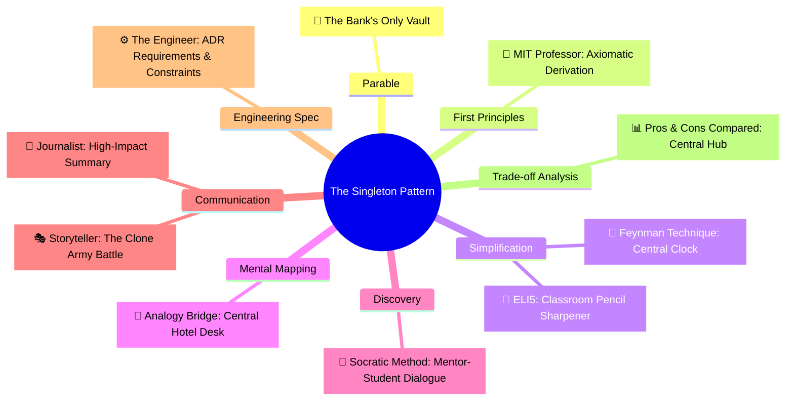

# Pros and Cons Compared: Singleton (ការប្រៀបធៀបគុណសម្បត្តិ និងគុណវិបត្តិនៃ Singleton)

**Author:** ichamrong  
**Date:** 2026-05-18  
**Tags:** #pros-and-cons #trade-offs #design-patterns #singleton #clean-code  
**Category:** Concepts / Pros and Cons Compared  
**Read Time:** ~8 min  

---

> **"The Singleton isn't about laziness — it's about truth. There can only be one source of truth."**

---

## 📌 មាតិកា (Table of Contents)
- [១. ចំណុចប្រឈមស្នូល (The Core Tension)](#១-ចំណុចប្រឈមស្នូល-the-core-tension)
- [២. តារាងប្រៀបធៀបសង្ខេប (Side-by-Side Summary)](#២-តារាងប្រៀបធៀបសង្ខេប-side-by-side-summary)
- [៣. គុណសម្បត្តិលម្អិត (Detailed Pros)](#៣-គុណសម្បត្តិលម្អិត-detailed-pros)
- [៤. គុណវិបត្តិលម្អិត (Detailed Cons)](#៤-គុណវិបត្តិលម្អិត-detailed-cons)
- [៥. ក្របខ័ណ្ឌអនុសាសន៍ និងការសម្រេចចិត្ត (Recommendations & Decision Matrix)](#៥-ក្របខ័ណ្ឌអនុសាសន៍-និងការសម្រេចចិត្ត-recommendations-decision-matrix)
- [៦. បណ្តាញតភ្ជាប់ការសិក្សាពហុវិមាត្រ (The Learning Nexus)](#៦-បណ្តាញតភ្ជាប់ការសិក្សាពហុវិមាត្រ-the-learning-nexus)

---

## ១. ចំណុចប្រឈមស្នូល (The Core Tension)

The Singleton pattern solves two problems simultaneously: it **guarantees exactly one instance** in memory, and it provides a **global point of access** to that instance. While it is highly effective at preventing resource depletion and ensuring state consistency, it is notorious for introducing global state, creating tight coupling, and polluting unit tests. 

The core architectural tension lies between **efficient resource coordination** (truth) and **modular decoupling** (testability).

គំរូស្ថាបត្យកម្ម Singleton ដោះស្រាយបញ្ហាពីរក្នុងពេលតែមួយ៖ វា **ធានាឱ្យមាន Object តែមួយគត់** នៅក្នុង Memory និងផ្តល់នូវ **ច្រកចូលប្រើប្រាស់ជាសកល** ទៅកាន់វា។ ទោះបីជាវាមានប្រសិទ្ធភាពខ្ពស់ក្នុងការការពារការខាតបង់ធនធាន និងធានាភាពស៊ីសង្វាក់គ្នានៃទិន្នន័យក៏ដោយ វាក៏ល្បីល្បាញខាងបង្កើតស្ថានភាពសកល (Global State) បង្កការចងភ្ជាប់គ្នាស្អិតរមួត (Tight Coupling) និងបង្កផលលំបាកក្នុងការសរសេរកូដតេស្ត (Test Pollution) ផងដែរ។

ចំណុចប្រឈមស្នូលនៃស្ថាបត្យកម្មកូដ គឺការជ្រើសរើសរវាង **ការសម្របសម្រួលធនធានដ៏មានប្រសិទ្ធភាព (ការពិត)** និង **ការបំបែកកូដឱ្យដាច់ពីគ្នា (លទ្ធភាពធ្វើតេស្ត)**។

---

## ២. តារាងប្រៀបធៀបសង្ខេប (Side-by-Side Summary)

| 🟢 គុណសម្បត្តិ (Pros / What We Gain) | 🔴 គុណវិបត្តិ (Cons / What We Lose) |
| :--- | :--- |
| **Strict Instance Control:** Guaranteed single source of truth in memory. | **Unit Test Pollution:** Global state carries over, causing tests to interfere with one another. |
| **Resource Savings:** Prevents heavy database socket and memory duplication. | **Tight Coupling:** Callers depend directly on the concrete class static implementation. |
| **Lazy Loading:** Instantiated only when required, improving boot time. | **Violation of SRP:** Class manages both its business logic and its lifecycle. |
| **Polymorphic Adaptation:** Unlike static classes, Singletons can implement interfaces. | **Distributed Scale Breakdown:** "Exactly one instance" breaks in multi-JVM or microservice scales. |

---

## ៣. គុណសម្បត្តិលម្អិត (Detailed Pros)

### ១. Controlled Access to Sole Instance (ការគ្រប់គ្រងការចូលប្រើប្រាស់ធនធានតែមួយគត់)
* **English:** Because the class encapsulates the sole instance, it has strict control over how and when clients access it. This prevents conflicting writes and ensures that global operations (such as logger file writers or configuration updates) occur in a coordinated, atomic sequence.
* **Khmer:** ដោយសារតែ Class ខ្លួនឯងជាអ្នកខ្ចប់ Object តែមួយគត់នោះ វារក្សាសិទ្ធិគ្រប់គ្រងយ៉ាងតឹងរ៉ឹងលើវិធីសាស្ត្រ និងពេលវេលាដែល Client ចូលប្រើប្រាស់វា។ វាជួយការពារការសរសេរទិន្នន័យជាន់គ្នា និងធានាថាប្រតិបត្តិការរួម (ដូចជាការសរសេរ Log ឬការកែប្រែការកំណត់ប្រព័ន្ធ) កើតឡើងតាមលំដាប់លំដោយ និងមានសុវត្ថិភាព។

### ២. Memory and Socket Depletion Prevention (ការការពារការហៀរមេម៉ូរី និងរន្ធតភ្ជាប់បណ្តាញ)
* **English:** Heavy components like database connection pools or thread executors consume significant CPU cycles and operating system file handles. Enforcing a Singleton prevents the system from spinning up duplicate connection pools, eliminating database connection exhaustion and thread starvation.
* **Khmer:** ផ្នែកសំខាន់ៗដែលធ្ងន់ៗ ដូចជា Database Connection Pool ឬ Thread Executor ស៊ីកម្លាំង CPU និង File Handles របស់ប្រព័ន្ធប្រតិបត្តិការច្រើនណាស់។ ការប្រើប្រាស់ Singleton ការពារប្រព័ន្ធកុំឱ្យបង្កើត Object Pool ស្ទួនៗគ្នា ដែលជួយលុបបំបាត់បញ្ហាអស់ Connection ទៅ database និងការស្ទះខ្សែស្រឡាយការងារ។

### ៣. Extensibility via Inheritance (លទ្ធភាពពង្រីកមុខងារតាមរយៈមរតកកូដ)
* **English:** Unlike utility classes with only static methods, a Singleton class can implement interfaces and inherit from a superclass. This allows you to configure different singleton implementations at runtime (e.g., swapping a `ProductionConfig` with a `TestConfig` at system startup).
* **Khmer:** ខុសពី Utility Class ដែលមានតែ static methods ធម្មតា Class Singleton អាចអនុវត្តតាម (implement) Interface និងទទួលមរតក (inherit) ពី Superclass ផ្សេងទៀតបាន។ វាអនុញ្ញាតឱ្យយើងកំណត់រចនាសម្ព័ន្ធ Singleton ផ្សេងៗគ្នានៅពេលរត់ (Runtime) ដូចជាការប្តូររវាង `ProductionConfig` និង `TestConfig` នៅពេលដំណើរការប្រព័ន្ធជាដើម។

---

## ៤. គុណវិបត្តិលម្អិត (Detailed Cons)

### ១. Tight Coupling and Test Pollution (ការភ្ជាប់គ្នាស្អិតរមួត និងកំហុសការធ្វើតេស្តសាកល្បង)
* **English:** Singletons introduce global state. When running unit tests in parallel, a test that modifies a Singleton's state will pollute and break subsequent tests. Mocking a Singleton is incredibly difficult without reflection, making it a major blocker for Test-Driven Development (TDD).
* **Khmer:** Singleton បង្កើតស្ថានភាពសកល (Global State)។ នៅពេលដំណើរការ unit tests ក្នុងពេលដំណាលគ្នា (Parallel) តេស្តមួយដែលកែប្រែស្ថានភាព Singleton នឹងបង្កផលប៉ះពាល់ និងធ្វើឱ្យខូចលទ្ធផលតេស្តផ្សេងទៀត។ ការធ្វើ Mock លើ Singleton គឺពិបាកខ្លាំងណាស់បើគ្មានបច្ចេកទេស Reflection ដែលធ្វើឱ្យវាជាឧបសគ្គធំសម្រាប់ការសរសេរកូដបែប TDD។

### ២. Violation of the Single Responsibility Principle (ការរំលោភលើគោលការណ៍ SRP)
* **English:** A Singleton class takes on two completely separate duties: it is responsible for its actual business logic, *and* it is responsible for managing its own creation and memory lifecycle. This violates the "Single Responsibility Principle" (SRP) in SOLID.
* **Khmer:** Class Singleton ទទួលបន្ទុកការងារពីរផ្សេងគ្នាទាំងស្រុង៖ ទីមួយគឺទទួលខុសត្រូវលើ Business Logic ជាក់ស្តែងរបស់វា និងទីពីរគឺទទួលខុសត្រូវលើការគ្រប់គ្រងវដ្តជីវិតនៃការបង្កើត និងមេម៉ូរីរបស់ខ្លួនឯង។ ការធ្វើបែបនេះរំលោភលើ «គោលការណ៍ទទួលខុសត្រូវតែមួយ (SRP)» នៅក្នុង SOLID។

### ៣. Failure in Distributed Scales (ការបែកបាក់ស្ថាបត្យកម្មលើប្រព័ន្ធចែកចាយ)
* **English:** In microservices or clustered cloud applications (like multiple JVMs running behind a load balancer), the Singleton's invariant of "exactly one instance" breaks. Each JVM node has its own memory space, creating one singleton instance per node. If the singleton represents a shared physical resource, it will create race conditions across nodes.
* **Khmer:** នៅក្នុងស្ថាបត្យកម្ម Microservices ឬកម្មវិធីខ្លោដ (ដូចជា JVM ច្រើនដំណើរការនៅពីក្រោយ Load Balancer) លក្ខខណ្ឌ «Object តែមួយគត់» របស់ Singleton ត្រូវបានបែកបាក់។ ម៉ាស៊ីននីមួយៗមានទំហំ Memory ដាច់ដោយឡែកពីគ្នា ដែលបង្កើតឱ្យមាន Object Singleton មួយនៅលើម៉ាស៊ីននីមួយៗ។ ប្រសិនបើ Singleton នោះតំណាងឱ្យធនធានរូបវន្តរួម វានឹងបង្កជម្លោះទិន្នន័យ (Race Conditions) រវាងម៉ាស៊ីន និងម៉ាស៊ីនជាមិនខាន។

---

## ៥. ក្របខ័ណ្ឌអនុសាសន៍ និងការសម្រេចចិត្ត (Recommendations & Decision Matrix)

### When to Use Singleton ( situations where Singleton is correct )
1. **Immutable Shared Resources:** Shared state that is Read-Only or constant at runtime (e.g., a static configuration directory loader).
2. **Strict Hardware / OS Sockets:** When wrapping physical constraints like an audio driver or print spooler interface.
3. **Database Connection Pools:** When managed inside an application framework where only one pool should feed the current microservice thread pool.

### When to Avoid Singleton ( candidates for elimination )
1. **Mutable Business State:** Never store user sessions, cart contents, or shopping data inside a Singleton.
2. **When Testing is Critical:** Avoid direct static calls to Singletons (`DatabasePool.getInstance()`). Instead, wrap the class as a Singleton managed by a **Dependency Injection (DI)** container (like Spring `@Bean` or Guice `@Singleton`), letting the framework manage lifecycle while keeping your code clean and mockable.

---

## ៦. បណ្តាញតភ្ជាប់ការសិក្សាពហុវិមាត្រ (The Learning Nexus)

To master the Singleton Design Pattern from every cognitive and technical angle, explore the full multi-dimensional suite in this repository:

### 🔗 Explore All Viewpoints:
* 📖 **Read the Parable:** [The Bank's Only Vault (ទូដែកតែមួយគត់របស់ធនាគារ)](../../parables/75-the-banks-only-vault.md) — Explains the emotional core of shared truth.
* 🧠 **Read the First Principles Derivation:** [MIT Professor Strategy: Singleton (គោលការណ៍គ្រឹះដំបូងនៃ Singleton)](../01-mit-professor/01-singleton.md) — Derives the pattern from fundamental computer axioms.
* 👶 **Read the Feynman Simplification:** [Feynman Technique: Singleton (ការពន្យល់ពី Singleton ដោយគ្មានពាក្យបច្ចេកទេស)](../02-feynman-technique/04-singleton.md) — Breaks it down using the central clock tower.
* 👦 **Read the ELI5 Metaphor:** [ELI5: Singleton (ម៉ាស៊ីនខួងខ្មៅដៃតែមួយគត់ក្នុងថ្នាក់រៀន)](../03-eli5/04-singleton.md) — Teaches it to a five-year-old using classroom pencil sharpeners.
* 🌉 **Read the Analogy Bridge:** [Analogy Bridge: Singleton (ស្ពានប្រៀបធៀបនៃប្រភពពិតតែមួយគត់)](../04-analogy-bridge/04-singleton.md) — Maps it to a hotel front desk and shows where physical limits fail compared to code threads.
* 🧐 **Read the Socratic Discovery:** [Socratic Method: Singleton (ការបង្កើតប្រព័ន្ធការពិតតែមួយគត់តាមវិធីសាស្ត្រសូក្រាត)](../05-socratic-method/04-singleton.md) — Guide your self-discovery through mentor-student dialogue.
* 📰 **Read the Journalist Summary:** [Journalist: Singleton (ការធានាឱ្យមានការពិតតែមួយគត់ក្នុងប្រព័ន្ធទាំងមូល)](../06-journalist-inverted-pyramid/04-singleton.md) — Get the high-impact lede, volatile visibility, and thread-safety details first.
* 🎭 **Read the Storyteller Narrative:** [Storyteller: Singleton (អាណាព្យាបាលនៃសេចក្តីពិត និងកងទ័ពក្លូនបង្កចលាចល)](../07-storyteller-narrative-arc/04-singleton.md) — Follow Kiri's heroic journey to vanquish the duplicate logger clone army.
* ⚙️ **Read the Engineer Spec:** [Engineer: Singleton (ការសម្របសម្រួលប្រភពពិតតែមួយគត់ និងទប់ស្កាត់ការខ្ជះខ្ជាយធនធាន)](../08-engineer-requirements-constraints-solution/03-singleton.md) — Read the rigorous engineering specification, DCL performance details, and candidate elimination.

---

### Related
* [← Back to Concepts](../README.md)
* [Strategy 08: The Engineer Strategy](../08-engineer-requirements-constraints-solution/README.md)
* [Strategy 10: Pedagogical Parables](../../parables/README.md)
