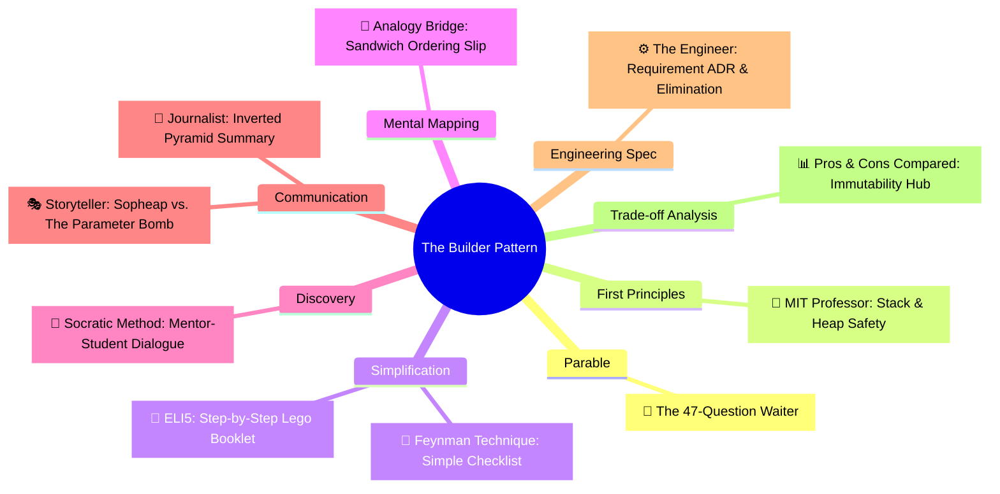

# Pros and Cons Compared: Builder (ការប្រៀបធៀបគុណសម្បត្តិ និងគុណវិបត្តិនៃ Builder)

**Author:** ichamrong  
**Date:** 2026-05-18  
**Tags:** #pros-and-cons #trade-offs #design-patterns #builder #clean-code  
**Category:** Concepts / Pros and Cons Compared  
**Read Time:** ~8 min  

---

> **"The Builder isn't just about syntax sugar — it's about structural safety. Creating objects must be as safe as running them."**

---

## 📌 មាតិកា (Table of Contents)
- [១. ចំណុចប្រឈមស្នូល (The Core Tension)](#១-ចំណុចប្រឈមស្នូល-the-core-tension)
- [២. តារាងប្រៀបធៀបសង្ខេប (Side-by-Side Summary)](#២-តារាងប្រៀបធៀបសង្ខេប-side-by-side-summary)
- [៣. គុណសម្បត្តិលម្អិត (Detailed Pros)](#៣-គុណសម្បត្តិលម្អិត-detailed-pros)
- [៤. គុណវិបត្តិលម្អិត (Detailed Cons)](#៤-គុណវិបត្តិលម្អិត-detailed-cons)
- [៥. ក្របខ័ណ្ឌអនុសាសន៍ និងការសម្រេចចិត្ត (Recommendations & Decision Matrix)](#៥-ក្របខ័ណ្ឌអនុសាសន៍-និងការសម្រេចចិត្ត-recommendations-decision-matrix)
- [៦. បណ្តាញតភ្ជាប់ការសិក្សាពហុវិមាត្រ (The Learning Nexus)](#៦-បណ្តាញតភ្ជាប់ការសិក្សាពហុវិមាត្រ-the-learning-nexus)

---

## ១. ចំណុចប្រឈមស្នូល (The Core Tension)

Constructing complex domain objects requires balancing two competing requirements: **compile-time readability** and **structural immutability**. 

While the standard Java Beans (Setters) approach is highly readable, it leaves objects open to partial state initialization and runtime mutations, making them dangerous in multi-threaded environments. Conversely, Telescoping Constructors preserve immutability but destroy readability and compile-time position safety. The **Builder Pattern** resolves this tension at the cost of **increased boilerplate code** and extra object allocations on the heap.

ការបង្កើត Object ដែលមានភាពស្មុគស្មាញ តម្រូវឱ្យយើងរក្សាតុល្យភាពរវាងលក្ខខណ្ឌប្រកួតប្រជែងពីរ៖ **ភាពងាយស្រួលអាននៅពេល Compile** និង **ភាពមិនអាចកែប្រែបាននៃស្ថាបត្យកម្មកូដ (Immutability)**។

ខណៈពេលដែលវិធីសាស្ត្រ Setters ធម្មតាមានភាពងាយស្រួលអាន វាក៏បើកឱកាសឱ្យ Object ស្ថិតក្នុងស្ថានភាពមិនពេញលេញ និងអាចកែប្រែបានគ្រប់ពេល ដែលបង្កគ្រោះថ្នាក់ក្នុងបរិស្ថាន Multi-threaded។ ផ្ទុយទៅវិញ Telescoping Constructors ធានាភាពមិនអាចកែប្រែបាន ប៉ុន្តែបំផ្លាញភាពងាយស្រួលអានទាំងស្រុង។ គំរូ **Builder Pattern** ដោះស្រាយវិបត្តិនេះ ដោយលះបង់នូវ **ការបង្កើតកូដដដែលៗច្រើន (Boilerplate)** និងការបង្កើត Object ជំនួយបន្ថែមនៅក្នុង Heap Memory។

---

## ២. តារាងប្រៀបធៀបសង្ខេប (Side-by-Side Summary)

| 🟢 គុណសម្បត្តិ (Pros / What We Gain) | 🔴 គុណវិបត្តិ (Cons / What We Lose) |
| :--- | :--- |
| **Strict Immutability:** Enforces final attributes; thread-safe by default. | **Boilerplate Explosion:** Requires duplicating all target class fields inside the inner builder. |
| **Compile-time Argument Safety:** Eliminates primitive positional parameter swap bugs. | **Heap Overhead:** Creates a short-lived transient Builder object on every construction. |
| **Fluent Self-Documenting Code:** Chaining methods reads like normal human language. | **Class Intimacy Overhead:** High coupling between the target class and its nested builder. |
| **Atomic Invariant Validation:** Object validates all fields together at `.build()` time. | **No Backward Compatibility:** Modifying fields requires altering both target class and builder. |

---

## ៣. គុណសម្បត្តិលម្អិត (Detailed Pros)

### ១. Safe Multithreading via Immutability (សុវត្ថិភាពខ្ពស់សម្រាប់ Multi-threading)
* **English:** By making the target object constructor private and declaring all attributes `final`, the object is 100% immutable. Multiple concurrent threads can safely read the object without any lock overhead or risk of state corruption.
* **Khmer:** តាមរយៈការធ្វើឱ្យ Constructor របស់ Object ដើមជា `private` និងប្រកាសរាល់ attribute ទាំងអស់ជា `final` នោះ Object ចុងក្រោយនឹងមិនអាចកែប្រែបានឡើយ (100% immutable)។ Thread ជាច្រើនអាចអាន Object នេះក្នុងពេលតែមួយដោយសុវត្ថិភាព ដោយមិនចាំបាច់មានការ Lock ឡើយ។

### ២. Fluent and Self-Documenting Chaining (កូដងាយអាន និងបង្ហាញន័យដោយខ្លួនឯង)
* **English:** Method chaining (`.timeout(1000).isDraft(false)`) makes the creation process read like a sentence. Developers don't have to look up parameter positions or read Javadocs to understand what optional parameters are doing.
* **Khmer:** ការតភ្ជាប់វិធីសាស្ត្រ (Method chaining ដូចជា `.timeout(1000).isDraft(false)`) ធ្វើឱ្យដំណើរការបង្កើតមានសភាពដូចជាប្រយោគអាន។ អ្នកអភិវឌ្ឍន៍មិនចាំបាច់ស្វែងរកទីតាំងប៉ារ៉ាម៉ែត្រ ឬអាន Javadocs ដើម្បីយល់ពីតួនាទីរបស់ជម្រើសនីមួយៗឡើយ។

### ៣. Atomic Invariant Validation (ការផ្ទៀងផ្ទាត់លក្ខខណ្ឌបែបអាតូមិក)
* **English:** Unlike setters where invalid states can exist mid-configuration, the Builder collects all information first. Only when `.build()` is triggered does it perform structural cross-validation, throwing an exception before the product is allocated on the heap.
* **Khmer:** ខុសពី Setters ដែលអាចមានស្ថានភាពមិនត្រឹមត្រូវនៅពាក់កណ្តាលផ្លូវ Builder ប្រមូលទិន្នន័យទាំងអស់ជាមុនសិន។ លុះត្រាតែហៅ `.build()` ទើបវាផ្ទៀងផ្ទាត់លក្ខខណ្ឌរួមគ្នា ធានាថាមិនមាន Object មិនពេញលេញណាមួយត្រូវបានបង្កើតឡើងឡើយ។

---

## ៤. គុណវិបត្តិលម្អិត (Detailed Cons)

### ១. Boilerplate Code Explosion (ការកើនឡើងនៃកូដដដែលៗច្រើន)
* **English:** You must duplicate every target class field inside the Builder class. This increases the total lines of code per class by up to 100%, though this can be mitigated using modern code generation tools like Lombok (`@Builder`).
* **Khmer:** អ្នកត្រូវតែចម្លងគ្រប់ attributes ទាំងអស់របស់ Class ដើម យកទៅដាក់ក្នុង Class Builder។ វាធ្វើឱ្យកូដកើនឡើងទ្វេដង ទោះបីជាបញ្ហានេះអាចដោះស្រាយបានដោយប្រើឧបករណ៍ជំនួយដូចជា Lombok (`@Builder`) ក៏ដោយ។

### ២. Garbage Collection and Memory Pressure (បន្ទុកលើ Heap Memory និង Garbage Collector)
* **English:** Generating a transient `Builder` object for every single creation cycle creates garbage heap pressure. In high-frequency trading or real-time gaming engines where millions of objects are created per second, this transient allocation can trigger GC pauses.
* **Khmer:** ការបង្កើត Object `Builder` បណ្តោះអាសន្នរាល់ពេលបង្កើត Object ដើម បង្កើតបន្ទុកធំដល់ Heap Memory។ នៅក្នុងកម្មវិធីជួញដូរល្បឿនលឿន ឬហ្គេមដែលបង្កើត Object រាប់លានក្នុងមួយវិនាទី បញ្ហានេះអាចបង្កឱ្យមានការកកស្ទះ (GC Pauses)។

---

## ៥. ក្របខ័ណ្ឌអនុសាសន៍ និងការសម្រេចចិត្ត (Recommendations & Decision Matrix)

| Scenario / Constraints | Primary Decision | Alternative / Recommended Pattern |
| :--- | :--- | :--- |
| **Object has 1-3 parameters** | ❌ Avoid Builder | Use standard constructor; Builder adds useless boilerplate here. |
| **Object attributes are mutable at runtime** | ❌ Avoid Builder | Use standard Setters (JavaBeans pattern). |
| **Object has 5+ parameters and must be Immutable** | **✅ Use Builder** | Decouples complex construction safely. |
| **High-Frequency Loop Allocations (Real-time)** | ❌ Avoid Builder | Use static factory method or Object Pooling to save memory. |

---

## ៦. បណ្តាញតភ្ជាប់ការសិក្សាពហុវិមាត្រ (The Learning Nexus)

To master the Builder Design Pattern from every cognitive and technical angle, explore the full multi-dimensional suite in this repository:

### 🔗 Explore All Viewpoints:
* 📖 **Read the Parable:** [The 47-Question Waiter (អ្នករត់តុសួរ ៤៧ សំណួរ)](../../parables/76-the-overwhelmed-sandwich-shop.md) — The emotional story of a chaotic customer experience.
* 🧠 **Read the First Principles Derivation:** [MIT Professor Strategy: Builder (គោលការណ៍គ្រឹះដំបូងនៃ Builder)](../01-mit-professor/04-builder.md) — Derives the pattern from stack frame layouts and thread safety laws.
* 👶 **Read the Feynman Simplification:** [Feynman Technique: Builder (ការពន្យល់ពី Builder ដោយគ្មានពាក្យបច្ចេកទេស)](../02-feynman-technique/05-builder.md) — Breaks it down using a simple cafe menu checklist.
* 👦 **Read the ELI5 Metaphor:** [ELI5: Builder (ការពន្យល់ពី Builder ដូចក្មេងអាយុ ៥ ឆ្នាំ)](../03-eli5/05-builder.md) — Teaches a five-year-old using Lego spaceship construction books.
* 🌉 **Read the Analogy Bridge:** [Analogy Bridge: Builder (ស្ពានប្រៀបធៀបនៃ Builder)](../04-analogy-bridge/05-builder.md) — Maps real sandwich ticks to fluent Java methods, outlining physical limitations.
* 🧐 **Read the Socratic Discovery:** [Socratic Method: Builder (ការបង្កើត Object ស្មុគស្មាញតាមវិធីសាស្ត្រសូក្រាត)](../05-socratic-method/05-builder.md) — Probes yourself via a mentor-student constructor debate.
* 📰 **Read the Journalist Summary:** [Journalist: Builder (ការបង្កើត Object ស្មុគស្មាញជាជំហានៗ)](../06-journalist-inverted-pyramid/05-builder.md) — Quick news lede, telescoping prevention, and step-by-step assembly validation.
* 🎭 **Read the Storyteller Narrative:** [Storyteller: Builder (វីរបុរស Builder និងសង្គ្រាមប៉ារ៉ាម៉ែត្ររញ៉េរញ៉ៃ)](../07-storyteller-narrative-arc/05-builder.md) — Sopheap's battle against a production parameter bomb catastrophe on Black Friday.
* ⚙️ **Read the Engineer Spec:** [Engineer: Builder (ការបង្កើត Object ស្មុគស្មាញជាជំហានៗ)](../08-engineer-requirements-constraints-solution/01-builder.md) — Read the formal engineering requirements and candidate evaluation table.

---

### Related
* [← Back to Concepts](../README.md)
* [Strategy 08: The Engineer Strategy](../08-engineer-requirements-constraints-solution/README.md)
* [Strategy 10: Pedagogical Parables](../../parables/README.md)
