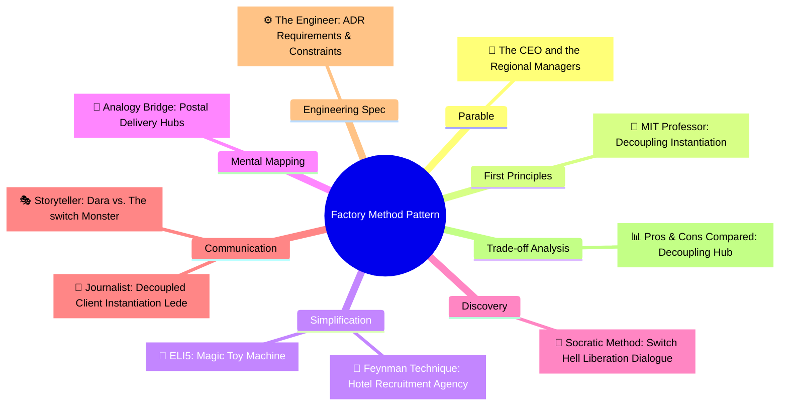

# Pros and Cons Compared: Factory Method (ការប្រៀបធៀបគុណសម្បត្តិ និងគុណវិបត្តិនៃ Factory Method)

**Author:** ichamrong  
**Date:** 2026-05-18  
**Tags:** #pros-and-cons #trade-offs #design-patterns #factory-method #clean-code  
**Category:** Concepts / Pros and Cons Compared  
**Read Time:** ~8 min  

---

> **"The Factory Method is a declaration of independence: it allows client logic to focus on running the business, while subclass systems focus on construction."**

---

## 📌 មាតិកា (Table of Contents)
- [១. ចំណុចប្រឈមស្នូល (The Core Tension)](#១-ចំណុចប្រឈមស្នូល-the-core-tension)
- [២. តារាងប្រៀបធៀបសង្ខេប (Side-by-Side Summary)](#២-តារាងប្រៀបធៀបសង្ខេប-side-by-side-summary)
- [៣. គុណសម្បត្តិលម្អិត (Detailed Pros)](#៣-គុណសម្បត្តិលម្អិត-detailed-pros)
- [៤. គុណវិបត្តិលម្អិត (Detailed Cons)](#៤-គុណវិបត្តិលម្អិត-detailed-cons)
- [៥. ក្របខ័ណ្ឌអនុសាសន៍ និងការសម្រេចចិត្ត (Recommendations & Decision Matrix)](#៥-ក្របខ័ណ្ឌអនុសាសន៍-និងការសម្រេចចិត្ត-recommendations-decision-matrix)
- [៦. បណ្តាញតភ្ជាប់ការសិក្សាពហុវិមាត្រ (The Learning Nexus)](#៦-បណ្តាញតភ្ជាប់ការសិក្សាពហុវិមាត្រ-the-learning-nexus)

---

## ១. ចំណុចប្រឈមស្នូល (The Core Tension)

The Factory Method pattern resolves a fundamental architectural dilemma: how does a base framework orchestrate a series of operations if it doesn't know *which* specific components it needs to instantiate beforehand?

The pattern resolves this by **declaring a virtual interface for object creation**, shifting the concrete responsibility downstream to subclasses. However, this decoupling introduces a significant trade-off: **the Class Explosion anti-pattern**. Developers must create a brand-new concrete creator subclass for every new concrete product type they introduce, increasing architectural complexity and codebase size.

គំរូ Factory Method ដោះស្រាយវិបត្តិស្ថាបត្យកម្មកូដដ៏សំខាន់មួយ៖ តើ Base Framework អាចដឹកនាំដំណើរការការងារជាបន្តបន្ទាប់ដោយរបៀបណា បើវាគ្មិនដឹងជាមុនថាត្រូវបង្កើត (instantiate) ផ្នែកជាក់លាក់ (concrete component) មួយណាខ្លះនោះ?

គំរូនេះដោះស្រាយបញ្ហាដោយ **ការប្រកាស virtual interface សម្រាប់ការបង្កើត Object** ដោយផ្ទេរការទទួលខុសត្រូវជាក់ស្តែងទៅ Subclasses។ ទោះជាយ៉ាងណាក៏ដោយ ការបំបែកកូដនេះនាំមកនូវការលះបង់ដ៏ធំមួយ៖ **ការកើនឡើងនៃចំនួន Class ច្រើនហួសប្រមាណ (Class Explosion)**។ អ្នកអភិវឌ្ឍន៍ត្រូវតែបង្កើត concrete creator subclass ថ្មីស្រឡាងមួយសម្រាប់រាល់ concrete product ថ្មីដែលពួកគេចង់ណែនាំ ដែលបង្កើនភាពស្មុគស្មាញ និងទំហំកូដរបស់ប្រព័ន្ធ។

---

## ២. តារាងប្រៀបធៀបសង្ខេប (Side-by-Side Summary)

| 🟢 គុណសម្បត្តិ (Pros / What We Gain) | 🔴 គុណវិបត្តិ (Cons / What We Lose) |
| :--- | :--- |
| **Loose Coupling:** The core engine depends exclusively on abstract interfaces, never concrete classes. | **Class Explosion:** Requires writing a twin pair of classes (Product + Creator) for every variant. |
| **Open-Closed Principle (OCP):** Introduce new product families without touching existing tested logic. | **Indirection Overhead:** Code flow can be harder to trace, as creation happens dynamically via polymorphism. |
| **Unit Test Isolation:** Simplifies test mocking; base creator flow can be validated using fake mock products. | **Framework Rigidity:** Base creators must anticipate the creation lifecycle, making signature changes hard. |
| **Single Responsibility Principle (SRP):** Completely separates business flow logic from object instantiation. | **Subclass Rigidity:** Creator subclasses are heavily coupled to their specific concrete products. |

---

## ៣. គុណសម្បត្តិលម្អិត (Detailed Pros)

### ១. Strict Adherence to the Dependency Inversion Principle (ការគោរពតាមគោលការណ៍ Dependency Inversion)
* **English:** By relying on abstract interfaces instead of concrete constructors (`new`), the high-level business workflow is protected against changes in lower-level infrastructure details. Swapping out concrete product classes does not trigger compiler dependency updates across core services.
* **Khmer:** តាមរយៈការពឹងផ្អែកលើ abstract interfaces ជំនួសឱ្យ concrete constructors (`new`) លំហូរការងារកម្រិតខ្ពស់របស់ប្រព័ន្ធត្រូវបានការពារពីការផ្លាស់ប្តូរនៃផ្នែកហេដ្ឋារចនាសម្ព័ន្ធកម្រិតទាប។ ការផ្លាស់ប្តូរ concrete product classes មិនបង្កឱ្យមានការប៉ះពាល់ដល់ compiler dependencies របស់សេវាកម្មស្នូលឡើយ។

### ២. Absolute Separation of Concerns (ការបំបែកភារកិច្ចដាច់ដោយឡែកពីគ្នា)
* **English:** Creation logic is highly volatile and requires knowledge of dependencies, database configurations, and environment setups. Isolating this creation pipeline within subclasses ensures that the caller class remains completely clean of lifecycle parameters.
* **Khmer:** កូដសម្រាប់បង្កើត Object តែងតែមានការប្រែប្រួល និងទាមទារការយល់ដឹងពី dependencies ផ្សេងៗ ព្រមទាំងការកំណត់រចនាសម្ព័ន្ធ database ជាដើម។ ការទុកកូដបង្កើតនេះដាច់ដោយឡែកនៅក្នុង subclasses ធានាថាកូដហៅ (Caller) នៅតែស្អាតស្អំ និងគ្មានជាប់ជំពាក់នឹង parameters ទាំងឡាយឡើយ។

---

## ៤. គុណវិបត្តិលម្អិត (Detailed Cons)

### ១. Codebase Class Bloat (ការកើនឡើងហួសកម្រិតនៃចំនួន Class)
* **English:** For every new target concrete type added, a developer must create both the concrete product implementation *and* a new concrete creator subclass. For small teams or simple systems, this double-overhead can quickly double the total file count of the repository.
* **Khmer:** សម្រាប់រាល់ concrete type ថ្មីដែលបានបន្ថែម អ្នកអភិវឌ្ឍន៍ត្រូវតែបង្កើតទាំង concrete product implementation និង concrete creator subclass ថ្មីមួយទៀត។ សម្រាប់ក្រុមតូចៗ ឬប្រព័ន្ធសាមញ្ញ បន្ទុកបន្ថែមទ្វេដងនេះអាចធ្វើឱ្យចំនួនឯកសារកូដនៅក្នុង repository កើនឡើងទ្វេដងយ៉ាងលឿន។

### ២. Increased Cognitive Indirection (ការលំបាកក្នុងការតាមដានលំហូរកូដ)
* **English:** Because creation is deferred polymorphically, reading the code in a static IDE can be confusing. Pressing "Go to Definition" on `createSender()` leads only to an abstract method declaration, requiring the engineer to trace through multiple implementation subclasses to find what is actually running at runtime.
* **Khmer:** ដោយសារការបង្កើត Object ត្រូវបានផ្ទេរទៅ Subclass តាមរយៈ polymorphism ការអានកូដនៅក្នុង IDE អាចបង្កការភាន់ច្រឡំ។ ការចុច «Go to Definition» លើមុខងារ `createSender()` នាំយើងទៅកាន់តែ abstract method declaration ប៉ុណ្ណោះ ដែលតម្រូវឱ្យវិស្វករស្វែងរកតាម subclasses ជាច្រើនដើម្បីរកឃើញកូដពិតប្រាកដដែលដំណើរការនៅពេលរត់ (Runtime)។

---

## ៥. ក្របខ័ណ្ឌអនុសាសន៍ និងការសម្រេចចិត្ត (Recommendations & Decision Matrix)

### When to Use Factory Method
1. **Dynamic Provider Swapping:** When your system relies on third-party APIs (like payment gateways or notification providers) that change frequently.
2. **Framework & Plugin Architectures:** When building a framework that external developers should be able to extend with custom components easily.
3. **Core Workflow Reusability:** When a complex series of steps is identical across different scenarios, but the underlying resources swap dynamically.

### When to Avoid Factory Method
1. **Static System Domains:** If your system only supports one type of database or one type of connection pool, do not introduce Factory Method.
2. **Simple Value Objects:** Use standard constructors or basic static factory helper methods (e.g. `String.valueOf()`) for simple data transfer bags to keep the codebase clean.

---

## ៦. បណ្តាញតភ្ជាប់ការសិក្សាពហុវិមាត្រ (The Learning Nexus)

To master the Factory Method Design Pattern from every cognitive and technical angle, explore the full multi-dimensional suite in this repository:

### 🔗 Explore All Viewpoints:
* 📖 **Read the Parable:** [The CEO and the Regional Managers (នាយកប្រតិបត្តិ និងអ្នកគ្រប់គ្រងតំបន់)](../../parables/77-the-ceo-and-regional-managers.md) — The emotional core of delegating local decisions.
* 🧠 **Read the First Principles Derivation:** [MIT Professor Strategy: Factory Method (គោលការណ៍គ្រឹះដំបូងនៃ Factory Method)](../01-mit-professor/02-factory-method.md) — Derives the pattern step-by-step from base interface dependency laws.
* 👶 **Read the Feynman Simplification:** [Feynman Technique: Factory Method (ការពន្យល់ពី Factory Method ដោយគ្មានពាក្យបច្ចេកទេស)](../02-feynman-technique/06-factory-method.md) — Breaks it down using the hotel cleaner recruitment agency.
* 👦 **Read the ELI5 Metaphor:** [ELI5: Factory Method (ការពន្យល់ពី Factory Method ដូចក្មេងអាយុ ៥ ឆ្នាំ)](../03-eli5/06-factory-method.md) — Teaches a five-year-old using the magic toy machine slot.
* 🌉 **Read the Analogy Bridge:** [Analogy Bridge: Factory Method (ស្ពានប្រៀបធៀបនៃ Factory Method)](../04-analogy-bridge/06-factory-method.md) — Maps regional postal transport hubs to virtual methods, outlining physical limitations.
* 🧐 **Read the Socratic Discovery:** [Socratic Method: Factory Method (ការបង្កើត Object តាមតម្រូវការយឺតយ៉ាវតាមវិធីសាស្ត្រសូក្រាត)](../05-socratic-method/06-factory-method.md) — Socrates guides your discovery out of switch block coupling.
* 📰 **Read the Journalist Summary:** [Journalist: Factory Method (ការបំបែកកូដបង្កើត Object ឱ្យមានសេរីភាពសម្រេចចិត្តលើ Subclass)](../06-journalist-inverted-pyramid/06-factory-method.md) — High-impact news lede, OCP compliance, and SRP isolation details first.
* 🎭 **Read the Storyteller Narrative:** [Storyteller: Factory Method (វីរបុរស Factory Method និងការដោះលែងប្រព័ន្ធផ្ញើសារពីរនរក switch)](../07-storyteller-narrative-arc/06-factory-method.md) — Junior developer Dara’s battle to vanquish the switch statement monster on Black Friday.
* ⚙️ **Read the Engineer Spec:** [Engineer: Factory Method (ការបំបែកកូដបង្កើត Object តាមរយៈការវាយតម្លៃតម្រូវការ និងឧបសគ្គកំណត់)](../08-engineer-requirements-constraints-solution/04-factory-method.md) — Technical requirements, ADR candidate matrix, and SLA evaluation.

---

### Related
* [← Back to Concepts](../README.md)
* [Strategy 08: The Engineer Strategy](../08-engineer-requirements-constraints-solution/README.md)
* [Strategy 10: Pedagogical Parables](../../parables/README.md)
