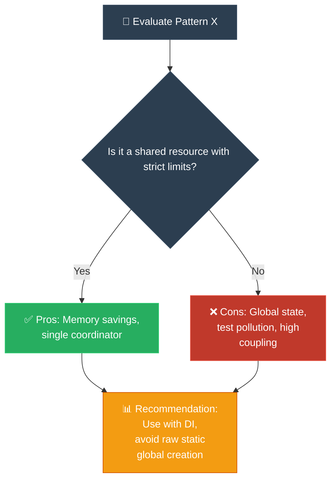

# Strategy 09: Pros and Cons Compared (ការប្រៀបធៀបគុណសម្បត្តិ និងគុណវិបត្តិ)

**Author:** ichamrong  
**Date:** 2026-05-18  
**Tags:** #explanation-strategies #pros-and-cons #trade-offs #recommendations #architecture  
**Category:** Concepts / Explanation Strategies  
**Read Time:** ~5 min  

---

## 📌 មាតិកា (Table of Contents)
- [សេចក្តីផ្តើម (Introduction)](#សេចក្តីផ្តើម-introduction)
- [រូបមន្តនៃការដោះស្រាយ (The Formula)](#រូបមន្តនៃការដោះស្រាយ-the-formula)
- [ដ្យាក្រាមលំហូរ (Visual Flowchart)](#ដ្យាក្រាមលំហូរ-visual-flowchart)
- [មេរៀន និងដែនកំណត់ (When to Use & Limitations)](#មេរៀន-និងដែនកំណត់-when-to-use-limitations)
- [📚 Implemented Patterns (គំរូស្ថាបត្យកម្មដែលបានអនុវត្ត)](#implemented-patterns-គំរូស្ថាបត្យកម្មដែលបានអនុវត្ត)

---

## សេចក្តីផ្តើម (Introduction)

In software engineering, there are no solutions — only **trade-offs**. Every design pattern, library, or architectural choice is a double-edged sword: it solves one problem while introducing others. 

The **Pros and Cons Compared** strategy is designed to provide senior engineers, architects, and tech leads with a rigorous, objective, and multi-dimensional analysis of a specific technology or design pattern. By presenting benefits and drawbacks side-by-side and providing clear, actionable recommendation frameworks, it transforms abstract guidelines into concrete, defensible engineering decisions.

យុទ្ធសាស្ត្រ **Pros and Cons Compared (ការប្រៀបធៀបគុណសម្បត្តិ និងគុណវិបត្តិ)** ត្រូវបានរចនាឡើងដើម្បីផ្តល់ឱ្យវិស្វករជាន់ខ្ពស់ ស្ថាបត្យករប្រព័ន្ធ និងអ្នកដឹកនាំបច្ចេកវិទ្យានូវការវិភាគដ៏ហ្មត់ចត់ គោលបំណង និងពហុវិមាត្រនៃបច្ចេកវិទ្យា ឬគំរូរចនាកូដជាក់លាក់ណាមួយ។ តាមរយៈការបង្ហាញពីអត្ថប្រយោជន៍ និងគុណវិបត្តិទន្ទឹមគ្នា ព្រមទាំងផ្តល់នូវក្របខ័ណ្ឌអនុសាសន៍ច្បាស់លាស់ វិធីសាស្ត្រនេះបំប្លែងគោលការណ៍ណែនាំអរូបីឱ្យទៅជាការសម្រេចចិត្តវិស្វកម្មជាក់ស្តែង និងអាចការពារបានដោយហេតុផលច្បាស់លាស់។

---

## រូបមន្តនៃការដោះស្រាយ (The Formula)

```
1. Core Tension: State the primary trade-off at the top.
2. Side-by-Side Comparison Table: Quick, high-level summary of Pros and Cons.
3. Detailed Pros (with Khmer): In-depth look at what we gain, citing specific metrics or scenarios.
4. Detailed Cons (with Khmer): In-depth look at what we lose (memory, testability, coupling).
5. Recommendation Matrix (When to Use vs. Avoid): Actionable rules for dev teams.
6. The Learning Nexus: Links to all other 9 pedagogical views of this pattern in the workspace.
```

---

## ដ្យាក្រាមលំហូរ (Visual Flowchart)



---

## មេរៀន និងដែនកំណត់ (When to Use & Limitations)

### 📈 Best For (សាកសមបំផុតសម្រាប់)
* **Architectural Decision Records (ADRs):** Defending pattern selections to stakeholders and external auditors.
* **Refactoring Plans:** Convincing product owners and engineers to eliminate anti-patterns.
* **Onboarding & Standards Docs:** Establishing clear rules for team members on when to write a pattern and when to reject it.

### ⚠️ Limitations (ដែនកំណត់)
* **Demands Objectivity:** The writer must avoid bias; they cannot make a pattern look perfect or totally useless. Every pattern has its place.
* **Needs Deep Context:** Recommendations only make sense if mapped to concrete real-world engineering constraints (e.g. testing frameworks, microservice architecture limits).

---

## 📚 Implemented Patterns (គំរូស្ថាបត្យកម្មដែលបានអនុវត្ត)

Here are the design patterns analyzed using the **Pros and Cons Compared** strategy:

* **[01. Singleton (ការប្រៀបធៀបគុណសម្បត្តិ និងគុណវិបត្តិនៃ Singleton)](./01-singleton.md)** — Offers a comprehensive side-by-side trade-off analysis of the Singleton pattern, detailed pros and cons, concrete recommendations, and a complete links nexus to all 9 other pedagogical viewpoints.
* **[02. Builder (ការប្រៀបធៀបគុណសម្បត្តិ និងគុណវិបត្តិនៃ Builder)](./02-builder.md)** — Offers a comprehensive side-by-side trade-off analysis of the Builder pattern, comparing it to Setters and Telescopic Constructors, complete with a recommendations matrix and links nexus.
* **[03. Factory Method (ការប្រៀបធៀបគុណសម្បត្តិ និងគុណវិបត្តិនៃ Factory Method)](./03-factory-method.md)** — Offers a comprehensive side-by-side trade-off analysis of the Factory Method pattern, evaluating dynamic provider swapping decoupling advantages against class explosion boilerplate overheads.

---

## Related
* [← Back to Concepts](../README.md)
* [Strategy 08: The Engineer Strategy](../08-engineer-requirements-constraints-solution/README.md)
* [Strategy 10: Pedagogical Parables](../../parables/README.md)
