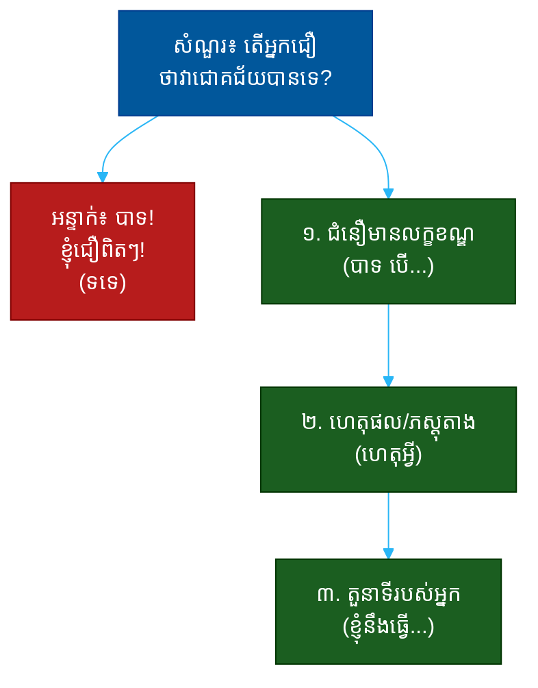

# "តើអ្នកជឿថាវាអាចជោគជ័យបានទេ?" (Do You Believe This Can Succeed?)៖ សំណួរតែមួយដែលបង្ហាញពីជំនឿ ចក្ខុវិស័យ និងភាពជាម្ចាស់

**Author:** ichamrong  
**Date:** 2026-05-30  
**Tags:** #one-question #interview #startup #conviction #vision #ownership #communication  
**Category:** Concepts / One Question  
**Read Time:** ~12 min  

---

## 📌 មាតិកា (Table of Contents)
- [អន្ទាក់ (The Setup)](#the-setup)
- [១. សំណួរពិតប្រាកដ (What They Are Really Asking)](#1)
- [២. អ្វីដែលវាបង្ហាញអំពីអ្នក (The Hidden Signals)](#2)
- [៣. អន្ទាក់ — ចម្លើយខ្សោយ (The Trap: Weak Answers)](#3)
- [៤. នីតិវិធីឆ្លើយតប (The Response Procedure)](#4)
- [៥. ឧទាហរណ៍ចម្លើយខ្លាំង (Strong Sample Answer)](#5)
- [៦. សំណួរបន្ត និងរបៀបដោះស្រាយ (Follow-up Traps)](#6)
- [សេចក្តីសន្និដ្ឋាន (Conclusion)](#conclusion)
- [ឯកសារយោង (References)](#references)
- [អត្ថបទពាក់ព័ន្ធ (Related Posts)](#related-posts)

---

## អន្ទាក់ (The Setup) 

ស្ថាបនិក (Founder) មើលមកអ្នកត្រង់ៗ ហើយសួរថា៖ **«តើអ្នកជឿថាក្រុមហ៊ុននេះអាចជោគជ័យបានទេ?»**

នេះមើលទៅដូចជាសំណួរសាមញ្ញ — តែវាមិនមែនទេ។ វាជាសំណួរ «តម្រងតែមួយ» (Single Filter Question)។ គេមិនបានស្តាប់ថាអ្នកនិយាយ «បាទ» ឬ «ទេ» នោះទេ។ គេកំពុងស្តាប់ **របៀបដែលអ្នកគិត** ឆ្លងកាត់សំណួរនេះ។

ក្នុងរយៈពេល ៣០ វិនាទីនៃចម្លើយរបស់អ្នក គេអាចអានបាន៖
* តើអ្នកមានជំនឿពិតប្រាកដ ឬគ្រាន់តែនិយាយឲ្យពេញចិត្ត (flattery)?
* តើអ្នកមើលឃើញ «ផ្លូវ» ទៅរកជោគជ័យ ឬគ្រាន់តែសង្ឃឹម?
* តើអ្នកស្មោះត្រង់នឹងហានិភ័យ ឬងងឹតភ្នែក?
* តើអ្នកនិយាយដូចជា «ម្ចាស់» (owner) ឬដូចជា «អ្នកមើល» (spectator)?

នេះជាផែនទីបង្ហាញផ្លូវសម្រាប់ការឆ្លើយតបឲ្យបានល្អ៖

---

## ១. សំណួរពិតប្រាកដ (What They Are Really Asking) 

ស្ថាបនិកមិនមែនកំពុងសុំ «ការទស្សន៍ទាយ» ពីអនាគតទេ។ គ្មាននរណាម្នាក់ដឹងច្បាស់ថាក្រុមហ៊ុនណាមួយនឹងជោគជ័យ ១០០% នោះឡើយ។ អ្វីដែលគេពិតជាសួរគឺ៖

> **«តើ​អ្នក​នឹង​ក្លាយ​ជា​មនុស្ស​ដែល​ខ្ញុំ​ចង់​នៅ​ក្បែរ​ពេល​មាន​ការ​លំបាក​ដែរ​ឬ​ទេ?»**

នៅពេលក្រុមហ៊ុនថ្មីៗ (startup) ឆ្លងកាត់វិបត្តិ — លុយជិតអស់, អតិថិជនរត់ចោល, ក្រុមការងារធ្លាក់ទឹកចិត្ត — ស្ថាបនិកត្រូវការមនុស្សដែលមាន **ជំនឿផ្អែកលើហេតុផល** (reasoned conviction) មិនមែនមនុស្សដែលរត់ចោលនៅពេលលំបាកនោះទេ។

ដូច្នេះ សំណួរនេះវាស់ ៣ យ៉ាង៖
1. **ជំនឿ (Conviction)** — តើអ្នកមានឬទេ?
2. **គុណភាពនៃជំនឿ (Quality)** — តើជំនឿរបស់អ្នកផ្អែកលើអ្វី?
3. **ភាពជាម្ចាស់ (Ownership)** — តើអ្នកមើលឃើញខ្លួនឯងជាផ្នែកនៃដំណោះស្រាយដែរឬទេ?

---

## ២. អ្វីដែលវាបង្ហាញអំពីអ្នក (The Hidden Signals) 

| សញ្ញាដែលគេអាន | ចម្លើយខ្សោយបង្ហាញ | ចម្លើយខ្លាំងបង្ហាញ |
| :--- | :--- | :--- |
| **ជំនឿ (Conviction)** | «បាទ» ឥតហេតុផល | «បាទ បើយើងធ្វើ X និង Y» |
| **ចក្ខុវិស័យ (Vision)** | មិនដឹងថាជោគជ័យមើលទៅយ៉ាងណា | ពណ៌នាបានច្បាស់ថាជោគជ័យជាអ្វី |
| **ភាពស្មោះត្រង់ (Honesty)** | លាក់ហានិភ័យ ឬមើលមិនឃើញ | ទទួលស្គាល់ហានិភ័យ ហើយមានផែនការ |
| **ភាពជាម្ចាស់ (Ownership)** | «ពួកគេ/ក្រុមហ៊ុននឹង...» | «ខ្ញុំនឹង...» |
| **ចំណេះដឹង (Knowledge)** | និយាយទូទៅ | ដឹងពីទីផ្សារ, គូប្រកួត, អតិថិជន |

**ចំណុចសំខាន់៖** ការសុទិដ្ឋិនិយមងងឹតភ្នែក (blind optimism) គឺជាសញ្ញាក្រហម។ តែការគ្មានសុទិដ្ឋិនិយមសោះ ក៏ជាសញ្ញាក្រហមដែរ។ ចម្លើយល្អស្ថិតនៅ **ចំកណ្តាល**៖ ជឿ ប៉ុន្តែដឹងពីហានិភ័យ។

---

## ៣. អន្ទាក់ — ចម្លើយខ្សោយ (The Trap: Weak Answers) 

**អន្ទាក់ទី ១ — ការផ្គាប់ចិត្ត (The Flatterer):**
> «បាទ! ខ្ញុំជឿពិតៗ! វាជាគំនិតដ៏អស្ចារ្យ!»

ហេតុអ្វីបរាជ័យ៖ ឥតមានសារធាតុ (substance)។ វាស្តាប់ទៅដូចជាការលក់ មិនមែនការគិត។ ស្ថាបនិកមិនអាចទុកចិត្តលើមនុស្សដែលគ្រាន់តែ «យល់ស្រប» គ្រប់ពេលនោះទេ។

**អន្ទាក់ទី ២ — អ្នកសង្ស័យ (The Skeptic):**
> «ខ្ញុំមិនដឹងទេ ទីផ្សារពិបាកណាស់ ហើយមានគូប្រកួតច្រើន...»

ហេតុអ្វីបរាជ័យ៖ បើអ្នកមិនជឿ ហេតុអ្វីអ្នកនៅទីនេះ? វាបង្ហាញពីការខ្វះការប្តេជ្ញាចិត្ត។

**អន្ទាក់ទី ៣ — អ្នកមើល (The Spectator):**
> «បាទ ខ្ញុំគិតថា**ពួកគេ**អាចធ្វើបាន បើ**ក្រុមហ៊ុន**ដំណើរការត្រឹមត្រូវ»

ហេតុអ្វីបរាជ័យ៖ ពាក្យ «ពួកគេ» និង «ក្រុមហ៊ុន» បង្ហាញថាអ្នកមើលឃើញខ្លួនឯងពីខាងក្រៅ មិនមែនជាផ្នែកនៃក្រុម។

---

## ៤. នីតិវិធីឆ្លើយតប (The Response Procedure) 

ចម្លើយខ្លាំងមាន **៣ ផ្នែក** តាមលំដាប់៖

**ជំហានទី ១ — ជំនឿមានលក្ខខណ្ឌ (Conditional Belief)**
ចាប់ផ្តើមដោយ «បាទ» ប៉ុន្តែភ្ជាប់នឹង «បើ» (if)។
> «បាទ ខ្ញុំជឿ — *បើ* យើងអាចដោះស្រាយ X និង Y»

នេះបង្ហាញថាអ្នកមើលឃើញ **ឆ្នុក** (levers) ដែលគ្រប់គ្រងជោគជ័យ មិនមែនគ្រាន់តែសង្ឃឹម។

**ជំហានទី ២ — ហេតុផល/ភស្តុតាង (Evidence)**
ដាក់ហេតុផលពិតប្រាកដ៖ ចន្លោះទីផ្សារ (market gap), ភាពខ្លាំងរបស់ក្រុម, ឬការយល់ដឹងពិសេស (unique insight)។
> «ដោយសារ​ពេលវេលា​ទីផ្សារ​ត្រឹមត្រូវ ហើយ​ក្រុម​ធ្លាប់​បាន​ដឹកនាំ​ផលិតផល​ជោគជ័យ​មក​ហើយ»

នេះបង្ហាញ **ចំណេះដឹង**។

**ជំហានទី ៣ — តួនាទីរបស់អ្នក (Your Role)**
បញ្ចប់ដោយការប្តេជ្ញាចិត្តពីខ្លួនអ្នក។
> «ហើយ​នេះ​ជា​កន្លែង​ដែល​ខ្ញុំ​គិត​ថា​ខ្ញុំ​អាច​ជួយ​ច្រើន​បំផុត»

នេះបង្ហាញ **ភាពជាម្ចាស់** និង **ទំនុកចិត្ត**។

---

## ៥. ឧទាហរណ៍ចម្លើយខ្លាំង (Strong Sample Answer) 

> **«បាទ ខ្ញុំជឿ។ ពេលវេលា​ទីផ្សារ​គឺ​ត្រឹមត្រូវ ហើយ​ក្រុម​នេះ​ធ្លាប់​បាន​បញ្ចេញ​ផលិតផល​ជោគជ័យ​មក​ហើយ។ ហានិភ័យ​ដ៏​ធំ​បំផុត​គឺ​ការ​ចែកចាយ (distribution) — តែ​នោះ​ជា​បញ្ហា​ដែល​ខ្ញុំ​ពូកែ​ដោះស្រាយ។ ដូច្នេះ បាទ ខ្ញុំ​ជឿ *ហើយ* ខ្ញុំ​ចង់​ទទួល​ខុស​ត្រូវ​លើ​ផ្នែក​នោះ។»**

**ការវិភាគ (Breakdown):**
* «បាទ ខ្ញុំជឿ» → ជំនឿច្បាស់លាស់ (conviction)
* «ពេលវេលា... ក្រុមធ្លាប់...» → ភស្តុតាង (knowledge)
* «ហានិភ័យ​គឺ​ការ​ចែកចាយ» → ភាពស្មោះត្រង់ (honesty about risk)
* «នោះជាបញ្ហាដែលខ្ញុំពូកែ» → ភាពជាម្ចាស់ (ownership)
* «ខ្ញុំ​ចង់​ទទួល​ខុស​ត្រូវ» → ទំនុកចិត្ត (confidence)

**ប្រៀបធៀប៖**
* ❌ ខ្សោយ៖ «បាទ ខ្ញុំជឿពិតៗ!»
* ✅ ខ្លាំង៖ ចម្លើយ ៣ ផ្នែកខាងលើ

---

## ៦. សំណួរបន្ត និងរបៀបដោះស្រាយ (Follow-up Traps) 

ស្ថាបនិកល្អនឹងសួរបន្ត ដើម្បីសាកល្បងថាជំនឿរបស់អ្នកពិតឬមិនពិត៖

**«ចុះបើវាបរាជ័យ?» (What if it fails?)**
> កុំ​ភ័យ។ ឆ្លើយ​ដោយ​ភាព​ចាស់ទុំ៖ «បើ​បរាជ័យ ខ្ញុំ​ចង់​បាន​បទពិសោធន៍​នៃ​ការ​សាងសង់​អ្វី​ដែល​ពិបាក​ជាមួយ​ក្រុម​ល្អ។ ខ្ញុំ​មិន​ភ័យ​ការ​បរាជ័យ​ទេ ខ្ញុំ​ភ័យ​ការ​មិន​បាន​ព្យាយាម។»

**«ហេតុអ្វីបានជាអ្នកនៅទីនេះ ជំនួសឲ្យកន្លែងធំជាង?» (Why here, not a bigger company?)**
> «ខ្ញុំ​ចង់​បាន​ផល​ប៉ះពាល់​ផ្ទាល់ (direct impact)។ នៅ​កន្លែង​នេះ ការ​ងារ​របស់​ខ្ញុំ​ប៉ះពាល់​ដោយ​ផ្ទាល់​ទៅ​លើ​ជោគជ័យ​ឬ​បរាជ័យ។»

**ច្បាប់មាស៖** រាល់សំណួរបន្ត គឺជាការសាកល្បងថាតើ «បើ» របស់អ្នកនៅជំហានទី ១ ពិតប្រាកដឬអត់។ បើអ្នកដឹងពីហានិភ័យពិតៗ អ្នកនឹងឆ្លើយបានយ៉ាងរលូន។

---

## សេចក្តីសន្និដ្ឋាន (Conclusion) 

សំណួរ «តើអ្នកជឿថាវាជោគជ័យបានទេ?» មិនមែនជាសំណួរ បាទ/ទេ ទេ។ វាជា **កញ្ចក់** ដែលឆ្លុះបញ្ចាំងពីរបៀបដែលអ្នកគិត។

ចងចាំរូបមន្ត ៣ ផ្នែក៖
1. **ជំនឿមានលក្ខខណ្ឌ** (បាទ បើ...)
2. **ហេតុផល** (ដោយសារ...)
3. **តួនាទីរបស់អ្នក** (ខ្ញុំនឹង...)

ជំនឿ​ដែល​មាន​ហេតុផល​រួម​នឹង​ភាព​ស្មោះត្រង់​នឹង​ហានិភ័យ — នោះ​ជា​អ្វី​ដែល​បង្ហាញ​ថា​អ្នក​ជា​មនុស្ស​ដែល​គេ​ចង់​នៅ​ក្បែរ​ពេល​លំបាក។

---

## ឯកសារយោង (References) 

- *The Hard Thing About Hard Things* — Ben Horowitz
- *Zero to One* — Peter Thiel
- *Radical Candor* — Kim Scott

---

## អត្ថបទពាក់ព័ន្ធ (Related Posts) 

- [Why Will You Win? (សំណួររបស់វិនិយោគិន)](../02-investor-vc/01-why-will-you-win.md)
- [Where Do You See This in 5 Years? (ចក្ខុវិស័យ)](../03-leadership-vision/01-where-in-five-years.md)
- [One Question Index](../README.md)
