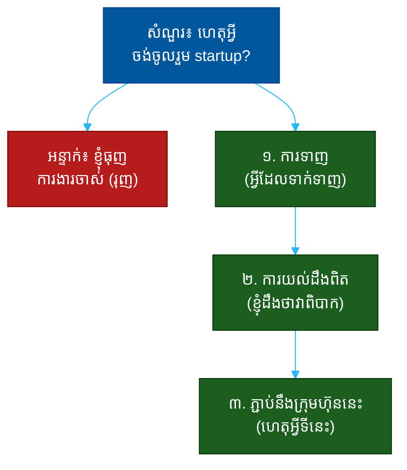

# "ហេតុអ្វីបានជាអ្នកចង់ចូលរួម startup?" (Why Do You Want to Join a Startup?)៖ សំណួរតែមួយដែលបង្ហាញពីការជម្រុញ ការយល់ដឹង និងភាពចុះសម្រុង

**Author:** ichamrong  
**Date:** 2026-05-30  
**Tags:** #one-question #interview #startup #motivation #fit #self-awareness #communication  
**Category:** Concepts / One Question  
**Read Time:** ~12 min  

---

## 📌 មាតិកា (Table of Contents)
- [អន្ទាក់ (The Setup)](#the-setup)
- [១. សំណួរពិតប្រាកដ (What They Are Really Asking)](#1)
- [២. អ្វីដែលវាបង្ហាញអំពីអ្នក (The Hidden Signals)](#2)
- [៣. អន្ទាក់ — ចម្លើយខ្សោយ (The Trap: Weak Answers)](#3)
- [៤. នីតិវិធីឆ្លើយតប (The Response Procedure)](#4)
- [៥. ឧទាហរណ៍ចម្លើយខ្លាំង (Strong Sample Answer)](#5)
- [៦. សំណួរបន្ត និងរបៀបដោះស្រាយ (Follow-up Traps)](#6)
- [សេចក្តីសន្និដ្ឋាន (Conclusion)](#conclusion)
- [ឯកសារយោង (References)](#references)
- [អត្ថបទពាក់ព័ន្ធ (Related Posts)](#related-posts)

---

## អន្ទាក់ (The Setup) 

ស្ថាបនិក (Founder) ផ្អៀងខ្លួនមកមុខ ហើយសួរថា៖ **«ហេតុអ្វីបានជាអ្នកចង់ចូលរួម startup?»**

នេះមើលទៅដូចជាសំណួរ «ស្គាល់គ្នា» ធម្មតា — តែវាមិនមែនទេ។ ស្ថាបនិកដឹងថា startup គឺ​ជា​កន្លែង​លុយ​តិច​ជាង ម៉ោង​ច្រើន​ជាង និង​សុវត្ថិភាព​តិច​ជាង​ក្រុមហ៊ុន​ធំ។ ដូច្នេះ​គេ​ចង់​ដឹង​ថា៖ **តើ​អ្នក​ដឹង​ខ្លួន​ថា​អ្នក​កំពុង​ជ្រើស​រើស​អ្វី — ឬ​អ្នក​គ្រាន់​តែ​រត់​ចេញ​ពី​កន្លែង​ចាស់?**

ក្នុងរយៈពេល ៣០ វិនាទីនៃចម្លើយរបស់អ្នក គេអាចអានបាន៖
* តើអ្នកត្រូវបាន **ទាញ** (pull) មកដោយ startup ឬ **រុញ** (push) ចេញពីការងារចាស់?
* តើអ្នកដឹងពិតប្រាកដថា startup ជាអ្វី ឬគ្រាន់តែស្រមៃតាមរូបភាពស្អាតៗ?
* តើ​ការ​ជម្រុញ​របស់​អ្នក​នឹង​នៅ​បន្ត​ពេល​ការងារ​ពិបាក​ឬ​ទេ?
* តើ​អ្នក​ចង់​បាន​អ្វី​ដែល startup អាច​ផ្តល់​ឲ្យ — ឬ​អ្នក​ច្រឡំ​ខ្លួន​ឯង?

នេះជាផែនទីបង្ហាញផ្លូវសម្រាប់ការឆ្លើយតបឲ្យបានល្អ៖

---

## ១. សំណួរពិតប្រាកដ (What They Are Really Asking) 

ស្ថាបនិកមិនមែនកំពុងសុំ «ហេតុផលស្អាតៗ» ដើម្បីលក់ឲ្យពួកគេទេ។ អ្វីដែលគេពិតជាសួរគឺ៖

> **«តើ​ការ​ជម្រុញ​របស់​អ្នក​នឹង​នៅ​បន្ត​ពេល​លុយ​តិច ម៉ោង​ច្រើន និង​ភាព​មិន​ច្បាស់​លាស់​មក​ដល់​ដែរ​ឬ​ទេ?»**

មាន​មនុស្ស​ច្រើន​ចូល​រួម startup ដោយ​ហេតុផល​ខុស៖ ស្រមៃ​ថា​នឹង​ក្លាយ​ជា​អ្នក​មាន​លឿន, ធុញ​ការងារ​ចាស់, ឬ​គ្រាន់​តែ​តាម​ម៉ូដ។ មនុស្ស​ទាំង​នេះ **ចេញ​លឿន** ពេល​ការ​ពិបាក​មក​ដល់។ ស្ថាបនិក​ត្រូវ​ការ​មនុស្ស​ដែល​ការ​ជម្រុញ​ស្ថិត​នៅ​ខាង​ក្នុង (intrinsic) មិន​មែន​ខាង​ក្រៅ។

ដូច្នេះ សំណួរនេះវាស់ ៣ យ៉ាង៖
1. **ការទាញ ឬ ការរុញ (Pull vs. Push)** — តើអ្នកមក *រក* អ្វី ឬ *រត់ចេញ* ពីអ្វី?
2. **ការយល់ដឹងពិត (Realism)** — តើអ្នកដឹងពីតម្លៃ (trade-offs) របស់ startup ឬទេ?
3. **ភាពចុះសម្រុង (Fit)** — តើការជម្រុញរបស់អ្នកត្រូវនឹង *ក្រុមហ៊ុននេះ* ឬ startup ណាក៏បាន?

---

## ២. អ្វីដែលវាបង្ហាញអំពីអ្នក (The Hidden Signals) 

| សញ្ញាដែលគេអាន | ចម្លើយខ្សោយបង្ហាញ | ចម្លើយខ្លាំងបង្ហាញ |
| :--- | :--- | :--- |
| **ប្រភពនៃការជម្រុញ (Source)** | រុញ៖ «ខ្ញុំធុញកន្លែងចាស់» | ទាញ៖ «ខ្ញុំចង់បាន X ដែលមានតែទីនេះ» |
| **ការយល់ដឹង (Realism)** | ស្រមៃ​តែ​ផ្នែក​ស្អាត | ដឹង​ថា​វា​ពិបាក ហើយ​ចង់​បាន​យ៉ាង​នោះ |
| **ផលប៉ះពាល់ (Impact)** | ចង់​បាន​តួនាទី​ស្អាត | ចង់​បាន​ផល​ប៉ះពាល់​ផ្ទាល់ |
| **ភាពចុះសម្រុង (Fit)** | startup ណា​ក៏​បាន | ហេតុ​ផល​ច្បាស់​ថា​ហេតុ​អ្វី *ទីនេះ* |
| **ការរៀនសូត្រ (Growth)** | ចង់​បាន​លុយ/តួនាទី​លឿន | ចង់​រៀន​ច្រើន​ក្នុង​ពេល​ខ្លី |

**ចំណុចសំខាន់៖** ការនិយាយថា «ខ្ញុំចង់បានឱកាសរីកចម្រើនលឿន» ដោយឯកោ គឺនៅរាក់ពេក។ ស្ថាបនិកអាចស្តាប់ឮរបស់នេះ ១០០ ដង។ ចម្លើយខ្លាំងភ្ជាប់ការជម្រុញរបស់អ្នកទៅនឹង **ភាពពិបាក** ដែល startup ផ្តល់ឲ្យ — ដោយបង្ហាញថាអ្នកចង់បានវាដោយដឹងខ្លួន។

---

## ៣. អន្ទាក់ — ចម្លើយខ្សោយ (The Trap: Weak Answers) 

**អន្ទាក់ទី ១ — អ្នករត់ចេញ (The Escapee):**
> «ខ្ញុំ​ធុញ​ការងារ​ចាស់ ដែល​យឺត​ៗ និង​មាន​នីតិវិធី​ច្រើន​ពេក»

ហេតុអ្វីបរាជ័យ៖ នេះជា «ការរុញ» មិនមែន «ការទាញ»។ បើអ្នករត់ចេញពីបញ្ហា អ្នកនឹងរត់ចេញម្តងទៀតពេលជួបបញ្ហានៅទីនេះ។ ស្ថាបនិកឮ​ថា៖ «មនុស្ស​នេះ​នឹង​ចេញ​ពេល​យើង​ពិបាក»។

**អន្ទាក់ទី ២ — អ្នកស្រមៃ (The Dreamer):**
> «ខ្ញុំ​ចង់​បាន​ភាព​រំភើប និង​ឱកាស​ក្លាយ​ជា​អ្នក​មាន​ពេល IPO!»

ហេតុអ្វីបរាជ័យ៖ បង្ហាញថាអ្នកមើលឃើញតែផ្នែកស្អាត។ ស្ថាបនិកដឹងថា IPO កម្រ​កើត​ឡើង ហើយ​ផ្លូវ​ទៅ​ដល់​នោះ​ពោរ​ពេញ​ដោយ​ការ​លំបាក។ វា​បង្ហាញ​ការ​ខ្វះ​ការ​យល់​ដឹង​ពិត។

**អន្ទាក់ទី ៣ — អ្នកនិយាយទូទៅ (The Generalist):**
> «ខ្ញុំ​ស្រឡាញ់​បរិយាកាស startup វា​លឿន​និង​បត់​បែន»

ហេតុអ្វីបរាជ័យ៖ ចម្លើយនេះអាចប្រើបានសម្រាប់ startup ណាក៏បាន។ វាមិនបង្ហាញថាហេតុអ្វី *ក្រុមហ៊ុននេះ* ទេ — បង្ហាញការខ្វះការស្រាវជ្រាវ និងភាពចុះសម្រុង។

---

## ៤. នីតិវិធីឆ្លើយតប (The Response Procedure) 

ចម្លើយខ្លាំងមាន **៣ ផ្នែក** តាមលំដាប់៖

**ជំហានទី ១ — ការទាញ មិនមែនការរុញ (Pull, not Push)**
ចាប់ផ្តើមដោយ *អ្វីដែលទាក់ទាញ* អ្នកមក មិនមែនអ្វីដែលអ្នករត់ចេញ។
> «ខ្ញុំ​ចង់​បាន​ការងារ​ដែល​ការ​សម្រេច​ចិត្ត​របស់​ខ្ញុំ​ប៉ះពាល់​ផ្ទាល់​ទៅ​លើ​អតិថិជន — មិន​ត្រូវ​ឆ្លង​កាត់​ស្រទាប់ ១០»

នេះបង្ហាញ **ការជម្រុញខាងក្នុង** (intrinsic motivation)។

**ជំហានទី ២ — ការយល់ដឹងពិត (Show Realism)**
បង្ហាញថាអ្នកដឹងពីតម្លៃ ហើយ *នៅតែ* ចង់បាន។
> «ខ្ញុំ​ដឹង​ថា​នេះ​មាន​ន័យ​ថា​ម៉ោង​ច្រើន​ជាង និង​មិន​ច្បាស់​លាស់​ច្រើន​ជាង — តែ​នោះ​ជា​កន្លែង​ដែល​ខ្ញុំ​ធ្វើ​ការ​ល្អ​បំផុត»

នេះបង្ហាញ **ភាពចាស់ទុំ** និងបំបាត់ការសង្ស័យថាអ្នកស្រមៃ។

**ជំហានទី ៣ — ហេតុអ្វីទីនេះ (Why This Company)**
ភ្ជាប់ការជម្រុញរបស់អ្នកទៅនឹង *ក្រុមហ៊ុននេះ* ដោយឡែក។
> «ហើយ​ជាក់​លាក់ បញ្ហា​ដែល​អ្នក​កំពុង​ដោះ​ស្រាយ​ក្នុង [វិស័យ X] គឺ​ជា​អ្វី​ដែល​ខ្ញុំ​បាន​គិត​ច្រើន​ឆ្នាំ​មក​ហើយ»

នេះបង្ហាញ **ភាពចុះសម្រុង** (fit) និងថាអ្នកបានស្រាវជ្រាវ។

---

## ៥. ឧទាហរណ៍ចម្លើយខ្លាំង (Strong Sample Answer) 

> **«ខ្ញុំ​ចង់​បាន​ការងារ​ដែល​ការ​សម្រេច​ចិត្ត​របស់​ខ្ញុំ​ប៉ះពាល់​ផ្ទាល់ — នៅ​កន្លែង​ចាស់ គំនិត​ល្អ​ត្រូវ​ស្លាប់​ក្នុង​កិច្ច​ប្រជុំ។ ខ្ញុំ​ដឹង startup មាន​ន័យ​ថា​ម៉ោង​ច្រើន និង​ភាព​មិន​ច្បាស់​លាស់ ប៉ុន្តែ​នោះ​ជា​កន្លែង​ដែល​ខ្ញុំ​ដុះ​លូត​លាស់​បាន​លឿន​បំផុត។ ហើយ​ជាក់​លាក់ បញ្ហា​ដែល​អ្នក​ដោះ​ស្រាយ​ក្នុង​ការ​ចែកចាយ​ឲ្យ​អាជីវកម្ម​តូចៗ — ខ្ញុំ​បាន​ឃើញ​បញ្ហា​នេះ​ដោយ​ផ្ទាល់​ពេល​ខ្ញុំ​ធ្វើ​ការ​ពី​មុន ហើយ​ខ្ញុំ​ចង់​ជួយ​ដោះ​ស្រាយ​វា។»**

**ការវិភាគ (Breakdown):**
* «ការ​សម្រេច​ចិត្ត​ប៉ះពាល់​ផ្ទាល់» → ការទាញខាងក្នុង (pull)
* «គំនិត​ល្អ​ស្លាប់​ក្នុង​កិច្ច​ប្រជុំ» → ហេតុផលជាក់ស្តែង មិនមែនការត្អូញត្អែរ
* «ខ្ញុំ​ដឹង... ម៉ោង​ច្រើន... មិន​ច្បាស់​លាស់» → ការយល់ដឹងពិត (realism)
* «កន្លែង​ដែល​ខ្ញុំ​ដុះ​លូត​លាស់​លឿន» → ការជម្រុញ​ផ្ទាល់​ខ្លួន
* «ជាក់​លាក់ បញ្ហា​ដែល​អ្នក​ដោះ​ស្រាយ...» → ភាពចុះសម្រុង (fit) ជាមួយក្រុមហ៊ុននេះ

**ប្រៀបធៀប៖**
* ❌ ខ្សោយ៖ «ខ្ញុំ​ស្រឡាញ់​បរិយាកាស startup»
* ✅ ខ្លាំង៖ ចម្លើយ ៣ ផ្នែកខាងលើ

---

## ៦. សំណួរបន្ត និងរបៀបដោះស្រាយ (Follow-up Traps) 

ស្ថាបនិកល្អនឹងសួរបន្ត ដើម្បីសាកល្បងថាការជម្រុញរបស់អ្នកពិតឬមិនពិត៖

**«ចុះបើយើងផ្តល់លុយតិចជាងកន្លែងចាស់ ៣០%?» (What if we pay 30% less?)**
> ឆ្លើយ​ដោយ​ស្មោះត្រង់៖ «លុយ​សំខាន់​ប៉ុន្តែ​មិន​មែន​ជា​ហេតុ​ផល​ចម្បង​ដែល​ខ្ញុំ​នៅ​ទីនេះ​ទេ។ ខ្ញុំ​ត្រូវ​ការ​លុយ​គ្រប់​គ្រាន់​ដើម្បី​កុំ​ឲ្យ​ខ្វល់ — តែ​អ្វី​ដែល​ខ្ញុំ​ចង់​បាន​ពិត​គឺ​ការ​រៀន​និង​ផល​ប៉ះពាល់។»

**«តើ​អ្នក​ធ្លាប់​ធ្វើ​ការ​ក្នុង​បរិយាកាស​មិន​ច្បាស់​លាស់​ដែរ​ឬ​ទេ?» (Have you worked in chaos before?)**
> ផ្តល់​ឧទាហរណ៍​ជាក់​ស្តែង៖ «បាទ — នៅ [គម្រោង X] យើង​មិន​ដឹង​ច្បាស់​ពី​ទិសដៅ​ពេល​ចាប់​ផ្តើម តែ​ខ្ញុំ​បាន... [សកម្មភាព​ជាក់​លាក់]»។ កុំ​និយាយ​ត្រឹម​«បាទ ខ្ញុំ​ចូល​ចិត្ត​ភាព​មិន​ច្បាស់​លាស់»។

**ច្បាប់មាស៖** រាល់សំណួរបន្ត គឺជាការសាកល្បងថាតើ «ការទាញ» របស់អ្នកនៅជំហានទី ១ ពិតប្រាកដឬអត់។ បើការជម្រុញរបស់អ្នកមកពីខាងក្នុងពិតៗ អ្នកនឹងឆ្លើយបានដោយមិនរើទាល់នឹងលុយ ឬភាពលំបាក។

---

## សេចក្តីសន្និដ្ឋាន (Conclusion) 

សំណួរ «ហេតុអ្វីបានជាអ្នកចង់ចូលរួម startup?» មិនមែនជាសំណួរ «ស្គាល់គ្នា» ទេ។ វាជា **តម្រងការជម្រុញ** (motivation filter) ដែលបំបែកមនុស្សដែលត្រូវ *ទាញ* មក ចេញពីមនុស្សដែលត្រូវ *រុញ* ចេញ។

ចងចាំរូបមន្ត ៣ ផ្នែក៖
1. **ការទាញ មិនមែនការរុញ** (ខ្ញុំចង់បាន... មិនមែន ខ្ញុំធុញ...)
2. **ការយល់ដឹងពិត** (ខ្ញុំដឹងថាវាពិបាក ហើយនៅតែចង់បាន)
3. **ហេតុអ្វីទីនេះ** (ជាក់លាក់ ក្រុមហ៊ុននេះព្រោះ...)

ការ​ជម្រុញ​ខាង​ក្នុង​ដែល​ភ្ជាប់​នឹង​ការ​យល់​ដឹង​ពិត — នោះ​ជា​អ្វី​ដែល​បង្ហាញ​ថា​អ្នក​នឹង​នៅ​បន្ត​ពេល​ការ​ពិបាក​មក​ដល់។

---

## ឯកសារយោង (References) 

- *The Hard Thing About Hard Things* — Ben Horowitz
- *Drive: The Surprising Truth About What Motivates Us* — Daniel Pink
- *So Good They Can't Ignore You* — Cal Newport

---

## អត្ថបទពាក់ព័ន្ធ (Related Posts) 

- [Do You Believe This Can Succeed? (ជំនឿ)](01-do-you-believe-this-can-succeed.md)
- [Are You Okay With Uncertainty? (ភាពមិនច្បាស់លាស់)](04-are-you-okay-with-uncertainty.md)
- [One Question Index](../README.md)
