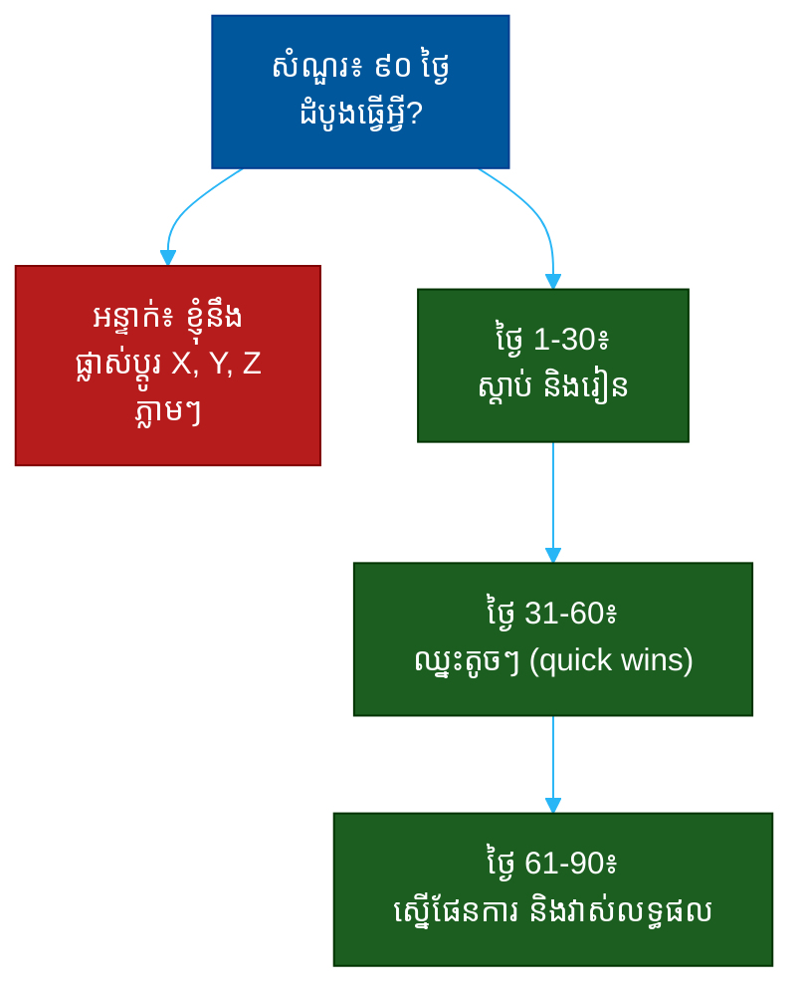

# "តើអ្នកនឹងធ្វើអ្វីក្នុង ៩០ ថ្ងៃដំបូង?" (What Would You Do in Your First 90 Days?)៖ សំណួរតែមួយដែលបង្ហាញពីការគិតជាប្រព័ន្ធ ការផ្តល់អាទិភាព និងភាពចាស់ទុំ

**Author:** ichamrong  
**Date:** 2026-05-30  
**Tags:** #one-question #interview #startup #onboarding #prioritization #ownership #communication  
**Category:** Concepts / One Question  
**Read Time:** ~12 min  

---

## 📌 មាតិកា (Table of Contents)
- [អន្ទាក់ (The Setup)](#the-setup)
- [១. សំណួរពិតប្រាកដ (What They Are Really Asking)](#1)
- [២. អ្វីដែលវាបង្ហាញអំពីអ្នក (The Hidden Signals)](#2)
- [៣. អន្ទាក់ — ចម្លើយខ្សោយ (The Trap: Weak Answers)](#3)
- [៤. នីតិវិធីឆ្លើយតប (The Response Procedure)](#4)
- [៥. ឧទាហរណ៍ចម្លើយខ្លាំង (Strong Sample Answer)](#5)
- [៦. សំណួរបន្ត និងរបៀបដោះស្រាយ (Follow-up Traps)](#6)
- [សេចក្តីសន្និដ្ឋាន (Conclusion)](#conclusion)
- [ឯកសារយោង (References)](#references)
- [អត្ថបទពាក់ព័ន្ធ (Related Posts)](#related-posts)

---

## អន្ទាក់ (The Setup) 

ស្ថាបនិក (Founder) សួរ​ដោយ​ស្ងប់ៗ ថា៖ **«បើ​ឧបមា​ថា​យើង​ជួល​អ្នក — តើ​អ្នក​នឹង​ធ្វើ​អ្វី​ក្នុង ៩០ ថ្ងៃ​ដំបូង?»**

នេះមើលទៅដូចជាសំណួរ «ផែនការការងារ» ធម្មតា — តែវាមិនមែនទេ។ ស្ថាបនិកមិនរំពឹងថាអ្នកនឹងដឹងពីបញ្ហាខាងក្នុងរបស់ក្រុមហ៊ុនពិតៗនោះទេ — អ្នកមិនទាន់ចូលផង។ អ្វីដែលគេពិតជាមើលគឺ **របៀបដែលអ្នករៀបចំការគិត** ពេលប្រឈមនឹងស្ថានភាពថ្មីដែលមិនច្បាស់លាស់។

ក្នុងរយៈពេលនៃចម្លើយរបស់អ្នក គេអាចអានបាន៖
* តើ​អ្នក​នឹង​ស្តាប់​ និង​រៀន​មុន ឬ​ប្រញាប់​ផ្លាស់​ប្តូរ​អ្វីៗ?
* តើ​អ្នក​ដឹង​ពី​ការ​ផ្តល់​អាទិភាព (prioritization) ឬ​ចង់​ធ្វើ​គ្រប់​យ៉ាង​ម្តង?
* តើ​អ្នក​មាន​ភាព​ជា​ម្ចាស់ ឬ​រង់​ចាំ​គេ​ប្រាប់?
* តើ​អ្នក​ដឹង​ថា​លទ្ធផល​ត្រូវ​វាស់​យ៉ាង​ណា?

នេះជាផែនទីបង្ហាញផ្លូវសម្រាប់ការឆ្លើយតបឲ្យបានល្អ៖

---

## ១. សំណួរពិតប្រាកដ (What They Are Really Asking) 

ស្ថាបនិកមិនមែនកំពុងសុំ «បញ្ជីការងារ» ច្បាស់លាស់ទេ — អ្នកមិនទាន់មានព័ត៌មានគ្រប់គ្រាន់ដើម្បីសរសេរវាផង។ អ្វីដែលគេពិតជាសួរគឺ៖

> **«តើ​អ្នក​ដឹង​ពី​របៀប​ចូល​ស្ថានភាព​ថ្មី​ដោយ​មិន​ខូច​អ្វីៗ ហើយ​បង្កើត​តម្លៃ​ក្នុង​ពេល​ខ្លី​ដែរ​ឬ​ទេ?»**

មនុស្ស​ថ្មី​ដែល​មិន​ល្អ​មាន​ពីរ​ប្រភេទ៖ ​អ្នក​ដែល​មក​ហើយ​ប្រញាប់​ផ្លាស់​ប្តូរ​អ្វីៗ​ដោយ​មិន​ទាន់​យល់ (បំផ្លាញ​ការ​ទុក​ចិត្ត) និង​អ្នក​ដែល​អង្គុយ​ស្ងៀម​រង់​ចាំ​គេ​ប្រាប់ (មិន​បង្កើត​តម្លៃ)។ ស្ថាបនិក​ត្រូវ​ការ​អ្នក​ដែល​ដឹង​ពី​តុល្យភាព៖ **រៀន​មុន ហើយ​បន្ទាប់​មក​ចាប់​ផ្តើម​ឈ្នះ**។

ដូច្នេះ សំណួរនេះវាស់ ៣ យ៉ាង៖
1. **ការគិតជាប្រព័ន្ធ (Structured Thinking)** — តើ​អ្នក​បំបែក​បញ្ហា​ធំ​ជា​ដំណាក់​កាល​បាន​ឬ​ទេ?
2. **ការផ្តល់អាទិភាព (Prioritization)** — តើ​អ្នក​ដឹង​ថា​អ្វី​ត្រូវ​ធ្វើ​មុន​ឬ​ទេ?
3. **ភាពចាស់ទុំ (Humility + Drive)** — តើ​អ្នក​ស្តាប់​មុន​ ប៉ុន្តែ​នៅ​តែ​មាន​ភាព​ជា​ម្ចាស់?

---

## ២. អ្វីដែលវាបង្ហាញអំពីអ្នក (The Hidden Signals) 

| សញ្ញាដែលគេអាន | ចម្លើយខ្សោយបង្ហាញ | ចម្លើយខ្លាំងបង្ហាញ |
| :--- | :--- | :--- |
| **ការគិតជាប្រព័ន្ធ** | បញ្ជី​ការងារ​ច្របូកច្របល់ | ដំណាក់​កាល​ច្បាស់ (រៀន → ឈ្នះ → ផែនការ) |
| **ភាពចាស់ទុំ (Humility)** | ផ្លាស់​ប្តូរ​ភ្លាមៗ​ដោយ​មិន​យល់ | ស្តាប់​អតិថិជន/ក្រុម​មុន |
| **ការផ្តល់អាទិភាព** | ចង់​ធ្វើ​គ្រប់​យ៉ាង​ម្តង | ជ្រើស​បញ្ហា​ធំ​បំផុត​មុន |
| **ការវាស់លទ្ធផល** | មិន​និយាយ​ពី​លទ្ធផល | កំណត់​ថា​ជោគ​ជ័យ​មើល​ទៅ​យ៉ាង​ណា |
| **ភាពជាម្ចាស់** | រង់​ចាំ​គេ​ប្រាប់ | ស្នើ​សកម្មភាព​ដោយ​ខ្លួន​ឯង |

**ចំណុចសំខាន់៖** អ្នកដែលនិយាយថា «ខ្ញុំនឹងផ្លាស់ប្តូរ A, B, C ភ្លាមៗ» គឺជាសញ្ញាក្រហម — អ្នកមិនទាន់ដឹងពីមូលហេតុដែលអ្វីៗត្រូវធ្វើបែបនោះ។ ប៉ុន្តែអ្នកដែលនិយាយត្រឹម «ខ្ញុំនឹងស្តាប់ និងរៀន» ដោយឯកោ ក៏រាក់ដែរ។ ចម្លើយខ្លាំងបង្ហាញ **ការផ្លាស់ប្តូរពីការរៀន ទៅការធ្វើ** តាមពេលវេលា។

---

## ៣. អន្ទាក់ — ចម្លើយខ្សោយ (The Trap: Weak Answers) 

**អន្ទាក់ទី ១ — អ្នកវីរបុរស (The Hero):**
> «ខ្ញុំ​នឹង​ផ្លាស់​ប្តូរ​ដំណើរ​ការ​លក់ កែ​ផលិតផល និង​ជួល​មនុស្ស​បន្ថែម​ភ្លាមៗ»

ហេតុអ្វីបរាជ័យ៖ អ្នកមិនទាន់ដឹងថាហេតុអ្វីអ្វីៗត្រូវធ្វើបែបនោះ។ ការផ្លាស់ប្តូរមុនពេលយល់ បំផ្លាញការទុកចិត្តរបស់ក្រុម ហើយជារឿយៗធ្វើឲ្យអ្វីៗកាន់តែអាក្រក់។ វាបង្ហាញការអួត (arrogance)។

**អន្ទាក់ទី ២ — អ្នកអកម្ម (The Passive):**
> «ខ្ញុំ​នឹង​រៀន​ពី​ការងារ ហើយ​ធ្វើ​អ្វី​ដែល​អ្នក​ប្រាប់»

ហេតុអ្វីបរាជ័យ៖ ខ្វះភាពជាម្ចាស់។ Startup ត្រូវការមនុស្សដែលរុញខ្លួនឯង មិនមែនរង់ចាំការណែនាំ។ វាបង្ហាញការខ្វះ initiative។

**អន្ទាក់ទី ៣ — អ្នកមិនច្បាស់លាស់ (The Vague):**
> «ខ្ញុំ​នឹង​ស្វែង​យល់​ពី​ក្រុមហ៊ុន​ហើយ​រក​មើល​កន្លែង​ដែល​ខ្ញុំ​អាច​ជួយ»

ហេតុអ្វីបរាជ័យ៖ គ្មានរចនាសម្ព័ន្ធ មិនបង្ហាញការគិតជាប្រព័ន្ធ។ ស្តាប់ទៅដូចជាគ្មានផែនការសោះ។

---

## ៤. នីតិវិធីឆ្លើយតប (The Response Procedure) 

ចម្លើយខ្លាំងបំបែក ៩០ ថ្ងៃ ជា **៣ ដំណាក់កាល** ៣០ ថ្ងៃម្តងៗ៖

**ដំណាក់កាលទី ១ (ថ្ងៃ 1–30) — ស្តាប់ និងរៀន (Learn)**
ចាប់ផ្តើមដោយការទទួលស្គាល់ថាអ្នកមិនទាន់ដឹង។
> «៣០ ថ្ងៃ​ដំបូង ខ្ញុំ​នឹង​ជួប​ក្រុម, និយាយ​ជា​មួយ​អតិថិជន ១០ នាក់, ហើយ​យល់​ពី​ការ​វាស់​លទ្ធផល​បច្ចុប្បន្ន»

នេះបង្ហាញ **ភាពចាស់ទុំ** (humility)។

**ដំណាក់កាលទី ២ (ថ្ងៃ 31–60) — ឈ្នះតូចៗ (Quick Wins)**
ស្នើបង្កើតតម្លៃតូចៗ ដែលបង្ហាញការទុកចិត្តបាន។
> «ដោយ​ផ្អែក​លើ​អ្វី​ដែល​ខ្ញុំ​រៀន ខ្ញុំ​នឹង​ជ្រើស​បញ្ហា ១–២ ដែល​ខ្ញុំ​អាច​ដោះ​ស្រាយ​លឿន​ដើម្បី​បង្កើត​សន្ទុះ»

នេះបង្ហាញ **ការផ្តល់អាទិភាព** និង **ភាពជាម្ចាស់**។

**ដំណាក់កាលទី ៣ (ថ្ងៃ 61–90) — ផែនការ និងលទ្ធផល (Plan + Measure)**
បញ្ចប់ដោយការស្នើផែនការធំជាង, ភ្ជាប់នឹងលទ្ធផលដែលអាចវាស់បាន។
> «ត្រឹម​ថ្ងៃ​ទី ៩០ ខ្ញុំ​ចង់​ស្នើ​ផែនការ​មួយ​ត្រីមាស​ច្បាស់​លាស់ ជា​មួយ​លេខ​គោល​ដៅ​ដែល​យើង​យល់​ស្រប​គ្នា»

នេះបង្ហាញ **ការគិតជាប្រព័ន្ធ** និងថាអ្នកគិតពីលទ្ធផល។

---

## ៥. ឧទាហរណ៍ចម្លើយខ្លាំង (Strong Sample Answer) 

> **«ខ្ញុំ​នឹង​បំបែក​វា​ជា​បី​ដំណាក់​កាល។ ៣០ ថ្ងៃ​ដំបូង គឺ​ស្តាប់៖ ខ្ញុំ​នឹង​និយាយ​ជា​មួយ​ក្រុម, ជួប​អតិថិជន ១០ នាក់, ហើយ​យល់​ពី​លេខ​បច្ចុប្បន្ន — ខ្ញុំ​នឹង​មិន​ផ្លាស់​ប្តូរ​អ្វី​មុន​ពេល​ខ្ញុំ​យល់​ពី​មូលហេតុ​ដែល​វា​ត្រូវ​ធ្វើ​បែប​នេះ​ទេ។ ៣០ ថ្ងៃ​បន្ទាប់ ខ្ញុំ​នឹង​ជ្រើស​បញ្ហា ១–២ ដែល​អាច​ឈ្នះ​លឿន​ដើម្បី​បង្កើត​ការ​ទុក​ចិត្ត។ ហើយ​ត្រឹម​ថ្ងៃ​ទី ៩០ ខ្ញុំ​ចង់​មក​ជា​មួយ​អ្នក​ដោយ​មាន​ផែនការ​ច្បាស់​លាស់​ និង​លេខ​គោល​ដៅ​ដែល​យើង​អាច​យល់​ស្រប​គ្នា។ តែ​ខ្ញុំ​នឹង​សួរ​អ្នក​ត្រឡប់​វិញ​ថា — តើ​បញ្ហា​ធំ​បំផុត​ដែល​អ្នក​ចង់​ឲ្យ​ខ្ញុំ​ដោះ​ស្រាយ​មុន​គឺ​អ្វី?»**

**ការវិភាគ (Breakdown):**
* «បំបែក​ជា​បី​ដំណាក់​កាល» → ការគិតជាប្រព័ន្ធ (structure)
* «ស្តាប់... មិន​ផ្លាស់​ប្តូរ​មុន​ពេល​យល់» → ភាពចាស់ទុំ (humility)
* «ជ្រើស​បញ្ហា ១–២ ឈ្នះ​លឿន» → ការផ្តល់អាទិភាព (prioritization)
* «លេខ​គោល​ដៅ​ដែល​យល់​ស្រប​គ្នា» → ការវាស់លទ្ធផល (measurement)
* «សួរ​អ្នក​ត្រឡប់​វិញ...» → ភាពជាម្ចាស់ + ការសហការ (ownership)

**ប្រៀបធៀប៖**
* ❌ ខ្សោយ៖ «ខ្ញុំ​នឹង​ផ្លាស់​ប្តូរ A, B, C ភ្លាមៗ»
* ✅ ខ្លាំង៖ ចម្លើយ ៣ ដំណាក់កាលខាងលើ

---

## ៦. សំណួរបន្ត និងរបៀបដោះស្រាយ (Follow-up Traps) 

ស្ថាបនិកល្អនឹងសួរបន្ត ដើម្បីសាកល្បងថាផែនការរបស់អ្នកមានសារធាតុពិតៗ៖

**«ចុះ​បើ​ថ្ងៃ​ដំបូង​អ្នក​ឃើញ​អ្វី​មួយ​ខុស​យ៉ាង​ច្បាស់?» (What if you see something obviously broken on day one?)**
> ឆ្លើយ​ដោយ​តុល្យភាព៖ «ខ្ញុំ​នឹង​លើក​វា​ឡើង​ភ្លាមៗ​ដើម្បី​ពិភាក្សា ប៉ុន្តែ​ខ្ញុំ​នឹង​សួរ​មុន​ថា​ហេតុ​អ្វី​បាន​ជា​វា​នៅ​បែប​នេះ — ប្រហែល​ជា​មាន​មូលហេតុ​ដែល​ខ្ញុំ​មិន​ទាន់​ឃើញ។ បន្ទាប់​មក​ ​បើ​វា​ខុស​ពិត ខ្ញុំ​នឹង​ស្នើ​ដោះ​ស្រាយ​វា​ជា quick win។»

**«តើ​អ្នក​នឹង​វាស់​ជោគ​ជ័យ​ក្នុង ៩០ ថ្ងៃ​យ៉ាង​ណា?» (How will you measure success?)**
> បង្ហាញ​ការ​គិត​ពី​លទ្ធផល៖ «ខ្ញុំ​ចង់​ឲ្យ​មាន​ភស្តុតាង​ច្បាស់ — quick win ១ ឬ ២ ដែល​ឃើញ​បាន, ការ​យល់​ដឹង​ច្បាស់​ពី​ក្រុម​ និង​អតិថិជន, និង​ផែនការ​ត្រីមាស​ដែល​អ្នក​យល់​ស្រប។»

**ច្បាប់មាស៖** រាល់សំណួរបន្ត គឺជាការសាកល្បងថាតើអ្នកដឹងពីតុល្យភាពរវាង «ការរៀន» និង «ការធ្វើ» ឬអត់។ បើអ្នកប្រញាប់ផ្លាស់ប្តូរពេក ឬអកម្មពេក — អ្នកនឹងធ្លាក់ក្នុងអន្ទាក់។

---

## សេចក្តីសន្និដ្ឋាន (Conclusion) 

សំណួរ «តើអ្នកនឹងធ្វើអ្វីក្នុង ៩០ ថ្ងៃដំបូង?» មិនមែនជាសំណួរ «ផែនការការងារ» ទេ។ វាជា **កញ្ចក់នៃភាពចាស់ទុំ** ដែលឆ្លុះបញ្ចាំងពីរបៀបដែលអ្នកចូលស្ថានភាពថ្មីដោយមិនបំផ្លាញ ហើយនៅតែបង្កើតតម្លៃ។

ចងចាំរូបមន្ត ៣ ដំណាក់កាល៖
1. **ថ្ងៃ 1–30៖ ស្តាប់ និងរៀន** (humility)
2. **ថ្ងៃ 31–60៖ ឈ្នះតូចៗ** (prioritization)
3. **ថ្ងៃ 61–90៖ ផែនការ និងលទ្ធផល** (structured impact)

ការ​ស្តាប់​មុន​ ​បន្ទាប់​មក​ឈ្នះ​លឿន​ រួម​នឹង​លេខ​គោល​ដៅ​ច្បាស់​លាស់ — នោះ​ជា​អ្វី​ដែល​បង្ហាញ​ថា​អ្នក​ជា​មនុស្ស​ដែល​អាច​ទុក​ចិត្ត​ឲ្យ​ដឹក​នាំ​ខ្លួន​ឯង។

---

## ឯកសារយោង (References) 

- *The First 90 Days* — Michael D. Watkins
- *The Hard Thing About Hard Things* — Ben Horowitz
- *High Output Management* — Andrew Grove

---

## អត្ថបទពាក់ព័ន្ធ (Related Posts) 

- [Why Do You Want to Join a Startup? (ការជម្រុញ)](02-why-do-you-want-to-join-a-startup.md)
- [Are You Okay With Uncertainty? (ភាពមិនច្បាស់លាស់)](04-are-you-okay-with-uncertainty.md)
- [One Question Index](../README.md)
