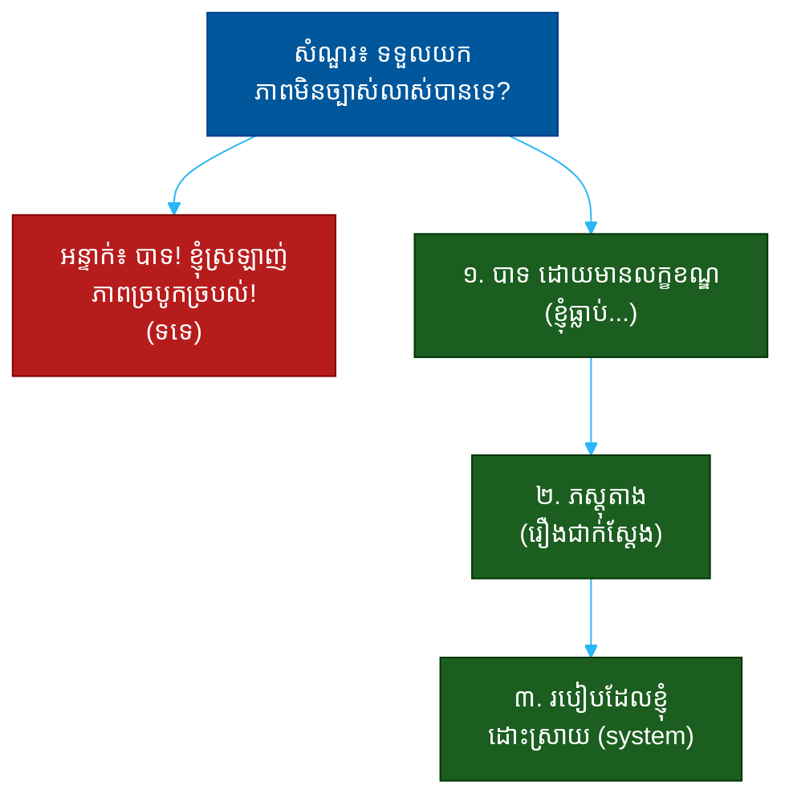

# "តើអ្នកទទួលយកភាពមិនច្បាស់លាស់បានទេ?" (Are You Okay With Uncertainty?)៖ សំណួរតែមួយដែលបង្ហាញពីភាពធន់ ការសម្រេចចិត្តក្នុងភាពមិនច្បាស់ និងភាពចាស់ទុំ

**Author:** ichamrong  
**Date:** 2026-05-30  
**Tags:** #one-question #interview #startup #uncertainty #resilience #adaptability #communication  
**Category:** Concepts / One Question  
**Read Time:** ~12 min  

---

## 📌 មាតិកា (Table of Contents)
- [អន្ទាក់ (The Setup)](#the-setup)
- [១. សំណួរពិតប្រាកដ (What They Are Really Asking)](#1)
- [២. អ្វីដែលវាបង្ហាញអំពីអ្នក (The Hidden Signals)](#2)
- [៣. អន្ទាក់ — ចម្លើយខ្សោយ (The Trap: Weak Answers)](#3)
- [៤. នីតិវិធីឆ្លើយតប (The Response Procedure)](#4)
- [៥. ឧទាហរណ៍ចម្លើយខ្លាំង (Strong Sample Answer)](#5)
- [៦. សំណួរបន្ត និងរបៀបដោះស្រាយ (Follow-up Traps)](#6)
- [សេចក្តីសន្និដ្ឋាន (Conclusion)](#conclusion)
- [ឯកសារយោង (References)](#references)
- [អត្ថបទពាក់ព័ន្ធ (Related Posts)](#related-posts)

---

## អន្ទាក់ (The Setup) 

ស្ថាបនិក (Founder) សួរ​ត្រង់ៗ ថា៖ **«តើ​អ្នក​ទទួល​យក​ភាព​មិន​ច្បាស់​លាស់​បាន​ទេ? នៅ​ទីនេះ​អ្វីៗ​ផ្លាស់​ប្តូរ​រាល់​សប្តាហ៍»**

នេះមើលទៅដូចជាសំណួរ បាទ/ទេ ធម្មតា — តែវាមិនមែនទេ។ មនុស្ស​គ្រប់​គ្នា​នឹង​ឆ្លើយ «បាទ» — ​គ្មាន​នរណា​ម្នាក់​ឆ្លើយ «ទេ» ក្នុង​ការ​សម្ភាស​ការងារ startup នោះ​ទេ។ ដូច្នេះ​ ​ពាក្យ «បាទ» គ្មាន​តម្លៃ​អ្វី​ទេ។ ស្ថាបនិក​កំពុង​ស្តាប់ **ភស្តុតាង** ថា​អ្នក​ធ្លាប់​នៅ​ក្នុង​ភាព​មិន​ច្បាស់​លាស់​ហើយ​ដំណើរ​ការ​ល្អ។

ក្នុងរយៈពេលនៃចម្លើយរបស់អ្នក គេអាចអានបាន៖
* តើ​អ្នក​ដឹង​ថា​ភាព​មិន​ច្បាស់​លាស់​ពិត​ប្រាកដ​មាន​អារម្មណ៍​យ៉ាង​ណា ឬ​គ្រាន់​តែ​ស្រមៃ?
* តើ​អ្នក *ដំណើរ​ការ* ក្នុង​ភាព​ច្របូកច្របល់ ឬ​គ្រាន់​តែ *ស៊ូទ្រាំ*?
* តើ​អ្នក​សម្រេច​ចិត្ត​បាន​ពេល​ព័ត៌មាន​មិន​គ្រប់ ឬ​ហ្ស៊ាប់ (freeze)?
* តើ​អ្នក​បង្កើត​សណ្តាប់​ធ្នាប់​ពី​ភាព​ច្របូកច្របល់ ឬ​បន្ថែម​ភាព​ច្របូកច្របល់?

នេះជាផែនទីបង្ហាញផ្លូវសម្រាប់ការឆ្លើយតបឲ្យបានល្អ៖

---

## ១. សំណួរពិតប្រាកដ (What They Are Really Asking) 

ស្ថាបនិកមិនមែនកំពុងសុំ «ការសន្យា» ថាអ្នកនឹងមិនត្អូញត្អែរទេ។ អ្វីដែលគេពិតជាសួរគឺ៖

> **«ពេល​ផែនការ​ប្តូរ​នៅ​ថ្ងៃ​ព្រហស្បតិ៍ ​អ្នក​ប្រាក់​ប្រែ​ឬ​អ្នក​បត់​បែន​ហើយ​ដើរ​បន្ត?»**

ភាព​មិន​ច្បាស់​លាស់​ក្នុង startup មិន​មែន​ជា​រឿង​រំភើប​ដូច​ក្នុង​ភាព​យន្ត​ទេ។ វា​មាន​ន័យ​ថា​អ្នក​ត្រូវ​សម្រេច​ចិត្ត​ដោយ​ព័ត៌មាន ៥០% ​ ​ផែនការ​ផ្លាស់​ប្តូរ​ភ្លាមៗ ​ ​និង​គ្មាន​នរណា​ប្រាប់​ច្បាស់​ថា​ត្រូវ​ធ្វើ​អ្វី។ ស្ថាបនិក​ត្រូវ​ការ​មនុស្ស​ដែល *ដំណើរ​ការ​ល្អ* ក្នុង​ស្ថានភាព​នេះ​ មិន​មែន​គ្រាន់​តែ​ស៊ូទ្រាំ​វា​ដោយ​ការ​ឈឺ​ចាប់។

ដូច្នេះ សំណួរនេះវាស់ ៣ យ៉ាង៖
1. **ភាពធន់ (Resilience)** — តើ​អ្នក​នៅ​ស្ងប់​ពេល​អ្វីៗ​ប្តូរ​ឬ​ទេ?
2. **ការសម្រេចចិត្ត (Decision-making)** — តើ​អ្នក​សម្រេច​បាន​ពេល​ព័ត៌មាន​មិន​គ្រប់​ឬ​ទេ?
3. **ភាពចាស់ទុំ (Self-awareness)** — តើ​អ្នក​ដឹង​ពី​ដែន​កំណត់​របស់​ខ្លួន​ឯង​ឬ​ទេ?

---

## ២. អ្វីដែលវាបង្ហាញអំពីអ្នក (The Hidden Signals) 

| សញ្ញាដែលគេអាន | ចម្លើយខ្សោយបង្ហាញ | ចម្លើយខ្លាំងបង្ហាញ |
| :--- | :--- | :--- |
| **ភស្តុតាង (Evidence)** | «បាទ ខ្ញុំ​ទទួល​បាន» (ឥត​រឿង) | រឿង​ជាក់​ស្តែង​ដែល​ធ្លាប់​ឆ្លង​កាត់ |
| **ការ​ដំណើរ​ការ​ (Process)** | ស៊ូទ្រាំ​ដោយ​ការ​ឈឺ​ចាប់ | មាន​ប្រព័ន្ធ​ដោះ​ស្រាយ​ច្បាស់ |
| **ការសម្រេចចិត្ត** | រង់​ចាំ​ព័ត៌មាន​គ្រប់​ ​មុន​ធ្វើ | សម្រេច​ដោយ​ព័ត៌មាន​មិន​គ្រប់ |
| **ភាពចាស់ទុំ** | «ខ្ញុំ​ស្រឡាញ់​ភាព​ច្របូកច្របល់!» | ដឹង​ថា​អ្វី​ធ្វើ​ឲ្យ​ខ្ញុំ​ស្ត្រេស​ និង​ដោះ​ស្រាយ​យ៉ាង​ណា |
| **ការបង្កើតសណ្តាប់ធ្នាប់** | បន្ថែម​ភាព​ច្របូកច្របល់ | បង្កើត​សណ្តាប់​ធ្នាប់​ពី​ភាព​ច្របូកច្របល់ |

**ចំណុចសំខាន់៖** ការនិយាយថា «ខ្ញុំស្រឡាញ់ភាពច្របូកច្របល់!» គឺជាសញ្ញាក្រហម — វាបង្ហាញថាអ្នកមិនធ្លាប់នៅក្នុងវាពិតៗ។ មនុស្សដែលធ្លាប់ឆ្លងកាត់ភាពមិនច្បាស់លាស់ពិតៗ មិននិយាយថា «ស្រឡាញ់» ទេ — ​គេ​និយាយ​ថា «ខ្ញុំ​ដឹង​របៀប​ដោះ​ស្រាយ​វា»។

---

## ៣. អន្ទាក់ — ចម្លើយខ្សោយ (The Trap: Weak Answers) 

**អន្ទាក់ទី ១ — អ្នកស្រឡាញ់ភាពច្របូកច្របល់ (The Chaos Lover):**
> «បាទ! ខ្ញុំ​ស្រឡាញ់​ភាព​ច្របូកច្របល់ ខ្ញុំ​រីក​ចម្រើន​ក្នុង​ភាព​ច្របូកច្របល់!»

ហេតុអ្វីបរាជ័យ៖ ឥតមានភស្តុតាង ហើយវាស្តាប់ទៅមិនពិត។ មនុស្សដែលធ្លាប់នៅក្នុង startup ដឹងថាភាពច្របូកច្របល់នឿយហត់ — អ្នកគ្រប់គ្រងវា អ្នកមិន *ស្រឡាញ់* វាទេ។ វាបង្ហាញការខ្វះបទពិសោធន៍ពិត។

**អន្ទាក់ទី ២ — អ្នកត្រូវការភាពច្បាស់លាស់ (The Order-Seeker):**
> «បាទ ​ ​ប៉ុន្តែ​ខ្ញុំ​ធ្វើ​ការ​ល្អ​បំផុត​ពេល​មាន​ផែនការ​ច្បាស់​លាស់​ និង​ការ​ណែនាំ​ច្បាស់»

ហេតុអ្វីបរាជ័យ៖ នេះជាការផ្ទុយនឹងតម្រូវការ។ បើអ្នកត្រូវការផែនការច្បាស់លាស់ដើម្បីដំណើរការ — អ្នកនឹងហ្ស៊ាប់នៅ startup។ វាបង្ហាញការមិនចុះសម្រុង (mismatch)។

**អន្ទាក់ទី ៣ — អ្នកនិយាយទូទៅ (The Abstract):**
> «បាទ ​ ​ខ្ញុំ​បត់​បែន​បាន​ ​ ​ខ្ញុំ​សម្រប​ខ្លួន​បាន​លឿន»

ហេតុអ្វីបរាជ័យ៖ ពាក្យ «បត់បែន» គ្មានភស្តុតាង គ្រាន់តែជាពាក្យ buzzword។ ស្ថាបនិកឮ​ពាក្យ​នេះ​រាប់​រយ​ដង។ បើ​គ្មាន​រឿង​ជាក់​ស្តែង វា​គ្មាន​ទម្ងន់។

---

## ៤. នីតិវិធីឆ្លើយតប (The Response Procedure) 

ចម្លើយខ្លាំងមាន **៣ ផ្នែក** តាមលំដាប់៖

**ជំហានទី ១ — បាទ ​ ​ប៉ុន្តែ​ស្មោះត្រង់ (Honest Yes)**
ចាប់ផ្តើមដោយ «បាទ» ប៉ុន្តែទទួលស្គាល់ការពិត — ភាពមិនច្បាស់លាស់ពិបាក។
> «បាទ — ​ ​ខ្ញុំ​មិន​និយាយ​ថា​វា​ងាយ​ស្រួល​ទេ​ ​ ​តែ​ខ្ញុំ​ដំណើរ​ការ​ល្អ​ក្នុង​វា»

នេះបង្ហាញ **ភាពចាស់ទុំ** និងភាពស្មោះត្រង់ — អ្នកមិនកំពុងលក់ការកុហក។

**ជំហានទី ២ — ភស្តុតាង (Tell a Story)**
ផ្តល់រឿងជាក់ស្តែងពីពេលអ្នកធ្វើការក្នុងភាពមិនច្បាស់លាស់។
> «នៅ [គម្រោង X] ​ ​ផែនការ​ផ្លាស់​ប្តូរ ៣ ដង​ក្នុង ១ ខែ​ ​ ​នេះ​ជា​អ្វី​ដែល​ខ្ញុំ​បាន​ធ្វើ...»

នេះបង្ហាញ **ភស្តុតាង** — រឿងពិតមិនអាចក្លែងបាន។

**ជំហានទី ៣ — ប្រព័ន្ធរបស់អ្នក (Your System)**
បង្ហាញ *របៀប* ដែលអ្នកដោះស្រាយភាពមិនច្បាស់លាស់ — បង្កើតសណ្តាប់ធ្នាប់ពីភាពច្របូកច្របល់។
> «ពេល​អ្វីៗ​មិន​ច្បាស់​ ​ ​ខ្ញុំ​ផ្តោត​លើ​អ្វី​ដែល​ខ្ញុំ​គ្រប់​គ្រង​បាន ​ ​ ​សម្រេច​ដោយ​ព័ត៌មាន​ដែល​មាន ​ ​ ​ហើយ​ប្តូរ​ពេល​មាន​ព័ត៌មាន​ថ្មី»

នេះបង្ហាញ **ការសម្រេចចិត្ត** និងថាអ្នកមិនមែនជាជនរងគ្រោះនៃភាពច្របូកច្របល់។

---

## ៥. ឧទាហរណ៍ចម្លើយខ្លាំង (Strong Sample Answer) 

> **«បាទ — ​ ​ខ្ញុំ​មិន​និយាយ​ថា​វា​តែង​តែ​ស្រួល​ទេ ​ ​តែ​នោះ​ជា​កន្លែង​ដែល​ខ្ញុំ​ធ្វើ​ការ​ល្អ​បំផុត។ នៅ​គម្រោង​មុន​របស់​ខ្ញុំ ​ ​ ​ទិសដៅ​ផលិតផល​ប្តូរ ៣ ដង​ក្នុង​មួយ​ត្រីមាស ​ ​ ​ដោយសារ​អតិថិជន​សំខាន់​ប្តូរ​តម្រូវការ។ ជំនួស​ឲ្យ​ការ​រង់​ចាំ​ភាព​ច្បាស់​លាស់ ​ ​ ​ខ្ញុំ​បាន​បំបែក​ការងារ​ជា​ផ្នែក​តូចៗ​មួយ​សប្តាហ៍​ម្តង ​ ​ ​ផ្តោត​លើ​អ្វី​ដែល​ខ្ញុំ​ដឹង​ច្បាស់ ​ ​ ​ហើយ​សម្រេច​ចិត្ត​ដោយ​ព័ត៌មាន​ដែល​មាន។ ខ្ញុំ​មិន​ត្រូវ​ការ​ផែនការ​ល្អ​ឥត​ខ្ចោះ​ដើម្បី​ផ្លាស់​ទី​ទេ — ​ខ្ញុំ​ត្រូវ​ការ​ត្រឹម​ទិសដៅ​ច្បាស់​គ្រប់​គ្រាន់​ ​ ​ហើយ​ខ្ញុំ​នឹង​កែ​តម្រូវ​ពេល​ដើរ។»**

**ការវិភាគ (Breakdown):**
* «មិន​និយាយ​ថា​ស្រួល​ទេ» → ភាពចាស់ទុំ + ស្មោះត្រង់ (honesty)
* «ទិសដៅ​ប្តូរ ៣ ដង​ក្នុង​ត្រីមាស» → ភស្តុតាង (real story)
* «បំបែក​ការងារ​ជា​ផ្នែក​តូចៗ» → ប្រព័ន្ធ (system)
* «សម្រេច​ដោយ​ព័ត៌មាន​ដែល​មាន» → ការសម្រេចចិត្ត (decision-making)
* «កែ​តម្រូវ​ពេល​ដើរ» → ភាពបត់បែនពិត (real adaptability)

**ប្រៀបធៀប៖**
* ❌ ខ្សោយ៖ «បាទ ខ្ញុំ​ស្រឡាញ់​ភាព​ច្របូកច្របល់!»
* ✅ ខ្លាំង៖ ចម្លើយ ៣ ផ្នែកខាងលើ ​ (ភស្តុតាង + ប្រព័ន្ធ)

---

## ៦. សំណួរបន្ត និងរបៀបដោះស្រាយ (Follow-up Traps) 

ស្ថាបនិកល្អនឹងសួរបន្ត ដើម្បីសាកល្បងថាភស្តុតាងរបស់អ្នកពិតៗ៖

**«ប្រាប់​ខ្ញុំ​ពី​ពេល​ដែល​អ្នក​សម្រេច​ចិត្ត​ខុស​ក្នុង​ស្ថានភាព​មិន​ច្បាស់​លាស់?» (Tell me about a wrong call you made in chaos?)**
> កុំ​លាក់។ ឆ្លើយ​ដោយ​ភាព​ចាស់ទុំ៖ «បាទ — ​ខ្ញុំ​ធ្លាប់​សម្រេច​ប្រញាប់​ពេក​ម្តង ​ ​ ​ហើយ​វា​ខុស។ ខ្ញុំ​បាន​រៀន​ថា​ត្រូវ​បែង​ចែក​រវាង​ការ​សម្រេច​ដែល​អាច​ត្រឡប់​បាន (reversible) និង​ការ​សម្រេច​ដែល​ត្រឡប់​មិន​បាន — ​ខ្ញុំ​សម្រេច​លឿន​លើ​ប្រភេទ​ទី ១ ​ ​ហើយ​យឺត​ៗ​លើ​ប្រភេទ​ទី ២។»

**«ចុះ​បើ​យើង​ប្តូរ​អាទិភាព​របស់​អ្នក​នៅ​ពាក់​កណ្តាល​សប្តាហ៍?» (What if we change your priorities mid-week?)**
> «នោះ​ជា​រឿង​ធម្មតា​ខ្ញុំ​រំពឹង​ទុក។ ខ្ញុំ​នឹង​សួរ​ឲ្យ​ច្បាស់​ថា​ហេតុ​អ្វី​ប្តូរ ​ ​ ​ដើម្បី​ខ្ញុំ​យល់​បរិបទ ​ ​ ​បន្ទាប់​មក​ខ្ញុំ​នឹង​កែ​តម្រូវ​ដោយ​មិន​អន្ទះ​អន្ទែង។»

**ច្បាប់មាស៖** រាល់សំណួរបន្ត គឺជាការសាកល្បងថាតើរឿងរបស់អ្នកនៅជំហានទី ២ ពិតប្រាកដឬជាការតែង។ បើអ្នកធ្លាប់នៅក្នុងភាពមិនច្បាស់លាស់ពិតៗ — អ្នកនឹងមានព័ត៌មានលម្អិតពិត និងមេរៀនច្បាស់លាស់។

---

## សេចក្តីសន្និដ្ឋាន (Conclusion) 

សំណួរ «តើអ្នកទទួលយកភាពមិនច្បាស់លាស់បានទេ?» មិនមែនជាសំណួរ បាទ/ទេ ទេ។ វាជា **តម្រងភស្តុតាង** ដែលបំបែកមនុស្សដែលនិយាយថា «ស្រឡាញ់ភាពច្របូកច្របល់» ចេញពីមនុស្សដែលធ្លាប់ឆ្លងកាត់វាពិតៗ ហើយដឹងពីរបៀបដោះស្រាយ។

ចងចាំរូបមន្ត ៣ ផ្នែក៖
1. **បាទ ​ ​ប៉ុន្តែ​ស្មោះត្រង់** (មិន​ងាយ​ស្រួល​ទេ ​ ​តែ​ខ្ញុំ​ដំណើរ​ការ​ល្អ)
2. **ភស្តុតាង** (រឿង​ជាក់​ស្តែង)
3. **ប្រព័ន្ធរបស់អ្នក** (របៀប​ខ្ញុំ​ដោះ​ស្រាយ)

ភាព​ស្មោះត្រង់​ថា​ភាព​មិន​ច្បាស់​លាស់​ពិបាក​ ​ ​រួម​នឹង​ភស្តុតាង​ថា​អ្នក​ដំណើរ​ការ​ល្អ​ក្នុង​វា — នោះ​ជា​អ្វី​ដែល​បង្ហាញ​ថា​អ្នក​នឹង​មិន​ប្រាក់​ប្រែ​ពេល startup ​ប្តូរ​ផ្លូវ។

---

## ឯកសារយោង (References) 

- *The Lean Startup* — Eric Ries
- *Antifragile: Things That Gain from Disorder* — Nassim Nicholas Taleb
- *Thinking in Bets* — Annie Duke

---

## អត្ថបទពាក់ព័ន្ធ (Related Posts) 

- [What Would You Do in Your First 90 Days? (ផែនការ)](03-what-would-you-do-in-your-first-90-days.md)
- [Why Do You Want to Join a Startup? (ការជម្រុញ)](02-why-do-you-want-to-join-a-startup.md)
- [One Question Index](../README.md)
