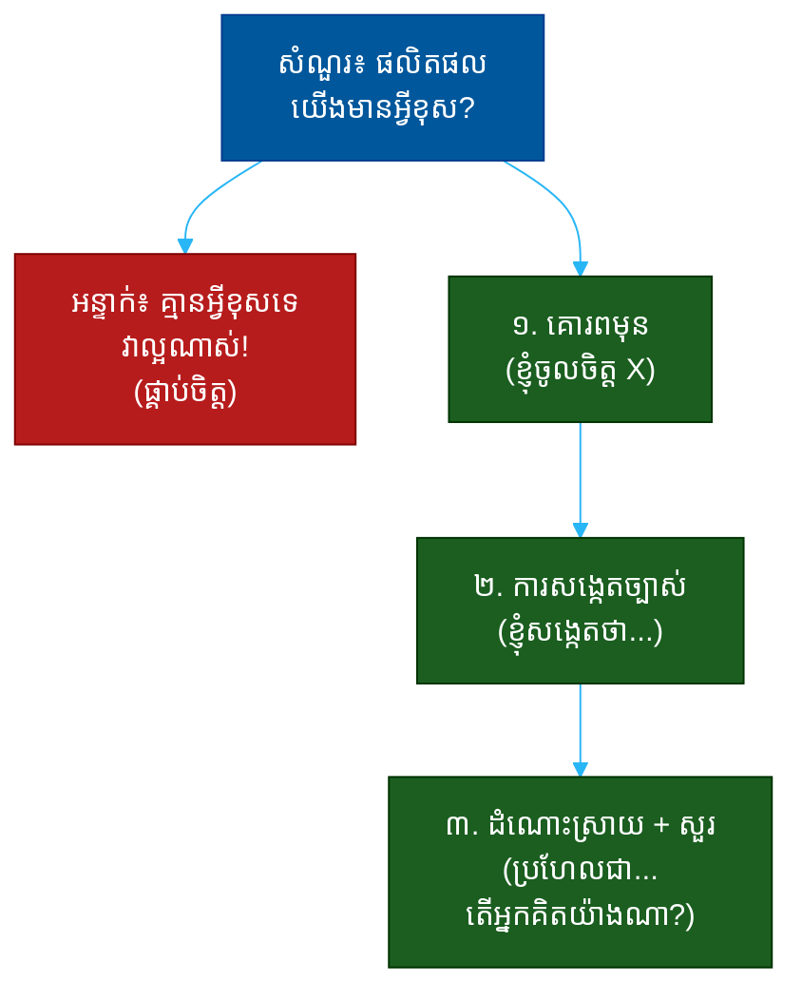

# "តើអ្នកគិតថាផលិតផលយើងមានអ្វីខុស?" (What Do You Think Is Wrong With Our Product?)៖ សំណួរតែមួយដែលបង្ហាញពីការគិតរិះគន់ ភាពក្លាហាន និងភាពមានកលល្បិច

**Author:** ichamrong  
**Date:** 2026-05-30  
**Tags:** #one-question #interview #startup #product #critical-thinking #candor #communication  
**Category:** Concepts / One Question  
**Read Time:** ~12 min  

---

## 📌 មាតិកា (Table of Contents)
- [អន្ទាក់ (The Setup)](#the-setup)
- [១. សំណួរពិតប្រាកដ (What They Are Really Asking)](#1)
- [២. អ្វីដែលវាបង្ហាញអំពីអ្នក (The Hidden Signals)](#2)
- [៣. អន្ទាក់ — ចម្លើយខ្សោយ (The Trap: Weak Answers)](#3)
- [៤. នីតិវិធីឆ្លើយតប (The Response Procedure)](#4)
- [៥. ឧទាហរណ៍ចម្លើយខ្លាំង (Strong Sample Answer)](#5)
- [៦. សំណួរបន្ត និងរបៀបដោះស្រាយ (Follow-up Traps)](#6)
- [សេចក្តីសន្និដ្ឋាន (Conclusion)](#conclusion)
- [ឯកសារយោង (References)](#references)
- [អត្ថបទពាក់ព័ន្ធ (Related Posts)](#related-posts)

---

## អន្ទាក់ (The Setup) 

ស្ថាបនិក (Founder) — ​ ​អ្នក​ដែល​ចំណាយ​ឆ្នាំ​ៗ​សាង​សង់​ផលិតផល​នេះ — ​ ​សួរ​អ្នក​ថា៖ **«តើ​អ្នក​គិត​ថា​ផលិតផល​យើង​មាន​អ្វី​ខុស?»**

នេះមើលទៅដូចជា «អន្ទាក់» — ​ ​បើ​អ្នក​រិះ​គន់​ច្រើន​ពេក ​ ​អ្នក​អាច​ធ្វើ​ឲ្យ​ស្ថាបនិក​អន់​ចិត្ត ​ ​ ​បើ​អ្នក​មិន​និយាយ​អ្វី​ ​ ​អ្នក​មើល​ទៅ​ខ្សោយ។ ​ ​ប៉ុន្តែ​នេះ​មិន​មែន​ជា​អន្ទាក់​ដើម្បី​ចាប់​ខុស​ទេ។ ​ ​ស្ថាបនិក​ល្អ​ៗ​សួរ​សំណួរ​នេះ​ដើម្បី​មើល​ថា​អ្នក​អាច **គិត​ដាច់​ដោយ​ខ្លួន​ឯង​ ​ ​និយាយ​ការ​ពិត​ដោយ​គួរ​សម​ ​ ​និង​នៅ​តែ​គោរព​ការ​ខំ​ប្រឹង​របស់​គេ** ​ ​ ​ក្នុង​ពេល​តែ​មួយ​ឬ​ទេ។

ក្នុងរយៈពេលនៃចម្លើយរបស់អ្នក គេអាចអានបាន៖
* តើ​អ្នក​ប្រើ​ផលិតផល​ពិត ​ ​ឬ​គ្រាន់​តែ​មើល​វេបសាយ ៥ នាទី?
* តើ​អ្នក​ហ៊ាន​និយាយ​ការ​ពិត ​ ​ឬ​គ្រាន់​តែ​ផ្គាប់​ចិត្ត?
* តើ​អ្នក​រិះ​គន់​ដោយ​ការ​ស្រឡាញ់ (constructive) ​ ​ឬ​ដោយ​ការ​អួត?
* តើ​អ្នក​ផ្តល់ *ដំណោះ​ស្រាយ* ​ ​ឬ​គ្រាន់​តែ *ត្អូញ​ត្អែរ*?

នេះជាផែនទីបង្ហាញផ្លូវសម្រាប់ការឆ្លើយតបឲ្យបានល្អ៖

---

## ១. សំណួរពិតប្រាកដ (What They Are Really Asking) 

ស្ថាបនិកមិនមែនកំពុងសុំ «ការវាយប្រហារ» លើផលិតផលរបស់គេទេ — ​ ​ហើយ​ក៏​មិន​មែន​សុំ​ការ​សរសើរ​ដែរ។ អ្វីដែលគេពិតជាសួរគឺ៖

> **«តើ​អ្នក​នឹង​ប្រាប់​ខ្ញុំ​នូវ​ការ​ពិត​ដែល​ខ្ញុំ​ត្រូវ​ការ​ឮ ​ ​ដោយ​របៀប​ដែល​ខ្ញុំ​ស្តាប់​បាន​ ​ ​ដែរ​ឬ​ទេ?»**

ស្ថាបនិក​ត្រូវ​ការ​មនុស្ស​ដែល​ប្រាប់​ការ​ពិត — ​ ​ដោយ​សារ​មនុស្ស​ជុំ​វិញ​គេ​ភាគ​ច្រើន​ (បុគ្គលិក ​ ​ ​អ្នក​លក់) ​ ​មិន​ហ៊ាន​និយាយ។ ​ ​ប៉ុន្តែ​ការ​ពិត​ដែល​និយាយ​ដោយ​ការ​មិន​គោរព ​ ​បំផ្លាញ​ទំនាក់​ទំនង។ នេះ​ជា​ការ​សាក​ល្បង **candor** (ការ​និយាយ​ត្រង់​ដោយ​ការ​យក​ចិត្ត​ទុក​ដាក់) — ​ ​មិន​មែន​ភាព​ល្ងង់ ​ ​ ​មិន​មែន​ការ​ផ្គាប់​ចិត្ត។

ដូច្នេះ សំណួរនេះវាស់ ៣ យ៉ាង៖
1. **ការគិតរិះគន់ (Critical Thinking)** — តើ​អ្នក​ឃើញ​បញ្ហា​ពិត​ឬ​ទេ?
2. **ភាពក្លាហាន (Candor)** — តើ​អ្នក​ហ៊ាន​និយាយ​វា​ឬ​ទេ?
3. **ភាពមានកលល្បិច (Tact)** — តើ​អ្នក​និយាយ​វា​ដោយ​របៀប​ដែល​ស្ថាបនិក​ស្តាប់​បាន​ឬ​ទេ?

---

## ២. អ្វីដែលវាបង្ហាញអំពីអ្នក (The Hidden Signals) 

| សញ្ញាដែលគេអាន | ចម្លើយខ្សោយបង្ហាញ | ចម្លើយខ្លាំងបង្ហាញ |
| :--- | :--- | :--- |
| **ការត្រៀម (Preparation)** | មិន​ធ្លាប់​ប្រើ​ផលិតផល | ប្រើ​ផលិតផល​ ​ ​មាន​ឧទាហរណ៍​ច្បាស់ |
| **ភាពក្លាហាន (Candor)** | «គ្មាន​អ្វី​ខុស​ទេ​!» | និយាយ​បញ្ហា​ពិត​ដោយ​គួរ​សម |
| **ការគិតរិះគន់** | រិះ​គន់​ស្បែក​ៗ (UI ពណ៌) | រិះ​គន់​ស៊ី​ជម្រៅ (onboarding ​ ​ ​value) |
| **ភាពមានកលល្បិច** | វាយ​ប្រហារ​ ​ ​អួត | គោរព​មុន ​ ​ ​សួរ​ត្រឡប់ |
| **ការ​ដោះ​ស្រាយ (Solution)** | ត្អូញ​ត្អែរ​ឥត​ដំណោះ​ស្រាយ | ផ្តល់​សម្មតិកម្ម​ ​ ​ ​ដំណោះ​ស្រាយ |

**ចំណុចសំខាន់៖** ការនិយាយថា «គ្មានអ្វីខុសទេ ​ ​ ​ផលិតផលល្អណាស់!» គឺជាសញ្ញាក្រហមធំ — ​ ​វា​បង្ហាញ​ថា​អ្នក​ខ្លាច​និយាយ​ការ​ពិត​ ​ ​ ​ឬ​មិន​ធ្លាប់​ប្រើ​ផលិតផល។ ​ ​ប៉ុន្តែ​ការ​វាយ​ប្រហារ​ដោយ​មិន​គោរព​ការ​ខំ​ប្រឹង​ ​ ​ ​ក៏​ជា​សញ្ញា​ក្រហម​ដែរ។ ចម្លើយ​ខ្លាំង​ស្ថិត​នៅ​ចំ​កណ្តាល៖ ​ ​ ​ត្រង់​ ​ ​ ​ប៉ុន្តែ​គួរ​សម។

---

## ៣. អន្ទាក់ — ចម្លើយខ្សោយ (The Trap: Weak Answers) 

**អន្ទាក់ទី ១ — អ្នកផ្គាប់ចិត្ត (The Flatterer):**
> «ឱ​ ​ ​ ​គ្មាន​អ្វី​ខុស​ទេ​ ​ ​ ​ ​ផលិតផល​នេះ​ល្អ​ណាស់ ​ ​ ​ខ្ញុំ​គ្មាន​អ្វី​រិះ​គន់​ទេ!»

ហេតុអ្វីបរាជ័យ៖ ស្ថាបនិកដឹងថាគ្មានផលិតផលណាល្អឥតខ្ចោះទេ។ ការនិយាយបែបនេះបង្ហាញថាអ្នកមិនធ្លាប់ប្រើវា ​ ​ ​ ​ឬ​ខ្លាច​និយាយ​ការ​ពិត។ ​ ​អ្នក​បាត់​បង់​ឱកាស​បង្ហាញ​តម្លៃ។

**អន្ទាក់ទី ២ — អ្នកវាយប្រហារ (The Attacker):**
> «តាម​ពិត​ ​ ​ ​ផលិតផល​នេះ​មាន​បញ្ហា​ច្រើន​ណាស់ ​ ​ ​ ​UX អន់ ​ ​ ​ ​យុទ្ធសាស្ត្រ​ខុស ​ ​ ​ ​ខ្ញុំ​នឹង​ធ្វើ​ខុស​ពី​នេះ​ទាំង​អស់»

ហេតុអ្វីបរាជ័យ៖ វាមិនគោរពការខំប្រឹងជាឆ្នាំៗ ​ ​ ​ ​ហើយ​បង្ហាញ​ការ​អួត។ ស្ថាបនិក​គិត៖ « បើ​មនុស្ស​នេះ​មិន​គោរព​ការ​ងារ​ខ្ញុំ​ពេល​សម្ភាស ​ ​ ​ ​តើ​គេ​នឹង​គោរព​ក្រុម​យ៉ាង​ណា?»

**អន្ទាក់ទី ៣ — អ្នកនិយាយស្បែកៗ (The Surface Critic):**
> «ខ្ញុំ​គិត​ថា​ពណ៌​ប៊ូតុង​គួរ​ប្តូរ ​ ​ ​ ​ហើយ logo អាច​ធ្វើ​ឲ្យ​ធំ​ជាង»

ហេតុអ្វីបរាជ័យ៖ ការរិះគន់ស្បែកៗ (cosmetic) បង្ហាញថាអ្នកមិនយល់ពីបញ្ហាស៊ីជម្រៅ — ​ ​ ​ ​ដូចជា​ការ​រក​អតិថិជន ​ ​ ​ ​ ​value proposition ​ ​ ​ ​ ​ ​ឬ retention។ វា​បង្ហាញ​ការ​គិត​រាក់។

---

## ៤. នីតិវិធីឆ្លើយតប (The Response Procedure) 

ចម្លើយខ្លាំងមាន **៣ ផ្នែក** តាមលំដាប់ — ​ ​ ​នេះ​ជា​រូបមន្ត «ការ​នំ​សាំងវិច» (sandwich) ​ ​ ​ ​ ​តែ​ឆ្ងាញ់៖

**ជំហានទី ១ — គោរពមុន (Respect First)**
ចាប់ផ្តើមដោយបង្ហាញថាអ្នកធ្លាប់ប្រើផលិតផល ​ ​ ​ ​ ​និង​ឃើញ​អ្វី​ដែល​ល្អ។
> «ខ្ញុំ​បាន​ប្រើ​ផលិតផល​ប៉ុន្មាន​ថ្ងៃ​មុន​មក​ ​ ​ ​ ​ ​ផ្នែក X គឺ​ល្អ​ខ្លាំង​ណាស់...»

នេះបង្ហាញ **ការត្រៀម** ​ ​ ​ ​និង​ការ​គោរព ​ ​ ​ ​ ​ ​ ​ ​ ​ ​ហើយ​ធ្វើ​ឲ្យ​ស្ថាបនិក​បើក​ត្រចៀក​ស្តាប់។

**ជំហានទី ២ — ការសង្កេតច្បាស់ (Specific Observation)**
បន្ទាប់មក ​ ​ ​ ​ ​ ​ ​ ​ ​ ​លើក​ការ​សង្កេត​ស៊ី​ជម្រៅ​មួយ ​ ​ ​ ​ ​ ​ ​ ​ ​ ​ ​ ​ផ្អែក​លើ​បទពិសោធន៍​ពិត។
> «ខ្ញុំ​សង្កេត​ឃើញ​ថា ​ ​ ​ ​ ​ ​ ​ ​ ​ដំណើរ​ការ onboarding ​ ​ ​ ​ ​ ​ត្រូវ​ការ​ជំហាន ៧ មុន​ឃើញ​តម្លៃ​ដំបូង...»

នេះបង្ហាញ **ការគិតរិះគន់** ​ ​ ​ ​ ​ ​ ​ ​ ​ ​និង **candor** ​ ​ ​ ​ ​ ​ — ​ ​ ​ ​ ​ ​ ​មួយ​បញ្ហា​ច្បាស់​លាស់ ​ ​ ​ ​ ​ ​ ​ ​ ​ ​ ​ ​ ​មិន​មែន​បញ្ជី​វែង។

**ជំហានទី ៣ — ដំណោះស្រាយ + សួរត្រឡប់ (Solution + Curiosity)**
បញ្ចប់ដោយសម្មតិកម្មដំណោះស្រាយ ​ ​ ​ ​ ​ ​ ​ ​ ​ ​ ​ ​ ​ ​ ​ ​ ​ហើយ​សួរ​ត្រឡប់​ដោយ​ការ​ចង់​ដឹង។
> «ប្រហែល​ជា​កាត់​បន្ថយ​ជំហាន​នឹង​ជួយ ​ ​ ​ ​ ​ ​ ​ ​ ​ ​ ​ ​ ​ ​ ​ ​ ​ ​ ​ ​ ​ ​ ​តែ​តើ​អ្នក​ធ្លាប់​សាក​ល្បង​វា​ហើយ​ឬ​នៅ? ​ ​ ​ ​ ​ ​ ​ ​ ​ ​ ​ ​ ​ ​ ​ ​ ​ប្រហែល​ជា​មាន​មូលហេតុ​ដែល​ខ្ញុំ​មិន​ឃើញ»

នេះបង្ហាញ **ភាពមានកលល្បិច** ​ ​ ​ ​ ​ ​ ​ ​ ​ ​ ​ ​ ​ ​ ​ ​ ​ ​ ​ ​ ​ ​ ​ ​ ​និង​ភាព​ចាស់ទុំ ​ ​ ​ ​ ​ ​ — ​ ​ ​ ​ ​ ​ ​ ​អ្នក​មិន​សន្មត​ថា​អ្នក​ដឹង​គ្រប់​យ៉ាង។

---

## ៥. ឧទាហរណ៍ចម្លើយខ្លាំង (Strong Sample Answer) 

> **«ខ្ញុំ​បាន​ប្រើ​ផលិតផល​ប៉ុន្មាន​ថ្ងៃ​មុន​មក ​ ​ ​ ​ ​ ​ ​ ​ ​ ​ ​ ​ ​ ​ ​ ​ ​មុខងារ​ស្នូល​ពិត​ជា​ល្អ​ខ្លាំង ​ ​ ​ ​ ​ ​ ​ ​ ​ ​ ​ ​ ​ ​ ​ ​ ​ ​ ​ ​ ​ ​ខ្ញុំ​ឃើញ​ភ្លាម​ថា​ហេតុ​អ្វី​អតិថិជន​ស្រឡាញ់​វា។ ​ ​ ​ ​ ​ ​ ​ ​ ​ ​ ​ ​ ​ ​ ​ ​ ​ ​ ​ ​ ​ ​ ​ ​ ​ ​អ្វី​មួយ​ដែល​ខ្ញុំ​សង្កេត​ឃើញ​ ​ ​ ​ ​ ​ ​ ​ ​ ​ ​ ​ ​ ​ ​ ​ ​គឺ​ការ​ចាប់​ផ្តើម​ប្រើ​ដំបូង (onboarding) ​ ​ ​ ​ ​ ​ ​ ​ ​ ​ ​ ​ ​ ​ ​ ​ត្រូវ​ការ​ជំហាន​ច្រើន​មុន​អ្នក​ប្រើ​ឃើញ​តម្លៃ​ដំបូង ​ ​ ​ ​ ​ ​ ​ ​ ​ ​ ​ ​ ​ ​ ​ ​ ​ ​ ​ ​ ​ ​ខ្ញុំ​ខ្លួន​ឯង​ស្ទើរ​តែ​បោះ​បង់​ពាក់​កណ្តាល​ផ្លូវ។ ​ ​ ​ ​ ​ ​ ​ ​ ​ ​ ​ ​ ​ ​ ​ ​ ​ ​ ​ ​ ​ ​ខ្ញុំ​សង្ស័យ​ថា​ការ​នាំ​អ្នក​ប្រើ​ទៅ​ដល់ ‹‹ ​ ​ ​ ​ ​ moment ​ ​ ​ ​ ​ អស្ចារ្យ ›› ​ ​ ​ ​ ​ ​ ​លឿន​ជាង​មុន​អាច​ជួយ retention ​ ​ ​ ​ ​ ​ ​ ​ ​ ​ ​ ​ ​ ​ ​ ​ ​ ​ ​ ​ ​ ​ ​តែ​តើ​អ្នក​ធ្លាប់​សាក​ល្បង​ការ​កាត់​បន្ថយ​ជំហាន​ហើយ​ឬ​នៅ? ​ ​ ​ ​ ​ ​ ​ ​ ​ ​ ​ ​ ​ ​ ​ ​ ​ ​ ​ ​ ​ ​ប្រហែល​ជា​មាន​បរិបទ​ដែល​ខ្ញុំ​មិន​ឃើញ។»**

**ការវិភាគ (Breakdown):**
* «ខ្ញុំ​បាន​ប្រើ... មុខងារ​ស្នូល​ល្អ» → ការត្រៀម + ការគោរព (respect)
* «ខ្ញុំ​សង្កេត​ឃើញ... onboarding» → ការសង្កេតស៊ីជម្រៅ (depth)
* «ខ្ញុំ​ខ្លួន​ឯង​ស្ទើរ​បោះ​បង់» → ភស្តុតាងពិត (candor with evidence)
* «ប្រហែល​ជា​កាត់​បន្ថយ​ជំហាន​នឹង​ជួយ» → ដំណោះស្រាយ (solution)
* «តើ​អ្នក​ធ្លាប់​សាក​ល្បង​ហើយ​ឬ​នៅ?» → ភាពមានកលល្បិច + ភាពចាស់ទុំ (tact + humility)

**ប្រៀបធៀប៖**
* ❌ ខ្សោយ៖ «គ្មាន​អ្វី​ខុស​ទេ ​ ​ ​ ​វា​ល្អ​ណាស់!» ​ ​ ​ ​ ​ ​ ​(ផ្គាប់ចិត្ត)
* ❌ ខ្សោយ៖ «ផលិតផល​នេះ​មាន​បញ្ហា​ច្រើន​ណាស់...» ​ ​ ​(វាយប្រហារ)
* ✅ ខ្លាំង៖ ចម្លើយ ៣ ផ្នែកខាងលើ ​ ​ ​ ​ ​ ​(គោរព → សង្កេត → ដំណោះស្រាយ)

---

## ៦. សំណួរបន្ត និងរបៀបដោះស្រាយ (Follow-up Traps) 

ស្ថាបនិកល្អនឹងសួរបន្ត ​ ​ ​ ​ ​ ​ ​ ​ ​ ​ ​ ​ ​ ​ ​ ​ ​ ​ ​ ​ ​ ​ ​ ​ ​ ​ ​ ​ដើម្បី​សាក​ល្បង​ថា​ការ​សង្កេត​របស់​អ្នក​ស៊ី​ជម្រៅ​ឬ​អត់៖

**«ចុះ​បើ​ខ្ញុំ​ប្រាប់​អ្នក​ថា​យើង​ធ្វើ​បែប​នេះ​ដោយ​ចេតនា?» (What if I told you we did that on purpose?)**
> កុំ​បត់​ខ្នង​ភ្លាម។ ​ ​ ​ ​ ​ ​ ​ ​ ​ ​ ​ ​ ​ ​ ​ ​ឆ្លើយ​ដោយ​ការ​ចង់​ដឹង៖ ​ ​ ​ ​ ​ ​ ​ ​ ​«ឱ ​ ​ ​ ​ ​ ​ ​គួរ​ឲ្យ​ចាប់​អារម្មណ៍ ​ ​ ​ ​ ​ ​ ​ ​ ​ ​ ​តើ​ការ​សម្រេច​នោះ​ដោះ​ស្រាយ​អ្វី? ​ ​ ​ ​ ​ ​ ​ ​ ​ ​ ​ ​ ​ខ្ញុំ​ប្រហែល​មិន​ឃើញ​ផ្នែក​មួយ​នៃ​បរិបទ»។ ​ ​ ​ ​ ​ ​ ​ ​នេះ​បង្ហាញ​ថា​អ្នក​មិន​រឹង​រូស ​ ​ ​ ​ ​ ​ ​ ​ ​ ​ ​ ​ ​ ​ ​ ​ ​ ​ ​ ​តែ​ក៏​មិន​បត់​ខ្នង​ភ្លាម​ដែរ។

**«អ្នក​អាច​ដោះ​ស្រាយ​បញ្ហា​នោះ​យ៉ាង​ណា​បើ​អ្នក​ចូល​ធ្វើ​ការ?» (How would you fix it if you joined?)**
> ផ្តល់​ដំណើរ​ការ ​ ​ ​ ​ ​ ​ ​ ​ ​ ​ ​ ​ ​ ​ ​ ​ ​មិន​មែន​ការ​សន្និដ្ឋាន៖ ​ ​ ​ ​ ​ ​ ​ ​ ​«ដំបូង ​ ​ ​ ​ ​ ​ ​ ​ ​ ​ ​ ​ ​ខ្ញុំ​នឹង​មើល​ទិន្នន័យ​ថា​អ្នក​ប្រើ​បោះ​បង់​ត្រង់​ណា ​ ​ ​ ​ ​ ​ ​ ​ ​ ​ ​ ​ ​ ​ ​ ​បន្ទាប់​មក​សាក​ល្បង​សម្មតិកម្ម​មួយ​ៗ ​ ​ ​ ​ ​ ​ ​ ​ ​ ​ ​ ​ ​ ​ ​ ​មុន​ផ្លាស់​ប្តូរ​ធំ»។

**ច្បាប់មាស៖** រាល់សំណួរបន្ត ​ ​ ​ ​ ​ ​ ​ ​ ​ ​ ​ ​ ​ ​ ​ ​ ​ ​ ​ ​គឺ​ជា​ការ​សាក​ល្បង​ថា​តើ​ការ​រិះ​គន់​របស់​អ្នក​មក​ពី​ការ​ស្រឡាញ់ ​ ​ ​ ​ ​ ​ ​ ​ ​ ​ ​ ​ ​ ​(ចង់​ឲ្យ​ផលិតផល​ល្អ​ជាង) ​ ​ ​ ​ ​ ​ ​ ​ ​ ​ ​ ​ ​ ​ ​ ​ ​ ​ ​ ​ ​ ​ ​ ​ ​ ​ ​ឬ​មក​ពី​ការ​អួត ​ ​ ​ ​ ​ ​ ​ ​ ​ ​ ​(ចង់​បង្ហាញ​ថា​អ្នក​ឆ្លាត)។ ​ ​ ​ ​ ​ ​ ​ ​ ​ ​ ​ ​ ​ ​ ​ ​បើ​អ្នក​រិះ​គន់​ដោយ​ការ​ស្រឡាញ់ ​ ​ ​ ​ ​ ​ ​ ​ ​ ​ ​ ​ ​ ​ ​ ​ ​ ​ ​ ​អ្នក​នឹង​នៅ​ស្ងប់​ ​ ​ ​ ​ ​ ​ ​ ​ ​ ​ ​ ​ ​ ​ ​ ​ ​ ​និង​ចង់​ដឹង​បន្ថែម។

---

## សេចក្តីសន្និដ្ឋាន (Conclusion) 

សំណួរ «តើអ្នកគិតថាផលិតផលយើងមានអ្វីខុស?» មិនមែនជាអន្ទាក់ដើម្បីចាប់ខុសទេ។ វាជា **កញ្ចក់នៃ candor** ​ ​ ​ ​ ​ ​ ​ ​ ​ ​ ​ ​ ​ ​ ​ ​ ​ ​ ​ ​ ​ ​ ​ ​ ​ ​ ​ ​ ​ ​ ​ ​ ​ ​ ​ ​ ​ ​ ​ ​ ​ ​ ​ ​ ​ ​ ​ ​ ​ ​ ​ ​ ​ ​ ​ ​ ​ ​ ​ ​ ​ ​ ​ ​ ​ ​ ​ ​ ​ ​ ​ ​ ​ ​ ​ ​ ​ ​ ​ ​ ​ ​ ​ ​ ​ ​ ​ ​ ​ ​ ​ ​ ​ ​ ​ ​ ​ ​ ​ ​ ​ ​ ​ ​ ​ ​ ​ ​ ​ ​ ​ ​ ​ ​ ​ ​ ​ ​ ​ ​ ​ ​ ​ ​ ​ ​ ​ ​ ​ ​ ​ ​ ​ ​ ​ ​ ​ ​ ​ ​ ​ ​ ​ ​ ​ ​ ​ ​ ​ ​ ​ ​ដែល​ឆ្លុះ​បញ្ចាំង​ថា​តើ​អ្នក​អាច​និយាយ​ការ​ពិត​ដោយ​ការ​យក​ចិត្ត​ទុក​ដាក់​ឬ​ទេ។

ចងចាំរូបមន្ត ៣ ផ្នែក៖
1. **គោរពមុន** ​ ​ ​ ​ ​(ខ្ញុំ​ប្រើ​ហើយ ​ ​ ​ ​ ​ ​ ​ ​ផ្នែក X ល្អ)
2. **ការសង្កេតច្បាស់** ​ ​ ​ ​ ​(ខ្ញុំ​សង្កេត​ឃើញ​ថា...)
3. **ដំណោះស្រាយ + សួរ** ​ ​ ​ ​ ​(ប្រហែល​ជា... ​ ​ ​ ​ ​ ​ ​ ​តើ​អ្នក​គិត​យ៉ាង​ណា?)

ការ​និយាយ​ការ​ពិត​ដោយ​គោរព​ការ​ខំ​ប្រឹង ​ ​ ​ ​ ​ ​ ​ ​ ​ ​ ​ ​រួម​នឹង​ការ​ផ្តល់​ដំណោះ​ស្រាយ​ជំនួស​ការ​ត្អូញ​ត្អែរ — ​ ​ ​ ​ ​ ​ ​ ​នោះ​ជា​អ្វី​ដែល​បង្ហាញ​ថា​អ្នក​ជា​មនុស្ស​ដែល​ស្ថាបនិក​ចង់​បាន​ក្នុង​បន្ទប់​ពេល​សម្រេច​ចិត្ត​ពិបាក។

---

## ឯកសារយោង (References) 

- *Radical Candor* — Kim Scott
- *Inspired: How to Create Tech Products Customers Love* — Marty Cagan
- *The Mom Test* — Rob Fitzpatrick

---

## អត្ថបទពាក់ព័ន្ធ (Related Posts) 

- [Do You Believe This Can Succeed? (ជំនឿ)](01-do-you-believe-this-can-succeed.md)
- [What Would You Do in Your First 90 Days? (ផែនការ)](03-what-would-you-do-in-your-first-90-days.md)
- [One Question Index](../README.md)
