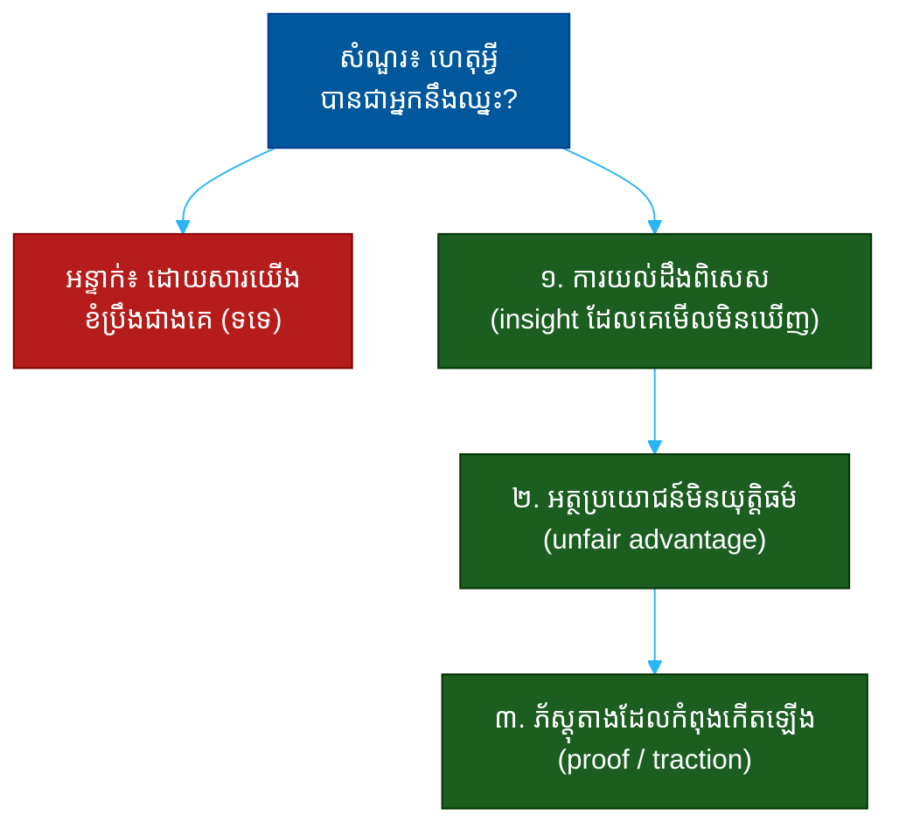

# "ហេតុអ្វីបានជាអ្នកនឹងឈ្នះ?" (Why Will You Win?)៖ សំណួរតែមួយដែលបង្ហាញពីយុទ្ធសាស្ត្រ ការយល់ដឹង និងភាពច្បាស់លាស់

**Author:** ichamrong  
**Date:** 2026-05-30  
**Tags:** #one-question #investor #vc #strategy #competition #conviction #fundraising  
**Category:** Concepts / One Question  
**Read Time:** ~12 min  

---

## 📌 មាតិកា (Table of Contents)
- [អន្ទាក់ (The Setup)](#the-setup)
- [១. សំណួរពិតប្រាកដ (What They Are Really Asking)](#1)
- [២. អ្វីដែលវាបង្ហាញអំពីអ្នក (The Hidden Signals)](#2)
- [៣. អន្ទាក់ — ចម្លើយខ្សោយ (The Trap: Weak Answers)](#3)
- [៤. នីតិវិធីឆ្លើយតប (The Response Procedure)](#4)
- [៥. ឧទាហរណ៍ចម្លើយខ្លាំង (Strong Sample Answer)](#5)
- [៦. សំណួរបន្ត និងរបៀបដោះស្រាយ (Follow-up Traps)](#6)
- [សេចក្តីសន្និដ្ឋាន (Conclusion)](#conclusion)
- [ឯកសារយោង (References)](#references)
- [អត្ថបទពាក់ព័ន្ធ (Related Posts)](#related-posts)

---

## អន្ទាក់ (The Setup) 

វិនិយោគិន (Investor) ផ្អែកខ្នង អង្គុយឱប ហើយសួរយ៉ាងស្ងប់ស្ងាត់ថា៖ **«ហេតុអ្វីបានជា *អ្នក* នឹងឈ្នះ?»**

គេមិនបានសួរថា «តើទីផ្សារនេះល្អទេ?» ឬ «តើផលិតផលនេះអស្ចារ្យទេ?» នោះទេ។ គេបានសង្កត់លើពាក្យ «អ្នក» — ក្នុងចំណោមក្រុមហ៊ុនរាប់រយ ដែលឃ្លានដូចគ្នា មានទីផ្សារដូចគ្នា ហេតុអ្វីបានជា *អ្នកនេះ* ដែលនឹងនៅរស់រាន ហើយដណ្តើមឈ្នះ?

ក្នុងរយៈពេលប៉ុន្មានវិនាទីនៃចម្លើយរបស់អ្នក គេអាចអានបាន៖
* តើអ្នកមាន **ការយល់ដឹងពិសេស** (unique insight) ឬគ្រាន់តែនិយាយតាមគេ?
* តើអ្នកដឹងពី **គូប្រកួត** (competitors) ពិតប្រាកដ ឬមើលឃើញតែខ្លួនឯង?
* តើ «ការឈ្នះ» របស់អ្នកផ្អែកលើ **យុទ្ធសាស្ត្រ** ឬគ្រាន់តែសង្ឃឹមថាការខំប្រឹងនឹងគ្រប់គ្រាន់?

នេះជាផែនទីបង្ហាញផ្លូវសម្រាប់ការឆ្លើយតបឲ្យបានល្អ៖

---

## ១. សំណួរពិតប្រាកដ (What They Are Really Asking) 

វិនិយោគិនមិនមែនកំពុងសុំ «ការអួត» ពីភាពពូកែរបស់អ្នកទេ។ គេមើលឃើញក្រុមហ៊ុនថ្មីៗរាប់រយ ដែលសុទ្ធតែគិតថាខ្លួនឯងពូកែ។ អ្វីដែលគេពិតជាសួរគឺ៖

> **«តើ​អ្នក​យល់​ច្បាស់​អំពី​ហេតុ​ផល​ដែល​ធ្វើ​ឲ្យ​អ្នក​ខុស​ពី​គេ ហើយ​ហេតុ​ផល​នោះ​នឹង​នៅ​តែ​ពិត​ក្នុង​៥​ឆ្នាំ​ខាង​មុខ​ដែរ​ឬ​ទេ?»**

«ការឈ្នះ» នៅក្នុងភាសារបស់វិនិយោគិន គឺមិនមែនមានន័យថា «ផលិតផលល្អ» នោះទេ។ វាមានន័យថា អ្នកមាន **អត្ថប្រយោជន៍ដែលរីកធំ** (compounding advantage) — អ្វីមួយដែលកាន់តែ​ខ្លាំង​ឡើង​នៅ​ពេល​អ្នក​រីក​ធំ ហើយ​ដែល​គូប្រកួត​ពិបាក​ចម្លង។

ដូច្នេះ សំណួរនេះវាស់ ៣ យ៉ាង៖
1. **ការយល់ដឹង (Insight)** — តើអ្នកដឹងអ្វីដែលគេមិនដឹង?
2. **យុទ្ធសាស្ត្រ (Strategy)** — តើអ្នកមើលឃើញផ្លូវឈ្នះច្បាស់ ឬគ្រាន់តែខំ?
3. **ការគោរពគូប្រកួត (Respect for rivals)** — តើអ្នកដឹងថាខ្លួនអ្នកប្រកួតនឹងអ្នកណា?

---

## ២. អ្វីដែលវាបង្ហាញអំពីអ្នក (The Hidden Signals) 

| សញ្ញាដែលគេអាន | ចម្លើយខ្សោយបង្ហាញ | ចម្លើយខ្លាំងបង្ហាញ |
| :--- | :--- | :--- |
| **ការយល់ដឹង (Insight)** | «ផលិតផលយើងល្អជាង» | «យើងដឹងថា X ខណៈគេនៅជឿ Y» |
| **យុទ្ធសាស្ត្រ (Strategy)** | «យើងខំប្រឹងជាងគេ» | «យើងឈ្នះតាមផ្លូវ Z ដែលគេចម្លងមិនបាន» |
| **ការគោរពគូប្រកួត** | «យើងគ្មានគូប្រកួត» | «គូប្រកួតពិតរបស់យើងគឺ A — ហើយនេះជារបៀបយើងលើស» |
| **ភាពធន់ (Durability)** | អត្ថប្រយោជន៍មួយដង | អត្ថប្រយោជន៍ដែលរីកធំតាមពេល |
| **ភ័ស្តុតាង (Proof)** | គ្រាន់តែទ្រឹស្តី | លេខ/ការទាក់ទាញ (traction) ដែលគាំទ្រ |

**ចំណុចសំខាន់៖** ការនិយាយ «យើងគ្មានគូប្រកួត» គឺជាសញ្ញាក្រហមធំបំផុត។ វាមិនបង្ហាញពីភាពពិសេសទេ — វាបង្ហាញថាអ្នកមិនបានស្វែងយល់ ឬទីផ្សារនោះគ្មាននរណាចង់បាន។

---

## ៣. អន្ទាក់ — ចម្លើយខ្សោយ (The Trap: Weak Answers) 

**អន្ទាក់ទី ១ — អ្នកខំប្រឹង (The Grinder):**
> «ដោយសារយើងខំប្រឹងជាងគេ ហើយយើងស្រឡាញ់អ្វីដែលយើងធ្វើ»

ហេតុអ្វីបរាជ័យ៖ ការខំប្រឹង មិនមែនជា​យុទ្ធសាស្ត្រ​ទេ។ គូប្រកួត​ទាំងអស់​ក៏​ខំ​ប្រឹង​ដែរ។ វា​មិន​ប្រាប់​ពី​អត្ថ​ប្រយោជន៍​ដែល​ការពារ​បាន​នោះ​ឡើយ។

**អន្ទាក់ទី ២ — អ្នកក្រអឺតក្រទម (The Lone Hero):**
> «យើងគ្មានគូប្រកួតទេ — យើងពិសេសតែម្នាក់ឯង»

ហេតុអ្វីបរាជ័យ៖ វា​បង្ហាញ​ការ​ខ្វះ​ការ​ស្រាវជ្រាវ។ វិនិយោគិន​ដឹង​ថា​គ្រប់​ទីផ្សារ​ល្អ​សុទ្ធតែ​មាន​អ្នក​ប្រកួត​ ឬ​ដៃ​គូ​ជំនួស (alternatives)។

**អន្ទាក់ទី ៣ — អ្នកមើលផលិតផល (The Feature Lister):**
> «ដោយសារផលិតផលយើងមានមុខងារ A, B, C ច្រើនជាងគេ»

ហេតុអ្វីបរាជ័យ៖ មុខងារ​អាច​ចម្លង​បាន​ក្នុង​រយៈ​ពេល​ខ្លី។ ការ​ឈ្នះ​មិន​មក​ពី​មុខងារ​ច្រើន​ជាង​ទេ — វា​មក​ពី​អត្ថ​ប្រយោជន៍​រចនាសម្ព័ន្ធ (structural advantage)។

---

## ៤. នីតិវិធីឆ្លើយតប (The Response Procedure) 

ចម្លើយខ្លាំងមាន **៣ ផ្នែក** តាមលំដាប់៖

**ជំហានទី ១ — ការយល់ដឹងពិសេស (The Unique Insight)**
ចាប់ផ្តើមដោយប្រាប់ពីអ្វីដែលអ្នកជឿ ប៉ុន្តែទីផ្សារភាគច្រើននៅមិនទាន់ជឿ។
> «យើង​ឈ្នះ​ដោយ​សារ​យើង​ដឹង​ថា [X] ខណៈ​អ្នក​ឯ​ទៀត​នៅ​តែ​សាង​សង់​លើ [Y]»

នេះបង្ហាញថាការឈ្នះរបស់អ្នកមាន **គ្រឹះនៃគំនិត** (a thesis) មិនមែនគ្រាន់តែ​ការ​សង្ឃឹម។

**ជំហានទី ២ — អត្ថប្រយោជន៍មិនយុត្តិធម៌ (The Unfair Advantage)**
បង្ហាញថា ហេតុអ្វីបានជាការយល់ដឹងនោះប្រែទៅជាអត្ថប្រយោជន៍ដែលគូប្រកួត **ចម្លងមិនបាន** ឬ **ចម្លងលំបាក**។
> «ហើយ​ដោយ​សារ​យើង​ផ្តើម​ពី [ប្រភព​ទិន្នន័យ / ការ​ចែកចាយ / បណ្តាញ​ឥទ្ធិពល] នេះ វា​នឹង​កាន់​តែ​ខ្លាំង​ឡើង​នៅ​ពេល​យើង​រីក​ធំ»

នេះបង្ហាញ **ភាពធន់** (durability)។

**ជំហានទី ៣ — ភ័ស្តុតាងដែលកំពុងកើតឡើង (Early Proof)**
បញ្ចប់ដោយលេខ ឬសញ្ញាតូចមួយ ដែលបង្ហាញថាគំនិតនេះកំពុងផ្ទៀងផ្ទាត់រួចហើយ។
> «យើង​ឃើញ​វា​ហើយ​ក្នុង​ការ​ពិត — [អត្រា​រក្សា​អតិថិជន / ការ​លូតលាស់ / អ្វី​មួយ​ជាក់​ស្តែង]»

នេះប្រែ​ការ​អះអាង​ទៅ​ជា​ភ័ស្តុតាង។

---

## ៥. ឧទាហរណ៍ចម្លើយខ្លាំង (Strong Sample Answer) 

> **«យើង​ឈ្នះ​ដោយ​សារ​យើង​ផ្តើម​ពី​ផ្នែក​ដែល​អ្នក​ឯ​ទៀត​មិន​ចង់​ប៉ះ — អតិថិជន​តូចៗ។ ពួក​គេ​ខ្លាច​ការ​ចំណាយ​ខ្ពស់​ក្នុង​ការ​ទាញ​អតិថិជន​ប្រភេទ​នេះ ប៉ុន្តែ​យើង​បាន​សាង​ផ្លូវ​ចែកចាយ​ដោយ​ស្វ័យ​ប្រវត្តិ​ដែល​ធ្វើ​ឲ្យ​ការ​ចំណាយ​នោះ​ស្ទើរ​តែ​សូន្យ។ រាល់​អតិថិជន​ថ្មី​ធ្វើ​ឲ្យ​ផ្លូវ​នេះ​កាន់​តែ​មាន​ប្រសិទ្ធភាព — នេះ​ជា​អត្ថ​ប្រយោជន៍​ដែល​រីក​ធំ។ ៦​ខែ​ចុង​ក្រោយ ការ​ចំណាយ​ទាញ​អតិថិជន​របស់​យើង​ធ្លាក់​ចុះ ៤០% ខណៈ​អតិថិជន​កើន​ឡើង​ទ្វេ​ដង។»**

**ការវិភាគ (Breakdown):**
* «យើងផ្តើមពីផ្នែកដែលគេមិនចង់ប៉ះ» → ការយល់ដឹងពិសេស (insight)
* «បានសាងផ្លូវចែកចាយស្វ័យប្រវត្តិ» → អត្ថប្រយោជន៍ (advantage)
* «រាល់អតិថិជនថ្មីធ្វើឲ្យកាន់តែខ្លាំង» → ភាពធន់ដែលរីកធំ (durability)
* «ការចំណាយធ្លាក់ ៤០%... កើនទ្វេដង» → ភ័ស្តុតាង (proof)

**ប្រៀបធៀប៖**
* ❌ ខ្សោយ៖ «យើងខំប្រឹងជាងគេ»
* ✅ ខ្លាំង៖ ចម្លើយ ៣ ផ្នែកខាងលើ — insight, advantage, proof

---

## ៦. សំណួរបន្ត និងរបៀបដោះស្រាយ (Follow-up Traps) 

វិនិយោគិនល្អនឹងសួរបន្ត ដើម្បីសាកល្បងថាអត្ថប្រយោជន៍របស់អ្នកពិតប្រាកដ ឬគ្រាន់តែជារឿងនិទាន៖

**«ចុះបើ [គូប្រកួតធំ] ចម្លងអ្នកមកស្អែក?» (What if a giant copies you?)**
> កុំ​អះអាង​ថា​គេ​ចម្លង​មិន​បាន។ ឆ្លើយ​ដោយ​ភាព​ច្បាស់​លាស់៖ «ពួក​គេ​អាច​ចម្លង​មុខងារ​បាន ប៉ុន្តែ​ពួក​គេ​មិន​អាច​ចម្លង [បណ្តាញ​ទិន្នន័យ / ការ​ផ្តោត / ល្បឿន​យើង] បាន​ទេ — ហើយ​ការ​ចម្លង​នឹង​ប៉ះ​ពាល់​អាជីវកម្ម​ស្នូល​របស់​គេ»។

**«តើអ្នកប្រាកដថា insight របស់អ្នកត្រឹមត្រូវ?» (How do you know your insight is right?)**
> ភ្ជាប់​ត្រឡប់​ទៅ​ភ័ស្តុតាង៖ «ខ្ញុំ​មិន​ប្រាកដ ១០០% ទេ — ប៉ុន្តែ​ទិន្នន័យ​ដំបូង​កំពុង​គាំទ្រ​វា ហើយ​នេះ​ជា​អ្វី​ដែល​យើង​នឹង​សាក​ល្បង​បន្ត»។

**ច្បាប់មាស៖** រាល់សំណួរបន្ត គឺជាការសាកល្បងថាតើ «អត្ថប្រយោជន៍» របស់អ្នកជារចនាសម្ព័ន្ធ (structural) ឬគ្រាន់តែជាការនិយាយ។ បើអ្នកស្គាល់ការប្រកួតពិតៗ អ្នកនឹងឆ្លើយបានដោយស្ងប់ស្ងាត់។

---

## សេចក្តីសន្និដ្ឋាន (Conclusion) 

សំណួរ «ហេតុអ្វីបានជាអ្នកនឹងឈ្នះ?» មិនមែនជាការសុំឲ្យអ្នកអួតទេ។ វាជា **តេស្តនៃភាពច្បាស់លាស់នៃយុទ្ធសាស្ត្រ**។

ចងចាំរូបមន្ត ៣ ផ្នែក៖
1. **ការយល់ដឹងពិសេស** (យើងដឹង X ខណៈគេជឿ Y)
2. **អត្ថប្រយោជន៍មិនយុត្តិធម៌** (ដែលរីកធំតាមពេល)
3. **ភ័ស្តុតាងដំបូង** (កំពុងផ្ទៀងផ្ទាត់)

ការ​ឈ្នះ​ដែល​ផ្អែក​លើ​យុទ្ធសាស្ត្រ​ និង​ការ​គោរព​គូប្រកួត — នោះ​ជា​អ្វី​ដែល​បង្ហាញ​ថា​អ្នក​យល់​ច្បាស់​ពី​ល្បែង​ដែល​អ្នក​កំពុង​លេង។

---

## ឯកសារយោង (References) 

- *Zero to One* — Peter Thiel
- *7 Powers: The Foundations of Business Strategy* — Hamilton Helmer
- *Competitive Strategy* — Michael Porter

---

## អត្ថបទពាក់ព័ន្ធ (Related Posts) 

- [What Is Your Moat? (របាំងការពារ)](02-what-is-your-moat.md)
- [How Big Can This Get? (ទំហំទីផ្សារ)](03-how-big-can-this-get.md)
- [One Question Index](../README.md)
