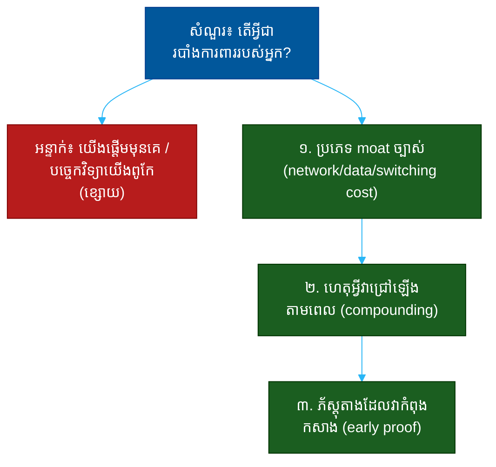

# "តើអ្វីជារបាំងការពាររបស់អ្នក?" (What Is Your Moat?)៖ សំណួរតែមួយដែលបង្ហាញពីភាពធន់ យុទ្ធសាស្ត្រ និងការគិតរយៈពេលវែង

**Author:** ichamrong  
**Date:** 2026-05-30  
**Tags:** #one-question #investor #vc #moat #defensibility #strategy #competition  
**Category:** Concepts / One Question  
**Read Time:** ~12 min  

---

## 📌 មាតិកា (Table of Contents)
- [អន្ទាក់ (The Setup)](#the-setup)
- [១. សំណួរពិតប្រាកដ (What They Are Really Asking)](#1)
- [២. អ្វីដែលវាបង្ហាញអំពីអ្នក (The Hidden Signals)](#2)
- [៣. អន្ទាក់ — ចម្លើយខ្សោយ (The Trap: Weak Answers)](#3)
- [៤. នីតិវិធីឆ្លើយតប (The Response Procedure)](#4)
- [៥. ឧទាហរណ៍ចម្លើយខ្លាំង (Strong Sample Answer)](#5)
- [៦. សំណួរបន្ត និងរបៀបដោះស្រាយ (Follow-up Traps)](#6)
- [សេចក្តីសន្និដ្ឋាន (Conclusion)](#conclusion)
- [ឯកសារយោង (References)](#references)
- [អត្ថបទពាក់ព័ន្ធ (Related Posts)](#related-posts)

---

## អន្ទាក់ (The Setup) 

វិនិយោគិន (VC) ងក់ក្បាលឲ្យអ្នកនៅពេលអ្នកនិយាយពីការលូតលាស់ ហើយបន្ទាប់មកសួរថា៖ **«តើអ្វីជារបាំងការពាររបស់អ្នក? (What is your moat?)»**

ពាក្យ «moat» (គូទឹកព័ទ្ធជុំវិញប្រាសាទ) គឺជាការប្រៀបធៀប — អ្វីដែលការពារ «ប្រាសាទ» (អាជីវកម្ម) របស់អ្នកពីការវាយប្រហារ។ វិនិយោគិនមិនបារម្ភថាអ្នកអាចចាប់ផ្តើមបានទេ — គេបារម្ភថា **នៅពេលអ្នកជោគជ័យ តើនរណានឹងលួចយកវាពីអ្នក?**

ក្នុងចម្លើយរបស់អ្នក គេកំពុងស្តាប់៖
* តើអ្នកដឹងពីភាពខុសគ្នារវាង **ភាពនាំមុខបណ្តោះអាសន្ន** (a head start) និង **របាំងពិត** (a real moat)?
* តើ​អ្នក​គិត​ពី​អនាគត​ ៥-១០​ឆ្នាំ ឬ​គ្រាន់​តែ​ត្រី​មាស​បន្ទាប់?
* តើ​អ្នក​យល់​ថា «moat» ដ៏​ល្អ​បំផុត​គឺ​មួយ​ដែល​កាន់​តែ​ជ្រៅ​ឡើង​នៅ​ពេល​អ្នក​រីក​ធំ?

នេះជាផែនទីបង្ហាញផ្លូវសម្រាប់ការឆ្លើយតបឲ្យបានល្អ៖

---

## ១. សំណួរពិតប្រាកដ (What They Are Really Asking) 

វិនិយោគិនមិនមែនកំពុងសុំ​បញ្ជី​បច្ចេកវិទ្យា​របស់​អ្នក​ទេ។ អ្វីដែលគេពិតជាសួរគឺ៖

> **«នៅ​ពេល​អ្នក​បង្ហាញ​ថា​ទីផ្សារ​នេះ​មាន​តម្លៃ ហើយ​អ្នក​ឯ​ទៀត​ហូរ​ចូល​មក — តើ​អ្វី​នឹង​ការ​ពារ​អ្នក​មិន​ឲ្យ​ត្រូវ​គេ​លុប?»**

«moat» ពិតប្រាកដ មាន​លក្ខណៈ​ ៣៖ វា​ **ការពារ​បាន** (defensible), វា​ **ជ្រៅ​ឡើង​តាម​ពេល** (compounding), ហើយ​វា​ **ពិបាក​ចម្លង** (hard to copy)។ ប្រភេទ moat ដែលជឿទុកចិត្តបាន រួមមាន៖
- **ឥទ្ធិពលបណ្តាញ (Network effects)** — អ្នកប្រើកាន់តែច្រើន តម្លៃកាន់តែខ្ពស់
- **ថ្លៃនៃការប្តូរ (Switching costs)** — អតិថិជនពិបាកចាកចេញ
- **អត្ថប្រយោជន៍ទិន្នន័យ (Data advantage)** — ទិន្នន័យកាន់តែច្រើន ផលិតផលកាន់តែឆ្លាត
- **សេដ្ឋកិច្ចមាត្រដ្ឋាន (Economies of scale)** — ធំជាង = ថោកជាង
- **ម៉ាក និងការទុកចិត្ត (Brand & trust)**

ដូច្នេះ សំណួរនេះវាស់ ៣ យ៉ាង៖
1. **ការយល់ដឹងពីយុទ្ធសាស្ត្រ (Strategic literacy)** — តើអ្នកដឹងថា moat ពិតមើលទៅយ៉ាងណា?
2. **ការគិតរយៈពេលវែង (Long-term thinking)** — តើអ្នកគិតពី ៥ ឆ្នាំ?
3. **ភាពស្មោះត្រង់ (Honesty)** — តើអ្នកទទួលស្គាល់ថា moat នៅខ្សោយ ប៉ុន្តែមានផែនការ?

---

## ២. អ្វីដែលវាបង្ហាញអំពីអ្នក (The Hidden Signals) 

| សញ្ញាដែលគេអាន | ចម្លើយខ្សោយបង្ហាញ | ចម្លើយខ្លាំងបង្ហាញ |
| :--- | :--- | :--- |
| **ប្រភេទ moat** | «បច្ចេកវិទ្យាយើងពូកែ» | «ឥទ្ធិពលបណ្តាញ / ថ្លៃប្តូរ / ទិន្នន័យ» |
| **ភាពធន់ (Durability)** | moat តែមួយដង | moat ដែលជ្រៅឡើងតាមពេល |
| **ការគិតពេលវេលា** | ផ្តោតលើថ្ងៃនេះ | ផ្តោតលើ ៥ ឆ្នាំ |
| **ភាពស្មោះត្រង់** | អះអាងថា moat រឹងមាំហើយ | «moat នៅខ្ចី តែនេះជាផែនការ» |
| **ការយល់ដឹង** | យល់ច្រឡំ head start = moat | ដឹងថា head start មិនមែន moat |

**ចំណុចសំខាន់៖** ការ​ផ្តើម​មុន​គេ (first-mover advantage) **មិន​មែន​ជា moat ទេ** — វា​គ្រាន់​តែ​ជា​ភាព​នាំ​មុខ​បណ្តោះ​អាសន្ន។ moat ពិត​ត្រូវ​តែ​ជា​អ្វី​ដែល​កាន់​តែ​រឹង​មាំ​នៅ​ពេល​ដៃ​គូ​ប្រកួត​ព្យាយាម​តាម​ទាន់។

---

## ៣. អន្ទាក់ — ចម្លើយខ្សោយ (The Trap: Weak Answers) 

**អន្ទាក់ទី ១ — អ្នកនាំមុខ (The First Mover):**
> «យើងជាក្រុមហ៊ុនទីមួយដែលធ្វើរឿងនេះ»

ហេតុអ្វីបរាជ័យ៖ ការ​ផ្តើម​មុន​មិន​ការ​ពារ​អ្នក​ទេ។ ប្រវត្តិសាស្ត្រ​ពោរ​ពេញ​ដោយ​ក្រុមហ៊ុន​ទីមួយ​ដែល​ត្រូវ​ក្រុមហ៊ុន​ទីពីរ​លុប (search engines មុន Google, social networks មុន Facebook)។

**អន្ទាក់ទី ២ — អ្នកមោទនៈបច្ចេកវិទ្យា (The Tech Believer):**
> «បច្ចេកវិទ្យាយើងស្មុគស្មាញ — គេចម្លងពិបាក»

ហេតុអ្វីបរាជ័យ៖ បច្ចេកវិទ្យា​ស្ទើរ​តែ​តែង​តែ​អាច​ចម្លង​បាន ឬ​ត្រូវ​បាន​ជំនួស។ វា​កម្រ​ជា moat ដែល​ស្ថិត​ស្ថេរ​ឡើយ លុះត្រា​តែ​មាន​ភ្ជាប់​នឹង​ទិន្នន័យ​ឬ​បណ្តាញ។

**អន្ទាក់ទី ៣ — អ្នកប្រកែក (The Denier):**
> «យើងពិបាកត្រូវចម្លងណាស់ ដោយសារក្រុមយើងពូកែ»

ហេតុអ្វីបរាជ័យ៖ ក្រុម​ល្អ​ជា​ការ​ចាំ​បាច់ ប៉ុន្តែ​មិន​មែន​ជា moat — គូប្រកួត​អាច​ជួល​មនុស្ស​ល្អ​ដូច​គ្នា។ វា​បង្ហាញ​ការ​ខ្វះ​ការ​យល់​ដឹង​ពី​យុទ្ធសាស្ត្រ។

---

## ៤. នីតិវិធីឆ្លើយតប (The Response Procedure) 

ចម្លើយខ្លាំងមាន **៣ ផ្នែក** តាមលំដាប់៖

**ជំហានទី ១ — ដាក់ឈ្មោះ moat ឲ្យច្បាស់ (Name the Mechanism)**
កុំនិយាយទូទៅ។ ដាក់ឈ្មោះប្រភេទ moat ជាក់លាក់។
> «moat ស្នូល​របស់​យើង​គឺ [ឥទ្ធិពល​បណ្តាញ / ថ្លៃ​ប្តូរ / អត្ថ​ប្រយោជន៍​ទិន្នន័យ]»

នេះបង្ហាញ **ការយល់ដឹងពីយុទ្ធសាស្ត្រ**។

**ជំហានទី ២ — ពន្យល់ការរីកធំ (Explain the Compounding)**
បង្ហាញ​ហេតុ​អ្វី​បាន​ជា moat នេះ​កាន់​តែ​ជ្រៅ​ឡើង​នៅ​ពេល​អ្នក​រីក​ធំ — មិន​មែន​ស្ថិត​នឹង​ឬ​រឹប​អូស​ខ្សោយ​ឡើង។
> «រាល់​អតិថិជន​ថ្មី​ធ្វើ​ឲ្យ​ផលិតផល​មាន​តម្លៃ​បន្ថែម​សម្រាប់​អតិថិជន​ដែល​មាន​ស្រាប់ — ដូច្នេះ​គូប្រកួត​ត្រូវ​ដេញ​តាម​គោល​ដៅ​ដែល​កំពុង​រត់​ឆ្ងាយ»

នេះបង្ហាញ **ការគិតរយៈពេលវែង**។

**ជំហានទី ៣ — ភ័ស្តុតាងដែលវាកំពុងកសាង (Show Early Proof)**
បង្ហាញសញ្ញាដែល moat កំពុងចាប់ផ្តើមកើតឡើង — ឬ ស្មោះត្រង់ថាវានៅខ្ចី តែមានផែនការ។
> «យើង​ឃើញ​វា​ហើយ​ក្នុង [អត្រា​រក្សា​អតិថិជន​ខ្ពស់​ឡើង / ការ​ប្រើ​ប្រាស់​ស៊ីជម្រៅ]»

នេះប្រែ​ការ​អះអាង​ទៅ​ជា​ភ័ស្តុតាង។

---

## ៥. ឧទាហរណ៍ចម្លើយខ្លាំង (Strong Sample Answer) 

> **«moat ស្នូល​របស់​យើង​គឺ​អត្ថ​ប្រយោជន៍​ទិន្នន័យ​ដែល​ភ្ជាប់​នឹង​ថ្លៃ​ប្តូរ។ រាល់​ប្រតិបត្តិការ​ដែល​អតិថិជន​ធ្វើ បង្រៀន​ម៉ូដែល​យើង​ឲ្យ​ផ្តល់​ការ​ណែ​នាំ​ល្អ​ជាង — ដូច្នេះ​អតិថិជន​ដែល​នៅ​ជា​មួយ​យើង​យូរ​ ទទួល​បាន​ផលិតផល​ដែល​ល្អ​ជាង​អ្នក​ថ្មី​ៗ។ ការ​ផ្ទេរ​ទិន្នន័យ​ប្រវត្តិ​ទាំង​នេះ​ទៅ​គូប្រកួត​ស្ទើរ​តែ​មិន​អាច​ធ្វើ​ទៅ​បាន។ យើង​ឃើញ​វា​ហើយ — អតិថិជន​ដែល​នៅ​លើស ៦​ខែ មាន​អត្រា​ចាក​ចេញ​តិច​ជាង ៣​ដង​បើ​ធៀប​នឹង​អ្នក​ថ្មី។ moat នេះ​នៅ​តូច​ថ្ងៃ​នេះ ប៉ុន្តែ​វា​ជ្រៅ​ឡើង​រាល់​ខែ។»**

**ការវិភាគ (Breakdown):**
* «អត្ថប្រយោជន៍ទិន្នន័យ ភ្ជាប់នឹងថ្លៃប្តូរ» → ដាក់ឈ្មោះ moat ច្បាស់ (mechanism)
* «អតិថិជននៅយូរ ទទួលផលិតផលល្អជាង» → ការរីកធំ (compounding)
* «អត្រាចាកចេញតិចជាង ៣ ដង» → ភ័ស្តុតាង (proof)
* «moat នេះនៅតូច ប៉ុន្តែជ្រៅឡើង» → ភាពស្មោះត្រង់ (honesty)

**ប្រៀបធៀប៖**
* ❌ ខ្សោយ៖ «យើងជាក្រុមហ៊ុនទីមួយ»
* ✅ ខ្លាំង៖ ចម្លើយ ៣ ផ្នែកខាងលើ — mechanism, compounding, proof

---

## ៦. សំណួរបន្ត និងរបៀបដោះស្រាយ (Follow-up Traps) 

វិនិយោគិនល្អនឹងសួរបន្ត ដើម្បីសាកល្បងថា moat របស់អ្នកពិត ឬគ្រាន់តែជាពាក្យ៖

**«ចុះបើគូប្រកួតមានទិន្នន័យច្រើនជាងអ្នករួចហើយ?» (What if a rival already has more data?)**
> កុំ​ប្រកែក​ការ​ពិត។ ឆ្លើយ​ដោយ​ភាព​ច្បាស់​លាស់៖ «ទិន្នន័យ​ទូទៅ​របស់​គេ​ច្រើន​មែន ប៉ុន្តែ​ទិន្នន័យ​យើង​ស៊ី​ជម្រៅ​ក្នុង [ផ្នែក​ជាក់​លាក់] ដែល​ជា​កន្លែង​ដែល​ការ​សម្រេច​ចិត្ត​សំខាន់​បំផុត»។

**«ហេតុអ្វី Google/Amazon មិនធ្វើរឿងនេះ?» (Why won't a giant just do this?)**
> «វា​ប៉ះ​ពាល់​អាជីវកម្ម​ស្នូល​របស់​គេ ឬ​វា​តូច​ពេក​សម្រាប់​គេ​ឥឡូវ​នេះ — តែ​នៅ​ពេល​វា​ធំ​ល្មម​ឲ្យ​គេ​ចាប់​អារម្មណ៍ moat យើង​នឹង​ជ្រៅ​រួច​ហើយ»។

**ច្បាប់មាស៖** រាល់សំណួរបន្ត គឺជាការសាកល្បងថា moat របស់អ្នកជ្រៅឡើង (compounds) ឬស្ថិតនឹង។ បើអ្នកដឹងពីយន្តការពិតៗ អ្នកនឹងឆ្លើយបានយ៉ាងម៉ឺងម៉ាត់។

---

## សេចក្តីសន្និដ្ឋាន (Conclusion) 

សំណួរ «តើអ្វីជារបាំងការពាររបស់អ្នក?» គឺជា **តេស្តនៃការគិតរយៈពេលវែង**។ វាញែកស្ថាបនិកដែលគិតពីត្រីមាសបន្ទាប់ ចេញពីអ្នកដែលគិតពីទសវត្សរ៍បន្ទាប់។

ចងចាំរូបមន្ត ៣ ផ្នែក៖
1. **ដាក់ឈ្មោះ moat ច្បាស់** (network / data / switching cost)
2. **ពន្យល់ការរីកធំ** (ហេតុអ្វីវាជ្រៅឡើងតាមពេល)
3. **ភ័ស្តុតាងដំបូង** (កំពុងកសាង)

moat ល្អ​បំផុត​មិន​មែន​ជា​ជញ្ជាំង​ខ្ពស់​មួយ​ដែល​អ្នក​សង់​ហើយ​បញ្ចប់​ទេ — វា​ជា​គូ​ទឹក​ដែល​កាន់​តែ​ជ្រៅ​ឡើង​រាល់​ថ្ងៃ​ដែល​អ្នក​ដំណើរ​ការ។

---

## ឯកសារយោង (References) 

- *7 Powers: The Foundations of Business Strategy* — Hamilton Helmer
- *Zero to One* — Peter Thiel
- *The Innovator's Dilemma* — Clayton Christensen

---

## អត្ថបទពាក់ព័ន្ធ (Related Posts) 

- [Why Will You Win? (ហេតុអ្វីអ្នកនឹងឈ្នះ)](01-why-will-you-win.md)
- [What Could Kill This Company? (ហានិភ័យ)](04-what-could-kill-this-company.md)
- [One Question Index](../README.md)
