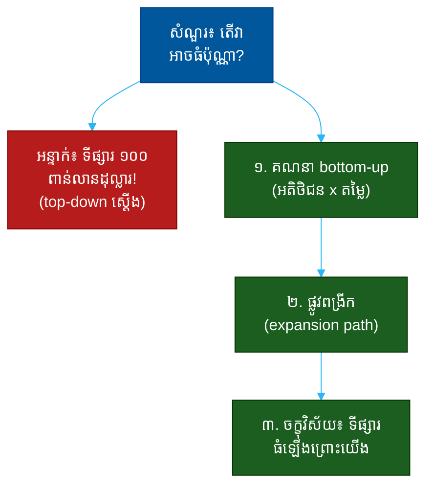

# "តើវាអាចធំប៉ុណ្ណា?" (How Big Can This Get?)៖ សំណួរតែមួយដែលបង្ហាញពីមហិច្ឆតា ការគិតពីទីផ្សារ និងភាពស្មោះត្រង់

**Author:** ichamrong  
**Date:** 2026-05-30  
**Tags:** #one-question #investor #vc #market-size #tam #ambition #fundraising  
**Category:** Concepts / One Question  
**Read Time:** ~12 min  

---

## 📌 មាតិកា (Table of Contents)
- [អន្ទាក់ (The Setup)](#the-setup)
- [១. សំណួរពិតប្រាកដ (What They Are Really Asking)](#1)
- [២. អ្វីដែលវាបង្ហាញអំពីអ្នក (The Hidden Signals)](#2)
- [៣. អន្ទាក់ — ចម្លើយខ្សោយ (The Trap: Weak Answers)](#3)
- [៤. នីតិវិធីឆ្លើយតប (The Response Procedure)](#4)
- [៥. ឧទាហរណ៍ចម្លើយខ្លាំង (Strong Sample Answer)](#5)
- [៦. សំណួរបន្ត និងរបៀបដោះស្រាយ (Follow-up Traps)](#6)
- [សេចក្តីសន្និដ្ឋាន (Conclusion)](#conclusion)
- [ឯកសារយោង (References)](#references)
- [អត្ថបទពាក់ព័ន្ធ (Related Posts)](#related-posts)

---

## អន្ទាក់ (The Setup) 

វិនិយោគិន (VC) ផ្អៀងមកមុខ ហើយសួរថា៖ **«តើវាអាចធំប៉ុណ្ណា? (How big can this get?)»**

នេះ​ជា​សំណួរ​ដែល​មាន​អន្ទាក់​ពីរ​ផ្នែក​ផ្ទុយ​គ្នា។ បើ​អ្នក​និយាយ​លេខ​តូច​ពេក វិនិយោគិន​បែប VC នឹង​បាត់​ចំណាប់​អារម្មណ៍ — ម៉ូដែល​របស់​គេ​ត្រូវ​ការ​ការ​លូត​លាស់​ដ៏​ធំ។ តែ​បើ​អ្នក​បោះ​លេខ​ធំ​ស្តើង​ៗ ដោយ​គ្មាន​មូលដ្ឋាន គេ​នឹង​ដឹង​ភ្លាម​ថា​អ្នក​មិន​យល់​ពី​ទីផ្សារ​របស់​ខ្លួន។

ក្នុងចម្លើយរបស់អ្នក គេកំពុងស្តាប់៖
* តើ​អ្នក​មាន **មហិច្ឆតា** គ្រប់​គ្រាន់​សម្រាប់​ការ​លូត​លាស់​ដ៏​ធំ?
* តើ​អ្នក​បាន​លេខ​នោះ​មក​ដោយ​ **ការ​គណនា​ពី​ខាង​ក្រោម​ឡើង​លើ** (bottom-up) ឬ​គ្រាន់​តែ​លើក​លេខ​ឧស្សាហកម្ម​ដ៏​ធំ?
* តើ​អ្នក​យល់​ពី​ភាព​ខុស​គ្នា​រវាង **ទីផ្សារ​សព្វ​ថ្ងៃ** និង **ទីផ្សារ​នៅ​ពេល​ដែល​ផលិតផល​នេះ​ផ្លាស់​ប្តូរ​ឥរិយាបថ**?

នេះជាផែនទីបង្ហាញផ្លូវសម្រាប់ការឆ្លើយតបឲ្យបានល្អ៖

---

## ១. សំណួរពិតប្រាកដ (What They Are Really Asking) 

វិនិយោគិនមិនមែនកំពុងសុំ​លេខ​ដ៏​ត្រឹម​ត្រូវ​ទេ — គ្មាន​នរណា​អាច​ទស្សន៍​ទាយ​ទីផ្សារ​បាន​ច្បាស់​នោះ​ឡើយ។ អ្វីដែលគេពិតជាសួរគឺ៖

> **«បើ​អ្វី​ៗ​ដំណើរ​ការ​ត្រឹម​ត្រូវ តើ​នេះ​អាច​ក្លាយ​ជា​ក្រុមហ៊ុន​ដ៏​ធំ​ដែរ​ឬ​ទេ — ហើយ​តើ​អ្នក​យល់​ច្បាស់​ពី​ផ្លូវ​ទៅ​ដល់​ទី​នោះ​ដែរ​ឬ​ទេ?»**

ម៉ូដែល​អាជីវកម្ម​របស់ VC ត្រូវ​ការ​«លទ្ធផល​ដ៏​ធំ» (outsized outcomes) — ការ​វិនិយោគ​មួយ​ត្រូវ​អាច​សង​វិញ​ទាំង​មូលនិធិ។ ដូច្នេះ TAM (Total Addressable Market — ទីផ្សារ​សរុប​ដែល​អាច​ឈាន​ដល់) ត្រូវ​តែ​ធំ​ល្មម។ ប៉ុន្តែ​ការ​ដែល​ TAM ធំ​មិន​មាន​ន័យ​អ្វី បើ​អ្នក​មិន​អាច​ពន្យល់​ផ្លូវ​ដែល​អ្នក​នឹង​ដណ្តើម​យក​វា​បាន​ច្បាស់។

ដូច្នេះ សំណួរនេះវាស់ ៣ យ៉ាង៖
1. **មហិច្ឆតា (Ambition)** — តើអ្នកគិតធំ ឬគិតតូច?
2. **ភាពម៉ត់ចត់ (Rigor)** — តើលេខរបស់អ្នកមកពីណា?
3. **ការគិតពីទីផ្សារ (Market thinking)** — តើអ្នកមើលឃើញពីការពង្រីក?

---

## ២. អ្វីដែលវាបង្ហាញអំពីអ្នក (The Hidden Signals) 

| សញ្ញាដែលគេអាន | ចម្លើយខ្សោយបង្ហាញ | ចម្លើយខ្លាំងបង្ហាញ |
| :--- | :--- | :--- |
| **ប្រភពលេខ** | លេខ top-down ស្តើង (% នៃទីផ្សារធំ) | គណនា bottom-up (អតិថិជន x តម្លៃ) |
| **មហិច្ឆតា** | គិតតូចពេក | គិតធំ តែមានមូលដ្ឋាន |
| **ការពង្រីក** | ផលិតផលតែមួយ | ផ្លូវ៖ ផលិតផល → ផ្នែក → ភូមិសាស្ត្រ |
| **ភាពស្មោះត្រង់** | លេខ TAM មិនពិត | ទទួលថា TAM ថ្ងៃនេះតូច តែនឹងធំ |
| **ចក្ខុវិស័យ** | «យើងយក ១% នៃ X» | «យើងធ្វើឲ្យទីផ្សារនេះធំឡើង» |

**ចំណុចសំខាន់៖** ចម្លើយ «យើង​គ្រាន់​តែ​ត្រូវ​ការ ១% នៃ​ទីផ្សារ ១០០​ពាន់​លាន​ដុល្លារ» គឺ​ជា​សញ្ញា​ក្រហម​ដ៏​ល្បី។ វា​បង្ហាញ​ការ​គិត​ខ្ជិល — គ្មាន​នរណា​ដឹង​ថា​«១%» នោះ​មក​ពី​ណា ឬ​របៀប​ដណ្តើម​យក​វា។

---

## ៣. អន្ទាក់ — ចម្លើយខ្សោយ (The Trap: Weak Answers) 

**អន្ទាក់ទី ១ — អ្នកលេខ ១% (The 1% Fallacy):**
> «ទីផ្សារនេះធំ ១០០ ពាន់លានដុល្លារ — យើងគ្រាន់តែត្រូវការ ១%»

ហេតុអ្វីបរាជ័យ៖ វា​ជា​ការ​គណនា​ពី​លើ​ចុះ​ក្រោម (top-down) ដ៏​ខ្ជិល។ វា​មិន​ប្រាប់​ពី​អតិថិជន​ពិត​ប្រាកដ ឬ​របៀប​ឈាន​ដល់​ពួក​គេ​នោះ​ឡើយ។

**អន្ទាក់ទី ២ — អ្នកគិតតូច (The Modest One):**
> «យើងគិតថាអាចបាន​ប្រាក់​ចំណូល​ប៉ុន្មាន​លាន​ដុល្លារ​ក្នុង​ផ្នែក​តូច​នេះ»

ហេតុអ្វីបរាជ័យ៖ វា​ប្រហែល​ជា​ស្មោះ​ត្រង់ ប៉ុន្តែ​សម្រាប់ VC វា​មិន​ស្រប​នឹង​ម៉ូដែល​របស់​គេ។ បើ​ការ​លូត​លាស់​អតិបរមា​តូច​ពេក គេ​នឹង​ឆ្លង​កាត់។

**អន្ទាក់ទី ៣ — អ្នកសុបិន្ត (The Fantasist):**
> «វាអាចធំជា​ Google មួយ​ថ្ងៃ!»

ហេតុអ្វីបរាជ័យ៖ មហិច្ឆតា​ដោយ​គ្មាន​ផ្លូវ ឬ​លេខ​គាំ​ទ្រ បង្ហាញ​ការ​ខ្វះ​ភាព​ម៉ត់​ចត់។ វា​ស្តាប់​ទៅ​ដូច​ការ​សុបិន្ត មិន​មែន​ផែនការ។

---

## ៤. នីតិវិធីឆ្លើយតប (The Response Procedure) 

ចម្លើយខ្លាំងមាន **៣ ផ្នែក** តាមលំដាប់៖

**ជំហានទី ១ — គណនាពីខាងក្រោមឡើងលើ (Bottom-Up Math)**
ចាប់ផ្តើមពីអតិថិជនពិត × តម្លៃ × ចំនួន។
> «មាន​អតិថិជន​ប្រភេទ​នេះ​ប្រហែល [X លាន​នាក់] ហើយ​ពួក​គេ​ចំណាយ​ប្រហែល [Y ដុល្លារ/ឆ្នាំ] លើ​បញ្ហា​នេះ — ដូច្នេះ​ទីផ្សារ​ស្នូល​គឺ [X × Y]»

នេះបង្ហាញ **ភាពម៉ត់ចត់**។

**ជំហានទី ២ — បង្ហាញផ្លូវពង្រីក (Show the Expansion Path)**
បន្ទាប់​មក​ពន្យល់​ថា​ ទីផ្សារ​ស្នូល​នោះ​គ្រាន់​តែ​ជា​ច្រក​ចូល — ហើយ​អ្នក​នឹង​ពង្រីក​ទៅ​ផលិតផល/ផ្នែក/តំបន់​ផ្សេង​ទៀត​ដោយ​របៀប​ណា។
> «ពី​ច្រក​ចូល​នេះ យើង​ពង្រីក​ទៅ [ផលិតផល​ទី​ពីរ / ផ្នែក​ជាប់​គ្នា] ដែល​ធ្វើ​ឲ្យ TAM ឈាន​ដល់ [លេខ​ធំ​ជាង]»

នេះបង្ហាញ **ការគិតពីទីផ្សារ** និងបណ្តើរ​ៗ​ប្តូរ​លេខ​តូច​ទៅ​លេខ​ធំ​ដោយ​ហេតុ​ផល។

**ជំហានទី ៣ — ចក្ខុវិស័យ៖ ទីផ្សារធំឡើងព្រោះអ្នក (Market Creation)**
បញ្ចប់​ដោយ​ការ​បង្ហាញ​ថា​ ផលិតផល​ល្អ​បំផុត​មិន​គ្រាន់​តែ​ដណ្តើម​ទីផ្សារ​ដែល​មាន​ស្រាប់ — វា​ធ្វើ​ឲ្យ​ទីផ្សារ​នោះ​ធំ​ឡើង។
> «ហើយ​នៅ​ពេល​ការ​ប្រើ​ប្រាស់​ងាយ​ស្រួល​ឡើង មនុស្ស​ដែល​មិន​ដែល​បាន​ប្រើ​ពី​មុន​នឹង​ចូល​មក — ទីផ្សារ​ផ្ទាល់​នឹង​ធំ​ឡើង»

នេះបង្ហាញ **មហិច្ឆតាដែលមានមូលដ្ឋាន**។

---

## ៥. ឧទាហរណ៍ចម្លើយខ្លាំង (Strong Sample Answer) 

> **«ចូរ​ខ្ញុំ​គណនា​ពី​ខាង​ក្រោម​ឡើង​លើ។ មាន​អាជីវកម្ម​តូច​ប្រហែល ៣​លាន​នៅ​តំបន់​យើង ដែល​ចំណាយ​ប្រហែល ២,០០០​ដុល្លារ​ក្នុង​មួយ​ឆ្នាំ​លើ​បញ្ហា​នេះ — នោះ​ជា​ទីផ្សារ​ស្នូល ៦​ពាន់​លាន​ដុល្លារ។ នោះ​គ្រាន់​តែ​ច្រក​ចូល។ នៅ​ពេល​យើង​ឈ្នះ​អតិថិជន​ទាំង​នេះ យើង​ពង្រីក​ទៅ​សេវា​ហិរញ្ញវត្ថុ​ដែល​ភ្ជាប់​គ្នា ដែល​ធ្វើ​ឲ្យ TAM ឈាន​ដល់​ប្រមាណ ៣០​ពាន់​លាន​ដុល្លារ។ ហើយ​អ្វី​ដែល​គួរ​ឲ្យ​រំភើប​បំផុត​គឺ៖ ដោយ​សារ​យើង​ធ្វើ​ឲ្យ​បញ្ហា​នេះ​ងាយ​ស្រួល​ដោះ​ស្រាយ​ ១០​ដង អាជីវកម្ម​ដែល​មិន​ដែល​ហ៊ាន​ប៉ះ​ពី​មុន​នឹង​ចូល​មក — ដូច្នេះ​ទីផ្សារ​ផ្ទាល់​ខ្លួន​នឹង​ធំ​ឡើង​ព្រោះ​យើង។»**

**ការវិភាគ (Breakdown):**
* «៣ លាន × ២,០០០ ដុល្លារ = ៦ ពាន់លាន» → គណនា bottom-up (rigor)
* «ច្រកចូល... ពង្រីកទៅសេវាហិរញ្ញវត្ថុ... ៣០ ពាន់លាន» → ផ្លូវពង្រីក (market thinking)
* «អាជីវកម្មដែលមិនដែលប៉ះនឹងចូលមក» → ការបង្កើតទីផ្សារ (vision)
* លេខធំ តែមកពីការគណនា → មហិច្ឆតាមានមូលដ្ឋាន (grounded ambition)

**ប្រៀបធៀប៖**
* ❌ ខ្សោយ៖ «ទីផ្សារ ១០០ ពាន់លាន — យើងយក ១%»
* ✅ ខ្លាំង៖ ចម្លើយ ៣ ផ្នែកខាងលើ — bottom-up, expansion, creation

---

## ៦. សំណួរបន្ត និងរបៀបដោះស្រាយ (Follow-up Traps) 

វិនិយោគិនល្អនឹងសួរបន្ត ដើម្បីសាកល្បងថាលេខរបស់អ្នកមាននិងភាពម៉ត់ចត់ ឬគ្រាន់តែជាការសុបិន្ត៖

**«តើ ៣ លាននោះមកពីណា?» (Where did 3 million come from?)**
> ត្រូវ​ដឹង​ប្រភព​លេខ​របស់​ខ្លួន។ ឆ្លើយ៖ «ពី [ទិន្នន័យ​ស្ថិតិ​រដ្ឋាភិបាល / របាយការណ៍​ឧស្សាហកម្ម] — ហើយ​ខ្ញុំ​បាន​ផ្ទៀង​ផ្ទាត់​ជាមួយ​ការ​សម្ភាស​អតិថិជន ៥០​នាក់»។

**«ចុះបើ TAM របស់អ្នកតូចជាងនេះ?» (What if the market is smaller?)**
> ស្មោះ​ត្រង់៖ «បើ​ផ្នែក​ស្នូល​តូច​ជាង​នេះ ផ្លូវ​ពង្រីក​នៅ​តែ​មាន​សុពលភាព — ហើយ​ខ្ញុំ​ចូល​ចិត្ត​បង្ហាញ​លេខ​ដែល​ខ្ញុំ​អាច​ការ​ពារ​បាន ជាង​លេខ​ដែល​ស្តាប់​ទៅ​ល្អ»។

**ច្បាប់មាស៖** លេខ TAM ដ៏ធំ​ដោយ​គ្មាន​ការ​គណនា​ដែល​អ្នក​អាច​ការ​ពារ​បាន គឺ​ជា​អន្ទាក់។ វិនិយោគិន​ជឿ​លើ​ស្ថាបនិក​ដែល​ស្គាល់​លេខ​របស់​ខ្លួន​ស៊ី​ជម្រៅ មិន​មែន​អ្នក​ដែល​បោះ​លេខ​ធំ​ៗ។

---

## សេចក្តីសន្និដ្ឋាន (Conclusion) 

សំណួរ «តើវាអាចធំប៉ុណ្ណា?» គឺជា **តុល្យភាពរវាងមហិច្ឆតា និងភាពម៉ត់ចត់**។ លេខធំ​ដោយ​គ្មាន​មូលដ្ឋាន​បរាជ័យ — តែ​លេខ​តូច​ដោយ​គ្មាន​មហិច្ឆតា​ក៏​បរាជ័យ​ដែរ។

ចងចាំរូបមន្ត ៣ ផ្នែក៖
1. **គណនា bottom-up** (អតិថិជន × តម្លៃ)
2. **បង្ហាញផ្លូវពង្រីក** (ច្រកចូល → ផ្នែកជាប់គ្នា)
3. **ចក្ខុវិស័យបង្កើតទីផ្សារ** (ទីផ្សារធំឡើងព្រោះអ្នក)

ស្ថាបនិក​ដ៏​ល្អ​បំផុត​បង្ហាញ​លេខ​ដ៏​ធំ ដែល​ពួក​គេ​អាច​ការ​ពារ​បាន​រាល់​បន្ទាត់ — នេះ​ជា​អ្វី​ដែល​ប្តូរ​«សុបិន្ត» ទៅ​ជា​«ការ​វិនិយោគ»។

---

## ឯកសារយោង (References) 

- *Zero to One* — Peter Thiel
- *Secrets of Sand Hill Road* — Scott Kupor
- *Venture Deals* — Brad Feld & Jason Mendelson

---

## អត្ថបទពាក់ព័ន្ធ (Related Posts) 

- [Why Will You Win? (ហេតុអ្វីអ្នកនឹងឈ្នះ)](01-why-will-you-win.md)
- [Why Now? (ហេតុអ្វីពេលនេះ)](05-why-now.md)
- [One Question Index](../README.md)
