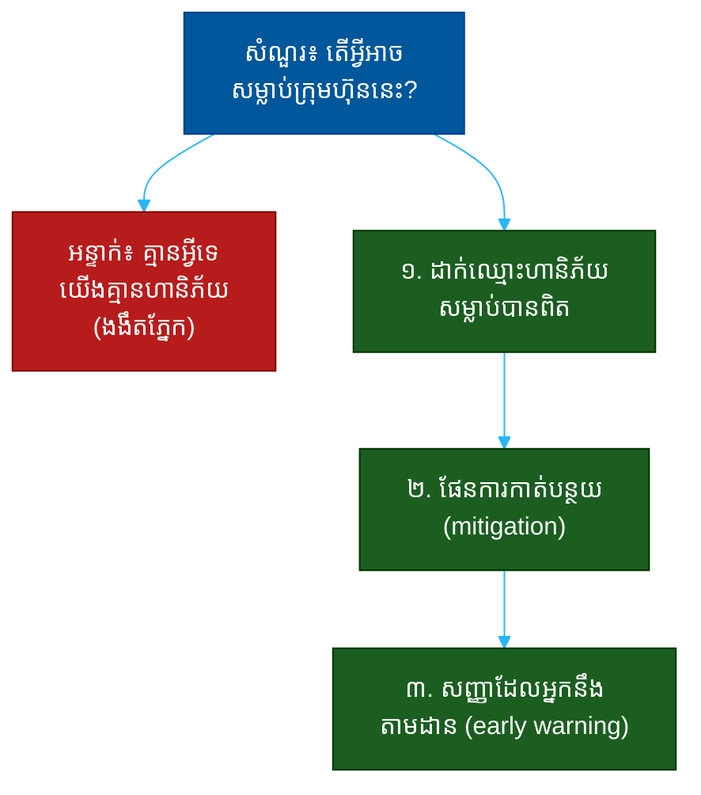

# "តើអ្វីអាចសម្លាប់ក្រុមហ៊ុននេះ?" (What Could Kill This Company?)៖ សំណួរតែមួយដែលបង្ហាញពីការដឹងហានិភ័យ ភាពចាស់ទុំ និងភាពស្មោះត្រង់

**Author:** ichamrong  
**Date:** 2026-05-30  
**Tags:** #one-question #investor #vc #risk #self-awareness #honesty #fundraising  
**Category:** Concepts / One Question  
**Read Time:** ~12 min  

---

## 📌 មាតិកា (Table of Contents)
- [អន្ទាក់ (The Setup)](#the-setup)
- [១. សំណួរពិតប្រាកដ (What They Are Really Asking)](#1)
- [២. អ្វីដែលវាបង្ហាញអំពីអ្នក (The Hidden Signals)](#2)
- [៣. អន្ទាក់ — ចម្លើយខ្សោយ (The Trap: Weak Answers)](#3)
- [៤. នីតិវិធីឆ្លើយតប (The Response Procedure)](#4)
- [៥. ឧទាហរណ៍ចម្លើយខ្លាំង (Strong Sample Answer)](#5)
- [៦. សំណួរបន្ត និងរបៀបដោះស្រាយ (Follow-up Traps)](#6)
- [សេចក្តីសន្និដ្ឋាន (Conclusion)](#conclusion)
- [ឯកសារយោង (References)](#references)
- [អត្ថបទពាក់ព័ន្ធ (Related Posts)](#related-posts)

---

## អន្ទាក់ (The Setup) 

វិនិយោគិន (VC) ស្ងប់ស្ងាត់មួយភ្លែត ហើយសួរយ៉ាងផ្ទាល់ថា៖ **«តើអ្វីអាចសម្លាប់ក្រុមហ៊ុននេះ? (What could kill this company?)»**

នេះ​ជា​សំណួរ​ដែល​បំបែក​ស្ថាបនិក​ភ្លាម​ៗ​ជា​ពីរ​ក្រុម។ ស្ថាបនិក​ខ្សោយ​ឮ​សំណួរ​នេះ​ជា​ការ​គំរាម​ — ហើយ​ការ​ពារ​ខ្លួន។ ស្ថាបនិក​ល្អ​ឮ​សំណួរ​នេះ​ជា​ឱកាស​ — ដើម្បី​បង្ហាញ​ថា​គេ​បាន​គិត​អំពី​ហានិភ័យ​ស៊ី​ជម្រៅ​ជាង​វិនិយោគិន​ទៅ​ទៀត។

ក្នុងចម្លើយរបស់អ្នក គេកំពុងស្តាប់៖
* តើ​អ្នក​មាន **ភាព​ស្មោះ​ត្រង់​នឹង​ខ្លួន​ឯង** ដើម្បី​ឃើញ​ហានិភ័យ​ពិត ឬ​ងងឹត​ភ្នែក?
* តើ​អ្នក​អាច​បែង​ចែក **ហានិភ័យ​ដ៏​សម្លាប់​បាន** (existential) ចេញ​ពី​ហានិភ័យ​តូច​ៗ?
* តើ​អ្នក​មាន **ផែនការ​កាត់​បន្ថយ​ហានិភ័យ** ឬ​គ្រាន់​តែ​សង្ឃឹម​ថា​វា​នឹង​មិន​កើត​ឡើង?

នេះជាផែនទីបង្ហាញផ្លូវសម្រាប់ការឆ្លើយតបឲ្យបានល្អ៖

---

## ១. សំណួរពិតប្រាកដ (What They Are Really Asking) 

វិនិយោគិនមិន​មែន​កំពុង​ព្យាយាម​បំបាក់​ស្មារតី​អ្នក​ទេ។ គេ​ដឹង​រួច​ហើយ​ថា​គ្រប់​ការ​វិនិយោគ​មាន​ហានិភ័យ។ អ្វីដែលគេពិតជាសួរគឺ៖

> **«តើ​អ្នក​បាន​គិត​អំពី​របៀប​ដែល​នេះ​អាច​បរាជ័យ​ ស៊ី​ជម្រៅ​ដូច​អ្នក​បាន​គិត​ពី​របៀប​ដែល​វា​អាច​ជោគ​ជ័យ​ដែរ​ឬ​ទេ?»**

ស្ថាបនិក​ដែល​ឆ្លើយ​«គ្មាន​អ្វី​អាច​សម្លាប់​យើង​ទេ» គឺ​បាន​ប្រាប់​វិនិយោគិន​ថា​គេ​មិន​បាន​គិត​អំពី​បញ្ហា​នេះ​ឡើយ — ដែល​ជា​ការ​គួរ​ឲ្យ​ភ័យ​ខ្លាច​ជាង​ហានិភ័យ​ខ្លួន​ឯង​ទៅ​ទៀត។ ផ្ទុយ​ទៅ​វិញ ស្ថាបនិក​ដែល​អាច​ដាក់​ឈ្មោះ​ហានិភ័យ​ដ៏​សម្លាប់​បាន​របស់​ខ្លួន ហើយ​បង្ហាញ​ផែនការ បាន​បង្ហាញ​ភាព​ចាស់​ទុំ​ ដែល​ធ្វើ​ឲ្យ​គេ​គួរ​ឲ្យ​ទុក​ចិត្ត​ជាង​មុន។

ដូច្នេះ សំណួរនេះវាស់ ៣ យ៉ាង៖
1. **ការដឹងខ្លួន (Self-awareness)** — តើអ្នកឃើញហានិភ័យពិត?
2. **ការដាក់អាទិភាព (Prioritization)** — តើអ្នកដឹងថាមួយណាសម្លាប់បាន?
3. **ភាពចាស់ទុំ (Maturity)** — តើអ្នកមានផែនការ ឬគ្រាន់តែសង្ឃឹម?

---

## ២. អ្វីដែលវាបង្ហាញអំពីអ្នក (The Hidden Signals) 

| សញ្ញាដែលគេអាន | ចម្លើយខ្សោយបង្ហាញ | ចម្លើយខ្លាំងបង្ហាញ |
| :--- | :--- | :--- |
| **ការដឹងខ្លួន** | «យើងគ្មានហានិភ័យ» | ដាក់ឈ្មោះ ១-២ ហានិភ័យពិត |
| **ការដាក់អាទិភាព** | រាយហានិភ័យតូចៗ | បំបែកសម្លាប់បាន ពីបញ្ហាតូច |
| **ភាពចាស់ទុំ** | «យើងសង្ឃឹមថាមិនកើត» | «នេះជារបៀបយើងតាមដាន/កាត់បន្ថយ» |
| **ភាពស្មោះត្រង់** | លាក់/ការពារខ្លួន | ស្មោះ បើទោះ​ជា​មិន​ស្រួល​និយាយ |
| **ភាពស្ងប់** | ភ័យ/ការពារ | ស្ងប់ — ដូចបានគិតរួចហើយ |

**ចំណុចសំខាន់៖** ការ​និយាយ​«គ្មាន​អ្វី​អាច​សម្លាប់​យើង​ទេ» គឺ​ជា​ចម្លើយ​ខ្សោយ​បំផុត។ ប៉ុន្តែ​ការ​រាយ​ហានិភ័យ​មិន​ឈប់ ដោយ​គ្មាន​ការ​ដាក់​អាទិភាព ឬ​ផែនការ ក៏​ខ្សោយ​ដែរ — វា​ស្តាប់​ទៅ​ដូច​ភ័យ។ ចម្លើយ​ល្អ​ស្ថិត​នៅ​ចំ​កណ្តាល៖ ស្មោះ​ត្រង់​ប៉ុន្តែ​គ្រប់​គ្រង​បាន។

---

## ៣. អន្ទាក់ — ចម្លើយខ្សោយ (The Trap: Weak Answers) 

**អន្ទាក់ទី ១ — អ្នកប្រកែក (The Denier):**
> «និយាយ​ត្រង់ៗ ខ្ញុំ​មិន​គិត​ថា​មាន​អ្វី​អាច​សម្លាប់​យើង​ទេ — យើង​មាន​ការ​ការ​ពារ​គ្រប់​យ៉ាង»

ហេតុអ្វីបរាជ័យ៖ វា​បង្ហាញ​ការ​ងងឹត​ភ្នែក ឬ​ការ​មិន​បាន​គិត។ វិនិយោគិន​ដែល​មាន​បទ​ពិសោធន៍​ដឹង​ភ្លាម​ថា​គ្រប់​ក្រុមហ៊ុន​មាន​ហានិភ័យ​សម្លាប់​បាន។

**អន្ទាក់ទី ២ — អ្នកការពារខ្លួន (The Defender):**
> «សំណួរ​នេះ​មិន​យុត្តិធម៌​ទេ — ​អ្នក​អាច​សួរ​បែប​នេះ​ចំពោះ​ក្រុមហ៊ុន​ណា​ក៏​បាន!»

ហេតុអ្វីបរាជ័យ៖ ការ​ការ​ពារ​ខ្លួន​បង្ហាញ​ថា​អ្នក​ឮ​ការ​រិះ​គន់ ជា​ការ​វាយ​ប្រហារ។ ស្ថាបនិក​ដែល​ការ​ពារ​ខ្លួន​ពេល​ឥឡូវ​នឹង​ការ​ពារ​ខ្លួន​នៅ​ក្នុង​បន្ទប់​ប្រជុំ​ក្រុម​ប្រឹក្សា​នាពេលអនាគត។

**អន្ទាក់ទី ៣ — អ្នករាយបញ្ជី (The Lister):**
> «មាន​ហានិភ័យ​ច្រើន​ណាស់ — ការ​ប្រកួត, បទ​ប្បញ្ញត្តិ, ការ​ជួល​មនុស្ស, ការ​ផ្គត់​ផ្គង់, បច្ចេកវិទ្យា...»

ហេតុអ្វីបរាជ័យ៖ ការ​រាយ​អ្វី​ៗ​គ្រប់​យ៉ាង​ដោយ​មិន​ដាក់​អាទិភាព បង្ហាញ​ថា​អ្នក​មិន​ដឹង​ថា​មួយ​ណា​ពិត​ជា​សម្លាប់​បាន — វា​ស្តាប់​ទៅ​ដូច​ភ័យ មិន​មែន​ការ​គ្រប់​គ្រង។

---

## ៤. នីតិវិធីឆ្លើយតប (The Response Procedure) 

ចម្លើយខ្លាំងមាន **៣ ផ្នែក** តាមលំដាប់៖

**ជំហានទី ១ — ដាក់ឈ្មោះហានិភ័យសម្លាប់បានពិត (Name the Real Killer)**
ជ្រើស​រើស ១ ឬ ២ ហានិភ័យ​ដ៏​ធំ​បំផុត ដែល​ពិត​ជា​អាច​បញ្ចប់​ក្រុមហ៊ុន — មិន​មែន​បញ្ហា​តូច​ៗ។
> «ហានិភ័យ​ដ៏​សម្លាប់​បាន​ដ៏​ពិត​ប្រាកដ​របស់​យើង​គឺ [ការ​ចែកចាយ / បទ​ប្បញ្ញត្តិ / ការ​ពឹង​ផ្អែក​លើ​ដៃ​គូ​តែ​មួយ]»

នេះបង្ហាញ **ការដឹងខ្លួន** និង **ការដាក់អាទិភាព**។

**ជំហានទី ២ — បង្ហាញផែនការកាត់បន្ថយ (Show the Mitigation)**
បន្ទាប់​មក​ពន្យល់​ថា​អ្នក​កំពុង​ធ្វើ​អ្វី​ខ្លះ​ ដើម្បី​កាត់​បន្ថយ​ហានិភ័យ​នោះ​ឥឡូវ​នេះ។
> «នេះ​ជា​មូល​ហេតុ​ដែល​យើង​កំពុង [ពិពិធកម្ម​ប្រភព​ចែកចាយ / ធ្វើ​ការ​ជាមួយ​អ្នក​ច្បាប់ / កសាង​ដៃ​គូ​ច្រើន]»

នេះបង្ហាញ **ភាពចាស់ទុំ** — អ្នកមិនគ្រាន់តែឃើញហានិភ័យ អ្នកកំពុងធ្វើអ្វីមួយ។

**ជំហានទី ៣ — សញ្ញាដែលអ្នកនឹងតាមដាន (The Early Warning Signal)**
បញ្ចប់​ដោយ​ការ​បង្ហាញ​ថា​អ្នក​ដឹង​ថា​សញ្ញា​អ្វី​ខ្លះ​នឹង​ប្រាប់​អ្នក​ថា​ហានិភ័យ​នោះ​កំពុង​កើត​ឡើង​មុន​ពេល​វា​ខ្លាំង​ពេក។
> «ហើយ​ខ្ញុំ​ឃ្លាំ​មើល [តម្លៃ​ការ​ទាញ​អតិថិជន / កំណែ​ច្បាប់​ថ្មី] ជា​សញ្ញា​ព្រមាន​ដំបូង»

នេះបង្ហាញ **ការគ្រប់គ្រងហានិភ័យសកម្ម**។

---

## ៥. ឧទាហរណ៍ចម្លើយខ្លាំង (Strong Sample Answer) 

> **«ហានិភ័យ​ដ៏​សម្លាប់​បាន​ដ៏​ពិត​ប្រាកដ​បំផុត​របស់​យើង​មិន​មែន​ការ​ប្រកួត​ទេ — វា​ជា​ការ​ពឹង​ផ្អែក​លើ​ផ្លូវ​ចែកចាយ​តែ​មួយ។ ៧០%​នៃ​អតិថិជន​ថ្មី​មក​ពី​វេទិកា​មួយ — បើ​ពួក​គេ​ប្តូរ​គោល​នយោបាយ វា​ប៉ះ​ពាល់​ខ្លាំង។ នេះ​ជា​មូល​ហេតុ​ដែល​យើង​កំពុង​កសាង​ផ្លូវ​ចែកចាយ​ផ្ទាល់ (direct channel) ដែល​ឥឡូវ​នេះ​មាន ២០%​រួច​ហើយ ហើយ​កំពុង​កើន។ ខ្ញុំ​ឃ្លាំ​មើល​សមាមាត្រ​នេះ​រាល់​សប្តាហ៍ — បើ​ការ​ពឹង​ផ្អែក​មិន​ធ្លាក់​ចុះ ខ្ញុំ​ដឹង​ថា​យើង​ត្រូវ​ពន្លឿន​ការ​ងារ​នោះ។»**

**ការវិភាគ (Breakdown):**
* «មិនមែនការប្រកួត — វាជាការពឹងផ្អែកលើផ្លូវចែកចាយតែមួយ» → ដាក់ឈ្មោះ killer ពិត (prioritization)
* «៧០% មកពីវេទិកាមួយ» → ស្មោះត្រង់នឹងលេខ (honesty)
* «កំពុងកសាងផ្លូវផ្ទាល់... ២០% រួចហើយ» → ផែនការកាត់បន្ថយ (mitigation)
* «ឃ្លាំមើលសមាមាត្ររាល់សប្តាហ៍» → សញ្ញាព្រមានដំបូង (early warning)

**ប្រៀបធៀប៖**
* ❌ ខ្សោយ៖ «គ្មានអ្វីអាចសម្លាប់យើងទេ»
* ✅ ខ្លាំង៖ ចម្លើយ ៣ ផ្នែកខាងលើ — killer, mitigation, signal

---

## ៦. សំណួរបន្ត និងរបៀបដោះស្រាយ (Follow-up Traps) 

វិនិយោគិនល្អនឹងសួរបន្ត ដើម្បីសាកល្បងថាការដឹងហានិភ័យរបស់អ្នកពិត ឬគ្រាន់តែជាការនិយាយ៖

**«ចុះបើ​ការ​កាត់​បន្ថយ​នោះ​បរាជ័យ?» (What if your mitigation fails?)**
> កុំ​ភ័យ។ ឆ្លើយ​ដោយ​ភាព​ចាស់​ទុំ៖ «បើ​ផ្លូវ​ផ្ទាល់​មិន​លូត​លាស់​ល្មម​ទាន់​ពេល យើង​មាន​ផែនការ​បម្រុង — [ដៃ​គូ​ចែកចាយ​ទី​ពីរ / ការ​ផ្លាស់​ប្តូរ​ម៉ូដែល​តម្លៃ]។ ខ្ញុំ​មិន​ចង់​ឲ្យ​ការ​រស់​រាន​របស់​យើង​ពឹង​ផ្អែក​លើ​ការ​ភ្នាល់​តែ​មួយ»។

**«តើ​ហានិភ័យ​មួយ​ណា​ដែល​អ្នក​មិន​ដឹង​ពី​របៀប​ដោះ​ស្រាយ?» (What risk don't you know how to solve?)**
> ស្មោះ​ត្រង់​ដោយ​ការ​ចង់​ដឹង៖ «ការ​ផ្លាស់​ប្តូរ​បទ​ប្បញ្ញត្តិ​គឺ​នៅ​ក្រៅ​ការ​គ្រប់​គ្រង​របស់​យើង — ខ្ញុំ​មិន​អាច​ការ​ពារ​ទាំង​ស្រុង​ទេ ប៉ុន្តែ​ខ្ញុំ​កំពុង​កសាង​ទំនាក់​ទំនង​ដើម្បី​ឲ្យ​យើង​ដឹង​មុន​គេ»។

**ច្បាប់មាស៖** រាល់សំណួរបន្ត គឺជាការសាកល្បងថាតើអ្នកបានគិតពីហានិភ័យ ស៊ីជម្រៅ ឬគ្រាន់តែបានទន្ទេញចម្លើយ។ ស្ថាបនិក​ដែល​បាន​គិត​ពិត​ៗ​ ឆ្លើយ​បាន​ស្ងប់​ៗ ដោយ​មិន​ភ័យ។

---

## សេចក្តីសន្និដ្ឋាន (Conclusion) 

សំណួរ «តើអ្វីអាចសម្លាប់ក្រុមហ៊ុននេះ?» គឺជា **តេស្តនៃភាពចាស់ទុំ និងភាពស្មោះត្រង់**។ ការ​ឆ្លើយ​«គ្មាន​អ្វី​ទេ» ធ្វើ​ឲ្យ​អ្នក​មើល​ទៅ​ងងឹត​ភ្នែក — ការ​ដាក់​ឈ្មោះ​ហានិភ័យ​ពិត​ហើយ​បង្ហាញ​ផែនការ ធ្វើ​ឲ្យ​អ្នក​មើល​ទៅ​ដូច​ជា​មេ​ដឹក​នាំ​ដែល​អាច​ទុក​ចិត្ត​បាន​ពេល​លំបាក។

ចងចាំរូបមន្ត ៣ ផ្នែក៖
1. **ដាក់ឈ្មោះ killer ពិត** (មិនមែនបញ្ហាតូចៗ)
2. **បង្ហាញផែនការកាត់បន្ថយ** (អ្នកកំពុងធ្វើអ្វី)
3. **សញ្ញាព្រមានដំបូង** (អ្នកនឹងដឹងមុនពេលវាខ្លាំង)

ការ​ស្គាល់​សត្រូវ​ដ៏​ធំ​បំផុត​របស់​ខ្លួន ហើយ​ត្រៀម​ខ្លួន​សម្រាប់​វា — នោះ​ជា​អ្វី​ដែល​ញែក​ស្ថាបនិក​ដែល​នឹង​នៅ​រស់​រាន ចេញ​ពី​អ្នក​ដែល​នឹង​ភ្ញាក់​ផ្អើល​ពេល​ហានិភ័យ​មក​ដល់។

---

## ឯកសារយោង (References) 

- *The Hard Thing About Hard Things* — Ben Horowitz
- *Thinking in Bets* — Annie Duke
- *Superforecasting* — Philip Tetlock & Dan Gardner

---

## អត្ថបទពាក់ព័ន្ធ (Related Posts) 

- [What Is Your Moat? (របាំងការពារ)](02-what-is-your-moat.md)
- [Why Now? (ហេតុអ្វីពេលនេះ)](05-why-now.md)
- [One Question Index](../README.md)
