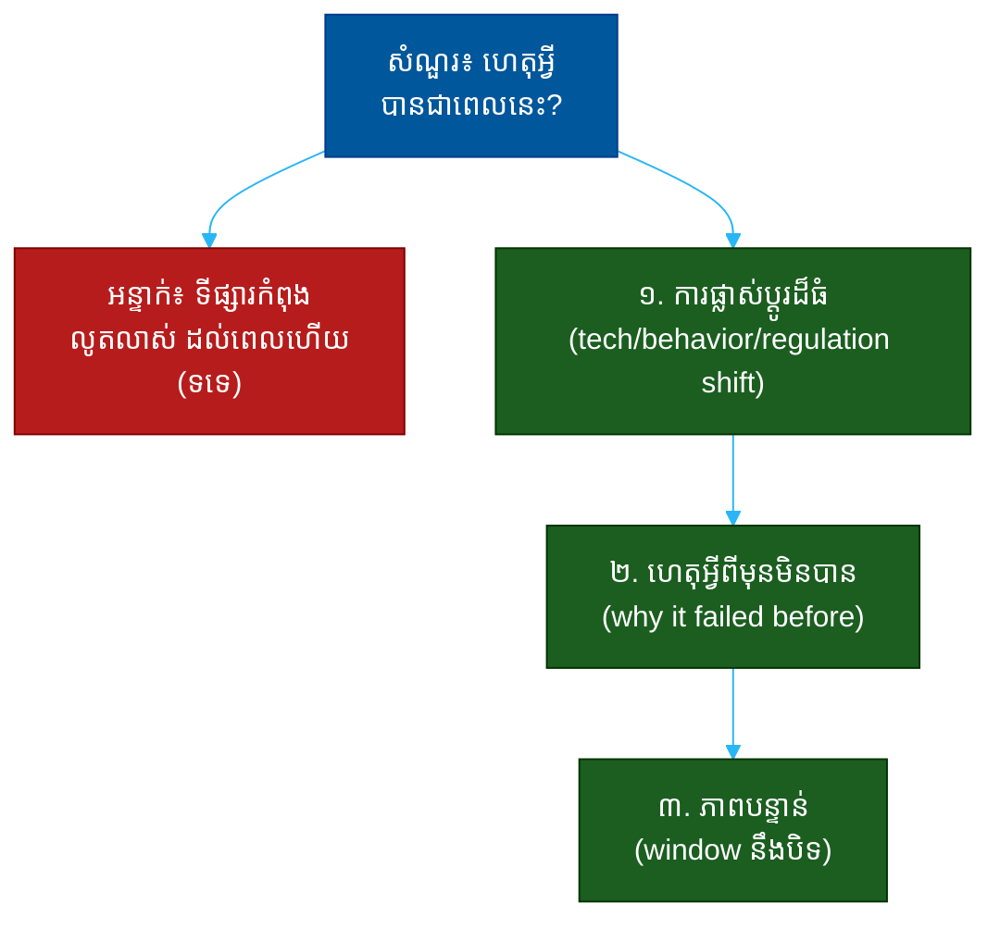

# "ហេតុអ្វីបានជាពេលនេះ?" (Why Now?)៖ សំណួរតែមួយដែលបង្ហាញពីពេលវេលាទីផ្សារ ការយល់ដឹង និងភាពបន្ទាន់

**Author:** ichamrong  
**Date:** 2026-05-30  
**Tags:** #one-question #investor #vc #timing #why-now #market-shift #fundraising  
**Category:** Concepts / One Question  
**Read Time:** ~12 min  

---

## 📌 មាតិកា (Table of Contents)
- [អន្ទាក់ (The Setup)](#the-setup)
- [១. សំណួរពិតប្រាកដ (What They Are Really Asking)](#1)
- [២. អ្វីដែលវាបង្ហាញអំពីអ្នក (The Hidden Signals)](#2)
- [៣. អន្ទាក់ — ចម្លើយខ្សោយ (The Trap: Weak Answers)](#3)
- [៤. នីតិវិធីឆ្លើយតប (The Response Procedure)](#4)
- [៥. ឧទាហរណ៍ចម្លើយខ្លាំង (Strong Sample Answer)](#5)
- [៦. សំណួរបន្ត និងរបៀបដោះស្រាយ (Follow-up Traps)](#6)
- [សេចក្តីសន្និដ្ឋាន (Conclusion)](#conclusion)
- [ឯកសារយោង (References)](#references)
- [អត្ថបទពាក់ព័ន្ធ (Related Posts)](#related-posts)

---

## អន្ទាក់ (The Setup) 

វិនិយោគិន (VC) ងក់ក្បាលឲ្យគំនិតរបស់អ្នក ហើយបន្ទាប់មកសួរថា៖ **«ហេតុអ្វីបានជាពេលនេះ? (Why now?)»**

នេះ​ជា​សំណួរ​ដ៏​មុត​ស្រួច​បំផុត​មួយ​ក្នុង​ការ​សួរ​ស្ថាបនិក។ បើ​គំនិត​នេះ​ល្អ​យ៉ាង​នេះ ហេតុ​អ្វី​បាន​ជា​គ្មាន​នរណា​បាន​ធ្វើ​វា​កាល​ពី ៥​ឆ្នាំ​មុន? ហើយ​បើ​មាន​គេ​ធ្លាប់​ព្យាយាម​ហើយ​បរាជ័យ ហេតុ​អ្វី​បាន​ជា​ឥឡូវ​នេះ​ខុស​គ្នា? រាល់​អាជីវកម្ម​ដ៏​អស្ចារ្យ​ត្រូវ​បាន​បង្កើត​ឡើង​ដោយ​ការ​ឆ្លៀត​យក​ការ​ផ្លាស់​ប្តូរ​ដ៏​ធំ​មួយ​ ដែល​ទើប​តែ​បាន​កើត​ឡើង។

ក្នុងចម្លើយរបស់អ្នក គេកំពុងស្តាប់៖
* តើ​អ្នក​មើល​ឃើញ **ការ​ផ្លាស់​ប្តូរ​ដ៏​ធំ** (a shift) ដែល​បើក​ឱកាស​នេះ ឬ​គ្រាន់​តែ​«ឥឡូវ​ដល់​ពេល​ហើយ»?
* តើ​អ្នក​ដឹង​ពី **ប្រវត្តិ​នៃ​ការ​ព្យាយាម​ពី​មុន** ហើយ​យល់​ថា​ហេតុ​អ្វី​ឥឡូវ​ខុស​គ្នា?
* តើ​អ្នក​បង្ហាញ **ភាព​បន្ទាន់** — ហេតុ​អ្វី​ឥឡូវ មិន​មែន​ឆ្នាំ​ក្រោយ?

នេះជាផែនទីបង្ហាញផ្លូវសម្រាប់ការឆ្លើយតបឲ្យបានល្អ៖

---

## ១. សំណួរពិតប្រាកដ (What They Are Really Asking) 

វិនិយោគិនមិន​មែន​កំពុង​សួរ​ពី​ប្រតិទិន​ផ្ទាល់​ខ្លួន​របស់​អ្នក​ទេ។ អ្វីដែលគេពិតជាសួរគឺ៖

> **«តើ​មាន​ការ​ផ្លាស់​ប្តូរ​ដ៏​ធំ​មួយ​នៅ​ក្នុង​ពិភព​លោក​ ដែល​ធ្វើ​ឲ្យ​អ្វី​ដែល​ធ្លាប់​មិន​អាច​ធ្វើ​ទៅ​បាន​ ឥឡូវ​នេះ​អាច​ធ្វើ​ទៅ​បាន​ — ហើយ​តើ​អ្នក​យល់​ច្បាស់​ពី​ការ​ផ្លាស់​ប្តូរ​នោះ​ដែរ​ឬ​ទេ?»**

ការ​ផ្លាស់​ប្តូរ​ដ៏​ធំ​ទាំង​នោះ ជា​ធម្មតា​មក​ពី ៣​ប្រភេទ៖
- **ការ​ផ្លាស់​ប្តូរ​បច្ចេកវិទ្យា (Technology shift)** — អ្វី​មួយ​ដែល​ទើប​តែ​ថោក​/លឿន​/អាច​ធ្វើ​បាន (ឧ. ស្មាតហ្វូន, cloud, AI)
- **ការ​ផ្លាស់​ប្តូរ​ឥរិយាបថ (Behavior shift)** — របៀប​ដែល​មនុស្ស​ធ្វើ​អ្វី​មួយ​ទើប​តែ​ប្តូរ (ឧ. ការ​ងារ​ពី​ផ្ទះ)
- **ការ​ផ្លាស់​ប្តូរ​បទ​ប្បញ្ញត្តិ (Regulatory shift)** — ច្បាប់​ទើប​តែ​បើក/បិទ​ទ្វារ​មួយ

«ការ​ឆ្លៀត​ពេល​វេលា» (timing) គឺ​ជា​កត្តា​ដ៏​សំខាន់​បំផុត​មួយ​ក្នុង​ការ​ជោគ​ជ័យ​របស់​ក្រុមហ៊ុន​ថ្មី — ច្រើន​ជាង​ក្រុម​ ឬ​គំនិត​ទៅ​ទៀត​ក្នុង​ករណី​ខ្លះ។ គំនិត​ត្រឹម​ត្រូវ​ក្នុង​ពេល​ខុស​ គឺ​ជា​ការ​បរាជ័យ។

ដូច្នេះ សំណួរនេះវាស់ ៣ យ៉ាង៖
1. **ការយល់ដឹងពីការផ្លាស់ប្តូរ (Insight on the shift)** — តើអ្នកមើលឃើញរលក?
2. **ចំណេះដឹងពីប្រវត្តិ (Historical literacy)** — តើអ្នកដឹងពីការព្យាយាមពីមុន?
3. **ភាពបន្ទាន់ (Urgency)** — ហេតុអ្វីពេលនេះ មិនមែនពេលក្រោយ?

---

## ២. អ្វីដែលវាបង្ហាញអំពីអ្នក (The Hidden Signals) 

| សញ្ញាដែលគេអាន | ចម្លើយខ្សោយបង្ហាញ | ចម្លើយខ្លាំងបង្ហាញ |
| :--- | :--- | :--- |
| **ការផ្លាស់ប្តូរ (The shift)** | «ដល់ពេលហើយ» | «X ទើបតែប្តូរ ដែលធ្វើឲ្យ Y អាចធ្វើបាន» |
| **ចំណេះដឹងពីប្រវត្តិ** | មិនដឹងថាគេធ្លាប់ព្យាយាម | «គេធ្លាប់ព្យាយាម តែ Z មិនទាន់មាន» |
| **ភាពបន្ទាន់ (Urgency)** | «យើងអាចធ្វើពេលណាក៏បាន» | «បង្អួចនេះនឹងបិទ — ហើយនេះជាមូលហេតុ» |
| **ការយល់ដឹង** | និយាយទូទៅពីនិន្នាការ | ភ្ជាប់និន្នាការទៅផលិតផលច្បាស់ |
| **ភាពច្បាស់លាស់** | ហេតុផលរាយប៉ាយ | រឿងតែមួយច្បាស់ៗ ពីការផ្លាស់ប្តូរ |

**ចំណុចសំខាន់៖** ចម្លើយ​«ទីផ្សារ​កំពុង​លូត​លាស់ ដូច្នេះ​ដល់​ពេល​ហើយ» គឺ​ជា​សញ្ញា​ក្រហម។ ការ​លូត​លាស់​នៃ​ទីផ្សារ​មិន​មែន​ជា​ការ​ផ្លាស់​ប្តូរ​ដ៏​ធំ​ទេ — អ្នក​ត្រូវ​ដាក់​ឈ្មោះ​អ្វី​ដែល​ **ទើប​តែ​ប្តូរ** ​ដ៏​ជាក់​លាក់។

---

## ៣. អន្ទាក់ — ចម្លើយខ្សោយ (The Trap: Weak Answers) 

**អន្ទាក់ទី ១ — អ្នកនិន្នាការ (The Trend Follower):**
> «ទីផ្សារ​នេះ​កំពុង​លូត​លាស់​លឿន​ណាស់ ដូច្នេះ​ឥឡូវ​ជា​ពេល​ដ៏​ល្អ»

ហេតុអ្វីបរាជ័យ៖ ការ​លូត​លាស់​ទីផ្សារ​មិន​ឆ្លើយ​សំណួរ​«ហេតុ​អ្វី​ឥឡូវ»​ទេ។ វា​អាច​ត្រូវ​បាន​និយាយ​ដែរ​កាល​ពី​ឆ្នាំ​មុន ឬ​ឆ្នាំ​ក្រោយ។

**អន្ទាក់ទី ២ — អ្នកមិនដឹងប្រវត្តិ (The Historically Naive):**
> «គ្មាន​នរណា​ធ្លាប់​ធ្វើ​រឿង​នេះ​ពី​មុន​ទេ — យើង​ជា​ដំបូង»

ហេតុអ្វីបរាជ័យ៖ ស្ទើរ​តែ​គ្រប់​គំនិត​ល្អ​ៗ​ធ្លាប់​ត្រូវ​បាន​សាក​ល្បង​ពី​មុន។ ការ​មិន​ដឹង​ប្រវត្តិ​នោះ​បង្ហាញ​ការ​ខ្វះ​ការ​ស្រាវ​ជ្រាវ — ហើយ​អ្នក​ខក​ខាន​មេរៀន​ដ៏​សំខាន់​ពី​ការ​បរាជ័យ​ពី​មុន។

**អន្ទាក់ទី ៣ — អ្នកគ្មានភាពបន្ទាន់ (The No-Urgency One):**
> «យើង​អាច​ធ្វើ​វា​ពេល​ណា​ក៏​បាន — គ្រាន់​តែ​ឥឡូវ​យើង​ត្រៀម​ខ្លួន​រួច​ហើយ»

ហេតុអ្វីបរាជ័យ៖ បើ​គ្មាន​ភាព​បន្ទាន់ ​នោះ​ក៏​គ្មាន​ហេតុ​ផល​ឲ្យ​វិនិយោគិន​សម្រេច​ចិត្ត​ឥឡូវ​ដែរ។ បង្អួច​ឱកាស (window) ដែល​មិន​បិទ​ មិន​មែន​ជា​បង្អួច​ឱកាស​ឡើយ។

---

## ៤. នីតិវិធីឆ្លើយតប (The Response Procedure) 

ចម្លើយខ្លាំងមាន **៣ ផ្នែក** តាមលំដាប់៖

**ជំហានទី ១ — ដាក់ឈ្មោះការផ្លាស់ប្តូរដ៏ធំ (Name the Shift)**
ចាប់​ផ្តើម​ដោយ​ដាក់​ឈ្មោះ​ការ​ផ្លាស់​ប្តូរ​បច្ចេកវិទ្យា/ឥរិយាបថ/បទ​ប្បញ្ញត្តិ​ ​ដ៏​ជាក់​លាក់​ ​ដែល​ទើប​តែ​បាន​កើត​ឡើង។
> «រឿង​ដែល​ទើប​តែ​ប្តូរ​គឺ [តម្លៃ​បច្ចេកវិទ្យា​ធ្លាក់ ១០​ដង / ឥរិយាបថ​អ្នក​ប្រើ​ប្តូរ / ច្បាប់​ថ្មី] ​ក្នុង​រយៈ​ពេល​ ​[X​ខែ​ចុង​ក្រោយ]»

នេះបង្ហាញ **ការយល់ដឹងពីរលក**។

**ជំហានទី ២ — ហេតុអ្វីពីមុនមិនបាន (Why It Failed Before)**
បន្ទាប់​មក​ បង្ហាញ​ថា​អ្នក​ដឹង​ពី​ការ​ព្យាយាម​ពី​មុន ​និង​ហេតុ​អ្វី​បាន​ជា​វា​បរាជ័យ​ ​ហើយ​ ​ហេតុ​អ្វី​ឥឡូវ​ខុស​គ្នា។
> «គេ​ធ្លាប់​ព្យាយាម​នេះ​កាល​ពី [ឆ្នាំ] ​ប៉ុន្តែ​វា​បរាជ័យ​ដោយ​សារ [Z] ​មិន​ទាន់​មាន — ឥឡូវ​នេះ Z ​មាន​ហើយ»

នេះបង្ហាញ **ចំណេះដឹងពីប្រវត្តិ** ​ដែល​ធ្វើ​ឲ្យ​អ្នក​មើល​ទៅ​ឆ្លាត​វៃ​ជាង​មុន។

**ជំហានទី ៣ — បង្ហាញភាពបន្ទាន់ (Show the Urgency)**
បញ្ចប់​ដោយ​ការ​ពន្យល់​ថា​ហេតុ​អ្វី​បាន​ជា​បង្អួច​នេះ​មាន​កំណត់ — ​ហើយ​ការ​រង់​ចាំ​មាន​តម្លៃ។
> «បង្អួច​នេះ​នឹង​បិទ​នៅ​ពេល [គូប្រកួត​ធំ​ភ្ញាក់ / ការ​ផ្លាស់​ប្តូរ​ឈប់] — ​ដូច្នេះ​អ្នក​ដែល​ផ្តើម​ឥឡូវ​នឹង​ឈ្នះ»

នេះបង្ហាញ **ភាពបន្ទាន់** ​ដែល​ជំរុញ​ការ​សម្រេច​ចិត្ត។

---

## ៥. ឧទាហរណ៍ចម្លើយខ្លាំង (Strong Sample Answer) 

> **«រឿង​ដែល​ទើប​តែ​ប្តូរ​គឺ​តម្លៃ​នៃ​ការ​ដំណើរ​ការ​ម៉ូដែល AI ​បាន​ធ្លាក់​ចុះ ​៩៥% ​ក្នុង​រយៈ​ពេល​ ​១៨​ខែ​ចុង​ក្រោយ។ ​មាន​គេ​ធ្លាប់​ព្យាយាម​សាង​ផលិតផល​នេះ​កាល​ពី ​២០១៩ ​ប៉ុន្តែ​វា​ត្រូវ​ការ​ការ​ចំណាយ​ដែល​ធ្វើ​ឲ្យ​សេដ្ឋកិច្ច​ឯកតា (unit economics) ​មិន​ដំណើរ​ការ — ​អតិថិជន​ម្នាក់​ខាត​ច្រើន​ជាង​ចំណេញ។ ​ឥឡូវ​នេះ​ ​ដោយ​សារ​តម្លៃ​ធ្លាក់​ ​សេដ្ឋកិច្ច​ឯកតា​ត្រឡប់​ជា​វិជ្ជមាន​ជា​លើក​ដំបូង។ ​ហើយ​បង្អួច​នេះ​មាន​កំណត់ — ​ក្នុង​រយៈ​ពេល ​១២-១៨​ខែ​ ​ក្រុមហ៊ុន​ធំ​ៗ​នឹង​ភ្ញាក់ ​ដូច្នេះ​អ្នក​ដែល​កសាង​ការ​ចែកចាយ​និង​ទិន្នន័យ​ឥឡូវ​នឹង​នាំ​មុខ។»**

**ការវិភាគ (Breakdown):**
* «តម្លៃ AI ធ្លាក់ ៩៥% ក្នុង ១៨ ខែ» → ដាក់ឈ្មោះ shift ច្បាស់ (insight)
* «គេធ្លាប់ព្យាយាមកាល ២០១៩... unit economics មិនដំណើរ» → ហេតុអ្វីពីមុនមិនបាន (historical literacy)
* «ឥឡូវ unit economics វិជ្ជមានជាលើកដំបូង» → ហេតុអ្វីឥឡូវខុសគ្នា
* «បង្អួចមាន ១២-១៨ ខែ... ក្រុមហ៊ុនធំនឹងភ្ញាក់» → ភាពបន្ទាន់ (urgency)

**ប្រៀបធៀប៖**
* ❌ ខ្សោយ៖ «ទីផ្សារកំពុងលូតលាស់ ដល់ពេលហើយ»
* ✅ ខ្លាំង៖ ចម្លើយ ៣ ផ្នែកខាងលើ — shift, history, urgency

---

## ៦. សំណួរបន្ត និងរបៀបដោះស្រាយ (Follow-up Traps) 

វិនិយោគិនល្អនឹងសួរបន្ត ដើម្បីសាកល្បងថាការយល់ដឹងពីពេលវេលារបស់អ្នកពិត ឬគ្រាន់តែជារឿងនិទាន៖

**«បើ​ការ​ផ្លាស់​ប្តូរ​នេះ​ច្បាស់​ យ៉ាង​នេះ ​ហេតុ​អ្វី​ក្រុមហ៊ុន​ធំ​មិន​ធ្វើ?» (If the shift is so clear, why hasn't a giant done it?)**
> «ពួក​គេ​នឹង​ធ្វើ ​ប៉ុន្តែ​វា​ប៉ះ​ពាល់​អាជីវកម្ម​ស្នូល​របស់​គេ ​ឬ​វា​តូច​ពេក​សម្រាប់​គេ​ឥឡូវ​ — ​នេះ​ជា​មូល​ហេតុ​ដែល​យើង​មាន​បង្អួច​ខ្លី​មួយ​ មុន​គេ​ភ្ញាក់»។

**«ចុះបើអ្នកមកលឿនពេក?» (What if you're too early?)**
> ស្មោះ​ត្រង់៖ «នេះ​ជា​ហានិភ័យ​ពិត — ​ដូច្នេះ​ខ្ញុំ​ឃ្លាំ​មើល​សញ្ញា​ការ​ទទួល​យក​ពី​អតិថិជន​ដំបូង។ ​ឥឡូវ​នេះ ​[សញ្ញា​ជាក់​ស្តែង] ​បង្ហាញ​ថា​តម្រូវ​ការ​មាន​ហើយ ​មិន​មែន​ត្រឹម​ទ្រឹស្តី»។

**ច្បាប់មាស៖** រាល់សំណួរបន្ត គឺជាការសាកល្បងថាតើ «ការផ្លាស់ប្តូរ» ​ដែល​អ្នក​ដាក់​ឈ្មោះ​នោះ​ពិត​ប្រាកដ ​និង​ច្បាស់​លាស់​ ​ឬ​គ្រាន់​តែ​ជា​ការ​ប្រឌិត។ បើ​អ្នក​ស្គាល់​ប្រវត្តិ​ និង​រលក​ពិត​ៗ​ ​អ្នក​ឆ្លើយ​បាន​យ៉ាង​ស៊ី​ជម្រៅ។

---

## សេចក្តីសន្និដ្ឋាន (Conclusion) 

សំណួរ «ហេតុអ្វីបានជាពេលនេះ?» គឺជា **តេស្តនៃការយល់ដឹងពីពេលវេលា**។ គំនិត​ត្រឹម​ត្រូវ​ក្នុង​ពេល​ខុស​ គឺ​ជា​ការ​បរាជ័យ — ​ហើយ​វិនិយោគិន​ដឹង​រឿង​នេះ​ច្បាស់​ជាង​អ្នក​ណា​ៗ។

ចងចាំរូបមន្ត ៣ ផ្នែក៖
1. **ដាក់ឈ្មោះការផ្លាស់ប្តូរដ៏ធំ** (បច្ចេកវិទ្យា / ឥរិយាបថ / បទប្បញ្ញត្តិ)
2. **ហេតុអ្វីពីមុនមិនបាន** (ហើយឥឡូវខុសគ្នាដោយរបៀបណា)
3. **បង្ហាញភាពបន្ទាន់** (បង្អួចនេះនឹងបិទ)

ការ​ឆ្លៀត​យក​រលក​ដ៏​ត្រឹម​ត្រូវ​ក្នុង​ពេល​ដ៏​ត្រឹម​ត្រូវ — ​នោះ​ជា​អ្វី​ដែល​ញែក​ស្ថាបនិក​ដែល​«សំណាង»​ ​ចេញ​ពី​អ្នក​ដែល​យល់​ច្បាស់​ពី​ល្បែង​ដែល​ខ្លួន​កំពុង​លេង។

---

## ឯកសារយោង (References) 

- *Zero to One* — Peter Thiel
- *The Power of Why Now* — Sequoia Capital (pitch framework)
- *Crossing the Chasm* — Geoffrey Moore

---

## អត្ថបទពាក់ព័ន្ធ (Related Posts) 

- [How Big Can This Get? (ទំហំទីផ្សារ)](03-how-big-can-this-get.md)
- [What Could Kill This Company? (ហានិភ័យ)](04-what-could-kill-this-company.md)
- [One Question Index](../README.md)
