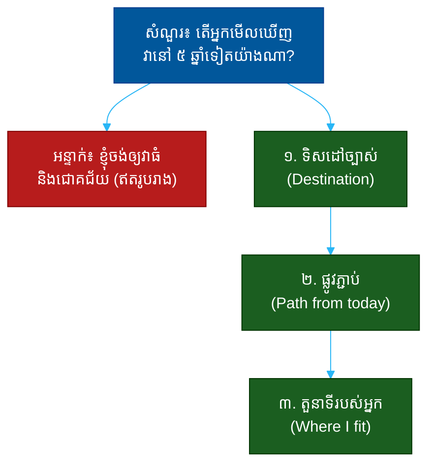

# "តើអ្នកមើលឃើញវានៅ ៥ ឆ្នាំទៀតយ៉ាងណា?" (Where Do You See This in 5 Years?)៖ សំណួរតែមួយដែលបង្ហាញពីចក្ខុវិស័យ ការគិតជាប្រព័ន្ធ និងភាពជាអ្នកដឹកនាំ

**Author:** ichamrong  
**Date:** 2026-05-30  
**Tags:** #one-question #leadership #vision #strategy #foresight #communication  
**Category:** Concepts / One Question  
**Read Time:** ~12 min  

---

## 📌 មាតិកា (Table of Contents)
- [អន្ទាក់ (The Setup)](#the-setup)
- [១. សំណួរពិតប្រាកដ (What They Are Really Asking)](#1)
- [២. អ្វីដែលវាបង្ហាញអំពីអ្នក (The Hidden Signals)](#2)
- [៣. អន្ទាក់ — ចម្លើយខ្សោយ (The Trap: Weak Answers)](#3)
- [៤. នីតិវិធីឆ្លើយតប (The Response Procedure)](#4)
- [៥. ឧទាហរណ៍ចម្លើយខ្លាំង (Strong Sample Answer)](#5)
- [៦. សំណួរបន្ត និងរបៀបដោះស្រាយ (Follow-up Traps)](#6)
- [សេចក្តីសន្និដ្ឋាន (Conclusion)](#conclusion)
- [ឯកសារយោង (References)](#references)
- [អត្ថបទពាក់ព័ន្ធ (Related Posts)](#related-posts)

---

## អន្ទាក់ (The Setup) 

អ្នកដឹកនាំ (Leader) ផ្អែកទៅក្រោយ ហើយសួរយឺតៗថា៖ **«តើអ្នកមើលឃើញវានៅ ៥ ឆ្នាំទៀតយ៉ាងណា?»**

«វា» នៅទីនេះអាចសំដៅទៅលើក្រុមហ៊ុន, ផលិតផល, ក្រុមការងារ ឬសូម្បីតែអាជីពរបស់អ្នកផ្ទាល់។ មិនថាជាអ្វីទេ — សំណួរនេះមិនមែនសុំ «ការទស្សន៍ទាយ» ដែលត្រឹមត្រូវនោះទេ។ វាជា **កញ្ចក់នៃរបៀបគិត** (a window into how you think across time)។

ក្នុងរយៈពេលដ៏ខ្លីនៃចម្លើយ គេអាចអាន៖
* តើអ្នកគិត **ឆ្ងាយ** (long-term) ឬគ្រាន់តែគិតពីសប្តាហ៍នេះ?
* តើអ្នកមាន **ផ្លូវ** (path) ភ្ជាប់ពីថ្ងៃនេះទៅអនាគត ឬគ្រាន់តែសុបិន?
* តើចក្ខុវិស័យរបស់អ្នក **មហិច្ឆតា** គ្រប់គ្រាន់ ប៉ុន្តែ **ជឿជាក់បាន** (ambitious yet credible)?
* តើអ្នកដាក់ **ខ្លួនឯង** នៅក្នុងរូបភាពអនាគតនោះដែរឬទេ?

នេះជាផែនទីបង្ហាញផ្លូវសម្រាប់ការឆ្លើយតបឲ្យបានល្អ៖

---

## ១. សំណួរពិតប្រាកដ (What They Are Really Asking) 

គ្មាននរណាម្នាក់រំពឹងថាអ្នកនឹងទាយត្រូវ ១០០% ពីអនាគត ៥ ឆ្នាំទេ។ ផ្ទុយទៅវិញ គេកំពុងសួរថា៖

> **«តើ​អ្នក​ជា​មនុស្ស​ដែល​អាច​ដឹក​នាំ​ឆ្ពោះ​ទៅ​អនាគត​មួយ ឬ​គ្រាន់​តែ​ប្រតិកម្ម​នឹង​បច្ចុប្បន្ន?»**

អ្នកដឹកនាំល្អត្រូវការមនុស្សដែលអាច **គូរផែនទីពេលវេលា** (map time)៖ ឃើញទិសដៅ ហើយយល់ផងដែរថាជំហានណាខ្លះត្រូវធ្វើពីថ្ងៃនេះ ដើម្បីទៅដល់ទីនោះ។ ចក្ខុវិស័យដោយគ្មានផ្លូវគឺជាការស្រមើស្រមៃ។ ផ្លូវដោយគ្មានចក្ខុវិស័យគឺជាការដើរវង្វេង។

ដូច្នេះ សំណួរនេះវាស់ ៣ យ៉ាង៖
1. **ចក្ខុវិស័យ (Vision)** — តើអ្នកមើលឃើញ «កន្លែងណា» ?
2. **ការគិតជាប្រព័ន្ធ (Systems thinking)** — តើអ្នកភ្ជាប់ថ្ងៃនេះទៅអនាគតយ៉ាងណា?
3. **ការតម្រឹមខ្លួន (Alignment)** — តើគោលដៅរបស់អ្នកស៊ីគ្នានឹងគោលដៅរបស់គេដែរឬទេ?

---

## ២. អ្វីដែលវាបង្ហាញអំពីអ្នក (The Hidden Signals) 

| សញ្ញាដែលគេអាន | ចម្លើយខ្សោយបង្ហាញ | ចម្លើយខ្លាំងបង្ហាញ |
| :--- | :--- | :--- |
| **ជើងមេឃ (Time horizon)** | គិតត្រឹមខែ ឬត្រីមាស | គិតឆ្លងកាត់ឆ្នាំ ដោយមានដំណាក់កាល |
| **ភាពជាក់លាក់ (Specificity)** | «ធំ», «ជោគជ័យ», «ល្បី» | លេខ, ទីផ្សារ, សមត្ថភាពច្បាស់ |
| **ផ្លូវភ្ជាប់ (Causality)** | លោតពីថ្ងៃនេះទៅសុបិន | បង្ហាញជំហានភ្ជាប់គ្នា |
| **មហិច្ឆតា (Ambition)** | តូចចង្អៀត ឬមិនពិត | ធំ ប៉ុន្តែជឿជាក់បាន |
| **ការតម្រឹម (Alignment)** | ផ្តោតលើខ្លួនឯងតែម្នាក់ | ភ្ជាប់ខ្លួនឯងនឹងបេសកកម្មរួម |

**ចំណុចសំខាន់៖** ចក្ខុវិស័យធំពេកដោយគ្មានផ្លូវ ស្តាប់ទៅដូចជាការនិយាយក្តៅៗ (hot air)។ ផ្លូវលម្អិតពេកដោយគ្មានចក្ខុវិស័យ ស្តាប់ទៅដូចជាបញ្ជីការងារ។ ចម្លើយល្អ **ភ្ជាប់** ទាំងពីរ៖ ឃើញឆ្ងាយ ប៉ុន្តែដឹងជំហានដំបូង។

---

## ៣. អន្ទាក់ — ចម្លើយខ្សោយ (The Trap: Weak Answers) 

**អន្ទាក់ទី ១ — អ្នកសុបិន (The Dreamer):**
> «ខ្ញុំចង់ឲ្យវាក្លាយជាក្រុមហ៊ុនធំបំផុតលើពិភពលោក!»

ហេតុអ្វីបរាជ័យ៖ ឥតមានផ្លូវ (no path)។ វាជាសុបិន មិនមែនចក្ខុវិស័យ។ គ្មាននរណាដឹងថាត្រូវធ្វើអ្វីពីព្រឹកស្អែកនោះទេ។

**អន្ទាក់ទី ២ — អ្នកប្រុងប្រយ័ត្ន (The Over-cautious):**
> «ពិបាកនិយាយណាស់ ទីផ្សារផ្លាស់ប្តូរលឿន ខ្ញុំមិនចង់ទាយខុសទេ»

ហេតុអ្វីបរាជ័យ៖ ការគេចវេស (dodging) បង្ហាញថាអ្នកគ្មានចក្ខុវិស័យ ឬខ្លាចការប្តេជ្ញាចិត្ត។ អ្នកដឹកនាំត្រូវហ៊ាននិយាយ «ខ្ញុំជឿថា...» ទោះមិនច្បាស់ ១០០%។

**អន្ទាក់ទី ៣ — អ្នកចម្លង (The Echo):**
> «ដូចដែលលោកបាននិយាយ ខ្ញុំគិតថាយើងគួរតែ...»

ហេតុអ្វីបរាជ័យ៖ ការនិយាយឡើងវិញនូវចក្ខុវិស័យរបស់គេ បង្ហាញថាអ្នកគ្មានគំនិតផ្ទាល់ខ្លួន។ គេចង់ឃើញ **ការគិតរបស់អ្នក** មិនមែនកញ្ចក់ឆ្លុះ។

---

## ៤. នីតិវិធីឆ្លើយតប (The Response Procedure) 

ចម្លើយខ្លាំងមាន **៣ ផ្នែក** តាមលំដាប់៖

**ជំហានទី ១ — ទិសដៅច្បាស់ (Name the Destination)**
ចាប់ផ្តើមដោយរូបភាពច្បាស់លាស់នៃអនាគត ៥ ឆ្នាំ។
> «ក្នុង​រយៈពេល ៥ ឆ្នាំ ខ្ញុំ​ឃើញ​យើង​ជា​ជម្រើស​លេខ​មួយ​សម្រាប់ X នៅ​ក្នុង​តំបន់​អាស៊ីអាគ្នេយ៍»

ឲ្យវាជាក់លាក់ — ទីផ្សារ, ទំហំ ឬឋានៈ — មិនមែនត្រឹម «ធំ»។

**ជំហានទី ២ — ផ្លូវភ្ជាប់ (Draw the Path)**
បង្ហាញ ២-៣ ដំណាក់កាលភ្ជាប់ពីថ្ងៃនេះទៅទីនោះ។
> «ឆ្នាំ​ដំបូង​យើង​ផ្តោត​លើ X, បន្ទាប់​មក​ពង្រីក​ទៅ Y, ហើយ​ឆ្នាំ​ទី​បី​ដល់​ប្រាំ​យើង​កសាង Z»

នេះបង្ហាញ **ការគិតជាប្រព័ន្ធ** — ថាអ្នកយល់ពីលំដាប់ និងហានិភ័យ។

**ជំហានទី ៣ — តួនាទីរបស់អ្នក (Place Yourself)**
បញ្ចប់ដោយកន្លែងដែលអ្នកជួយផ្លាស់ប្តូររូបភាពនោះ។
> «ហើយ​ខ្ញុំ​ឃើញ​ខ្លួន​ឯង​ដឹក​នាំ​ផ្នែក​ដែល​ភ្ជាប់​ដំណាក់​កាល​ទាំង​នេះ​ឲ្យ​កើត​ឡើង»

នេះបង្ហាញ **ការតម្រឹម** និងភាពជាម្ចាស់។

---

## ៥. ឧទាហរណ៍ចម្លើយខ្លាំង (Strong Sample Answer) 

> **«ក្នុង ៥ ឆ្នាំ ខ្ញុំ​ឃើញ​យើង​ជា​វេទិកា​ដែល​អាជីវកម្ម​តូចៗ​ក្នុង​តំបន់​ពឹង​ផ្អែក​រាល់​ថ្ងៃ — មិន​មែន​ត្រឹម​ឧបករណ៍​មួយ​ទេ ប៉ុន្តែ​ជា​ហេដ្ឋារចនាសម្ព័ន្ធ។ ដើម្បី​ទៅ​ដល់​ទីនោះ ឆ្នាំ​នេះ​យើង​ត្រូវ​ឈ្នះ​ទុកចិត្ត​ពី​អតិថិជន​ដំបូង, បន្ទាប់​មក​ពង្រីក​តាម​ការ​ណែនាំ​ផ្ទាល់​មាត់ ហើយ​ទើប​បន្ថែម​មុខងារ​ហិរញ្ញវត្ថុ។ ខ្ញុំ​ឃើញ​ខ្លួន​ឯង​កសាង​ក្រុម​ដែល​ធ្វើ​ឲ្យ​ដំណាក់​កាល​ទី​ពីរ​នោះ​កើត​ឡើង​បាន។»**

**ការវិភាគ (Breakdown):**
* «វេទិកា​ដែល​អាជីវកម្ម​ពឹង​ផ្អែក​រាល់​ថ្ងៃ» → ទិសដៅច្បាស់ និងមហិច្ឆតា (vision)
* «ឈ្នះ​ទុកចិត្ត → ពង្រីក → បន្ថែម​មុខងារ» → ផ្លូវភ្ជាប់ (systems thinking)
* «ខ្ញុំ​ឃើញ​ខ្លួន​ឯង​កសាង​ក្រុម...» → តួនាទីច្បាស់ (alignment + ownership)

**ប្រៀបធៀប៖**
* ❌ ខ្សោយ៖ «ខ្ញុំចង់ឲ្យវាធំ និងជោគជ័យ!»
* ✅ ខ្លាំង៖ ចម្លើយ ៣ ផ្នែកខាងលើ — ឃើញឆ្ងាយ ប៉ុន្តែដឹងជំហានដំបូង

---

## ៦. សំណួរបន្ត និងរបៀបដោះស្រាយ (Follow-up Traps) 

អ្នកដឹកនាំល្អនឹងសួរបន្ត ដើម្បីសាកល្បងថាចក្ខុវិស័យរបស់អ្នកមានឫសគល់ឬអត់៖

**«ចុះបើទីផ្សារផ្លាស់ប្តូរ?» (What if the market shifts?)**
> ឆ្លើយដោយភាពបត់បែន៖ «ទិសដៅ​អាច​នៅ​ដដែល តែ​ផ្លូវ​ត្រូវ​សម្រប។ ខ្ញុំ​ប្តេជ្ញា​នឹង​លទ្ធផល មិន​មែន​នឹង​ផែនការ​ជាក់​លាក់​ណា​មួយ​ទេ។» នេះបង្ហាញភាពចាស់ទុំ។

**«ហេតុអ្វីបានជា ៥ ឆ្នាំ មិនមែន ១០?» (Why 5, not 10?)**
> «ប្រាំ​ឆ្នាំ​គឺ​វែង​គ្រប់​គ្រាន់​ដើម្បី​ក្លាហាន តែ​ខ្លី​គ្រប់​គ្រាន់​ដើម្បី​ឲ្យ​ខ្ញុំ​ទទួល​ខុស​ត្រូវ​លើ​វា។» បង្ហាញការគិតពីការទទួលខុសត្រូវ។

**ច្បាប់មាស៖** រាល់សំណួរបន្ត គឺជាការសាកល្បងថាតើ «ផ្លូវ» នៅជំហានទី ២ មកពីការគិតពិតៗ ឬមកពីការនិយាយ។ បើអ្នកយល់ពីលំដាប់ហេតុ-ផល អ្នកនឹងឆ្លើយបានយ៉ាងរលូន។

---

## សេចក្តីសន្និដ្ឋាន (Conclusion) 

សំណួរ «តើអ្នកមើលឃើញវានៅ ៥ ឆ្នាំទៀតយ៉ាងណា?» មិនមែនជាការប្រឡងទស្សន៍ទាយទេ។ វាជា **ការវាស់សមត្ថភាពគិតឆ្លងពេលវេលា** (thinking across time)។

ចងចាំរូបមន្ត ៣ ផ្នែក៖
1. **ទិសដៅច្បាស់** (ខ្ញុំឃើញយើងជា...)
2. **ផ្លូវភ្ជាប់** (ដើម្បីទៅដល់ទីនោះ យើង...)
3. **តួនាទីរបស់អ្នក** (ខ្ញុំឃើញខ្លួនឯង...)

ចក្ខុវិស័យ​ដែល​មាន​ផ្លូវ​ភ្ជាប់​ច្បាស់ — នោះ​ជា​អ្វី​ដែល​បែង​ចែក​អ្នក​ដឹក​នាំ​ពិត​ចេញ​ពី​អ្នក​សុបិន។

---

## ឯកសារយោង (References) 

- *Good Strategy Bad Strategy* — Richard Rumelt
- *The Infinite Game* — Simon Sinek
- *Measure What Matters* — John Doerr

---

## អត្ថបទពាក់ព័ន្ធ (Related Posts) 

- [How Do You Make Hard Decisions? (ការសម្រេចចិត្ត)](02-how-do-you-make-hard-decisions.md)
- [What Does Success Look Like to You? (និយមន័យជោគជ័យ)](05-what-does-success-look-like-to-you.md)
- [One Question Index](../README.md)
