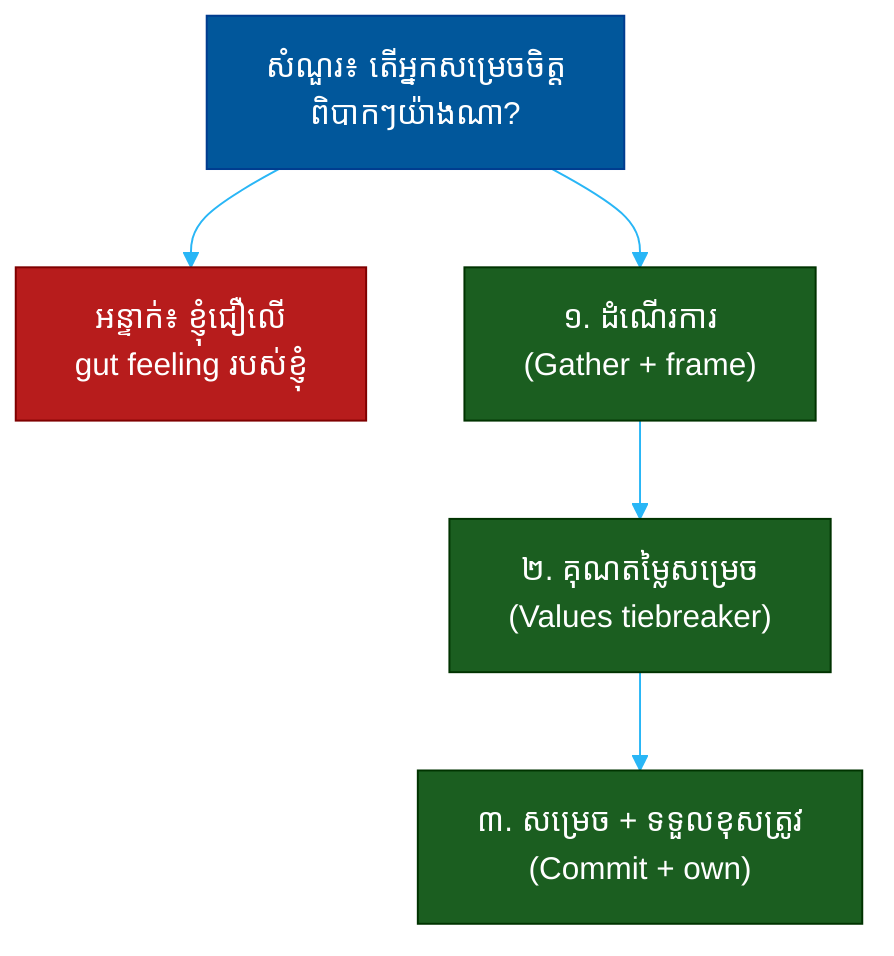

# "តើអ្នកធ្វើការសម្រេចចិត្តពិបាកៗយ៉ាងណា?" (How Do You Make Hard Decisions?)៖ សំណួរតែមួយដែលបង្ហាញពីដំណើរការគិត គុណតម្លៃ និងភាពក្លាហាន

**Author:** ichamrong  
**Date:** 2026-05-30  
**Tags:** #one-question #leadership #decision-making #judgment #values #communication  
**Category:** Concepts / One Question  
**Read Time:** ~12 min  

---

## 📌 មាតិកា (Table of Contents)
- [អន្ទាក់ (The Setup)](#the-setup)
- [១. សំណួរពិតប្រាកដ (What They Are Really Asking)](#1)
- [២. អ្វីដែលវាបង្ហាញអំពីអ្នក (The Hidden Signals)](#2)
- [៣. អន្ទាក់ — ចម្លើយខ្សោយ (The Trap: Weak Answers)](#3)
- [៤. នីតិវិធីឆ្លើយតប (The Response Procedure)](#4)
- [៥. ឧទាហរណ៍ចម្លើយខ្លាំង (Strong Sample Answer)](#5)
- [៦. សំណួរបន្ត និងរបៀបដោះស្រាយ (Follow-up Traps)](#6)
- [សេចក្តីសន្និដ្ឋាន (Conclusion)](#conclusion)
- [ឯកសារយោង (References)](#references)
- [អត្ថបទពាក់ព័ន្ធ (Related Posts)](#related-posts)

---

## អន្ទាក់ (The Setup) 

អ្នកសម្ភាសន៍ឱនមុខបន្តិច ហើយសួរថា៖ **«តើអ្នកធ្វើការសម្រេចចិត្តពិបាកៗយ៉ាងណា?»**

ពាក្យគន្លឹះគឺ «ពិបាក» — ការសម្រេចចិត្តដែលគ្មានចម្លើយត្រឹមត្រូវច្បាស់លាស់, ដែលគ្រប់ជម្រើសសុទ្ធតែមានតម្លៃត្រូវបង់ (trade-offs)។ គេមិនចង់ឮ «ដំណើរការ» ស្អាតៗដែលធ្វើឲ្យការសម្រេចចិត្តងាយស្រួលនោះទេ។ គេចង់ឃើញ **របៀបដែលអ្នកគិត នៅពេលគ្មានចម្លើយល្អ**។

ក្នុងចម្លើយរបស់អ្នក គេអាន៖
* តើអ្នកមាន **ដំណើរការ** (process) ឬគ្រាន់តែសម្រេចតាមអារម្មណ៍?
* តើអ្នកសម្រេចតាម **គុណតម្លៃ** (values) អ្វី នៅពេលទិន្នន័យមិនច្បាស់?
* តើអ្នកស្មោះត្រង់នឹង **តម្លៃត្រូវបង់** ឬធ្វើពុតថាគ្រប់ការសម្រេចចិត្តងាយ?
* តើអ្នក **សម្រេច** មែន ឬពន្យាពេលរហូត (decisiveness)?

នេះជាផែនទីបង្ហាញផ្លូវសម្រាប់ការឆ្លើយតបឲ្យបានល្អ៖

---

## ១. សំណួរពិតប្រាកដ (What They Are Really Asking) 

គេមិនមែនចង់ស្គាល់ «រូបមន្ត» វេទមន្តណាមួយទេ។ ការសម្រេចចិត្តពិបាក គឺពិបាក *ព្រោះ* គ្មានរូបមន្ត។ អ្វីដែលគេពិតជាសួរគឺ៖

> **«តើ​ខ្ញុំ​ទុក​ចិត្ត​អ្នក​ឲ្យ​សម្រេច​ចិត្ត​ដោយ​គ្មាន​ខ្ញុំ​នៅ​ក្បែរ​បាន​ឬ​ទេ?»**

អ្នកដឹកនាំមិនអាចនៅគ្រប់កន្លែងបានទេ។ គេត្រូវការមនុស្សដែលមាន **ការវិនិច្ឆ័យ** (judgment) ដែលអាចជឿទុកចិត្តបាន — ដែលនឹងសម្រេចចិត្តស្របនឹងគុណតម្លៃ ទោះពេលគេមិននៅ។

ដូច្នេះ សំណួរនេះវាស់ ៣ យ៉ាង៖
1. **ដំណើរការ (Process)** — តើអ្នកមានវិធីសាស្ត្រ ឬមានតែអារម្មណ៍?
2. **គុណតម្លៃ (Values)** — តើអ្វីជាគោលការណ៍ ដែលអ្នកប្រើនៅពេលលំបាក?
3. **ភាពក្លាហាន (Decisiveness)** — តើអ្នកហ៊ានសម្រេច និងទទួលខុសត្រូវ?

---

## ២. អ្វីដែលវាបង្ហាញអំពីអ្នក (The Hidden Signals) 

| សញ្ញាដែលគេអាន | ចម្លើយខ្សោយបង្ហាញ | ចម្លើយខ្លាំងបង្ហាញ |
| :--- | :--- | :--- |
| **ដំណើរការ (Process)** | «តាមអារម្មណ៍», «តាមករណី» | មានជំហានច្បាស់ ប្រើបានឡើងវិញ |
| **គុណតម្លៃ (Values)** | គ្មានគោលការណ៍ដឹកនាំ | ដឹងថាអ្វីសំខាន់ជាង នៅពេលប៉ះទង្គិច |
| **ភស្តុតាង (Evidence)** | សម្រេចមុនពេលប្រមូលព័ត៌មាន | ប្រមូលទិន្នន័យ ប៉ុន្តែមិនពន្យាពេលហួស |
| **ភាពក្លាហាន (Decisiveness)** | ពន្យាពេល ឬប្រគល់ឲ្យគេ | សម្រេច និងទទួលខុសត្រូវ |
| **ការឆ្លុះបញ្ចាំង (Reflection)** | មិនរៀនពីការសម្រេចចាស់ | ពិនិត្យឡើងវិញ និងកែតម្រូវ |

**ចំណុចសំខាន់៖** ភាពលឿនពេក (រលូត) គឺជាសញ្ញាក្រហម — បង្ហាញការសម្រេចមិនបានគិត។ ភាពយឺតពេក (វិភាគរហូត) ក៏ជាសញ្ញាក្រហមដែរ — បង្ហាញការខ្លាចទទួលខុសត្រូវ។ ចម្លើយល្អបង្ហាញ **ដំណើរការ + ភាពក្លាហានសម្រេច**។

---

## ៣. អន្ទាក់ — ចម្លើយខ្សោយ (The Trap: Weak Answers) 

**អន្ទាក់ទី ១ — អ្នកជឿអារម្មណ៍ (The Gut-Truster):**
> «ខ្ញុំជឿលើ instinct របស់ខ្ញុំ វាមិនដែលខុសទេ»

ហេតុអ្វីបរាជ័យ៖ គ្មានដំណើរការ មានន័យថាការសម្រេចចិត្តរបស់អ្នកមិនអាចព្យាករ ឬជឿទុកចិត្តបាន។ អារម្មណ៍មិនអាចបង្រៀន ឬធ្វើមាត្រដ្ឋាន (scale) បានទេ។

**អន្ទាក់ទី ២ — អ្នកវិភាគមិនចេះចប់ (The Analysis-Paralysis):**
> «ខ្ញុំប្រមូលទិន្នន័យឲ្យបានច្រើនបំផុត រួចវិភាគរហូតដល់ច្បាស់ ១០០%»

ហេតុអ្វីបរាជ័យ៖ ការសម្រេចចិត្តពិបាក *គ្មាន* ភាពច្បាស់ ១០០% ទេ។ បើអ្នករង់ចាំ អ្នកនឹងមិនដែលសម្រេច — ហើយការមិនសម្រេច គឺជាការសម្រេចមួយដែរ។

**អន្ទាក់ទី ៣ — អ្នកប្រគល់ការ (The Deferrer):**
> «ខ្ញុំសួរចៅហ្វាយ ឬឲ្យក្រុមបោះឆ្នោត»

ហេតុអ្វីបរាជ័យ៖ ការសុំការយល់ព្រម (consensus) គឺល្អ ប៉ុន្តែបើ *រាល់* ការសម្រេចចិត្តពិបាក អ្នកប្រគល់ឲ្យគេ — នោះមិនមែនជាការដឹកនាំទេ។

---

## ៤. នីតិវិធីឆ្លើយតប (The Response Procedure) 

ចម្លើយខ្លាំងមាន **៣ ផ្នែក** តាមលំដាប់៖

**ជំហានទី ១ — ដំណើរការ (Frame the Decision)**
បង្ហាញថាអ្នកមានវិធីសាស្ត្រ៖ ប្រមូលព័ត៌មាន, កំណត់ជម្រើស, ស្វែងយល់តម្លៃត្រូវបង់។
> «ដំបូង​ខ្ញុំ​ញែក​ការ​ពិត​ចេញ​ពី​ការ​ស្មាន, រួច​សរសេរ​ជម្រើស​ចំៗ និង​តម្លៃ​ត្រូវ​បង់​នៃ​នីមួយៗ»

នេះបង្ហាញ **ការគិតជាប្រព័ន្ធ**។

**ជំហានទី ២ — គុណតម្លៃសម្រេច (Use Values as Tiebreaker)**
នៅពេលទិន្នន័យមិនអាចសម្រេច, ប្រាប់ថាគុណតម្លៃអ្វីដែលអ្នកប្រើ។
> «ពេល​ជម្រើស​ស្មើ​គ្នា ខ្ញុំ​ជ្រើស​យក​អ្វី​ដែល​ការ​ពារ​ការ​ទុក​ចិត្ត​រយៈ​ពេល​វែង ជា​ជាង​ការ​ឈ្នះ​រយៈ​ពេល​ខ្លី»

នេះបង្ហាញ **គុណតម្លៃ** និងគោលការណ៍។

**ជំហានទី ៣ — សម្រេច និងទទួលខុសត្រូវ (Commit and Own)**
បញ្ចប់ដោយការសម្រេច និងការទទួលខុសត្រូវ ទោះលទ្ធផលយ៉ាងណា។
> «បន្ទាប់​មក​ខ្ញុំ​សម្រេច​ឲ្យ​ច្បាស់ ប្រាប់​មនុស្ស​ពី​មូល​ហេតុ និង​ទទួល​ខុស​ត្រូវ​លើ​លទ្ធផល»

នេះបង្ហាញ **ភាពក្លាហាន** និងភាពជាម្ចាស់។

---

## ៥. ឧទាហរណ៍ចម្លើយខ្លាំង (Strong Sample Answer) 

> **«ខ្ញុំ​ចាប់​ផ្តើម​ដោយ​ញែក​អ្វី​ដែល​ខ្ញុំ​ដឹង​ច្បាស់​ចេញ​ពី​អ្វី​ដែល​ខ្ញុំ​គ្រាន់​តែ​ស្មាន រួច​សរសេរ​ជម្រើស​ពីរ​បី ហើយ​ដាក់​តម្លៃ​ត្រូវ​បង់​នៃ​នីមួយៗ​ឲ្យ​ច្បាស់។ ពេល​ទិន្នន័យ​មិន​អាច​សម្រេច​ជំនួស​ខ្ញុំ​បាន ខ្ញុំ​ត្រឡប់​ទៅ​រក​គោល​ការណ៍៖ ការ​សម្រេច​ណា​ការ​ពារ​ការ​ទុក​ចិត្ត​របស់​អតិថិជន​រយៈ​ពេល​វែង។ បន្ទាប់​មក​ខ្ញុំ​សម្រេច​ឲ្យ​ច្បាស់, ពន្យល់​ក្រុម​ពី​មូល​ហេតុ ហើយ​ប្រាប់​ថា​ខ្ញុំ​ទទួល​ខុស​ត្រូវ​បើ​វា​ខុស។ ខ្ញុំ​ឃើញ​ការ​មិន​ហ៊ាន​សម្រេច​ថា​អាក្រក់​ជាង​ការ​សម្រេច​ខុស ព្រោះ​ការ​សម្រេច​ខុស​ខ្ញុំ​អាច​កែ​បាន។»**

**ការវិភាគ (Breakdown):**
* «ញែក​ការ​ដឹង​ចេញ​ពី​ការ​ស្មាន... តម្លៃ​ត្រូវ​បង់» → ដំណើរការ (process)
* «ត្រឡប់​ទៅ​រក​គោល​ការណ៍...» → គុណតម្លៃ (values tiebreaker)
* «សម្រេច​ឲ្យ​ច្បាស់... ទទួល​ខុស​ត្រូវ» → ភាពក្លាហាន (ownership)
* «ការ​មិន​ហ៊ាន​សម្រេច​អាក្រក់​ជាង...» → ភាពចាស់ទុំ (maturity)

**ប្រៀបធៀប៖**
* ❌ ខ្សោយ៖ «ខ្ញុំជឿលើ gut feeling»
* ✅ ខ្លាំង៖ ដំណើរការ → គុណតម្លៃ → សម្រេច

---

## ៦. សំណួរបន្ត និងរបៀបដោះស្រាយ (Follow-up Traps) 

អ្នកសម្ភាសន៍ល្អនឹងសួរបន្ត ដើម្បីសាកល្បងថាដំណើរការរបស់អ្នកពិតឬត្រឹមទ្រឹស្តី៖

**«ប្រាប់ខ្ញុំពីការសម្រេចចិត្តដែលអ្នកសម្រេចខុស» (Tell me about a wrong call.)**
> កុំ​លាក់។ ប្រាប់​ករណី​ពិត, អ្វី​ដែល​អ្នក​រៀន ហើយ​អ្វី​ដែល​អ្នក​ផ្លាស់​ប្តូរ​ក្រោយ​មក។ ភាព​ស្មោះ​ត្រង់​ពី​កំហុស​បង្ហាញ​ភាព​ចាស់​ទុំ​ជាង​ការ​ធ្វើ​ពុត​ថា​មិន​ដែល​ខុស។

**«ចុះបើគ្មានពេលគិត?» (What if there's no time?)**
> «ការ​សម្រេច​ចិត្ត​លឿន​ខ្ញុំ​ពឹង​លើ​គោល​ការណ៍​ដែល​ខ្ញុំ​បាន​សម្រេច​ទុក​ជា​មុន (pre-decided principles)។ ការ​មាន​គុណ​តម្លៃ​ច្បាស់​ធ្វើ​ឲ្យ​ការ​សម្រេច​លឿន​មិន​មែន​ការ​សម្រេច​ខ្វាក់។»

**ច្បាប់មាស៖** រាល់សំណួរបន្ត គឺការសាកល្បងថាតើ «គុណតម្លៃ» នៅជំហានទី ២ ពិតប្រាកដ ឬគ្រាន់តែពាក្យ។ បើគុណតម្លៃរបស់អ្នកពិត ឧទាហរណ៍ពិតរបស់អ្នកនឹងបញ្ជាក់វា។

---

## សេចក្តីសន្និដ្ឋាន (Conclusion) 

សំណួរ «តើអ្នកសម្រេចចិត្តពិបាកៗយ៉ាងណា?» មិនមែនសុំរូបមន្តទេ។ វាជា **កញ្ចក់នៃការវិនិច្ឆ័យ** (judgment) របស់អ្នក — ដែលជាអ្វីដែលធ្វើឲ្យអ្នកអាចជឿទុកចិត្តបាន នៅពេលគេមិននៅ។

ចងចាំរូបមន្ត ៣ ផ្នែក៖
1. **ដំណើរការ** (ខ្ញុំញែក... ដាក់តម្លៃត្រូវបង់)
2. **គុណតម្លៃសម្រេច** (ពេលស្មើគ្នា ខ្ញុំជ្រើស...)
3. **សម្រេច និងទទួលខុសត្រូវ** (ខ្ញុំសម្រេច និងទទួលខុសត្រូវ)

ដំណើរការ​ច្បាស់​បូក​នឹង​គុណ​តម្លៃ​ច្បាស់​បូក​នឹង​ភាព​ក្លាហាន — នោះ​ជា​អ្វី​ដែល​ធ្វើ​ឲ្យ​ការ​សម្រេច​ចិត្ត​របស់​អ្នក​អាច​ទុក​ចិត្ត​បាន។

---

## ឯកសារយោង (References) 

- *Thinking, Fast and Slow* — Daniel Kahneman
- *Principles* — Ray Dalio
- *The Decision Book* — Krogerus & Tschäppeler

---

## អត្ថបទពាក់ព័ន្ធ (Related Posts) 

- [Where Do You See This in 5 Years? (ចក្ខុវិស័យ)](01-where-in-five-years.md)
- [Tell Me About a Time You Failed (ការបរាជ័យ)](03-tell-me-about-a-time-you-failed.md)
- [One Question Index](../README.md)
