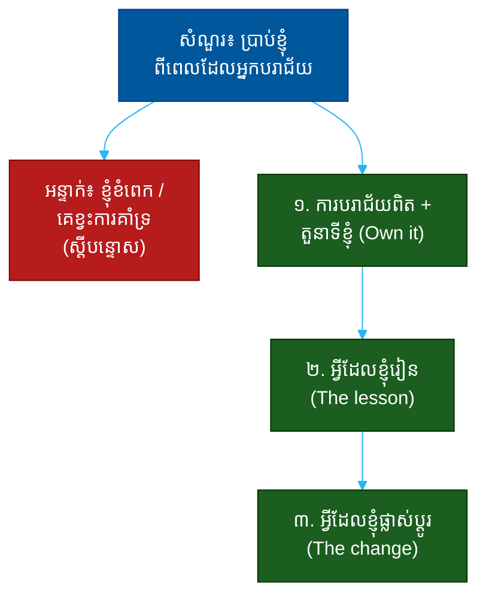

# "ប្រាប់ខ្ញុំពីពេលដែលអ្នកបរាជ័យ" (Tell Me About a Time You Failed)៖ សំណួរតែមួយដែលបង្ហាញពីភាពស្មោះត្រង់ ការទទួលខុសត្រូវ និងការរៀនសូត្រ

**Author:** ichamrong  
**Date:** 2026-05-30  
**Tags:** #one-question #leadership #failure #accountability #growth #self-awareness #communication  
**Category:** Concepts / One Question  
**Read Time:** ~12 min  

---

## 📌 មាតិកា (Table of Contents)
- [អន្ទាក់ (The Setup)](#the-setup)
- [១. សំណួរពិតប្រាកដ (What They Are Really Asking)](#1)
- [២. អ្វីដែលវាបង្ហាញអំពីអ្នក (The Hidden Signals)](#2)
- [៣. អន្ទាក់ — ចម្លើយខ្សោយ (The Trap: Weak Answers)](#3)
- [៤. នីតិវិធីឆ្លើយតប (The Response Procedure)](#4)
- [៥. ឧទាហរណ៍ចម្លើយខ្លាំង (Strong Sample Answer)](#5)
- [៦. សំណួរបន្ត និងរបៀបដោះស្រាយ (Follow-up Traps)](#6)
- [សេចក្តីសន្និដ្ឋាន (Conclusion)](#conclusion)
- [ឯកសារយោង (References)](#references)
- [អត្ថបទពាក់ព័ន្ធ (Related Posts)](#related-posts)

---

## អន្ទាក់ (The Setup) 

អ្នកសម្ភាសន៍និយាយដោយស្ងប់ស្ងាត់ថា៖ **«ប្រាប់ខ្ញុំពីពេលដែលអ្នកបរាជ័យ»**

នេះជាសំណួរដ៏គ្រោះថ្នាក់បំផុតមួយ — ព្រោះវាបង្ខំអ្នកឲ្យនិយាយអំពីភាពអន់ខ្សោយរបស់ខ្លួន។ មនុស្សភាគច្រើនធ្លាក់ចូលអន្ទាក់មួយក្នុងចំណោមពីរ៖ លាក់បាំងការបរាជ័យ ឬនិយាយវាដោយការ​ស្តីបន្ទោសអ្នកដទៃ។ ប៉ុន្តែគេមិនកំពុងសួរអំពី *ការបរាជ័យ* នោះទេ — គេកំពុងសួរអំពី **របៀបដែលអ្នកប្រព្រឹត្តចំពោះការបរាជ័យ**។

ក្នុងចម្លើយ គេអាន៖
* តើអ្នកមាន **ភាពស្មោះត្រង់** គ្រប់គ្រាន់ដើម្បីទទួលស្គាល់ការបរាជ័យពិត?
* តើអ្នក **ទទួលខុសត្រូវ** (own it) ឬស្តីបន្ទោសកាលៈទេសៈ?
* តើអ្នក **រៀន** អ្វីពិតប្រាកដ និងបានផ្លាស់ប្តូរអ្វី?
* តើអ្នកមាន **ការដឹងខ្លួន** (self-awareness) ឬមើលមិនឃើញកំហុសខ្លួនឯង?

នេះជាផែនទីបង្ហាញផ្លូវសម្រាប់ការឆ្លើយតបឲ្យបានល្អ៖

---

## ១. សំណួរពិតប្រាកដ (What They Are Really Asking) 

គេមិនកំពុងសុំ «រឿងភ័យ» ដើម្បីវិនិច្ឆ័យអ្នកទេ។ មនុស្សគ្រប់រូបបរាជ័យ — នោះមិនមែនជាការសាកល្បងទេ។ អ្វីដែលគេពិតជាសួរគឺ៖

> **«ពេល​អ្នក​បាក់​ស្បាត តើ​អ្នក​ក្លាយ​ជា​មនុស្ស​ដែល​ទទួល​ស្គាល់​និង​រៀន ឬ​ជា​មនុស្ស​ដែល​ស្តី​បន្ទោស​និង​លាក់​បាំង?»**

អ្នកដឹកនាំល្អត្រូវការមនុស្សដែលអាច **ប្រឈមមុខនឹងការពិត** ដោយមិនការពារខ្លួនពេក។ មនុស្សដែលលាក់ការបរាជ័យ នឹងលាក់ការបរាជ័យក្នុងការងារផងដែរ — ហើយនោះគ្រោះថ្នាក់។

ដូច្នេះ សំណួរនេះវាស់ ៣ យ៉ាង៖
1. **ភាពស្មោះត្រង់ (Honesty)** — តើអ្នកនិយាយការបរាជ័យពិត?
2. **ការទទួលខុសត្រូវ (Accountability)** — តើអ្នកទទួលស្គាល់តួនាទីខ្លួនឯង?
3. **ការរៀនសូត្រ (Growth)** — តើអ្នកបានផ្លាស់ប្តូរអ្វីពិតប្រាកដ?

---

## ២. អ្វីដែលវាបង្ហាញអំពីអ្នក (The Hidden Signals) 

| សញ្ញាដែលគេអាន | ចម្លើយខ្សោយបង្ហាញ | ចម្លើយខ្លាំងបង្ហាញ |
| :--- | :--- | :--- |
| **ភាពស្មោះត្រង់ (Honesty)** | ការបរាជ័យក្លែងក្លាយ ឬតូច | ការបរាជ័យពិត ដែលឈឺចាប់ |
| **ការទទួលខុសត្រូវ (Ownership)** | «ពួកគេ/កាលៈទេសៈ ខុស» | «ខ្ញុំ​បាន​សម្រេច​ខុស​ត្រង់...» |
| **ការដឹងខ្លួន (Self-awareness)** | មិនយល់ថាហេតុអ្វីបរាជ័យ | ដឹងពីឫសគល់នៃកំហុស |
| **ការរៀន (Growth)** | «ខ្ញុំខំខ្លាំងជាងមុន» (ឥតរូបរាង) | ផ្លាស់ប្តូរជាក់ស្តែង ដែលនៅជាប់ |
| **ភាពចាស់ទុំ (Maturity)** | អារម្មណ៍នៅរ៉ាំរ៉ៃ ឬការពារ | និយាយដោយស្ងប់ និងបើកចំហ |

**ចំណុចសំខាន់៖ ** ការ «បរាជ័យ​ក្លែងក្លាយ» (humble brag) ដូចជា «កំហុសខ្ញុំគឺខ្ញុំខំពេក» គឺជាសញ្ញាក្រហមធំ។ វាបង្ហាញថាអ្នកមិនហ៊ានទទួលស្គាល់ការបរាជ័យពិត។ ចម្លើយល្អត្រូវ **ឈឺចាប់បន្តិច** ដើម្បីបញ្ជាក់ថាវាពិត។

---

## ៣. អន្ទាក់ — ចម្លើយខ្សោយ (The Trap: Weak Answers) 

**អន្ទាក់ទី ១ — អ្នកអួត (The Humble-Bragger):**
> «ការបរាជ័យធំបំផុតរបស់ខ្ញុំ គឺខ្ញុំខំធ្វើការច្រើនពេក និងយកចិត្តទុកដាក់ខ្លាំងពេក»

ហេតុអ្វីបរាជ័យ៖ វាមិនមែនជាការបរាជ័យទេ — វាជាការអួតលាក់មុខ។ គេឃើញភ្លាមថាអ្នកមិនហ៊ានស្មោះត្រង់។

**អន្ទាក់ទី ២ — អ្នកស្តីបន្ទោស (The Blamer):**
> «គម្រោងបរាជ័យ ព្រោះក្រុមមិនសហការ ហើយថ្នាក់លើមិនគាំទ្រ»

ហេតុអ្វីបរាជ័យ៖ បើគ្រប់យ៉ាងជាកំហុសអ្នកដទៃ មានន័យថាអ្នកគ្មានការគ្រប់គ្រងលើជីវិតរបស់ខ្លួន — ហើយអ្នកនឹងធ្វើដូចគ្នាជាមួយគេនៅពេលក្រោយ។

**អន្ទាក់ទី ៣ — អ្នកគ្មានមេរៀន (The No-Lesson):**
> «បាទ ខ្ញុំធ្លាប់បរាជ័យ ប៉ុន្តែវាជារឿងអតីតកាលហើយ»

ហេតុអ្វីបរាជ័យ៖ បើគ្មានមេរៀន ការបរាជ័យគ្រាន់តែជារឿងអាក្រក់ មិនមែនការរីកចម្រើន។ គេចង់ឃើញ **ការផ្លាស់ប្តូរ** ដែលកើតចេញពីវា។

---

## ៤. នីតិវិធីឆ្លើយតប (The Response Procedure) 

ចម្លើយខ្លាំងមាន **៣ ផ្នែក** តាមលំដាប់ (រូបមន្ត Own-Learn-Change)៖

**ជំហានទី ១ — ការបរាជ័យពិត និងតួនាទីខ្លួនឯង (Own It)**
ជ្រើសរើសការបរាជ័យពិត ហើយប្រាប់ច្បាស់ថា *អ្នក* បានធ្វើខុសត្រង់ណា។
> «ខ្ញុំ​បាន​ដឹក​នាំ​គម្រោង​មួយ​ដែល​បរាជ័យ ព្រោះ​ខ្ញុំ​សន្មត់​ពី​តម្រូវ​ការ​អតិថិជន ដោយ​មិន​បាន​សួរ​ពួក​គេ​ឲ្យ​បាន​គ្រប់​គ្រាន់»

កុំស្តីបន្ទោសអ្នកដទៃ។ កុំធ្វើឲ្យវាតូច។

**ជំហានទី ២ — អ្វីដែលអ្នករៀន (The Lesson)**
បកស្រាយឫសគល់ និងមេរៀនពិត។
> «ខ្ញុំ​បាន​រៀន​ថា​ការ​សន្មត់​មាន​តម្លៃ​ថ្លៃ​ជាង​ការ​សួរ ហើយ​ល្បឿន​មិន​មែន​ល្អ​បើ​យើង​ប្រញាប់​ខុស​ទិស»

នេះបង្ហាញ **ការដឹងខ្លួន**។

**ជំហានទី ៣ — អ្វីដែលអ្នកផ្លាស់ប្តូរ (The Change)**
បញ្ចប់ដោយការផ្លាស់ប្តូរជាក់ស្តែង ដែលនៅជាប់រហូតមកដល់ឥឡូវ។
> «ឥឡូវ​នេះ ខ្ញុំ​មិន​ដែល​ចាប់​ផ្តើម​គម្រោង​ដោយ​គ្មាន​ការ​សម្ភាសន៍​អតិថិជន​យ៉ាង​ហោច​ប្រាំ​នាក់​ជា​មុន​ឡើយ»

នេះបង្ហាញ **ការរីកចម្រើនពិត**។

---

## ៥. ឧទាហរណ៍ចម្លើយខ្លាំង (Strong Sample Answer) 

> **«កាល​ខ្ញុំ​ដឹក​នាំ​ការ​បញ្ចេញ​ផលិតផល​ដំបូង ខ្ញុំ​បាន​សម្រេច​ឲ្យ​ចេញ​លឿន​ដើម្បី​ឈ្នះ​គូ​ប្រកួត។ ខ្ញុំ​សន្មត់​ថា​ខ្ញុំ​ដឹង​អ្វី​ដែល​អតិថិជន​ចង់​បាន — ប៉ុន្តែ​ខ្ញុំ​ខុស ហើយ​ផលិតផល​នោះ​គ្មាន​អ្នក​ប្រើ។ នោះ​ជា​កំហុស​របស់​ខ្ញុំ ព្រោះ​ខ្ញុំ​ជា​អ្នក​ជ្រើស​ល្បឿន​ជំនួស​ឲ្យ​ការ​យល់​ដឹង។ ខ្ញុំ​បាន​រៀន​ថា​ការ​សន្មត់​ដែល​មិន​បាន​ផ្ទៀង​ផ្ទាត់​គឺ​ជា​ហានិភ័យ​ធំ​បំផុត។ ចាប់​តាំង​ពី​ពេល​នោះ​មក គ្រប់​គម្រោង​ខ្ញុំ​ចាប់​ផ្តើម​ដោយ​ការ​សម្ភាសន៍​អតិថិជន​ពិត​ប្រាកដ​ជា​មុន — ហើយ​គម្រោង​ពីរ​ក្រោយ​មក​ជោគ​ជ័យ​ព្រោះ​មេរៀន​នោះ។»**

**ការវិភាគ (Breakdown):**
* «នោះ​ជា​កំហុស​របស់​ខ្ញុំ ព្រោះ​ខ្ញុំ​ជា​អ្នក​ជ្រើស...» → ការទទួលខុសត្រូវ (ownership)
* «ការ​សន្មត់​មិន​បាន​ផ្ទៀង​ផ្ទាត់​គឺ​ហានិភ័យ​ធំ​បំផុត» → មេរៀនពិត (lesson)
* «ចាប់​ពី​ពេល​នោះ... សម្ភាសន៍​អតិថិជន​ជា​មុន» → ការផ្លាស់ប្តូរ (change)
* «គម្រោង​ពីរ​ក្រោយ​មក​ជោគ​ជ័យ» → ភស្តុតាងថាមេរៀននៅជាប់ (proof)

**ប្រៀបធៀប៖**
* ❌ ខ្សោយ៖ «កំហុសខ្ញុំគឺខ្ញុំខំពេក»
* ✅ ខ្លាំង៖ ទទួលស្គាល់ → រៀន → ផ្លាស់ប្តូរ → បញ្ជាក់

---

## ៦. សំណួរបន្ត និងរបៀបដោះស្រាយ (Follow-up Traps) 

អ្នកសម្ភាសន៍ល្អនឹងសួរបន្ត ដើម្បីសាកល្បងថាការទទួលខុសត្រូវរបស់អ្នកពិតឬនិយាយលេង៖

**«ចុះអ្នកដទៃក្នុងក្រុមមិនមានកំហុសសោះទេ?» (Did no one else contribute?)**
> កុំ​ប្តូរ​ទៅ​ស្តី​បន្ទោស។ «អ្នក​ដទៃ​អាច​មាន​ផ្នែក​ខ្លះ ប៉ុន្តែ​ខ្ញុំ​ជា​អ្នក​ដឹក​នាំ — ដូច្នេះ​លទ្ធផល​ជា​ការ​ទទួល​ខុស​ត្រូវ​របស់​ខ្ញុំ។» នេះបង្ហាញភាពចាស់ទុំ។

**«បើជួបស្ថានភាពនោះម្តងទៀត តើធ្វើដូចម្តេច?» (What would you do differently?)**
> ត្រូវ​ឆ្លើយ​បាន​ច្បាស់​និង​ជាក់​លាក់។ បើ​មេរៀន​ពិត អ្នក​នឹង​ដឹង​ភ្លាម​ថា​ត្រូវ​ផ្លាស់​ប្តូរ​អ្វី — នោះ​ជា​ភ័ស្តុតាង​ថា​អ្នក​ពិត​ជា​បាន​រៀន។

**ច្បាប់មាស៖** រាល់សំណួរបន្ត គឺការសាកល្បងថាតើ «ការទទួលខុសត្រូវ» នៅជំហានទី ១ ពិតប្រាកដ ឬគ្រាន់តែការនិយាយ។ បើអ្នកទទួលស្គាល់ពិតៗ អ្នកនឹងមិនរត់ត្រឡប់ទៅរកការស្តីបន្ទោសទេ។

---

## សេចក្តីសន្និដ្ឋាន (Conclusion) 

សំណួរ «ប្រាប់ខ្ញុំពីពេលដែលអ្នកបរាជ័យ» មិនមែនជាការសាកល្បងថាតើអ្នកធ្លាប់បរាជ័យឬអត់ទេ។ វាជា **កញ្ចក់នៃរបៀបដែលអ្នកប្រព្រឹត្តចំពោះការបរាជ័យ** — ដែលជាសញ្ញាដ៏ល្អបំផុតមួយនៃភាពចាស់ទុំជាអ្នកដឹកនាំ។

ចងចាំរូបមន្ត ៣ ផ្នែក (Own-Learn-Change)៖
1. **ទទួលស្គាល់** (នោះជាកំហុសរបស់ខ្ញុំ ត្រង់...)
2. **រៀន** (ខ្ញុំបានរៀនថា...)
3. **ផ្លាស់ប្តូរ** (ឥឡូវនេះ ខ្ញុំ...)

ភាព​ស្មោះ​ត្រង់​ដែល​ឈឺ​ចាប់​បន្តិច រួម​នឹង​មេរៀន​ដែល​នៅ​ជាប់ — នោះ​ជា​អ្វី​ដែល​បង្ហាញ​ថា​អ្នក​ជា​មនុស្ស​ដែល​រីក​ចម្រើន​ពី​ការ​បរាជ័យ មិន​មែន​ខូច​ដោយ​សារ​វា។

---

## ឯកសារយោង (References) 

- *Mindset* — Carol Dweck
- *Black Box Thinking* — Matthew Syed
- *Dare to Lead* — Brené Brown

---

## អត្ថបទពាក់ព័ន្ធ (Related Posts) 

- [How Do You Make Hard Decisions? (ការសម្រេចចិត្ត)](02-how-do-you-make-hard-decisions.md)
- [How Do You Handle Disagreement? (ការមិនយល់ស្រប)](04-how-do-you-handle-disagreement.md)
- [One Question Index](../README.md)
