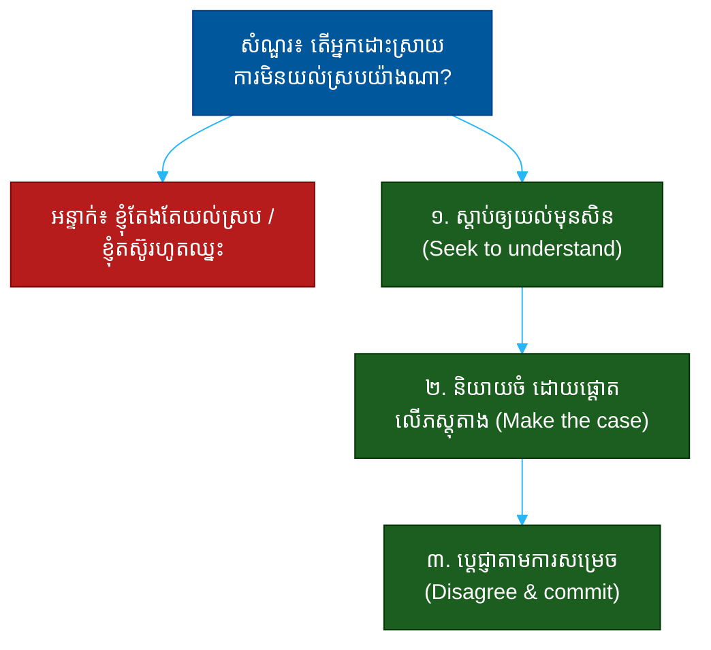

# "តើអ្នកដោះស្រាយការមិនយល់ស្របយ៉ាងណា?" (How Do You Handle Disagreement?)៖ សំណួរតែមួយដែលបង្ហាញពីភាពចាស់ទុំ ការគោរព និងភាពក្លាហានដែលមានគោលដៅ

**Author:** ichamrong  
**Date:** 2026-05-30  
**Tags:** #one-question #leadership #conflict #communication #maturity #collaboration  
**Category:** Concepts / One Question  
**Read Time:** ~12 min  

---

## 📌 មាតិកា (Table of Contents)
- [អន្ទាក់ (The Setup)](#the-setup)
- [១. សំណួរពិតប្រាកដ (What They Are Really Asking)](#1)
- [២. អ្វីដែលវាបង្ហាញអំពីអ្នក (The Hidden Signals)](#2)
- [៣. អន្ទាក់ — ចម្លើយខ្សោយ (The Trap: Weak Answers)](#3)
- [៤. នីតិវិធីឆ្លើយតប (The Response Procedure)](#4)
- [៥. ឧទាហរណ៍ចម្លើយខ្លាំង (Strong Sample Answer)](#5)
- [៦. សំណួរបន្ត និងរបៀបដោះស្រាយ (Follow-up Traps)](#6)
- [សេចក្តីសន្និដ្ឋាន (Conclusion)](#conclusion)
- [ឯកសារយោង (References)](#references)
- [អត្ថបទពាក់ព័ន្ធ (Related Posts)](#related-posts)

---

## អន្ទាក់ (The Setup) 

អ្នកសម្ភាសន៍សួរថា៖ **«តើអ្នកដោះស្រាយការមិនយល់ស្របជាមួយចៅហ្វាយ ឬក្រុមរបស់អ្នកយ៉ាងណា?»**

នេះជាសំណួរអន្ទាក់ពីរទិស។ បើអ្នកនិយាយថា «ខ្ញុំតែងតែយល់ស្រប» — អ្នកមើលទៅខ្សោយ និងគ្មានគំនិត។ បើអ្នកនិយាយថា «ខ្ញុំតស៊ូរហូតដល់ឈ្នះ» — អ្នកមើលទៅពិបាករួមការ។ គេចង់ឃើញ **របៀបដែលអ្នករុករកចន្លោះរវាងពីរ** (navigate the tension) — ការមានគំនិតផ្ទាល់ខ្លួន ប៉ុន្តែគោរពក្រុម។

ក្នុងចម្លើយ គេអាន៖
* តើអ្នកមាន **ភាពក្លាហាន** និយាយការពិត ឬ​ស្ងៀម​ដើម្បី​ឲ្យ​ស្រួល?
* តើអ្នកមិនយល់ស្រប **ដោយការគោរព** (disagree respectfully)?
* តើអ្នកដឹងពេលណាត្រូវ **ប្តេជ្ញាតាម** (disagree and commit)?
* តើគោលដៅរបស់អ្នកគឺ **លទ្ធផលល្អ** ឬ **ការឈ្នះ**?

នេះជាផែនទីបង្ហាញផ្លូវសម្រាប់ការឆ្លើយតបឲ្យបានល្អ៖

---

## ១. សំណួរពិតប្រាកដ (What They Are Really Asking) 

គេមិនកំពុងសួរថាតើអ្នកជាមនុស្សស្ងប់ ឬមនុស្សក្លាហានទេ។ គេកំពុងសួរថា៖

> **«តើ​អ្នក​អាច​មិន​យល់​ស្រប​ដោយ​មិន​បំផ្លាញ​ទំនាក់​ទំនង ហើយ​ប្តេជ្ញា​ដោយ​មិន​ខ្លាច​បាត់​មុខ​ដែរ​ឬ​ទេ?»**

ក្រុមការងារល្អ *ត្រូវការ* ការមិនយល់ស្រប — នោះជារបៀបដែលគំនិតអាក្រក់ត្រូវបានរកឃើញ។ ប៉ុន្តែការមិនយល់ស្របដោយគ្មានការគោរព បំផ្លាញការទុកចិត្ត។ អ្នកដឹកនាំចង់បានមនុស្សដែលនិយាយការពិត *ហើយ* អាចធ្វើការជាមួយក្រុមបន្ទាប់ពីការសម្រេចចិត្ត។

ដូច្នេះ សំណួរនេះវាស់ ៣ យ៉ាង៖
1. **ភាពក្លាហាន (Courage)** — តើអ្នកហ៊ាននិយាយការពិត?
2. **ការគោរព (Respect)** — តើអ្នកមិនយល់ស្របដោយរបៀបណា?
3. **ភាពចាស់ទុំ (Maturity)** — តើអ្នកដឹងពេលត្រូវឈប់ និងប្តេជ្ញាតាម?

---

## ២. អ្វីដែលវាបង្ហាញអំពីអ្នក (The Hidden Signals) 

| សញ្ញាដែលគេអាន | ចម្លើយខ្សោយបង្ហាញ | ចម្លើយខ្លាំងបង្ហាញ |
| :--- | :--- | :--- |
| **ភាពក្លាហាន (Courage)** | ស្ងៀមដើម្បីឲ្យស្រួល | និយាយការពិតដោយគួរសម |
| **ការស្តាប់ (Listening)** | ការពារគំនិតខ្លួនភ្លាម | ស្វែងយល់មុខងារផ្សេងមុនសិន |
| **គោលដៅ (Intent)** | ចង់ឈ្នះ ឬមានសិទ្ធិ | ចង់បានលទ្ធផលល្អបំផុត |
| **ការប្តេជ្ញា (Commit)** | រអ៊ូ ឬធ្វើទប់ស្កាត់ | ប្តេជ្ញាពេញលេញក្រោយការសម្រេច |
| **ការគ្រប់គ្រងអារម្មណ៍ (EQ)** | យកវាជារឿងផ្ទាល់ខ្លួន | ញែកគំនិតចេញពីមនុស្ស |

**ចំណុចសំខាន់៖** «ការមិនយល់ស្រប ហើយប្តេជ្ញាតាម» (disagree and commit) គឺជាសញ្ញានៃភាពចាស់ទុំខ្ពស់បំផុត។ វាបង្ហាញថាអ្នកអាចតស៊ូឲ្យគំនិតរបស់អ្នក *ហើយ* គាំទ្រការសម្រេចចិត្តរបស់ក្រុមពេញលេញ បើទោះវាមិនមែនជាគំនិតរបស់អ្នកក៏ដោយ។

---

## ៣. អន្ទាក់ — ចម្លើយខ្សោយ (The Trap: Weak Answers) 

**អន្ទាក់ទី ១ — អ្នកគ្រប់ពេលយល់ស្រប (The Yes-Person):**
> «ខ្ញុំជឿលើ​ការ​ការពារ​ភាព​សុខ​ដុមនីយកម្ម ដូច្នេះ​ខ្ញុំ​តែង​តែ​យល់​ស្រប​ជាមួយ​ថ្នាក់​លើ»

ហេតុអ្វីបរាជ័យ៖ មនុស្សដែលមិនដែលមិនយល់ស្រប គឺឥតប្រយោជន៍សម្រាប់ការសម្រេចចិត្ត។ ថ្នាក់លើល្អ *ត្រូវការ* គេឮការពិតពិបាក។

**អន្ទាក់ទី ២ — អ្នកឈ្នះ (The Winner):**
> «ខ្ញុំ​បង្ហាញ​ភស្តុតាង​រហូត​ដល់​ពួក​គេ​យល់​ថា​ខ្ញុំ​ត្រូវ»

ហេតុអ្វីបរាជ័យ៖ គោលដៅ «ឈ្នះ» បង្ហាញ ego ខ្ពស់។ វាធ្វើឲ្យការមិនយល់ស្របក្លាយជាការប្រកួត មិនមែនការស្វែងរកការពិត។

**អន្ទាក់ទី ៣ — អ្នករអ៊ូ (The Saboteur):**
> «ខ្ញុំ​ប្រាប់​ពួក​គេ​ថា​ខ្ញុំ​យល់​ស្រប ប៉ុន្តែ​ខ្ញុំ​ធ្វើ​តាម​របៀប​របស់​ខ្ញុំ»

ហេតុអ្វីបរាជ័យ៖ ការយល់ស្របខាងមុខ ហើយទប់ស្កាត់ខាងក្រោយ គឺពុលបំផុត។ វាបំផ្លាញការទុកចិត្តទាំងស្រុង។

---

## ៤. នីតិវិធីឆ្លើយតប (The Response Procedure) 

ចម្លើយខ្លាំងមាន **៣ ផ្នែក** តាមលំដាប់៖

**ជំហានទី ១ — ស្តាប់ឲ្យយល់មុនសិន (Seek to Understand)**
ចាប់ផ្តើមដោយការស្វែងយល់ មុននឹងការពារ។
> «ដំបូង​ខ្ញុំ​សួរ​ឲ្យ​យល់​ច្បាស់​ពី​ហេតុ​ផល​ខាង​ក្រោយ — ជា​ញឹក​ញាប់​គេ​ឃើញ​អ្វី​ដែល​ខ្ញុំ​មិន​ឃើញ»

នេះបង្ហាញការគោរព និងភាពទន់ភ្លន់ (humility)។

**ជំហានទី ២ — និយាយចំ ដោយផ្តោតលើភស្តុតាង (Make the Case)**
បន្ទាប់មក និយាយគំនិតរបស់អ្នកដោយផ្តោតលើ *បញ្ហា* មិនមែន *មនុស្ស*។
> «ខ្ញុំ​បង្ហាញ​ការ​ព្រួយ​បារម្ភ​របស់​ខ្ញុំ​ដោយ​ផ្តោត​លើ​ទិន្នន័យ និង​លទ្ធផល​ដែល​យើង​ចង់​បាន មិន​មែន​លើ​នរណា​ត្រូវ»

នេះបង្ហាញ **ភាពក្លាហាន** ដែលមានគោលដៅ។

**ជំហានទី ៣ — ប្តេជ្ញាតាមការសម្រេច (Disagree and Commit)**
បញ្ចប់ដោយការគោរពការសម្រេចចិត្តចុងក្រោយ និងគាំទ្រវាពេញលេញ។
> «ប្រសិន​បើ​ការ​សម្រេច​ផ្ទុយ​ពី​គំនិត​ខ្ញុំ ខ្ញុំ​ប្តេជ្ញា​គាំទ្រ​វា​ពេញ​លេញ — ក្រុម​ត្រូវ​ការ​ការ​ឯកភាព​ដើម្បី​ដើរ​ទៅ​មុខ»

នេះបង្ហាញ **ភាពចាស់ទុំ**។

---

## ៥. ឧទាហរណ៍ចម្លើយខ្លាំង (Strong Sample Answer) 

> **«ខ្ញុំ​ចាប់​ផ្តើម​ដោយ​ការ​ស្តាប់ — ខ្ញុំ​សួរ​ឲ្យ​យល់​ហេតុ​ផល​ខាង​ក្រោយ​មុន​សិន ព្រោះ​ជា​ញឹក​ញាប់​មាន​បរិបទ​ដែល​ខ្ញុំ​ខ្វះ។ បើ​ខ្ញុំ​នៅ​តែ​មិន​យល់​ស្រប ខ្ញុំ​និយាយ​ការ​ព្រួយ​បារម្ភ​របស់​ខ្ញុំ​ឲ្យ​ច្បាស់ ដោយ​ផ្តោត​លើ​ទិន្នន័យ និង​លទ្ធផល​អតិថិជន — មិន​មែន​លើ​មោទនភាព​នរណា​ម្នាក់​ឡើយ។ ប៉ុន្តែ​នៅ​ពេល​ការ​សម្រេច​ត្រូវ​បាន​ធ្វើ​ឡើង បើ​ទោះ​វា​ផ្ទុយ​ពី​គំនិត​ខ្ញុំ ខ្ញុំ​គាំទ្រ​វា​១០០% — ខ្ញុំ​មិន​មែន​ជា​អ្នក​យល់​ស្រប​ខាង​មុខ​ហើយ​រអ៊ូ​ខាង​ក្រោយ​ទេ។ ការ​មិន​យល់​ស្រប​របស់​ខ្ញុំ​គឺ​ដើម្បី​លទ្ធផល​ល្អ​ជាង មិន​មែន​ដើម្បី​ឈ្នះ។»**

**ការវិភាគ (Breakdown):**
* «ខ្ញុំ​ចាប់​ផ្តើម​ដោយ​ការ​ស្តាប់...» → ការគោរព (humility)
* «ផ្តោត​លើ​ទិន្នន័យ... មិន​មែន​មោទនភាព​នរណា» → ភាពក្លាហានដែលមានគោលដៅ (courage)
* «គាំទ្រ​វា​១០០%... មិន​រអ៊ូ​ខាង​ក្រោយ» → ភាពចាស់ទុំ (disagree & commit)
* «ដើម្បី​លទ្ធផល​ល្អ​ជាង មិន​មែន​ដើម្បី​ឈ្នះ» → គោលដៅត្រឹមត្រូវ (intent)

**ប្រៀបធៀប៖**
* ❌ ខ្សោយ៖ «ខ្ញុំតែងតែយល់ស្រប» ឬ «ខ្ញុំតស៊ូរហូតឈ្នះ»
* ✅ ខ្លាំង៖ ស្តាប់ → និយាយចំ → ប្តេជ្ញាតាម

---

## ៦. សំណួរបន្ត និងរបៀបដោះស្រាយ (Follow-up Traps) 

អ្នកសម្ភាសន៍ល្អនឹងសួរបន្ត ដើម្បីសាកល្បងថាតុល្យភាពរបស់អ្នកពិតឬនិយាយ៖

**«ចុះបើអ្នកជឿថាការសម្រេចចិត្តនោះខុសធ្ងន់ធ្ងរ?» (What if the call is seriously wrong?)**
> «បើ​វា​ប៉ះ​ពាល់​ខាង​សីលធម៌ ឬ​ហានិភ័យ​ធ្ងន់​ធ្ងរ ខ្ញុំ​នឹង​លើក​វា​ឡើង​ម្តង​ទៀត​ឲ្យ​ច្បាស់ និង​ជា​លាយ​លក្ខណ៍​អក្សរ។ មាន​បន្ទាត់​ខណ្ឌ​មួយ​រវាង​ការ​ប្តេជ្ញា​តាម និង​ការ​ស្ងៀម​មុន​បញ្ហា​ធ្ងន់​ធ្ងរ។» នេះបង្ហាញការវិនិច្ឆ័យ។

**«ផ្តល់ឧទាហរណ៍ពេលអ្នកមិនយល់ស្របជាមួយចៅហ្វាយ» (Give an example.)**
> ប្រាប់​ករណី​ពិត ដែល​អ្នក​បាន​និយាយ​ការ​ពិត​ដោយ​គួរ​សម ហើយ​លទ្ធផល​ល្អ​ឡើង — ឬ​ករណី​ដែល​អ្នក​ប្តេជ្ញា​តាម ទោះ​មិន​យល់​ស្រប។ ឧទាហរណ៍​ពិត​បញ្ជាក់​ថា​ទ្រឹស្តី​របស់​អ្នក​ពិត​មែន។

**ច្បាប់មាស៖** រាល់សំណួរបន្ត គឺការសាកល្បងថាតើ «គោលដៅ» របស់អ្នកគឺលទ្ធផល ឬ ego។ បើគោលដៅអ្នកត្រឹមត្រូវ អ្នកនឹងឆ្លើយបានដោយស្ងប់ ដោយគ្មានការការពារខ្លួន។

---

## សេចក្តីសន្និដ្ឋាន (Conclusion) 

សំណួរ «តើអ្នកដោះស្រាយការមិនយល់ស្របយ៉ាងណា?» មិនមែនសុំឲ្យអ្នកជ្រើសរវាងស្ងៀម ឬតស៊ូទេ។ វាជា **ការវាស់ភាពចាស់ទុំ** — សមត្ថភាពមិនយល់ស្របដោយការគោរព ហើយប្តេជ្ញាដោយគ្មាន ego។

ចងចាំរូបមន្ត ៣ ផ្នែក៖
1. **ស្តាប់ឲ្យយល់មុនសិន** (ខ្ញុំសួរឲ្យយល់ហេតុផល...)
2. **និយាយចំ ផ្តោតលើភស្តុតាង** (ខ្ញុំបង្ហាញការព្រួយបារម្ភ លើទិន្នន័យ...)
3. **ប្តេជ្ញាតាមការសម្រេច** (ខ្ញុំគាំទ្រ ១០០% បើទោះ...)

មិន​យល់​ស្រប​ដោយ​ការ​គោរព ហើយ​ប្តេជ្ញា​ដោយ​គ្មាន ego — នោះ​ជា​អ្វី​ដែល​ធ្វើ​ឲ្យ​អ្នក​ក្លាយ​ជា​មនុស្ស​ដែល​ក្រុម​ទុក​ចិត្ត ទាំង​ពេល​យល់​ស្រប និង​ពេល​មិន​យល់​ស្រប។

---

## ឯកសារយោង (References) 

- *Crucial Conversations* — Patterson, Grenny, McMillan, Switzler
- *Radical Candor* — Kim Scott
- *The Five Dysfunctions of a Team* — Patrick Lencioni

---

## អត្ថបទពាក់ព័ន្ធ (Related Posts) 

- [Tell Me About a Time You Failed (ការបរាជ័យ)](03-tell-me-about-a-time-you-failed.md)
- [What Does Success Look Like to You? (និយមន័យជោគជ័យ)](05-what-does-success-look-like-to-you.md)
- [One Question Index](../README.md)
