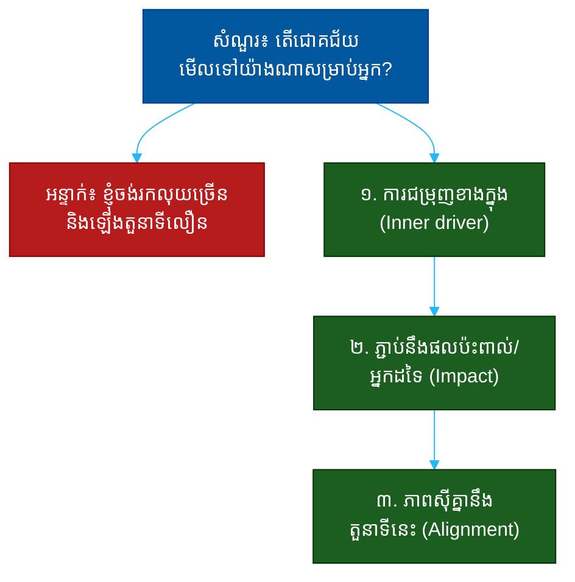

# "តើជោគជ័យមើលទៅយ៉ាងណាសម្រាប់អ្នក?" (What Does Success Look Like to You?)៖ សំណួរតែមួយដែលបង្ហាញពីគុណតម្លៃ ការជម្រុញ និងភាពស៊ីគ្នា

**Author:** ichamrong  
**Date:** 2026-05-30  
**Tags:** #one-question #leadership #success #values #motivation #alignment #communication  
**Category:** Concepts / One Question  
**Read Time:** ~12 min  

---

## 📌 មាតិកា (Table of Contents)
- [អន្ទាក់ (The Setup)](#the-setup)
- [១. សំណួរពិតប្រាកដ (What They Are Really Asking)](#1)
- [២. អ្វីដែលវាបង្ហាញអំពីអ្នក (The Hidden Signals)](#2)
- [៣. អន្ទាក់ — ចម្លើយខ្សោយ (The Trap: Weak Answers)](#3)
- [៤. នីតិវិធីឆ្លើយតប (The Response Procedure)](#4)
- [៥. ឧទាហរណ៍ចម្លើយខ្លាំង (Strong Sample Answer)](#5)
- [៦. សំណួរបន្ត និងរបៀបដោះស្រាយ (Follow-up Traps)](#6)
- [សេចក្តីសន្និដ្ឋាន (Conclusion)](#conclusion)
- [ឯកសារយោង (References)](#references)
- [អត្ថបទពាក់ព័ន្ធ (Related Posts)](#related-posts)

---

## អន្ទាក់ (The Setup) 

អ្នកសម្ភាសន៍សួរយឺតៗ ដោយចង់ដឹងជាក់ស្តែងថា៖ **«តើជោគជ័យមើលទៅយ៉ាងណាសម្រាប់អ្នក?»**

នេះមើលទៅជាសំណួរស្រាល — ប៉ុន្តែវាជាសំណួរ «កញ្ចក់ខាងក្នុង» (inner mirror)។ ចម្លើយរបស់អ្នកបង្ហាញ **អ្វីដែលជម្រុញអ្នកពិតប្រាកដ** — ប្រាក់, ឋានៈ, ការរៀន, ផលប៉ះពាល់ ឬមនុស្សជុំវិញ។ ហើយវាបង្ហាញផងដែរថា តើនិយមន័យជោគជ័យរបស់អ្នក **ស៊ីគ្នា** នឹងអ្វីដែលក្រុមហ៊ុនអាចផ្តល់ឲ្យដែរឬទេ។

ក្នុងចម្លើយ គេអាន៖
* តើអ្នកជម្រុញ​ដោយ​អ្វី **ពិតៗ** (intrinsic ឬ extrinsic)?
* តើនិយមន័យជោគជ័យរបស់អ្នកមាន **ភាពចាស់ទុំ** (mature) ឬនៅរាក់?
* តើជោគជ័យរបស់អ្នករួមបញ្ចូល **អ្នកដទៃ** ឬត្រឹមខ្លួនឯង?
* តើគោលដៅរបស់អ្នក **ស៊ីគ្នា** នឹងតួនាទីនេះដែរឬទេ?

នេះជាផែនទីបង្ហាញផ្លូវសម្រាប់ការឆ្លើយតបឲ្យបានល្អ៖

---

## ១. សំណួរពិតប្រាកដ (What They Are Really Asking) 

គេមិនកំពុងសួរថាតើគោលដៅរបស់អ្នកធំ ឬតូចទេ។ គេកំពុងសួរថា៖

> **«តើ​អ្វី​ដែល​អ្នក​ចង់​បាន ស៊ី​គ្នា​នឹង​អ្វី​ដែល​យើង​អាច​ផ្តល់​ឲ្យ​ដែរ​ឬ​ទេ — និង​តើ​អ្នក​នឹង​ស្ថិត​នៅ​បាន​យូរ​ឬ​ទេ?»**

ការជួលមនុស្សដែលនិយមន័យជោគជ័យមិនស៊ីគ្នានឹងតួនាទី គឺជាការខាតបង់សម្រាប់ភាគីទាំងពីរ។ បើអ្នកវាស់ជោគជ័យដោយឋានៈ ប៉ុន្តែតួនាទីនេះផ្តល់ការរៀន — អ្នកនឹងមិនសប្បាយ ហើយនឹងចេញ។ គេចង់ដឹងថាតើ **ការជម្រុញរបស់អ្នក** ត្រូវនឹង **អ្វីដែលការងារនេះផ្តល់ឲ្យ**។

ដូច្នេះ សំណួរនេះវាស់ ៣ យ៉ាង៖
1. **គុណតម្លៃ (Values)** — តើអ្វីសំខាន់សម្រាប់អ្នកពិតៗ?
2. **ភាពចាស់ទុំ (Maturity)** — តើនិយមន័យជោគជ័យរបស់អ្នកជ្រៅ ឬរាក់?
3. **ភាពស៊ីគ្នា (Alignment)** — តើវាត្រូវនឹងតួនាទីនេះ?

---

## ២. អ្វីដែលវាបង្ហាញអំពីអ្នក (The Hidden Signals) 

| សញ្ញាដែលគេអាន | ចម្លើយខ្សោយបង្ហាញ | ចម្លើយខ្លាំងបង្ហាញ |
| :--- | :--- | :--- |
| **ការជម្រុញ (Motivation)** | តែប្រាក់ ឬឋានៈ | ការរីកចម្រើន ផលប៉ះពាល់ និងលទ្ធផល |
| **ភាពចាស់ទុំ (Maturity)** | ផ្តោតលើខ្លួនឯងតែម្នាក់ | រួមបញ្ចូលក្រុម និងផលប៉ះពាល់ |
| **ភាពជាក់លាក់ (Specificity)** | «ឲ្យជោគជ័យ», «ឲ្យសប្បាយ» | រូបភាពច្បាស់ និងវាស់បាន |
| **ភាពស្មោះ (Authenticity)** | ចម្លើយដែលគេចង់ឮ | ចម្លើយពិតរបស់ខ្លួន |
| **ភាពស៊ីគ្នា (Alignment)** | មិនពាក់ព័ន្ធនឹងតួនាទី | ភ្ជាប់ច្បាស់នឹងការងារនេះ |

**ចំណុចសំខាន់៖** ការនិយាយតែប្រាក់ ឬឋានៈ មិនមែនជា «ខុស» ទេ — ប៉ុន្តែវាបង្ហាញការជម្រុញខាងក្រៅ (extrinsic) តែម្នាក់ ដែលងាយផ្លាស់ប្តូរ និងពិបាករក្សា។ ចម្លើយល្អបង្ហាញ **ការជម្រុញខាងក្នុង** (intrinsic) ដែលនៅជាប់ និងភ្ជាប់នឹងផលប៉ះពាល់ធំជាងខ្លួនឯង។

---

## ៣. អន្ទាក់ — ចម្លើយខ្សោយ (The Trap: Weak Answers) 

**អន្ទាក់ទី ១ — អ្នកប្រាក់ និងឋានៈ (The Status-Seeker):**
> «ជោគជ័យសម្រាប់ខ្ញុំ គឺរកប្រាក់ច្រើន និងឡើងតួនាទីលឿន»

ហេតុអ្វីបរាជ័យ៖ វាស្មោះត្រង់ ប៉ុន្តែរាក់ និងងាយផ្លាស់ប្តូរ។ បើក្រុមហ៊ុនផ្សេងផ្តល់ប្រាក់ច្រើនជាង អ្នកនឹងចេញ — ហើយគេដឹង។

**អន្ទាក់ទី ២ — អ្នកនិយាយឲ្យពេញចិត្ត (The People-Pleaser):**
> «ជោគជ័យគឺការ​ជួយ​ក្រុមហ៊ុន​សម្រេច​បេសកកម្ម​របស់​ខ្លួន»

ហេតុអ្វីបរាជ័យ៖ វាស្តាប់ទៅជាការនិយាយដែលគេចង់ឮ មិនមែនការពិតរបស់អ្នក។ វាគ្មានសារធាតុផ្ទាល់ខ្លួន។

**អន្ទាក់ទី ៣ — អ្នកមិនច្បាស់ (The Vague):**
> «ខ្ញុំគ្រាន់តែចង់សប្បាយចិត្ត និងធ្វើការងារល្អ»

ហេតុអ្វីបរាជ័យ៖ វាទូទៅពេក គ្មានរូបរាង។ វាមិនប្រាប់គេអ្វីសោះអំពីការជម្រុញ ឬគុណតម្លៃរបស់អ្នក។

---

## ៤. នីតិវិធីឆ្លើយតប (The Response Procedure) 

ចម្លើយខ្លាំងមាន **៣ ផ្នែក** តាមលំដាប់៖

**ជំហានទី ១ — ការជម្រុញខាងក្នុង (Name the Inner Driver)**
ចាប់ផ្តើមដោយអ្វីដែលជម្រុញអ្នកពិតៗ — ដោយស្មោះត្រង់។
> «ជោគជ័យ​សម្រាប់​ខ្ញុំ​គឺ​ការ​ដោះស្រាយ​បញ្ហា​ពិបាក​ដែល​មាន​ផល​ប៉ះពាល់​ពិត»

ឲ្យវាស្មោះ — មិនមែនអ្វីដែលគេចង់ឮ។

**ជំហានទី ២ — ភ្ជាប់នឹងផលប៉ះពាល់ និងអ្នកដទៃ (Connect to Impact)**
ពង្រីកនិយមន័យឲ្យលើសពីខ្លួនឯង។
> «ខ្ញុំ​វាស់​វា​មិន​ត្រឹម​លទ្ធផល​ខ្ញុំ​ទេ ប៉ុន្តែ​ថា​តើ​ខ្ញុំ​ជួយ​ឲ្យ​មនុស្ស​ជុំ​វិញ​ខ្ញុំ​ប្រសើរ​ឡើង​ដែរ​ឬ​ទេ»

នេះបង្ហាញ **ភាពចាស់ទុំ**។

**ជំហានទី ៣ — ភាពស៊ីគ្នានឹងតួនាទីនេះ (Tie to This Role)**
បញ្ចប់ដោយការភ្ជាប់ច្បាស់ទៅនឹងការងារនេះ។
> «ហើយ​នោះ​ជា​មូល​ហេតុ​ដែល​តួនាទី​នេះ​ស៊ី​គ្នា — វា​ផ្តល់​ឱកាស​ដោះស្រាយ​បញ្ហា​ប្រភេទ​នេះ​ច្បាស់»

នេះបង្ហាញ **ភាពស៊ីគ្នា**។

---

## ៥. ឧទាហរណ៍ចម្លើយខ្លាំង (Strong Sample Answer) 

> **«ជោគជ័យ​សម្រាប់​ខ្ញុំ​មាន​បី​ស្រទាប់។ ស្រទាប់​ដំបូង​គឺ​ការ​ងារ​ដែល​ខ្ញុំ​ធ្វើ​ដោះស្រាយ​បញ្ហា​ពិបាក​ដែល​មាន​ផល​ប៉ះពាល់​ពិត — ខ្ញុំ​ត្រូវ​ការ​មើល​ឃើញ​ថា​អ្វី​ដែល​ខ្ញុំ​ធ្វើ​មាន​ន័យ។ ស្រទាប់​ទី​ពីរ​គឺ​មនុស្ស​ជុំ​វិញ​ខ្ញុំ​រីក​ចម្រើន — ខ្ញុំ​វាស់​ខ្លួន​ឯង​មិន​ត្រឹម​លទ្ធផល​ផ្ទាល់​ខ្លួន​ទេ ប៉ុន្តែ​ថា​ខ្ញុំ​ធ្វើ​ឲ្យ​ក្រុម​ខ្លាំង​ឡើង​ដែរ​ឬ​ទេ។ ស្រទាប់​ទី​បី​គឺ​ការ​បន្ត​រៀន — បើ​ខ្ញុំ​មិន​លំបាក​បន្តិច ខ្ញុំ​មិន​រីក​ចម្រើន​ទេ។ ប្រាក់​និង​ឋានៈ​ជា​លទ្ធផល​នៃ​ការ​ធ្វើ​បី​យ៉ាង​នោះ​ឲ្យ​បាន​ល្អ មិន​មែន​ជា​គោល​ដៅ​ដាច់​ដោយ​ឡែក​ឡើយ។ តួនាទី​នេះ​ស៊ី​គ្នា​ព្រោះ​វា​ផ្តល់​ទាំង​បញ្ហា​ពិបាក និង​ក្រុម​ដែល​ខ្ញុំ​អាច​ជួយ​បាន។»**

**ការវិភាគ (Breakdown):**
* «ដោះស្រាយ​បញ្ហា​ពិបាក​ដែល​មាន​ផល​ប៉ះពាល់» → ការជម្រុញខាងក្នុង (intrinsic driver)
* «មនុស្ស​ជុំ​វិញ​ខ្ញុំ​រីក​ចម្រើន» → ភាពចាស់ទុំ (beyond self)
* «ប្រាក់​និង​ឋានៈ​ជា​លទ្ធផល មិន​មែន​គោល​ដៅ» → ភាពពេញវ័យ (mature framing)
* «តួនាទី​នេះ​ស៊ី​គ្នា​ព្រោះ...» → ភាពស៊ីគ្នា (alignment)

**ប្រៀបធៀប៖**
* ❌ ខ្សោយ៖ «ខ្ញុំចង់រកលុយច្រើន និងឡើងតួនាទីលឿន»
* ✅ ខ្លាំង៖ ការជម្រុញខាងក្នុង → ផលប៉ះពាល់ → ភាពស៊ីគ្នា

---

## ៦. សំណួរបន្ត និងរបៀបដោះស្រាយ (Follow-up Traps) 

អ្នកសម្ភាសន៍ល្អនឹងសួរបន្ត ដើម្បីសាកល្បងថានិយមន័យជោគជ័យរបស់អ្នកពិតឬនិយាយ៖

**«ចុះប្រាក់ខែ មិនសំខាន់ទេឬ?» (Doesn't money matter?)**
> កុំ​ធ្វើ​ពុត។ «សំខាន់ — ខ្ញុំ​ត្រូវ​ការ​វា​ត្រឹម​ត្រូវ​និង​យុត្តិធម៌។ ប៉ុន្តែ​វា​ជា​ល័ក្ខខ័ណ្ឌ មិន​មែន​ជា​ការ​ជម្រុញ។ បើ​ការ​ងារ​គ្មាន​ន័យ លុយ​មិន​អាច​រក្សា​ខ្ញុំ​បាន​យូរ​ទេ។» ភាពស្មោះត្រង់បង្ហាញតុល្យភាព។

**«តើជោគជ័យរបស់អ្នកផ្លាស់ប្តូរយ៉ាងណាក្នុង ៥ ឆ្នាំចុងក្រោយ?» (How has it changed?)**
> បង្ហាញ​ការ​រីក​ចម្រើន៖ «កាល​មុន​ខ្ញុំ​វាស់​ដោយ​លទ្ធផល​ផ្ទាល់​ខ្លួន, ឥឡូវ​ខ្ញុំ​វាស់​ដោយ​អ្វី​ដែល​ខ្ញុំ​អាច​ឲ្យ​ក្រុម​សម្រេច​បាន។» ការផ្លាស់ប្តូរនេះបង្ហាញភាពចាស់ទុំ។

**ច្បាប់មាស៖** រាល់សំណួរបន្ត គឺការសាកល្បងថាតើ «ការជម្រុញ» នៅជំហានទី ១ ពិតប្រាកដ ឬគ្រាន់តែការនិយាយដែលគេចង់ឮ។ បើនិយមន័យជោគជ័យរបស់អ្នកស្មោះ អ្នកនឹងឆ្លើយបានដោយរលូន ដោយគ្មានភាពផ្ទុយគ្នា។

---

## សេចក្តីសន្និដ្ឋាន (Conclusion) 

សំណួរ «តើជោគជ័យមើលទៅយ៉ាងណាសម្រាប់អ្នក?» មិនមែនជាការសុំឲ្យអ្នកនិយាយអ្វីដែលគេចង់ឮទេ។ វាជា **កញ្ចក់នៃការជម្រុញ និងគុណតម្លៃ** របស់អ្នក — ហើយជាការសាកល្បងថាតើអ្នកនិងតួនាទីនេះស៊ីគ្នាដែរឬទេ។

ចងចាំរូបមន្ត ៣ ផ្នែក៖
1. **ការជម្រុញខាងក្នុង** (ជោគជ័យសម្រាប់ខ្ញុំគឺ...)
2. **ភ្ជាប់នឹងផលប៉ះពាល់** (ខ្ញុំវាស់វាដោយ... មនុស្សជុំវិញ)
3. **ភាពស៊ីគ្នានឹងតួនាទីនេះ** (តួនាទីនេះស៊ីគ្នាព្រោះ...)

ការ​ជម្រុញ​ខាង​ក្នុង​ដែល​ស្មោះ រួម​នឹង​ភាព​ស៊ី​គ្នា​នឹង​ការ​ងារ — នោះ​ជា​អ្វី​ដែល​បង្ហាញ​ថា​អ្នក​នឹង​ស្ថិត​នៅ​បាន​យូរ និង​សប្បាយ​ចិត្ត​ក្នុង​អ្វី​ដែល​អ្នក​ធ្វើ។

---

## ឯកសារយោង (References) 

- *Drive* — Daniel Pink
- *Man's Search for Meaning* — Viktor Frankl
- *Designing Your Life* — Bill Burnett & Dave Evans

---

## អត្ថបទពាក់ព័ន្ធ (Related Posts) 

- [Where Do You See This in 5 Years? (ចក្ខុវិស័យ)](01-where-in-five-years.md)
- [How Do You Handle Disagreement? (ការមិនយល់ស្រប)](04-how-do-you-handle-disagreement.md)
- [One Question Index](../README.md)
