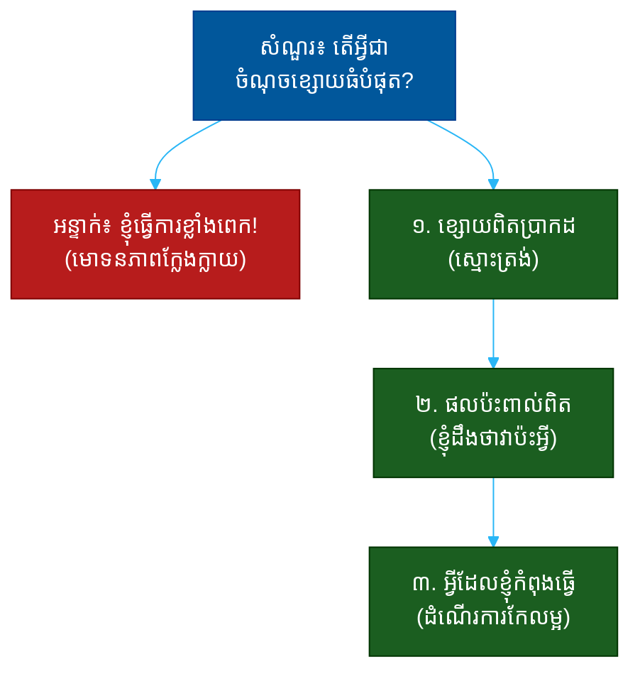

# "តើអ្វីជាចំណុចខ្សោយធំបំផុតរបស់អ្នក?" (What Is Your Biggest Weakness?)៖ សំណួរតែមួយដែលបង្ហាញពីភាពស្មោះត្រង់ ភាពចាស់ទុំ និងការយល់ដឹងខ្លួនឯង

**Author:** ichamrong  
**Date:** 2026-05-30  
**Tags:** #one-question #interview #self-awareness #honesty #maturity #emotional-intelligence #growth  
**Category:** Concepts / One Question  
**Read Time:** ~12 min  

---

## 📌 មាតិកា (Table of Contents)
- [អន្ទាក់ (The Setup)](#the-setup)
- [១. សំណួរពិតប្រាកដ (What They Are Really Asking)](#1)
- [២. អ្វីដែលវាបង្ហាញអំពីអ្នក (The Hidden Signals)](#2)
- [៣. អន្ទាក់ — ចម្លើយខ្សោយ (The Trap: Weak Answers)](#3)
- [៤. នីតិវិធីឆ្លើយតប (The Response Procedure)](#4)
- [៥. ឧទាហរណ៍ចម្លើយខ្លាំង (Strong Sample Answer)](#5)
- [៦. សំណួរបន្ត និងរបៀបដោះស្រាយ (Follow-up Traps)](#6)
- [សេចក្តីសន្និដ្ឋាន (Conclusion)](#conclusion)
- [ឯកសារយោង (References)](#references)
- [អត្ថបទពាក់ព័ន្ធ (Related Posts)](#related-posts)

---

## អន្ទាក់ (The Setup) 

អ្នកសម្ភាសន៍ (Interviewer) ងាកមកសួរថា៖ **«តើអ្វីជាចំណុចខ្សោយធំបំផុតរបស់អ្នក?»**

នេះជាសំណួរចាស់បំផុតក្នុងសៀវភៅ — ហើយក៏ជាសំណួរដែលមនុស្សភាគច្រើនឆ្លើយខុសបំផុតផងដែរ។ គេមិនកំពុងស្តាប់ថា «ចំណុចខ្សោយ» របស់អ្នកជាអ្វីនោះទេ។ គេកំពុងស្តាប់ថា **តើអ្នកស្គាល់ខ្លួនឯងបានកម្រិតណា** និង **តើអ្នកមានភាពចាស់ទុំគ្រប់គ្រាន់ដើម្បីនិយាយការពិតដែរឬទេ**។

ក្នុងរយៈពេលខ្លីនៃចម្លើយរបស់អ្នក គេអាចអានបាន៖
* តើអ្នកស្មោះត្រង់ ឬកំពុងលេងល្បែង (playing games)?
* តើអ្នកស្គាល់ខ្លួនឯងពិតៗ ឬងងឹតភ្នែកចំពោះខ្លួនឯង?
* តើអ្នកធ្វើអ្វីខ្លះដើម្បីកែលម្អ ឬគ្រាន់តែទទួលស្គាល់ហើយឈប់?
* តើអ្នកមានទំនុកចិត្តគ្រប់គ្រាន់ដើម្បីបង្ហាញភាពងាយរងគ្រោះ (vulnerability) ដែរឬទេ?

នេះជាផែនទីបង្ហាញផ្លូវសម្រាប់ការឆ្លើយតបឲ្យបានល្អ៖

---

## ១. សំណួរពិតប្រាកដ (What They Are Really Asking) 

អ្នកសម្ភាសន៍មិនមែនកំពុងស្វែងរក «បញ្ជីកំហុស» ដើម្បីច្រានចោលអ្នកនោះទេ។ មនុស្សគ្រប់រូបមានចំណុចខ្សោយ — គេដឹងរឿងនេះច្បាស់ណាស់។ អ្វីដែលគេពិតជាសួរគឺ៖

> **«តើ​អ្នក​ស្គាល់​ខ្លួន​ឯង​គ្រប់គ្រាន់​ដើម្បី​ដឹង​ពី​ចំណុច​ខ្សោយ​របស់​ខ្លួន ហើយ​ចាស់ទុំ​គ្រប់គ្រាន់​ដើម្បី​ធ្វើ​អ្វី​មួយ​អំពី​វា​ដែរ​ឬ​ទេ?»**

មនុស្សដែលនិយាយថា «ខ្ញុំគ្មានចំណុចខ្សោយ» ឬផ្តល់ចំណុចខ្សោយក្លែងក្លាយ (humble brag) គឺគ្រោះថ្នាក់ជាងមនុស្សដែលមានចំណុចខ្សោយពិតៗ — ព្រោះអ្នកដែលមើលមិនឃើញចំណុចខ្សោយរបស់ខ្លួននឹងមិនដែលកែលម្អបានឡើយ។

ដូច្នេះ សំណួរនេះវាស់ ៣ យ៉ាង៖
1. **ការយល់ដឹងខ្លួនឯង (Self-Awareness)** — តើអ្នកដឹងពិតប្រាកដឬទេ?
2. **ភាពស្មោះត្រង់ (Honesty)** — តើអ្នកហ៊ាននិយាយការពិតឬទេ?
3. **ការលូតលាស់ (Growth)** — តើអ្នកកំពុងធ្វើអ្វីដើម្បីកែលម្អ?

---

## ២. អ្វីដែលវាបង្ហាញអំពីអ្នក (The Hidden Signals) 

| សញ្ញាដែលគេអាន | ចម្លើយខ្សោយបង្ហាញ | ចម្លើយខ្លាំងបង្ហាញ |
| :--- | :--- | :--- |
| **ការយល់ដឹងខ្លួនឯង (Self-Awareness)** | «ខ្ញុំគ្មានចំណុចខ្សោយ» | ដឹងច្បាស់ និងជាក់លាក់ |
| **ភាពស្មោះត្រង់ (Honesty)** | ខ្សោយក្លែងក្លាយ (perfectionist!) | ខ្សោយពិតប្រាកដ |
| **ភាពចាស់ទុំ (Maturity)** | ស្តីបន្ទោសអ្នកដទៃ | ទទួលខុសត្រូវដោយខ្លួនឯង |
| **ការលូតលាស់ (Growth)** | ទទួលស្គាល់ហើយឈប់ | មានជំហានកែលម្អជាក់ស្តែង |
| **ការវិនិច្ឆ័យ (Judgment)** | ខ្សោយដែលធ្វើឲ្យអសមត្ថភាពលើការងារ | ខ្សោយដែលមិនបំផ្លាញតួនាទីស្នូល |

**ចំណុចសំខាន់៖** សិល្បៈ​នៅ​ត្រង់​ការ​ជ្រើស​ចំណុច​ខ្សោយ​ដែល **ពិត​ប្រាកដ** តែ **មិន​មែន​ជា​ចំណុច​ស្នូល** នៃ​តួនាទី។ បើ​អ្នក​ដាក់​ពាក្យ​ជា​គណនេយ្យករ ការ​និយាយ​ថា «ខ្ញុំ​ខ្សោយ​ខាង​លេខ» គឺ​ស្លាប់។

---

## ៣. អន្ទាក់ — ចម្លើយខ្សោយ (The Trap: Weak Answers) 

**អន្ទាក់ទី ១ — មោទនភាពក្លែងក្លាយ (The Humble Brag):**
> «ចំណុចខ្សោយរបស់ខ្ញុំគឺខ្ញុំធ្វើការខ្លាំងពេក ហើយខ្ញុំជាមនុស្សល្អឥតខ្ចោះ (perfectionist)។»

ហេតុអ្វីបរាជ័យ៖ អ្នកសម្ភាសន៍បានឮប្រយោគនេះរាប់ពាន់ដង។ វាបង្ហាញថាអ្នកមិនស្មោះត្រង់ ឬមិនស្គាល់ខ្លួនឯងពិតៗ។ វាជា «ការលាក់» ដែលគេមើលឃើញភ្លាមៗ។

**អន្ទាក់ទី ២ — ការបដិសេធ (The Denier):**
> «និយាយឲ្យត្រង់ ខ្ញុំគិតមិនឃើញចំណុចខ្សោយធំៗទេ។»

ហេតុអ្វីបរាជ័យ៖ នេះមិនមែនជាទំនុកចិត្តទេ — វាជាការខ្វះការយល់ដឹងខ្លួនឯង។ មនុស្សដែលមើលមិនឃើញខ្សោយរបស់ខ្លួននឹងមិនកែលម្អ ហើយក៏ពិបាកធ្វើការជាមួយផងដែរ។

**អន្ទាក់ទី ៣ — ការបណ្តាក់ខ្លួន (The Career-Killer):**
> «ខ្ញុំខ្សោយក្នុងការគ្រប់គ្រងពេលវេលា ហើយតែងតែខកកំណត់ផុតការងារ។»

ហេតុអ្វីបរាជ័យ៖ ស្មោះត្រង់ពេក​ដោយ​គ្មាន​ការ​វិនិច្ឆ័យ។ អ្នក​ទើប​ប្រាប់​គេ​ថា​អ្នក​មិន​អាច​ទុក​ចិត្ត​បាន។ ស្មោះត្រង់​មិន​មែន​មាន​ន័យ​ថា​ត្រូវ​ប្រគល់​អាវុធ​ឲ្យ​គេ​ប្រើ​ប្រឆាំង​នឹង​អ្នក​ទេ។

---

## ៤. នីតិវិធីឆ្លើយតប (The Response Procedure) 

ចម្លើយខ្លាំងមាន **៣ ផ្នែក** តាមលំដាប់៖

**ជំហានទី ១ — ខ្សោយពិតប្រាកដ (Real, Bounded Weakness)**
ជ្រើសចំណុចខ្សោយដែលពិត តែមិនបំផ្លាញតួនាទីស្នូល។
> «ខ្ញុំ​ធ្លាប់​មាន​ការ​លំបាក​ក្នុង​ការ​ប្រគល់​ការងារ​ឲ្យ​អ្នក​ដទៃ (delegation) — ខ្ញុំ​ចង់​កាន់​អ្វីៗ​ដោយ​ខ្លួន​ឯង។»

នេះបង្ហាញ **ភាពស្មោះត្រង់** ដែលមានព្រំដែន។

**ជំហានទី ២ — ផលប៉ះពាល់ពិត (Honest Impact)**
បង្ហាញថាអ្នកយល់ពីផលប៉ះពាល់របស់វា — នេះជាសញ្ញានៃការយល់ដឹងខ្លួនឯងពិតៗ។
> «វា​ធ្វើ​ឲ្យ​ខ្ញុំ​ផ្ទុក​ការងារ​ច្រើន​ពេក ហើយ​ក្រុម​មិន​បាន​លូតលាស់​ដូច​ដែល​គួរ។»

នេះបង្ហាញ **ភាពចាស់ទុំ** និងការទទួលខុសត្រូវ។

**ជំហានទី ៣ — ដំណើរការកែលម្អ (Active Improvement)**
បញ្ចប់ដោយជំហានជាក់ស្តែងដែលអ្នកកំពុងធ្វើ។
> «ឥឡូវ​ខ្ញុំ​បាន​ដាក់​ច្បាប់​ឲ្យ​ខ្លួន​ឯង​ថា​ត្រូវ​ប្រគល់​ការងារ​យ៉ាង​តិច​មួយ​សំខាន់​ឲ្យ​សមាជិក​ក្រុម​ក្នុង​គម្រោង​នីមួយៗ។»

នេះបង្ហាញ **ការលូតលាស់** — ការផ្លាស់ប្តូរពីការទទួលស្គាល់ទៅសកម្មភាព។

---

## ៥. ឧទាហរណ៍ចម្លើយខ្លាំង (Strong Sample Answer) 

> **«ចំណុច​ខ្សោយ​ពិត​ប្រាកដ​របស់​ខ្ញុំ​គឺ​ការ​ប្រគល់​ការងារ។ កាល​ពី​មុន ខ្ញុំ​ចង់​កាន់​អ្វីៗ​ដោយ​ខ្លួន​ឯង ព្រោះ​ខ្ញុំ​គិត​ថា​ខ្ញុំ​ធ្វើ​បាន​លឿន​ជាង។ តែ​ខ្ញុំ​បាន​ឃើញ​ថា​វា​ធ្វើ​ឲ្យ​ខ្ញុំ​ក្លាយ​ជា​ឧបសគ្គ (bottleneck) ហើយ​ក្រុម​មិន​បាន​លូតលាស់។ ដូច្នេះ ក្នុង​គម្រោង​ចុង​ក្រោយ ខ្ញុំ​បាន​ប្រគល់​ការ​ដឹកនាំ​ផ្នែក​មួយ​ទាំងស្រុង​ឲ្យ​សមាជិក​ក្រុម — វា​ពិបាក​សម្រាប់​ខ្ញុំ តែ​លទ្ធផល​ល្អ​ជាង​ការ​ដែល​ខ្ញុំ​នឹង​ធ្វើ​ដោយ​ខ្លួន​ឯង​ទៅ​ទៀត។»**

**ការវិភាគ (Breakdown):**
* «ការ​ប្រគល់​ការងារ» → ខ្សោយពិតប្រាកដ មិនមែនមោទនភាពក្លែងក្លាយ
* «ខ្ញុំ​គិត​ថា​ខ្ញុំ​ធ្វើ​បាន​លឿន​ជាង» → ស្មោះត្រង់អំពីឫសគល់
* «ខ្ញុំ​ក្លាយ​ជា​ឧបសគ្គ» → ការយល់ដឹងពីផលប៉ះពាល់ (self-awareness)
* «ខ្ញុំ​បាន​ប្រគល់...» → ជំហានកែលម្អជាក់ស្តែង (growth)
* «វា​ពិបាក​សម្រាប់​ខ្ញុំ» → ភាពងាយរងគ្រោះដ៏ស្មោះត្រង់ (mature vulnerability)

**ប្រៀបធៀប៖**
* ❌ ខ្សោយ៖ «ខ្ញុំធ្វើការខ្លាំងពេក!»
* ✅ ខ្លាំង៖ ចម្លើយ ៣ ផ្នែកខាងលើ

---

## ៦. សំណួរបន្ត និងរបៀបដោះស្រាយ (Follow-up Traps) 

អ្នកសម្ភាសន៍ល្អនឹងសួរបន្ត ដើម្បីសាកល្បងថាការយល់ដឹងខ្លួនឯងរបស់អ្នកពិតឬមិនពិត៖

**«តើវាបានធ្វើឲ្យអ្នកខាតបង់អ្វីពិតប្រាកដដែរឬទេ?» (Has it ever cost you something real?)**
> កុំ​លាក់។ ផ្តល់​ឧទាហរណ៍​ពិត​ប្រាកដ​មួយ៖ «បាទ — ខ្ញុំ​ធ្លាប់​បាន​កាន់​គម្រោង​មួយ​ច្រើន​ពេក​ដោយ​ខ្លួន​ឯង រហូត​ដល់​ខក​កំណត់​មួយ​សប្តាហ៍។ វា​ជា​មេរៀន​ដែល​ផ្លាស់​ប្តូរ​របៀប​ដែល​ខ្ញុំ​ដឹកនាំ។»

**«ហើយឥឡូវនេះ តើអ្នកដោះស្រាយវាបានទាំងស្រុងហើយឬនៅ?» (Have you fully fixed it?)**
> កុំ​អះអាង​ថា​ល្អ​ឥត​ខ្ចោះ៖ «មិន​ទាន់​ទាំង​ស្រុង​ទេ — វា​នៅ​ជា​អ្វី​ដែល​ខ្ញុំ​ត្រូវ​ដឹង​ខ្លួន​ជានិច្ច។ តែ​ខ្ញុំ​មាន​ប្រព័ន្ធ​ដែល​ជួយ​ខ្ញុំ​ឲ្យ​មិន​ធ្លាក់​ត្រឡប់​ទៅ​ដដែល។»

**ច្បាប់មាស៖** រាល់សំណួរបន្ត គឺជាការសាកល្បងថាតើចំណុចខ្សោយដែលអ្នកនិយាយជា «ការពិត» ឬជា «ការសម្តែង»។ បើវាជាការពិត អ្នកនឹងមានរឿងជាក់ស្តែង មេរៀន និងជំហានកែលម្អដែលផ្ទុយគ្នាមិនបាន។

---

## សេចក្តីសន្និដ្ឋាន (Conclusion) 

សំណួរ «តើអ្វីជាចំណុចខ្សោយធំបំផុតរបស់អ្នក?» មិនមែនជាការសាកល្បងថាតើអ្នកល្អឥតខ្ចោះឬទេ។ វាជា **កញ្ចក់** ដែលឆ្លុះបញ្ចាំងថាតើអ្នកស្គាល់ខ្លួនឯងបានកម្រិតណា និងហ៊ានស្មោះត្រង់កម្រិតណា។

ចងចាំរូបមន្ត ៣ ផ្នែក៖
1. **ខ្សោយពិតប្រាកដ** (មិនមែនមោទនភាពក្លែងក្លាយ មិនមែនការបណ្តាក់ខ្លួន)
2. **ផលប៉ះពាល់ពិត** (ខ្ញុំដឹងថាវាប៉ះអ្វី)
3. **ដំណើរការកែលម្អ** (ខ្ញុំកំពុងធ្វើ X)

ភាព​ស្មោះត្រង់​ដែល​មាន​ការ​វិនិច្ឆ័យ​ល្អ រួម​នឹង​ភស្តុតាង​នៃ​ការ​លូតលាស់ — នោះ​ជា​អ្វី​ដែល​បំប្លែង​ចំណុច​ខ្សោយ​ឲ្យ​ក្លាយ​ជា​ភស្តុតាង​នៃ​ភាព​ចាស់ទុំ។

---

## ឯកសារយោង (References) 

- *Insight* — Tasha Eurich
- *Mindset* — Carol Dweck
- *Emotional Intelligence* — Daniel Goleman

---

## អត្ថបទពាក់ព័ន្ធ (Related Posts) 

- [What Are You NOT Good At? (ភាពខ្សោយដោយផ្ទាល់)](05-what-are-you-not-good-at.md)
- [Tell Me About Feedback That Was Hard to Hear (មតិកែលម្អ)](03-tell-me-about-feedback-that-was-hard-to-hear.md)
- [One Question Index](../README.md)
