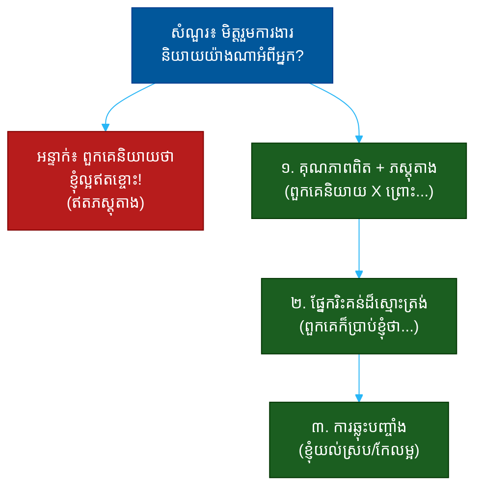

# "តើមិត្តរួមការងារនិយាយយ៉ាងណាអំពីអ្នក?" (What Would Your Coworkers Say About You?)៖ សំណួរតែមួយដែលបង្ហាញពីការយល់ដឹងសង្គម ភាពស្មោះត្រង់ និងភាពជាក្រុម

**Author:** ichamrong  
**Date:** 2026-05-30  
**Tags:** #one-question #interview #self-awareness #teamwork #social-awareness #honesty #reputation  
**Category:** Concepts / One Question  
**Read Time:** ~12 min  

---

## 📌 មាតិកា (Table of Contents)
- [អន្ទាក់ (The Setup)](#the-setup)
- [១. សំណួរពិតប្រាកដ (What They Are Really Asking)](#1)
- [២. អ្វីដែលវាបង្ហាញអំពីអ្នក (The Hidden Signals)](#2)
- [៣. អន្ទាក់ — ចម្លើយខ្សោយ (The Trap: Weak Answers)](#3)
- [៤. នីតិវិធីឆ្លើយតប (The Response Procedure)](#4)
- [៥. ឧទាហរណ៍ចម្លើយខ្លាំង (Strong Sample Answer)](#5)
- [៦. សំណួរបន្ត និងរបៀបដោះស្រាយ (Follow-up Traps)](#6)
- [សេចក្តីសន្និដ្ឋាន (Conclusion)](#conclusion)
- [ឯកសារយោង (References)](#references)
- [អត្ថបទពាក់ព័ន្ធ (Related Posts)](#related-posts)

---

## អន្ទាក់ (The Setup) 

អ្នកសម្ភាសន៍ឈរបង្អែកក្រោយ ហើយសួរថា៖ **«តើមិត្តរួមការងារនិយាយយ៉ាងណាអំពីអ្នក?»**

នេះមើលទៅជាសំណួរអំពីបុគ្គលិកលក្ខណៈ — តែវាជាសំណួរអំពី **ការយល់ដឹងសង្គម** (social self-awareness)។ គេមិនកំពុងស្តាប់បញ្ជីគុណសម្បត្តិរបស់អ្នកនោះទេ។ គេកំពុងស្តាប់ថា **តើអ្នកដឹងពិតប្រាកដថាមនុស្សជុំវិញអ្នកមើលឃើញអ្នកយ៉ាងណា** — ដែលជារឿងផ្សេងពីការដែលអ្នកមើលឃើញខ្លួនឯង។

ក្នុងចម្លើយរបស់អ្នក គេអាចអានបាន៖
* តើអ្នកដឹងពីរបៀបដែលអ្នកប៉ះពាល់អ្នកដទៃ ឬងងឹតភ្នែក?
* តើអ្នកស្មោះត្រង់ ឬគ្រាន់តែ «លក់» ខ្លួនឯង?
* តើអ្នកមើលឃើញខ្លួនឯងជាផ្នែកនៃក្រុម ឬនៅឯកោ?
* តើអ្នកមានទំនុកចិត្តគ្រប់គ្រាន់ដើម្បីទទួលស្គាល់ផ្នែកមិនល្អដែលគេឃើញដែរឬទេ?

នេះជាផែនទីបង្ហាញផ្លូវសម្រាប់ការឆ្លើយតបឲ្យបានល្អ៖

---

## ១. សំណួរពិតប្រាកដ (What They Are Really Asking) 

អ្នកសម្ភាសន៍មិនមែនកំពុងសុំ «បញ្ជីពាក្យសរសើរ» ដែលអ្នកប្រឌិតឡើងនោះទេ។ ពួកគេអាចស្នើសុំ​ឯកសារ​យោង (references) ដើម្បីផ្ទៀងផ្ទាត់ក្រោយ។ អ្វីដែលគេពិតជាសួរគឺ៖

> **«តើ​ការ​ដែល​អ្នក​មើល​ឃើញ​ខ្លួន​ឯង ត្រូវ​គ្នា​នឹង​ការ​ដែល​អ្នក​ដទៃ​មើល​ឃើញ​អ្នក​ដែរ​ឬ​ទេ?»**

នេះជាការវាស់ «គម្លាតការយល់ដឹង» (awareness gap)។ មនុស្សដែលមានគម្លាតធំ — គិតថាខ្លួនជាអ្នកដឹកនាំល្អ តែក្រុមមើលឃើញគ្រប់គ្រងតឹងពេក — គឺពិបាកធ្វើការជាមួយ ព្រោះគេមិនអាចមើលឃើញខ្លួនឯងពិតៗ។

ដូច្នេះ សំណួរនេះវាស់ ៣ យ៉ាង៖
1. **ការយល់ដឹងសង្គម (Social Awareness)** — តើអ្នកដឹងពីផលប៉ះពាល់របស់ខ្លួនលើអ្នកដទៃ?
2. **ភាពស្មោះត្រង់ (Calibration)** — តើការវាយតម្លៃខ្លួនឯងរបស់អ្នកជិតការពិត?
3. **ភាពចាស់ទុំ (Maturity)** — តើអ្នកហ៊ាននិយាយផ្នែកមិនល្អដែលគេឃើញ?

---

## ២. អ្វីដែលវាបង្ហាញអំពីអ្នក (The Hidden Signals) 

| សញ្ញាដែលគេអាន | ចម្លើយខ្សោយបង្ហាញ | ចម្លើយខ្លាំងបង្ហាញ |
| :--- | :--- | :--- |
| **ការយល់ដឹងសង្គម** | មិនដឹងគេមើលឃើញខ្លួនយ៉ាងណា | ដឹងច្បាស់ ទាំងល្អ ទាំងមិនល្អ |
| **ភស្តុតាង (Evidence)** | គុណសម្បត្តិទទេ | រឿងពិត/ឧទាហរណ៍គាំទ្រ |
| **ភាពស្មោះត្រង់ (Honesty)** | គ្រប់យ៉ាងវិជ្ជមាន ១០០% | មានផ្នែករិះគន់មួយដ៏ស្មោះត្រង់ |
| **ភាពជាក្រុម (Teamwork)** | «ខ្ញុំ ខ្ញុំ ខ្ញុំ» | ពិពណ៌នាពីទំនាក់ទំនងពិត |
| **ភាពចាស់ទុំ (Maturity)** | បដិសេធរាល់ការរិះគន់ | ទទួលយក ហើយឆ្លុះបញ្ចាំង |

**ចំណុចសំខាន់៖** ចម្លើយ​ដែល​មាន​តែ​ការ​សរសើរ​ឥត​មាន​ភស្តុតាង គឺ​ស្តាប់​ទៅ​ដូច​ការ​លក់​ខ្លួន​ឯង។ ការ​បន្ថែម​ផ្នែក​រិះគន់​ស្មោះត្រង់​មួយ​ធ្វើ​ឲ្យ​គ្រប់​យ៉ាង​ដែល​អ្នក​និយាយ​មុន​នោះ​គួរ​ឲ្យ​ជឿ​ជាង។

---

## ៣. អន្ទាក់ — ចម្លើយខ្សោយ (The Trap: Weak Answers) 

**អន្ទាក់ទី ១ — ការផ្សាយពាណិជ្ជកម្ម (The Advertisement):**
> «ពួកគេនិយាយថាខ្ញុំជាមនុស្សឧស្សាហ៍ ស្មោះត្រង់ ឆ្លាត និងតែងតែវិជ្ជមាន!»

ហេតុអ្វីបរាជ័យ៖ បញ្ជីពាក្យល្អៗ ឥតភស្តុតាង។ វាស្តាប់ទៅដូចជា CV ដែលដើរបាន មិនមែនមនុស្សពិត។ គ្មាននរណាល្អគ្រប់យ៉ាងទេ — ហើយគេដឹង។

**អន្ទាក់ទី ២ — អ្នកមិនដឹង (The Clueless):**
> «ហ៎ម... ខ្ញុំមិនដឹងទេ ... ខ្ញុំគិតថាគេចូលចិត្តខ្ញុំ។»

ហេតុអ្វីបរាជ័យ៖ បើអ្នកមិនដឹងថាមនុស្សជុំវិញអ្នកមើលឃើញអ្នកយ៉ាងណា នោះមានន័យថាអ្នកមិនដែលសុំ ឬមិនដែលស្តាប់មតិ — ដែលជាសញ្ញានៃការខ្វះការយល់ដឹងសង្គម។

**អន្ទាក់ទី ៣ — ការបន្ទោសក្រុម (The Blamer):**
> «អ្នកខ្លះប្រហែលនិយាយថាខ្ញុំតឹងពេក តែនោះព្រោះពួកគេមិនធ្វើការឲ្យបានស្តង់ដារ។»

ហេតុអ្វីបរាជ័យ៖ អ្នក​បាន​ប្រែ​ការ​រិះគន់​ឲ្យ​ក្លាយ​ជា​ការ​ស្តី​បន្ទោស​អ្នក​ដទៃ។ វា​បង្ហាញ​ការ​ខ្វះ​ភាព​ចាស់ទុំ និង​ការ​ការពារ​ខ្លួន​ខ្លាំង​ពេក (defensiveness)។

---

## ៤. នីតិវិធីឆ្លើយតប (The Response Procedure) 

ចម្លើយខ្លាំងមាន **៣ ផ្នែក** តាមលំដាប់៖

**ជំហានទី ១ — គុណភាពពិត + ភស្តុតាង (Quality with Proof)**
ផ្តល់គុណសម្បត្តិ ១-២ យ៉ាង រួមនឹងភស្តុតាងជាក់ស្តែងពីមូលហេតុដែលគេនិយាយ។
> «ខ្ញុំ​គិត​ថា​គេ​នឹង​និយាយ​ថា​ខ្ញុំ​ជា​មនុស្ស​ដែល​គេ​ងាក​មក​រក​ពេល​មាន​បញ្ហា​ស្មុគស្មាញ — ព្រោះ​ខ្ញុំ​ស្ងប់​នៅ​ពេល​មាន​សម្ពាធ។»

នេះបង្ហាញ **ភស្តុតាង** — មិនមែនពាក្យទទេ។

**ជំហានទី ២ — ផ្នែករិះគន់ដ៏ស្មោះត្រង់ (Honest Critique)**
បន្ថែមផ្នែកមួយដែលគេ «អាច» និយាយ ដែលមិនមែនវិជ្ជមាន ១០០%។
> «ហើយ​អ្នក​ខ្លះ​ប្រហែល​នឹង​និយាយ​ថា​ខ្ញុំ​ផ្តោត​លើ​ព័ត៌មាន​លម្អិត​ច្រើន​ពេក​ពេល​ខ្លះ។»

នេះបង្ហាញ **ភាពស្មោះត្រង់** និងការយល់ដឹងសង្គមពិតៗ។

**ជំហានទី ៣ — ការឆ្លុះបញ្ចាំង (Reflection)**
បង្ហាញថាអ្នកស្តាប់មតិនោះ ហើយធ្វើអ្វីមួយ។
> «នោះ​ជា​មតិ​ត្រឹមត្រូវ ដូច្នេះ​ឥឡូវ​ខ្ញុំ​ព្យាយាម​ដឹង​ខ្លួន​ថា​ពេល​ណា​ត្រូវ​ផ្តោត​លម្អិត ពេល​ណា​ត្រូវ​ដើរ​លឿន។»

នេះបង្ហាញ **ភាពចាស់ទុំ** និងការលូតលាស់។

---

## ៥. ឧទាហរណ៍ចម្លើយខ្លាំង (Strong Sample Answer) 

> **«ខ្ញុំ​គិត​ថា​ភាគ​ច្រើន​នឹង​និយាយ​ថា​ខ្ញុំ​ជា​មនុស្ស​ដែល​គេ​ទុក​ចិត្ត​នៅ​ពេល​មាន​បញ្ហា​ស្មុគស្មាញ — ព្រោះ​ខ្ញុំ​ស្ងប់ ហើយ​ខ្ញុំ​បំបែក​បញ្ហា​ធំ​ឲ្យ​ក្លាយ​ជា​ជំហាន​តូចៗ។ មិត្ត​រួម​ការងារ​ចាស់​ម្នាក់​ធ្លាប់​ហៅ​ខ្ញុំ​ថា «បុគ្គល​ដែល​ស្ងប់​ក្នុង​ព្យុះ»។ តែ​ដោយ​ស្មោះត្រង់ អ្នក​ខ្លះ​ក៏​ប្រហែល​នឹង​និយាយ​ថា​ខ្ញុំ​សួរ​សំណួរ​ច្រើន​ពេក​ពេល​ខ្ញុំ​ចង់​យល់​ឲ្យ​ច្បាស់ — ហើយ​នោះ​ជា​ការ​ពិត។ ដូច្នេះ​ឥឡូវ ខ្ញុំ​ព្យាយាម​ដឹង​ថា​ពេល​ណា​ការ​សួរ​មាន​ប្រយោជន៍ ពេល​ណា​វា​ធ្វើ​ឲ្យ​ក្រុម​យឺត។»**

**ការវិភាគ (Breakdown):**
* «គេ​ទុក​ចិត្ត​នៅ​ពេល​មាន​បញ្ហា​ស្មុគស្មាញ» → គុណភាពពិត
* «បុគ្គល​ដែល​ស្ងប់​ក្នុង​ព្យុះ» → ភស្តុតាង/ឧទាហរណ៍ជាក់ស្តែង
* «សួរ​សំណួរ​ច្រើន​ពេក» → ផ្នែករិះគន់ដ៏ស្មោះត្រង់ (honesty)
* «នោះ​ជា​ការ​ពិត» → ការទទួលយក (maturity)
* «ខ្ញុំ​ព្យាយាម​ដឹង​ថា​ពេល​ណា...» → ការឆ្លុះបញ្ចាំង (growth)

**ប្រៀបធៀប៖**
* ❌ ខ្សោយ៖ «ពួកគេនិយាយថាខ្ញុំល្អគ្រប់យ៉ាង!»
* ✅ ខ្លាំង៖ ចម្លើយ ៣ ផ្នែកខាងលើ

---

## ៦. សំណួរបន្ត និងរបៀបដោះស្រាយ (Follow-up Traps) 

អ្នកសម្ភាសន៍ល្អនឹងសួរបន្ត ដើម្បីសាកល្បងថាការយល់ដឹងសង្គមរបស់អ្នកពិតឬមិនពិត៖

**«ចុះអ្នកដែលមិនចូលចិត្តធ្វើការជាមួយអ្នកវិញ — គេនិយាយយ៉ាងណា?» (What about those who clash with you?)**
> កុំ​បដិសេធ​ថា​គ្មាន​អ្នក​ណា​មិន​ចូលចិត្ត។ ឆ្លើយ​ដោយ​ភាព​ចាស់ទុំ៖ «មនុស្ស​ដែល​ចូលចិត្ត​ដើរ​លឿន​ដោយ​មិន​ចង់​មាន​ដំណើរការ​ច្បាស់ ប្រហែល​ឃើញ​ខ្ញុំ​ជា​មនុស្ស​យឺត​ពេក។ ខ្ញុំ​ព្យាយាម​សម្រប​ខ្លួន​ទៅ​តាម​ល្បឿន​ដែល​ការងារ​ត្រូវ​ការ។»

**«តើអ្នកធ្លាប់សុំ feedback ដោយផ្ទាល់ដែរឬទេ?» (Have you actually asked for feedback?)**
> បង្ហាញ​ថា​ការ​ដឹង​នេះ​មក​ពី​ការ​ស្តាប់​ពិត៖ «បាទ — ខ្ញុំ​សុំ feedback ក្រោយ​គម្រោង​ធំ​នីមួយៗ ហើយ​នោះ​ជា​កន្លែង​ដែល​ខ្ញុំ​បាន​ឮ​ពី​ការ​សួរ​សំណួរ​ច្រើន​ពេក​នេះ។»

**ច្បាប់មាស៖** ការដែលអ្នកអាចនិយាយផ្នែកមិនល្អដែលគេឃើញ បានយ៉ាងស្ងប់ និងជាក់លាក់ គឺជាភស្តុតាងថាអ្នកពិតជាស្តាប់មតិ — មិនមែនកំពុងស្មាន។

---

## សេចក្តីសន្និដ្ឋាន (Conclusion) 

សំណួរ «តើមិត្តរួមការងារនិយាយយ៉ាងណាអំពីអ្នក?» មិនមែនជាការសុំបញ្ជីពាក្យសរសើរទេ។ វាជា **កញ្ចក់** ដែលឆ្លុះបញ្ចាំងថាតើអ្នកដឹងពិតប្រាកដពីផលប៉ះពាល់របស់ខ្លួនលើអ្នកដទៃ។

ចងចាំរូបមន្ត ៣ ផ្នែក៖
1. **គុណភាពពិត + ភស្តុតាង** (ពួកគេនិយាយ X ព្រោះ...)
2. **ផ្នែករិះគន់ដ៏ស្មោះត្រង់** (ពួកគេក៏អាចនិយាយថា...)
3. **ការឆ្លុះបញ្ចាំង** (ខ្ញុំស្តាប់ ហើយកែលម្អ)

ការ​ដែល​អ្នក​ហ៊ាន​និយាយ​ផ្នែក​មិន​ល្អ​ដែល​គេ​ឃើញ​ដោយ​ស្ងប់ គឺ​ជា​ភស្តុតាង​ដ៏​ខ្លាំង​បំផុត​នៃ​ការ​យល់​ដឹង​ខ្លួន​ឯង — ខ្លាំង​ជាង​ការ​សរសើរ​ខ្លួន​ឯង​ទាំង​អស់​បញ្ចូល​គ្នា។

---

## ឯកសារយោង (References) 

- *Insight* — Tasha Eurich
- *What Got You Here Won't Get You There* — Marshall Goldsmith
- *Radical Candor* — Kim Scott

---

## អត្ថបទពាក់ព័ន្ធ (Related Posts) 

- [What Is Your Biggest Weakness? (ចំណុចខ្សោយ)](01-what-is-your-biggest-weakness.md)
- [Tell Me About Feedback That Was Hard to Hear (មតិកែលម្អ)](03-tell-me-about-feedback-that-was-hard-to-hear.md)
- [One Question Index](../README.md)
