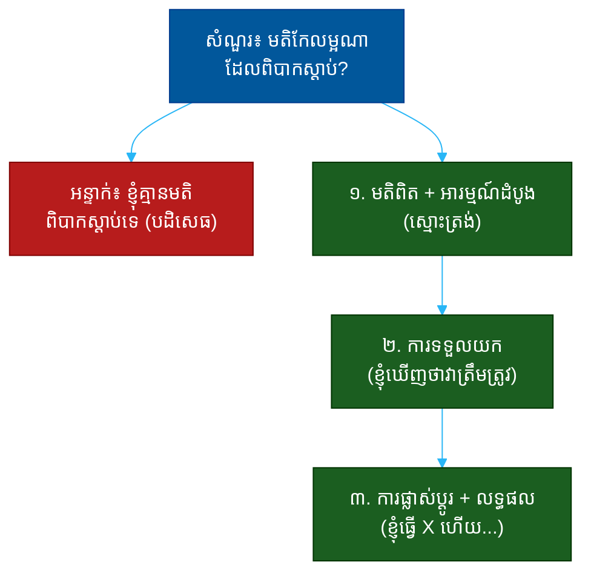

# "ប្រាប់ខ្ញុំពីមតិកែលម្អដែលពិបាកស្តាប់" (Tell Me About Feedback That Was Hard to Hear)៖ សំណួរតែមួយដែលបង្ហាញពីភាពចាស់ទុំ ការទទួលយក និងការលូតលាស់

**Author:** ichamrong  
**Date:** 2026-05-30  
**Tags:** #one-question #interview #self-awareness #feedback #maturity #growth #emotional-intelligence  
**Category:** Concepts / One Question  
**Read Time:** ~12 min  

---

## 📌 មាតិកា (Table of Contents)
- [អន្ទាក់ (The Setup)](#the-setup)
- [១. សំណួរពិតប្រាកដ (What They Are Really Asking)](#1)
- [២. អ្វីដែលវាបង្ហាញអំពីអ្នក (The Hidden Signals)](#2)
- [៣. អន្ទាក់ — ចម្លើយខ្សោយ (The Trap: Weak Answers)](#3)
- [៤. នីតិវិធីឆ្លើយតប (The Response Procedure)](#4)
- [៥. ឧទាហរណ៍ចម្លើយខ្លាំង (Strong Sample Answer)](#5)
- [៦. សំណួរបន្ត និងរបៀបដោះស្រាយ (Follow-up Traps)](#6)
- [សេចក្តីសន្និដ្ឋាន (Conclusion)](#conclusion)
- [ឯកសារយោង (References)](#references)
- [អត្ថបទពាក់ព័ន្ធ (Related Posts)](#related-posts)

---

## អន្ទាក់ (The Setup) 

អ្នកសម្ភាសន៍និយាយ​ដោយ​ស្ងប់​ស្ងាត់ថា៖ **«ប្រាប់ខ្ញុំពីពេលដែលអ្នកទទួលបានមតិកែលម្អ (feedback) ដែលពិបាកស្តាប់»**

នេះមើលទៅជាសំណួរអំពីអតីតកាល — តែវាជាសំណួរអំពី **របៀបដែលអ្នកប្រតិកម្មនៅពេលអ្នកត្រូវបានគេប៉ះ**។ គេមិនកំពុងស្តាប់ថា «មតិ» នោះជាអ្វីនោះទេ។ គេកំពុងស្តាប់ថា **តើអ្នកធ្វើអ្វីបន្ទាប់ពីឮវា** — ការពារខ្លួន ឬលូតលាស់?

ក្នុងចម្លើយរបស់អ្នក គេអាចអានបាន៖
* តើអ្នកទទួលយកការរិះគន់ ឬការពារខ្លួនភ្លាមៗ?
* តើអ្នកអាចមើលឃើញខ្លួនឯងពិតៗ ឬ​ច្រាន​មតិ​ចោល?
* តើអ្នកប្តូរអាកប្បកិរិយា ឬគ្រាន់តែស្តាប់ហើយភ្លេច?
* តើអ្នកមានភាពចាស់ទុំខាងអារម្មណ៍គ្រប់គ្រាន់ ដើម្បីបំបែកអារម្មណ៍ចេញពីការពិតដែរឬទេ?

នេះជាផែនទីបង្ហាញផ្លូវសម្រាប់ការឆ្លើយតបឲ្យបានល្អ៖

---

## ១. សំណួរពិតប្រាកដ (What They Are Really Asking) 

អ្នកសម្ភាសន៍មិនមែនកំពុងសុំ «រឿងសោកនាដកម្ម» នោះទេ។ ការទទួលមតិពិបាកស្តាប់គឺជារឿងធម្មតារបស់មនុស្សគ្រប់រូប — អ្វីដែលគេពិតជាសួរគឺ៖

> **«នៅ​ពេល​មនុស្ស​ម្នាក់​ប្រាប់​អ្នក​នូវ​អ្វី​ដែល​អ្នក​មិន​ចង់​ឮ តើ​អ្នក​ប្រែ​ក្លាយ​ជា​មនុស្ស​ការពារ​ខ្លួន ឬ​ជា​មនុស្ស​ដែល​ស្តាប់​ដោយ​ចំហ?»**

មនុស្សដែលមិនអាចទទួលមតិកែលម្អ គឺ​មិន​អាច​លូត​លាស់​បាន — ហើយ​គ្រប់​គ្រង​ពួក​គេ​ក៏​ពិបាក​ដែរ ព្រោះ​រាល់​ការ​ស្ថាបនា (coaching) នឹង​ប្រែ​ក្លាយ​ជា​ការ​ប្រឆាំង។ ផ្ទុយ​មក​វិញ មនុស្ស​ដែល​ស្តាប់​មតិ​ដ៏​ពិបាក ហើយ​បំ​លែង​វា​ឲ្យ​ក្លាយ​ជា​ការ​ផ្លាស់​ប្តូរ គឺ​ជា​មនុស្ស​ដែល​លូត​លាស់​បាន​លឿន​បំផុត។

ដូច្នេះ សំណួរនេះវាស់ ៣ យ៉ាង៖
1. **ការទទួលយក (Receptiveness)** — តើអ្នកស្តាប់ ឬការពារខ្លួន?
2. **ភាពចាស់ទុំខាងអារម្មណ៍ (Emotional Maturity)** — តើអ្នកបំបែកអារម្មណ៍ចេញពីការពិត?
3. **ការលូតលាស់ (Growth)** — តើមតិនោះប្រែជាការផ្លាស់ប្តូរ?

---

## ២. អ្វីដែលវាបង្ហាញអំពីអ្នក (The Hidden Signals) 

| សញ្ញាដែលគេអាន | ចម្លើយខ្សោយបង្ហាញ | ចម្លើយខ្លាំងបង្ហាញ |
| :--- | :--- | :--- |
| **ការទទួលយក (Receptiveness)** | ច្រានមតិចោល/បដិសេធ | ស្តាប់ ហើយឆ្លុះបញ្ចាំង |
| **ភាពស្មោះត្រង់ (Honesty)** | «ខ្ញុំគ្មានមតិពិបាក» | ទទួលស្គាល់អារម្មណ៍ដំបូង |
| **ភាពចាស់ទុំ (Maturity)** | ស្តីបន្ទោសអ្នកផ្តល់មតិ | ផ្តោតលើខ្លឹមសារ មិនមែនអ្នកនិយាយ |
| **ការលូតលាស់ (Growth)** | ស្តាប់ហើយឈប់ | មានការផ្លាស់ប្តូរជាក់ស្តែង |
| **ភាពចំហ (Coachability)** | ការពារខ្លួនខ្លាំង | សុំ​មតិ​បន្ថែម​ដោយ​ខ្លួន​ឯង |

**ចំណុចសំខាន់៖** ការ​ទទួល​ស្គាល់​ថា​មតិ​នោះ «ឆ្អល់​ចិត្ត» (stung) នៅ​ដំបូង គឺ **មិន​មែន​ជា​ភាព​ខ្សោយ​ទេ** — វា​ជា​ភាព​ស្មោះត្រង់។ អ្វី​ដែល​សំខាន់​គឺ​អ្វី​ដែល​អ្នក​ធ្វើ​បន្ទាប់​ពី​អារម្មណ៍​នោះ​បាន​ស្ងប់​វិញ។

---

## ៣. អន្ទាក់ — ចម្លើយខ្សោយ (The Trap: Weak Answers) 

**អន្ទាក់ទី ១ — ការបដិសេធ (The Denier):**
> «និយាយឲ្យត្រង់ ខ្ញុំមិនធ្លាប់ទទួលមតិដែលពិបាកស្តាប់ខ្លាំងទេ។»

ហេតុអ្វីបរាជ័យ៖ វាជារឿងមិនអាចទៅរួច — មនុស្សគ្រប់រូបធ្លាប់ឮរឿងពិបាក។ ការបដិសេធបង្ហាញថា ឬអ្នកមិនធ្លាប់ស្តាប់ ឬអ្នកមិនស្មោះត្រង់។

**អន្ទាក់ទី ២ — ការស្តីបន្ទោស (The Blamer):**
> «ចៅហ្វាយចាស់ម្នាក់រិះគន់ខ្ញុំ តែគាត់មិនយល់ស្ថានភាព ហើយគាត់ខុស។»

ហេតុអ្វីបរាជ័យ៖ អ្នកប្រែសំណួរ «តើអ្នករៀនអ្វី» ឲ្យក្លាយជា «អ្នកនិយាយខុស»។ វាបង្ហាញការការពារខ្លួន និងការខ្វះភាពចាស់ទុំខាងអារម្មណ៍។

**អន្ទាក់ទី ៣ — ការស្តាប់ហើយឈប់ (The Non-Changer):**
> «គេប្រាប់ខ្ញុំថាខ្ញុំទំនាក់ទំនងមិនច្បាស់ ខ្ញុំស្តាប់ ហើយខ្ញុំទទួលស្គាល់វា។»

ហេតុអ្វីបរាជ័យ៖ បាត់​ផ្នែក​សំខាន់​បំផុត — **ការ​ផ្លាស់​ប្តូរ**។ ការ​ទទួល​ស្គាល់​ដោយ​គ្មាន​សកម្មភាព​មិន​មែន​ជា​ការ​លូត​លាស់​ទេ វា​គ្រាន់​តែ​ជា​ការ​ស្តាប់។

---

## ៤. នីតិវិធីឆ្លើយតប (The Response Procedure) 

ចម្លើយខ្លាំងមាន **៣ ផ្នែក** តាមលំដាប់៖

**ជំហានទី ១ — មតិពិត + អារម្មណ៍ដំបូងដ៏ស្មោះត្រង់ (Real Feedback + Honest Reaction)**
ផ្តល់មតិជាក់ស្តែង ហើយទទួលស្គាល់ថាវាពិបាកស្តាប់ពិតៗ។
> «ចៅហ្វាយ​ខ្ញុំ​ធ្លាប់​ប្រាប់​ខ្ញុំ​ថា​ខ្ញុំ​កាត់​ផ្តាច់​មនុស្ស​ក្នុង​កិច្ច​ប្រជុំ។ ដំបូង​វា​ឆ្អល់​ចិត្ត​ខ្ញុំ​ណាស់ ព្រោះ​ខ្ញុំ​គិត​ថា​ខ្ញុំ​គ្រាន់​តែ​រំភើប​ចង់​ចូល​រួម។»

នេះបង្ហាញ **ភាពស្មោះត្រង់** — មិនលាក់អារម្មណ៍ដំបូង។

**ជំហានទី ២ — ការទទួលយក (Acceptance)**
បង្ហាញការផ្លាស់ប្តូរពីការការពារខ្លួន ទៅការមើលឃើញការពិត។
> «តែ​ពេល​ខ្ញុំ​សង្កេត​មើល​កិច្ច​ប្រជុំ​បន្ទាប់ ខ្ញុំ​ឃើញ​ថា​គាត់​និយាយ​ត្រូវ — ខ្ញុំ​ពិត​ជា​កាត់​ផ្តាច់​មនុស្ស​ស្ងាត់ៗ។»

នេះបង្ហាញ **ភាពចាស់ទុំខាងអារម្មណ៍** — បំបែកអារម្មណ៍ចេញពីការពិត។

**ជំហានទី ៣ — ការផ្លាស់ប្តូរ + លទ្ធផល (Change + Result)**
បញ្ចប់ដោយសកម្មភាពជាក់ស្តែង និងលទ្ធផល។
> «ខ្ញុំ​ចាប់​ផ្តើម​រាប់​ដល់​បី​មុន​ពេល​និយាយ ហើយ​សួរ​មនុស្ស​ស្ងាត់​ដោយ​ផ្ទាល់ — កិច្ច​ប្រជុំ​យើង​មាន​គំនិត​ល្អ​ៗ​ច្រើន​ជាង​មុន​ទៅ​ទៀត។»

នេះបង្ហាញ **ការលូតលាស់** ពិតប្រាកដ។

---

## ៥. ឧទាហរណ៍ចម្លើយខ្លាំង (Strong Sample Answer) 

> **«ចៅហ្វាយ​ខ្ញុំ​ធ្លាប់​ប្រាប់​ខ្ញុំ​ថា​ខ្ញុំ​កាត់​ផ្តាច់​មនុស្ស​ក្នុង​កិច្ច​ប្រជុំ​ដោយ​មិន​ដឹង​ខ្លួន។ ដោយ​ស្មោះត្រង់ ដំបូង​វា​ឆ្អល់​ចិត្ត​ខ្ញុំ​ណាស់ — ខ្ញុំ​គិត​ថា​ខ្ញុំ​គ្រាន់​តែ​មាន​ចំណង់​ចូល​រួម។ តែ​ខ្ញុំ​សម្រេច​ចិត្ត​សង្កេត​មើល​កិច្ច​ប្រជុំ​បន្ទាប់​ដោយ​ស្មោះត្រង់ ហើយ​ខ្ញុំ​ឃើញ​គាត់​និយាយ​ត្រូវ​ទាំង​ស្រុង — សមាជិក​ស្ងាត់​ពីរ​នាក់​ស្ទើរ​តែ​មិន​បាន​និយាយ​អ្វី​សោះ។ ដូច្នេះ ខ្ញុំ​ផ្លាស់​ប្តូរ​ពីរ​យ៉ាង៖ ខ្ញុំ​បង្ខំ​ខ្លួន​ឲ្យ​ឈប់​មុន​និយាយ ហើយ​ខ្ញុំ​ចាប់​ផ្តើម​សួរ​មនុស្ស​ស្ងាត់​ដោយ​ផ្ទាល់។ ក្នុង​រយៈ​ពេល​ប៉ុន្មាន​ខែ កិច្ច​ប្រជុំ​យើង​ផ្តល់​គំនិត​ល្អ​ៗ​ច្រើន​ជាង​មុន។ ឥឡូវ​ខ្ញុំ​មើល​ឃើញ​ការ​ស្តាប់​ជា​ជំនាញ​មួយ​ដែល​ខ្ញុំ​ត្រូវ​បន្ត​អនុវត្ត។»**

**ការវិភាគ (Breakdown):**
* «ខ្ញុំ​កាត់​ផ្តាច់​មនុស្ស» → មតិពិតប្រាកដ ជាក់លាក់
* «ដំបូង​វា​ឆ្អល់​ចិត្ត​ខ្ញុំ» → ស្មោះត្រង់អំពីអារម្មណ៍ដំបូង (honesty)
* «ខ្ញុំ​ឃើញ​គាត់​និយាយ​ត្រូវ» → ការទទួលយក (maturity)
* «ខ្ញុំ​ផ្លាស់​ប្តូរ​ពីរ​យ៉ាង» → សកម្មភាពជាក់ស្តែង (growth)
* «កិច្ច​ប្រជុំ​យើង​ផ្តល់​គំនិត​ល្អ​ៗ​ច្រើន​ជាង​មុន» → លទ្ធផល

**ប្រៀបធៀប៖**
* ❌ ខ្សោយ៖ «ខ្ញុំគ្មានមតិពិបាកស្តាប់ទេ»
* ✅ ខ្លាំង៖ ចម្លើយ ៣ ផ្នែកខាងលើ

---

## ៦. សំណួរបន្ត និងរបៀបដោះស្រាយ (Follow-up Traps) 

អ្នកសម្ភាសន៍ល្អនឹងសួរបន្ត ដើម្បីសាកល្បងថាការលូតលាស់របស់អ្នកពិតឬមិនពិត៖

**«ចុះបើអ្នកមិនយល់ស្របនឹងមតិនោះវិញ?» (What if you disagreed with the feedback?)**
> បង្ហាញ​ភាព​ចាស់ទុំ៖ «ខ្ញុំ​នៅ​តែ​ស្តាប់​ឲ្យ​ចប់ ហើយ​សុំ​ឧទាហរណ៍​ជាក់​ស្តែង។ ពេល​ខ្លះ ខ្ញុំ​យល់​ស្រប​ផ្នែក​ខ្លះ មិន​យល់​ស្រប​ផ្នែក​ខ្លះ — តែ​ខ្ញុំ​មិន​ច្រាន​ចោល​ភ្លាម​ៗ​ទេ ព្រោះ​ការ​ដែល​គេ​មើល​ឃើញ​ខ្ញុំ​បែប​នោះ ខ្លួន​វា​ក៏​ជា​ព័ត៌មាន​ដែរ។»

**«តើថ្មីៗនេះ អ្នកធ្លាប់ឮមតិពិបាកស្តាប់ដែរឬទេ?» (Any hard feedback recently?)**
> បង្ហាញ​ថា​អ្នក​នៅ​តែ​សុំ​មតិ​ជា​ប្រចាំ — កុំ​ធ្វើ​ឲ្យ​ហាក់​ដូច​ជា​ការ​លូត​លាស់​ឈប់​នៅ​អតីត​កាល។ ផ្តល់​ឧទាហរណ៍​ថ្មី​មួយ​ខ្លី​ៗ។

**ច្បាប់មាស៖** រាល់សំណួរបន្ត គឺជាការសាកល្បងថាតើ «ការផ្លាស់ប្តូរ» ដែលអ្នកនិយាយជាការពិត។ បើវាពិត អ្នកនឹងមានព័ត៌មានលម្អិតជាក់ស្តែង (តើផ្លាស់ប្តូរយ៉ាងណា លទ្ធផលជាអ្វី) ដែលមនុស្សដែលប្រឌិតរឿងមិនអាចមានបាន។

---

## សេចក្តីសន្និដ្ឋាន (Conclusion) 

សំណួរ «ប្រាប់ខ្ញុំពីមតិកែលម្អដែលពិបាកស្តាប់» មិនមែនជាការសុំរឿងពិបាកនោះទេ។ វាជា **កញ្ចក់** ដែលឆ្លុះបញ្ចាំងថាតើអ្នកប្រែជាមនុស្សការពារខ្លួន ឬជាមនុស្សដែលលូតលាស់នៅពេលត្រូវបានគេប៉ះ។

ចងចាំរូបមន្ត ៣ ផ្នែក៖
1. **មតិពិត + អារម្មណ៍ដំបូងដ៏ស្មោះត្រង់** (វាឆ្អល់ចិត្តខ្ញុំ...)
2. **ការទទួលយក** (តែខ្ញុំឃើញថាវាត្រឹមត្រូវ)
3. **ការផ្លាស់ប្តូរ + លទ្ធផល** (ខ្ញុំធ្វើ X ហើយលទ្ធផល Y)

ភាព​ងាយ​រង​គ្រោះ​ដ៏​ស្មោះត្រង់​អំពី​អារម្មណ៍​ដំបូង រួម​នឹង​ភស្តុតាង​នៃ​ការ​ផ្លាស់​ប្តូរ​ពិត — នោះ​ជា​អ្វី​ដែល​បង្ហាញ​ថា​អ្នក​ជា​មនុស្ស​ដែល​អាច​ស្ថាបនា​បាន (coachable) និង​លូត​លាស់​បាន។

---

## ឯកសារយោង (References) 

- *Thanks for the Feedback* — Douglas Stone & Sheila Heen
- *Mindset* — Carol Dweck
- *Radical Candor* — Kim Scott

---

## អត្ថបទពាក់ព័ន្ធ (Related Posts) 

- [What Is Your Biggest Weakness? (ចំណុចខ្សោយ)](01-what-is-your-biggest-weakness.md)
- [What Would Your Coworkers Say About You? (មិត្តរួមការងារ)](02-what-would-your-coworkers-say-about-you.md)
- [One Question Index](../README.md)
