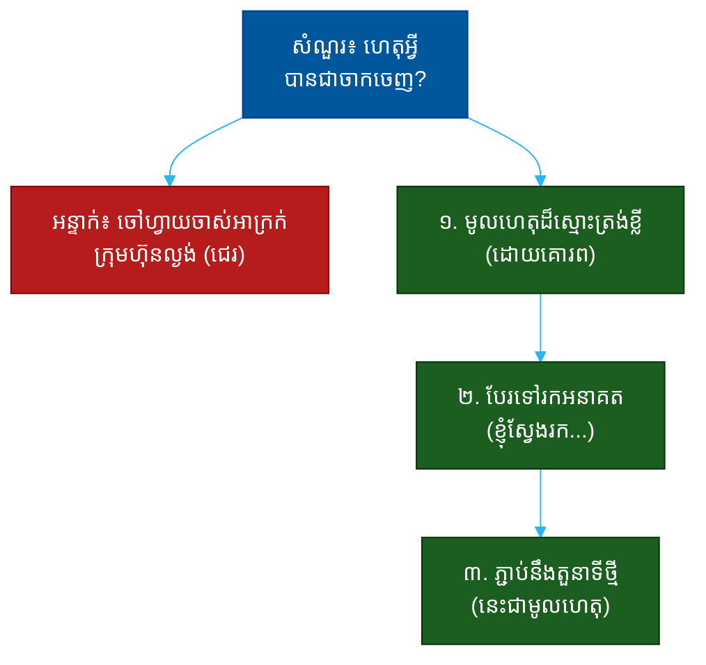

# "ហេតុអ្វីបានជាអ្នកចាកចេញពីការងារចាស់?" (Why Did You Leave Your Last Job?)៖ សំណួរតែមួយដែលបង្ហាញពីភាពចាស់ទុំ ភាពស្មោះត្រង់ និងគុណវិជ្ជាជីវៈ

**Author:** ichamrong  
**Date:** 2026-05-30  
**Tags:** #one-question #interview #self-awareness #maturity #professionalism #honesty #motivation  
**Category:** Concepts / One Question  
**Read Time:** ~12 min  

---

## 📌 មាតិកា (Table of Contents)
- [អន្ទាក់ (The Setup)](#the-setup)
- [១. សំណួរពិតប្រាកដ (What They Are Really Asking)](#1)
- [២. អ្វីដែលវាបង្ហាញអំពីអ្នក (The Hidden Signals)](#2)
- [៣. អន្ទាក់ — ចម្លើយខ្សោយ (The Trap: Weak Answers)](#3)
- [៤. នីតិវិធីឆ្លើយតប (The Response Procedure)](#4)
- [៥. ឧទាហរណ៍ចម្លើយខ្លាំង (Strong Sample Answer)](#5)
- [៦. សំណួរបន្ត និងរបៀបដោះស្រាយ (Follow-up Traps)](#6)
- [សេចក្តីសន្និដ្ឋាន (Conclusion)](#conclusion)
- [ឯកសារយោង (References)](#references)
- [អត្ថបទពាក់ព័ន្ធ (Related Posts)](#related-posts)

---

## អន្ទាក់ (The Setup) 

អ្នកសម្ភាសន៍មើលប្រវត្តិរូបរបស់អ្នក ហើយសួរថា៖ **«ហេតុអ្វីបានជាអ្នកចាកចេញពីការងារចាស់?»**

នេះមើលទៅជាសំណួរអំពីអតីតកាល — តែវាជាសំណួរអំពី **របៀបដែលអ្នកនិយាយអំពីមនុស្សដែលអ្នកលែងត្រូវការ**។ គេមិនកំពុងស្តាប់មូលហេតុនៃការចាកចេញនោះទេ។ គេកំពុងស្តាប់ថា **តើថ្ងៃណាមួយ ពេលអ្នកចាកចេញពីពួកគេ តើអ្នកនឹងនិយាយអំពីពួកគេយ៉ាងណា**។

ក្នុងចម្លើយរបស់អ្នក គេអាចអានបាន៖
* តើអ្នកនិយាយដោយគុណវិជ្ជាជីវៈ ឬជេរប្រមាថចៅហ្វាយចាស់?
* តើអ្នករត់ «ចេញពី» អ្វីមួយ ឬរត់ «ទៅរក» អ្វីមួយ?
* តើអ្នកទទួលខុសត្រូវផ្នែករបស់ខ្លួន ឬស្តីបន្ទោសគ្រប់យ៉ាង?
* តើអ្នកមានភាពចាស់ទុំគ្រប់គ្រាន់ ដើម្បីនិយាយការពិតដោយមិនបង្ខូចកេរ្តិ៍ឈ្មោះអ្នកដទៃ?

នេះជាផែនទីបង្ហាញផ្លូវសម្រាប់ការឆ្លើយតបឲ្យបានល្អ៖

---

## ១. សំណួរពិតប្រាកដ (What They Are Really Asking) 

អ្នកសម្ភាសន៍មិនមែនកំពុងស្វែងរក «រឿងពិត» នៃជម្លោះការងារចាស់នោះទេ។ ការចាកចេញពីការងារគឺជារឿងធម្មតា — អ្វីដែលគេពិតជាសួរគឺ៖

> **«តើ​ថ្ងៃ​ណា​មួយ ពេល​អ្នក​ចាក​ចេញ​ពី​ខ្ញុំ តើ​អ្នក​នឹង​អង្គុយ​នៅ​ការ​សម្ភាសន៍​បន្ទាប់ ហើយ​ជេរ​ខ្ញុំ​បែប​នេះ​ដែរ​ឬ​ទេ?»**

របៀបដែលអ្នកនិយាយអំពីនិយោជកចាស់ គឺជាការទស្សន៍ទាយដ៏ត្រឹមត្រូវបំផុតថា អ្នកនឹងនិយាយអំពីពួកគេយ៉ាងណានៅពេលក្រោយ។ មនុស្សដែលជេរប្រមាថចៅហ្វាយចាស់ បង្ហាញសញ្ញាក្រហមធំ ៣ យ៉ាង៖ ខ្វះការទទួលខុសត្រូវ, ខ្វះការវិនិច្ឆ័យ, និងខ្វះគុណវិជ្ជាជីវៈ។

ដូច្នេះ សំណួរនេះវាស់ ៣ យ៉ាង៖
1. **គុណវិជ្ជាជីវៈ (Professionalism)** — តើអ្នកនិយាយដោយគោរព?
2. **ការទទួលខុសត្រូវ (Ownership)** — តើអ្នកមើលឃើញផ្នែករបស់ខ្លួន?
3. **ការលើកទឹកចិត្ត (Motivation)** — តើអ្នករត់ទៅរក ឬរត់ចេញ?

---

## ២. អ្វីដែលវាបង្ហាញអំពីអ្នក (The Hidden Signals) 

| សញ្ញាដែលគេអាន | ចម្លើយខ្សោយបង្ហាញ | ចម្លើយខ្លាំងបង្ហាញ |
| :--- | :--- | :--- |
| **គុណវិជ្ជាជីវៈ** | ជេរប្រមាថចៅហ្វាយ/ក្រុមហ៊ុន | និយាយដោយគោរព |
| **ការទទួលខុសត្រូវ** | «គ្រប់យ៉ាងជាកំហុសគេ» | ទទួលស្គាល់ផ្នែករបស់ខ្លួន |
| **ការលើកទឹកចិត្ត** | រត់ចេញពីបញ្ហា | រត់ទៅរកឱកាស |
| **ការវិនិច្ឆ័យ (Judgment)** | លាតត្រដាងរឿងសម្ងាត់ | រក្សាព្រំដែនសមរម្យ |
| **ស្ថេរភាព (Stability)** | គ្រប់កន្លែងសុទ្ធតែមានបញ្ហា | មូលហេតុច្បាស់ លម្អិត |

**ចំណុចសំខាន់៖** ទោះ​បី​ការងារ​ចាស់​អាក្រក់​ពិត​ៗ​ក៏​ដោយ — ការ​ជេរ​ប្រមាថ​ក្នុង​ការ​សម្ភាសន៍​ធ្វើ​ឲ្យ​អ្នក​ខាត​បង់​ច្រើន​ជាង​ការងារ​ចាស់​នោះ​ទៅ​ទៀត។ ភាព​ស្ងប់​ស្ងាត់​និង​គោរព​បង្ហាញ​ភាព​ខ្លាំង មិន​មែន​ភាព​ខ្សោយ​ទេ។

---

## ៣. អន្ទាក់ — ចម្លើយខ្សោយ (The Trap: Weak Answers) 

**អន្ទាក់ទី ១ — អ្នកជេរ (The Bad-Mouther):**
> «ចៅហ្វាយខ្ញុំជាមនុស្សអាក្រក់ ក្រុមហ៊ុនគ្រប់គ្រងមិនល្អ ហើយគ្មាននរណាដឹងធ្វើអ្វីត្រឹមត្រូវ។»

ហេតុអ្វីបរាជ័យ៖ អ្នកទើបបង្ហាញខ្លួនថាជាមនុស្សដែលនឹងជេរនិយោជកថ្មីនៅពេលក្រោយ។ វាក៏បង្ហាញការខ្វះការទទួលខុសត្រូវ — តើអ្នកគ្មានផ្នែកអ្វីសោះមែនទេ?

**អន្ទាក់ទី ២ — អ្នកលាក់ (The Vague One):**
> «អ៎... គ្រាន់តែដល់ពេលផ្លាស់ប្តូរ។»

ហេតុអ្វីបរាជ័យ៖ ភាពមិនច្បាស់បង្កើតការសង្ស័យ។ អ្នកសម្ភាសន៍នឹងគិតថាមានអ្វីដែលអ្នកកំពុងលាក់ — ការបណ្តេញ? ជម្លោះ?

**អន្ទាក់ទី ៣ — ជនរងគ្រោះ (The Victim):**
> «ខ្ញុំធ្វើការខ្លាំង តែគ្មាននរណាដឹងគុណ ហើយខ្ញុំត្រូវគេយកប្រៀប។»

ហេតុអ្វីបរាជ័យ៖ ការ​លេង​តួ​ជន​រង​គ្រោះ​បង្ហាញ​ការ​ខ្វះ​ភាព​ជា​ម្ចាស់​លើ​ជីវិត​ការងារ​របស់​ខ្លួន។ និយោជក​ចង់​បាន​មនុស្ស​ដែល​ដោះ​ស្រាយ​បញ្ហា មិន​មែន​មនុស្ស​ដែល​រង់ចាំ​ការ​ទទួល​ស្គាល់​ឡើយ។

---

## ៤. នីតិវិធីឆ្លើយតប (The Response Procedure) 

ចម្លើយខ្លាំងមាន **៣ ផ្នែក** តាមលំដាប់៖

**ជំហានទី ១ — មូលហេតុដ៏ស្មោះត្រង់ខ្លី ដោយគោរព (Brief, Respectful, Honest Reason)**
ផ្តល់មូលហេតុពិត តែខ្លី និងគ្មានពាក្យអវិជ្ជមាន។
> «ខ្ញុំ​បាន​រៀន​បាន​ច្រើន​នៅ​ទី​នោះ ហើយ​ខ្ញុំ​ដឹង​គុណ​ឱកាស​នោះ — តែ​ខ្ញុំ​បាន​ឈាន​ដល់​ដែន​កំណត់​នៃ​ការ​លូត​លាស់​នៅ​ក្នុង​តួនាទី​នោះ។»

នេះបង្ហាញ **គុណវិជ្ជាជីវៈ** និងភាពស្មោះត្រង់ដោយគ្មានការជេរ។

**ជំហានទី ២ — បែរទៅរកអនាគត (Pivot Toward, Not Away)**
ប្តូរពីការនិយាយ «ចេញពីអ្វី» ទៅ «ទៅរកអ្វី»។
> «ខ្ញុំ​កំពុង​ស្វែង​រក​តួនាទី​ដែល​ខ្ញុំ​អាច​ទទួល​ខុស​ត្រូវ​លើ X និង​ធ្វើ​ការ​លើ​បញ្ហា​ប្រភេទ Y។»

នេះបង្ហាញ **ការលើកទឹកចិត្តវិជ្ជមាន** (running toward)។

**ជំហានទី ៣ — ភ្ជាប់នឹងតួនាទីថ្មី (Connect to This Role)**
បញ្ចប់ដោយការភ្ជាប់មកនឹងឱកាសនៅទីនេះ។
> «ហើយ​នោះ​ជា​មូលហេតុ​ដែល​តួនាទី​នេះ​ទាក់ទាញ​ខ្ញុំ — វា​ផ្តល់​ឱកាស​ដែល​ខ្ញុំ​កំពុង​ស្វែង​រក។»

នេះបង្ហាញ **ការផ្តោតអារម្មណ៍** និងភាពសមស្រប (fit)។

---

## ៥. ឧទាហរណ៍ចម្លើយខ្លាំង (Strong Sample Answer) 

> **«ខ្ញុំ​ដឹង​គុណ​ពេល​វេលា​ដែល​ខ្ញុំ​នៅ​ទី​នោះ​ណាស់ — ខ្ញុំ​បាន​រៀន​ពី​របៀប​ដឹក​នាំ​គម្រោង​ពី​ដើម​ដល់​ចប់។ តែ​ក្រុមហ៊ុន​នោះ​មាន​ទំហំ​តូច ហើយ​ខ្ញុំ​បាន​ឈាន​ដល់​ចំណុច​ដែល​គ្មាន​ផ្លូវ​លូត​លាស់​ច្បាស់​ទៀត​ទេ។ ខ្ញុំ​ចង់​ធ្វើ​ការ​លើ​បញ្ហា​ដែល​មាន​ទំហំ​ធំ​ជាង ជា​ពិសេស​ខាង​ការ​ដឹក​នាំ​ក្រុម​ផលិត​ផល។ បន្ទាប់​ពី​ខ្ញុំ​ស្រាវ​ជ្រាវ​អំពី​ក្រុមហ៊ុន​នេះ ខ្ញុំ​ឃើញ​ថា​តួនាទី​នេះ​ផ្តោត​ច្បាស់​លើ​អ្វី​ដែល​ខ្ញុំ​កំពុង​ស្វែង​រក — ហើយ​នោះ​ជា​មូលហេតុ​ដែល​ខ្ញុំ​នៅ​ទី​នេះ​ថ្ងៃ​នេះ។»**

**ការវិភាគ (Breakdown):**
* «ខ្ញុំ​ដឹង​គុណ​ពេល​វេលា...» → គុណវិជ្ជាជីវៈ ដោយគោរព
* «ក្រុមហ៊ុន​នោះ​មាន​ទំហំ​តូច» → មូលហេតុពិត គ្មានការជេរ (honesty)
* «ខ្ញុំ​ចង់​ធ្វើ​ការ​លើ​បញ្ហា​ដែល​មាន​ទំហំ​ធំ​ជាង» → រត់ទៅរក មិនមែនរត់ចេញ (motivation)
* «តួនាទី​នេះ​ផ្តោត​ច្បាស់​លើ​អ្វី​ដែល​ខ្ញុំ​ស្វែង​រក» → ភ្ជាប់នឹងតួនាទីថ្មី (fit)

**ប្រៀបធៀប៖**
* ❌ ខ្សោយ៖ «ចៅហ្វាយខ្ញុំអាក្រក់ ហើយក្រុមហ៊ុនល្ងង់»
* ✅ ខ្លាំង៖ ចម្លើយ ៣ ផ្នែកខាងលើ

---

## ៦. សំណួរបន្ត និងរបៀបដោះស្រាយ (Follow-up Traps) 

អ្នកសម្ភាសន៍ល្អនឹងសួរបន្ត ដើម្បីសាកល្បងថាគុណវិជ្ជាជីវៈរបស់អ្នកពិតឬគ្រាន់តែជាការសម្តែង៖

**«និយាយឲ្យត្រង់ — ពិតជាគ្មានបញ្ហាអ្វីសោះមែនទេ?» (Honestly, was there no conflict?)**
> កុំ​ត្រូវ​អន្ទាក់​ឲ្យ​ជេរ។ ទទួល​ស្គាល់​ដោយ​ភាព​ចាស់ទុំ៖ «ពិត​ណាស់ មិន​មែន​គ្រប់​យ៉ាង​ល្អ​ឥត​ខ្ចោះ​ទេ — យើង​មាន​ការ​យល់​ខុស​គ្នា​ខ្លះ​អំពី​អាទិភាព។ តែ​ខ្ញុំ​មើល​ឃើញ​ផ្នែក​ខ្ញុំ​ក្នុង​នោះ​ដែរ ហើយ​ខ្ញុំ​បាន​រៀន​ពី​វា។»

**«ចុះប្រសិនបើពួកគេផ្តល់តួនាទីខ្ពស់ជាង តើអ្នកនឹងនៅ?» (Would you have stayed for a promotion?)**
> ឆ្លើយ​ដោយ​ភាព​ច្បាស់៖ «បញ្ហា​មិន​មែន​គ្រាន់​តែ​តួនាទី​ទេ — វា​ជា​ប្រភេទ​បញ្ហា​ដែល​ខ្ញុំ​ចង់​ដោះ​ស្រាយ។ ទោះ​បី​មាន​តួនាទី​ខ្ពស់ ខ្ញុំ​នៅ​តែ​ស្វែង​រក​អ្វី​ដែល​មាន​នៅ​ទី​នេះ។»

**ច្បាប់មាស៖** រាល់សំណួរបន្ត គឺជាការទាក់ទាញឲ្យអ្នកជេរ ឬលាក់ការពិត។ មនុស្សចាស់ទុំទទួលស្គាល់ថាមានភាពមិនល្អ — ដោយគោរព និងដោយការទទួលខុសត្រូវផ្នែករបស់ខ្លួន — ដោយមិនបង្ខូចកេរ្តិ៍ឈ្មោះអ្នកដទៃ។

---

## សេចក្តីសន្និដ្ឋាន (Conclusion) 

សំណួរ «ហេតុអ្វីបានជាអ្នកចាកចេញពីការងារចាស់?» មិនមែនជាការសុំ «ហេតុផល» នោះទេ។ វាជា **កញ្ចក់** ដែលឆ្លុះបញ្ចាំងថា ថ្ងៃណាមួយ អ្នកនឹងនិយាយអំពីពួកគេយ៉ាងណានៅពេលអ្នកចាកចេញ។

ចងចាំរូបមន្ត ៣ ផ្នែក៖
1. **មូលហេតុដ៏ស្មោះត្រង់ខ្លី ដោយគោរព** (ខ្ញុំដឹងគុណ តែ...)
2. **បែរទៅរកអនាគត** (ខ្ញុំស្វែងរក...)
3. **ភ្ជាប់នឹងតួនាទីថ្មី** (នេះជាមូលហេតុ)

ភាព​ស្ងប់ និង​គោរព​ពេល​និយាយ​អំពី​អតីត — រួម​នឹង​ការ​លើក​ទឹក​ចិត្ត​ដែល​បែរ​ទៅ​មុខ — នោះ​ជា​អ្វី​ដែល​បង្ហាញ​ថា​អ្នក​ជា​មនុស្ស​ដែល​មាន​គុណ​វិជ្ជា​ជីវៈ និង​ដែល​គេ​ទុក​ចិត្ត​ឲ្យ​តំណាង​ឲ្យ​ខ្លួន​បាន។

---

## ឯកសារយោង (References) 

- *Designing Your Life* — Bill Burnett & Dave Evans
- *The First 90 Days* — Michael Watkins
- *Never Split the Difference* — Chris Voss

---

## អត្ថបទពាក់ព័ន្ធ (Related Posts) 

- [What Would Your Coworkers Say About You? (មិត្តរួមការងារ)](02-what-would-your-coworkers-say-about-you.md)
- [Tell Me About Feedback That Was Hard to Hear (មតិកែលម្អ)](03-tell-me-about-feedback-that-was-hard-to-hear.md)
- [One Question Index](../README.md)
