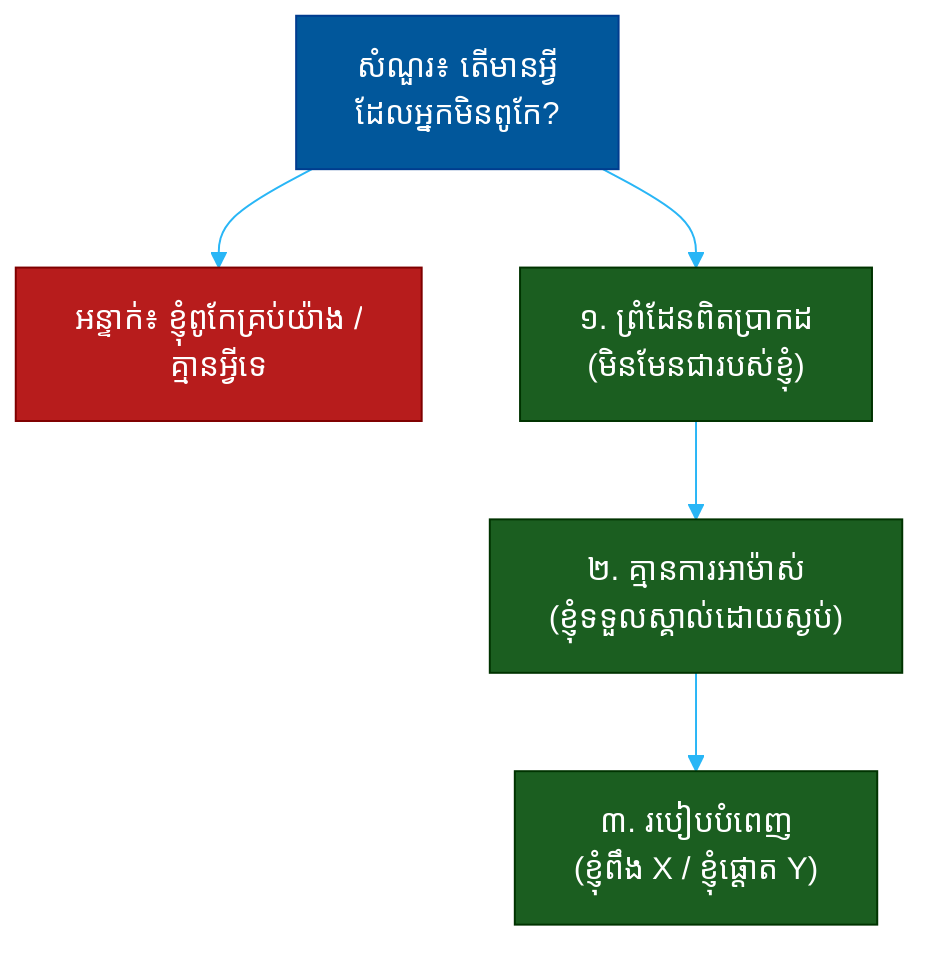

# "តើមានអ្វីដែលអ្នកមិនពូកែ?" (What Are You NOT Good At?)៖ សំណួរតែមួយដែលបង្ហាញពីភាពស្មោះត្រង់ ការស្គាល់ព្រំដែន និងភាពចាស់ទុំ

**Author:** ichamrong  
**Date:** 2026-05-30  
**Tags:** #one-question #interview #self-awareness #honesty #boundaries #maturity #emotional-intelligence  
**Category:** Concepts / One Question  
**Read Time:** ~12 min  

---

## 📌 មាតិកា (Table of Contents)
- [អន្ទាក់ (The Setup)](#the-setup)
- [១. សំណួរពិតប្រាកដ (What They Are Really Asking)](#1)
- [២. អ្វីដែលវាបង្ហាញអំពីអ្នក (The Hidden Signals)](#2)
- [៣. អន្ទាក់ — ចម្លើយខ្សោយ (The Trap: Weak Answers)](#3)
- [៤. នីតិវិធីឆ្លើយតប (The Response Procedure)](#4)
- [៥. ឧទាហរណ៍ចម្លើយខ្លាំង (Strong Sample Answer)](#5)
- [៦. សំណួរបន្ត និងរបៀបដោះស្រាយ (Follow-up Traps)](#6)
- [សេចក្តីសន្និដ្ឋាន (Conclusion)](#conclusion)
- [ឯកសារយោង (References)](#references)
- [អត្ថបទពាក់ព័ន្ធ (Related Posts)](#related-posts)

---

## អន្ទាក់ (The Setup) 

អ្នកសម្ភាសន៍សួរ​ដោយ​ត្រង់​ៗ៖ **«តើមានអ្វីដែលអ្នកមិនពូកែ?»**

នេះមើលទៅដូចជា «ចំណុចខ្សោយ» ម្តងទៀត — តែវាខុសគ្នា។ «ចំណុចខ្សោយ» គឺជានិស្ស័យដែលអ្នកអាចកែ។ «អ្វីដែលអ្នកមិនពូកែ» គឺជា **ព្រំដែននៃសមត្ថភាព** (boundary of competence) — ជំនាញដែលមិនមែនជារបស់អ្នក ហើយប្រហែលនឹងមិនធ្លាប់ក្លាយជារបស់អ្នក។ គេកំពុងស្តាប់ថា **តើអ្នកស្គាល់ព្រំដែនរបស់ខ្លួនដែរឬទេ**។

ក្នុងចម្លើយរបស់អ្នក គេអាចអានបាន៖
* តើអ្នកស្គាល់ព្រំដែនរបស់ខ្លួន ឬគិតថាខ្លួនពូកែគ្រប់យ៉ាង?
* តើអ្នកអាចទទួលស្គាល់ការមិនពូកែ ដោយមិនអាម៉ាស់?
* តើអ្នកដឹងពីរបៀបបំពេញចន្លោះនោះ (ក្រុម, ឧបករណ៍, អ្នកដទៃ)?
* តើអ្នកមានទំនុកចិត្តគ្រប់គ្រាន់ដើម្បីនិយាយ «នេះមិនមែនជារបស់ខ្ញុំ» ដែរឬទេ?

នេះជាផែនទីបង្ហាញផ្លូវសម្រាប់ការឆ្លើយតបឲ្យបានល្អ៖

---

## ១. សំណួរពិតប្រាកដ (What They Are Really Asking) 

អ្នកសម្ភាសន៍មិនមែនកំពុងស្វែងរក «ភស្តុតាងនៃភាពអសមត្ថភាព» នោះទេ។ គ្មាននរណាពូកែគ្រប់យ៉ាង — ហើយមនុស្សដែលគិតថាខ្លួនពូកែគ្រប់យ៉ាងគឺគ្រោះថ្នាក់បំផុត។ អ្វីដែលគេពិតជាសួរគឺ៖

> **«តើ​អ្នក​ស្គាល់​ព្រំដែន​នៃ​សមត្ថភាព​របស់​ខ្លួន​ច្បាស់​ល្អ​ដែរ​ឬ​ទេ — និង​តើ​អ្នក​ដឹង​ពេល​ណា​ត្រូវ​សុំ​ជំនួយ?»**

នេះខុសពីសំណួរ «ចំណុចខ្សោយ»។ ចំណុចខ្សោយ គឺ​អ្វី​ដែល​អ្នក​កែ។ «អ្វី​ដែល​អ្នក​មិន​ពូកែ» គឺ​ការ​ទទួល​ស្គាល់​ថា​មាន​ជំនាញ​ខ្លះ​ដែល​អ្នក​នឹង​មិន​ខ្នះ​ខ្នែង​ក្លាយ​ជា​ពូកែ — ហើយ​នោះ​មិន​អី​ទេ ដរាប​ណា​អ្នក​ដឹង​ហើយ​មាន​យុទ្ធសាស្ត្រ​បំពេញ​វា។ មនុស្ស​ដែល​ដឹង​ព្រំដែន​របស់​ខ្លួន​គឺ​ជា​មនុស្ស​ដែល​សហ​ការ​ល្អ​បំផុត។

ដូច្នេះ សំណួរនេះវាស់ ៣ យ៉ាង៖
1. **ការស្គាល់ព្រំដែន (Self-Knowledge)** — តើអ្នកដឹងថាអ្វីមិនមែនជារបស់អ្នក?
2. **ភាពមិនអាម៉ាស់ (Security)** — តើអ្នកស្រួលក្នុងការទទួលស្គាល់?
3. **យុទ្ធសាស្ត្របំពេញ (Compensation)** — តើអ្នកដឹងពីរបៀបបំពេញចន្លោះ?

---

## ២. អ្វីដែលវាបង្ហាញអំពីអ្នក (The Hidden Signals) 

| សញ្ញាដែលគេអាន | ចម្លើយខ្សោយបង្ហាញ | ចម្លើយខ្លាំងបង្ហាញ |
| :--- | :--- | :--- |
| **ការស្គាល់ព្រំដែន** | «ខ្ញុំពូកែគ្រប់យ៉ាង» | ច្បាស់ថាអ្វីមិនមែនជារបស់ខ្លួន |
| **ភាពមិនអាម៉ាស់ (Security)** | ខ្មាស/ការពារខ្លួន | ស្ងប់ មិនអាម៉ាស់ |
| **ភាពស្មោះត្រង់ (Honesty)** | ខ្សោយក្លែងក្លាយ | ការមិនពូកែពិតប្រាកដ |
| **យុទ្ធសាស្ត្រ (Strategy)** | ទុកវាចោល | ពឹងលើក្រុម/ឧបករណ៍/អ្នកដទៃ |
| **ការវិនិច្ឆ័យ (Judgment)** | មិនមែនជារបស់ស្នូលតួនាទី | មិនធ្វើឲ្យអសមត្ថភាពលើតួនាទីស្នូល |

**ចំណុចសំខាន់៖** ភាព​ខុស​គ្នា​រវាង​សំណួរ​នេះ​និង «ចំណុច​ខ្សោយ» គឺ៖ ត្រង់​នេះ​អ្នក **មិន​ចាំ​បាច់​សន្យា​ថា​នឹង​កែ​ឲ្យ​ពូកែ​ទេ** — អ្នក​គ្រាន់​តែ​ត្រូវ​បង្ហាញ​ថា​អ្នក​ដឹង​ហើយ​មាន​ផែនការ​បំពេញ។

---

## ៣. អន្ទាក់ — ចម្លើយខ្សោយ (The Trap: Weak Answers) 

**អន្ទាក់ទី ១ — អ្នកល្អឥតខ្ចោះ (The Know-It-All):**
> «និយាយឲ្យត្រង់ ខ្ញុំសម្របខ្លួនលឿន ដូច្នេះមិនមានអ្វីដែលខ្ញុំមិនអាចធ្វើបានទេ។»

ហេតុអ្វីបរាជ័យ៖ វាបង្ហាញការខ្វះការស្គាល់ខ្លួនឯង។ មនុស្សដែលគិតថាខ្លួនអាចធ្វើបានគ្រប់យ៉ាង គឺជាមនុស្សដែលនឹងទទួលយកការងារដែលគេមិនអាចធ្វើ ហើយធ្វើឲ្យខូច។

**អន្ទាក់ទី ២ — ការច្រឡំជាមួយចំណុចខ្សោយ (The Confused One):**
> «ខ្ញុំមិនពូកែគ្រប់គ្រងពេលវេលា តែខ្ញុំកំពុងព្យាយាមកែ។»

ហេតុអ្វីបរាជ័យ៖ នេះជាចម្លើយ «ចំណុចខ្សោយ» ដែលគេឆ្លើយខុសសំណួរ។ សំណួរនេះមិនសុំជំនាញដែលអ្នកនឹងកែ — វាសុំជំនាញដែលមិនមែនជារបស់អ្នក និងរបៀបដែលអ្នករស់នៅជាមួយវា។

**អន្ទាក់ទី ៣ — ការបណ្តាក់ខ្លួន (The Self-Saboteur):**
> «ខ្ញុំមិនពូកែខាងលេខ និងការវិភាគទិន្នន័យសោះ» (សម្រាប់តួនាទីដែលត្រូវការវិភាគ)

ហេតុអ្វីបរាជ័យ៖ អ្នក​ទើប​ប្រកាស​ថា​អ្នក​មិន​អាច​ធ្វើ​ស្នូល​នៃ​ការងារ​បាន។ ការ​ស្គាល់​ព្រំដែន​ល្អ​មាន​ន័យ​ថា​ជ្រើស​ការ​មិន​ពូកែ​ដែល​នៅ **ខាង​ក្រៅ** តួនាទី​ស្នូល។

---

## ៤. នីតិវិធីឆ្លើយតប (The Response Procedure) 

ចម្លើយខ្លាំងមាន **៣ ផ្នែក** តាមលំដាប់៖

**ជំហានទី ១ — ព្រំដែនពិតប្រាកដ (Real, Off-Core Boundary)**
ជ្រើសជំនាញដែលអ្នកពិតជាមិនពូកែ តែនៅខាងក្រៅស្នូលនៃតួនាទី។
> «ខ្ញុំ​មិន​ពូកែ​ខាង​ការ​រចនា​ក្រាហ្វិក (visual design) ទេ — ភ្នែក​សោភ័ណ​របស់​ខ្ញុំ​មិន​ខ្លាំង​ប៉ុន្មាន​ទេ។»

នេះបង្ហាញ **ការស្គាល់ព្រំដែន** ដ៏ស្មោះត្រង់។

**ជំហានទី ២ — គ្មានការអាម៉ាស់ (No Shame, Just Fact)**
បង្ហាញថាអ្នកស្រួលនឹងវា — មិនការពារខ្លួន មិនអាម៉ាស់។
> «ខ្ញុំ​បាន​ទទួល​ស្គាល់​វា​តាំង​ពី​យូរ​មក​ហើយ ហើយ​ខ្ញុំ​ស្រួល​ចិត្ត​នឹង​វា។»

នេះបង្ហាញ **ភាពមិនអាម៉ាស់** (security) និងភាពចាស់ទុំ។

**ជំហានទី ៣ — យុទ្ធសាស្ត្របំពេញ (How You Compensate)**
បញ្ចប់ដោយរបៀបដែលអ្នកបំពេញចន្លោះនោះ — ក្រុម, ឧបករណ៍, ឬការផ្តោតលើភាពខ្លាំង។
> «ដូច្នេះ ខ្ញុំ​ធ្វើ​ការ​ជិត​ស្និទ្ធ​នឹង​អ្នក​រចនា និង​ផ្តោត​លើ​អ្វី​ដែល​ខ្ញុំ​ផ្តល់​តម្លៃ​បាន​ច្រើន​បំផុត — ការ​រៀប​ចំ​ផលិត​ផល​និង​ទិន្នន័យ។»

នេះបង្ហាញ **យុទ្ធសាស្ត្រ** និងភាពចេះសហការ។

---

## ៥. ឧទាហរណ៍ចម្លើយខ្លាំង (Strong Sample Answer) 

> **«ខ្ញុំ​មិន​ពូកែ​ខាង​ការ​រចនា​ក្រាហ្វិក​ទេ — ភ្នែក​សោភ័ណ​របស់​ខ្ញុំ​មិន​ខ្លាំង​ប៉ុន្មាន​ទេ ហើយ​ខ្ញុំ​បាន​ទទួល​ស្គាល់​រឿង​នេះ​តាំង​ពី​យូរ​មក​ហើយ​ដោយ​មិន​មាន​ការ​អាម៉ាស់​អ្វី​ឡើយ។ ខ្ញុំ​ធ្លាប់​ព្យាយាម​ធ្វើ​វា​ដោយ​ខ្លួន​ឯង​ហើយ​លទ្ធផល​មិន​ល្អ — ដូច្នេះ​ឥឡូវ​ខ្ញុំ​ធ្វើ​ការ​ជិត​ស្និទ្ធ​នឹង​អ្នក​រចនា ផ្តល់​ឲ្យ​គេ​នូវ​ការ​រៀប​ចំ​ច្បាស់​លាស់ ហើយ​ខ្ញុំ​ផ្តោត​ថាមពល​ខ្ញុំ​លើ​អ្វី​ដែល​ខ្ញុំ​ផ្តល់​តម្លៃ​បាន​ច្រើន​បំផុត​គឺ​យុទ្ធសាស្ត្រ​ផលិត​ផល​និង​ការ​វិភាគ​ទិន្នន័យ។ ខ្ញុំ​ជឿ​ថា​ការ​ដឹង​ច្បាស់​ថា​អ្វី​មិន​មែន​ជា​របស់​ខ្ញុំ ធ្វើ​ឲ្យ​ខ្ញុំ​ក្លាយ​ជា​សមាជិក​ក្រុម​ដែល​ល្អ​ជាង។»**

**ការវិភាគ (Breakdown):**
* «ការ​រចនា​ក្រាហ្វិក» → ព្រំដែនពិតប្រាកដ នៅខាងក្រៅស្នូល
* «ដោយ​មិន​មាន​ការ​អាម៉ាស់» → ភាពមិនអាម៉ាស់ (security)
* «ខ្ញុំ​ធ្លាប់​ព្យាយាម... លទ្ធផល​មិន​ល្អ» → ស្មោះត្រង់ ជាក់ស្តែង (honesty)
* «ខ្ញុំ​ធ្វើ​ការ​ជិត​ស្និទ្ធ​នឹង​អ្នក​រចនា» → យុទ្ធសាស្ត្របំពេញ (compensation)
* «ការ​ដឹង​ច្បាស់​ថា​អ្វី​មិន​មែន​ជា​របស់​ខ្ញុំ» → ភាពចាស់ទុំ

**ប្រៀបធៀប៖**
* ❌ ខ្សោយ៖ «គ្មានអ្វីដែលខ្ញុំមិនអាចធ្វើបានទេ»
* ✅ ខ្លាំង៖ ចម្លើយ ៣ ផ្នែកខាងលើ

---

## ៦. សំណួរបន្ត និងរបៀបដោះស្រាយ (Follow-up Traps) 

អ្នកសម្ភាសន៍ល្អនឹងសួរបន្ត ដើម្បីសាកល្បងថាការស្គាល់ព្រំដែនរបស់អ្នកពិតឬមិនពិត៖

**«ចុះបើតួនាទីនេះត្រូវការជំនាញនោះវិញ?» (What if this role needs that skill?)**
> ឆ្លើយ​ដោយ​ភាព​ច្បាស់៖ «បើ​វា​ជា​ផ្នែក​តូច ខ្ញុំ​អាច​រៀន​បាន​គ្រប់​គ្រាន់​ដើម្បី​ធ្វើ​ការ​ជាមួយ​អ្នក​ឯកទេស។ តែ​បើ​វា​ជា​ស្នូល​នៃ​ការងារ​នេះ​មែន ខ្ញុំ​ចង់​ស្មោះត្រង់​ឥឡូវ​នេះ​ជាង​ការ​ធ្វើ​ឲ្យ​អ្នក​ខក​ចិត្ត​ពេល​ក្រោយ។»

**«តើអ្នកធ្លាប់ព្យាយាមកែវាដែរឬទេ?» (Have you tried to get better at it?)**
> បង្ហាញ​ការ​វិនិច្ឆ័យ​ឆ្លាត៖ «បាទ ខ្ញុំ​ធ្លាប់​ព្យាយាម​គ្រប់​គ្រាន់​ដើម្បី​ដឹង​ថា​វា​មិន​មែន​ជា​កន្លែង​ដែល​ខ្ញុំ​គួរ​វិនិយោគ​ពេល​វេលា — ខ្ញុំ​ផ្តល់​តម្លៃ​ច្រើន​ជាង​ដោយ​ការ​ខ្នះ​ខ្នែង​ភាព​ខ្លាំង​របស់​ខ្ញុំ​ឲ្យ​កាន់​តែ​ខ្លាំង។»

**ច្បាប់មាស៖** ភាពខុសគ្នាជាមួយសំណួរ «ចំណុចខ្សោយ» គឺ៖ ត្រង់នេះ អ្នកមិនត្រូវសន្យាថានឹងកែ — អ្នកត្រូវបង្ហាញការវិនិច្ឆ័យដ៏ល្អក្នុងការ **ជ្រើសរើស** ថាត្រូវវិនិយោគកន្លែងណា និងពឹងលើអ្នកដទៃកន្លែងណា។

---

## សេចក្តីសន្និដ្ឋាន (Conclusion) 

សំណួរ «តើមានអ្វីដែលអ្នកមិនពូកែ?» មិនមែនជាការសុំបញ្ជីភាពអសមត្ថភាពទេ។ វាជា **កញ្ចក់** ដែលឆ្លុះបញ្ចាំងថាតើអ្នកស្គាល់ព្រំដែននៃសមត្ថភាពរបស់ខ្លួនច្បាស់កម្រិតណា — និងថាតើអ្នកស្រួលក្នុងការទទួលស្គាល់វា។

ចងចាំរូបមន្ត ៣ ផ្នែក៖
1. **ព្រំដែនពិតប្រាកដ** (មិនមែនជារបស់ខ្ញុំ និងនៅខាងក្រៅស្នូល)
2. **គ្មានការអាម៉ាស់** (ខ្ញុំទទួលស្គាល់ដោយស្ងប់)
3. **យុទ្ធសាស្ត្របំពេញ** (ខ្ញុំពឹង X / ខ្ញុំផ្តោត Y)

ការ​ដឹង​ច្បាស់​ថា​អ្វី **មិន​មែន** ជា​របស់​អ្នក និង​មាន​យុទ្ធសាស្ត្រ​បំពេញ​វា — នោះ​ជា​សញ្ញា​នៃ​មនុស្ស​ដែល​ស្គាល់​ខ្លួន​ឯង​ច្បាស់ និង​ដែល​សហ​ការ​បាន​ល្អ​បំផុត ខ្លាំង​ជាង​ការ​អះអាង​ថា​ខ្លួន​ពូកែ​គ្រប់​យ៉ាង​ទៅ​ទៀត។

---

## ឯកសារយោង (References) 

- *StrengthsFinder 2.0* — Tom Rath
- *Insight* — Tasha Eurich
- *Range* — David Epstein

---

## អត្ថបទពាក់ព័ន្ធ (Related Posts) 

- [What Is Your Biggest Weakness? (ចំណុចខ្សោយ)](01-what-is-your-biggest-weakness.md)
- [What Would Your Coworkers Say About You? (មិត្តរួមការងារ)](02-what-would-your-coworkers-say-about-you.md)
- [One Question Index](../README.md)
