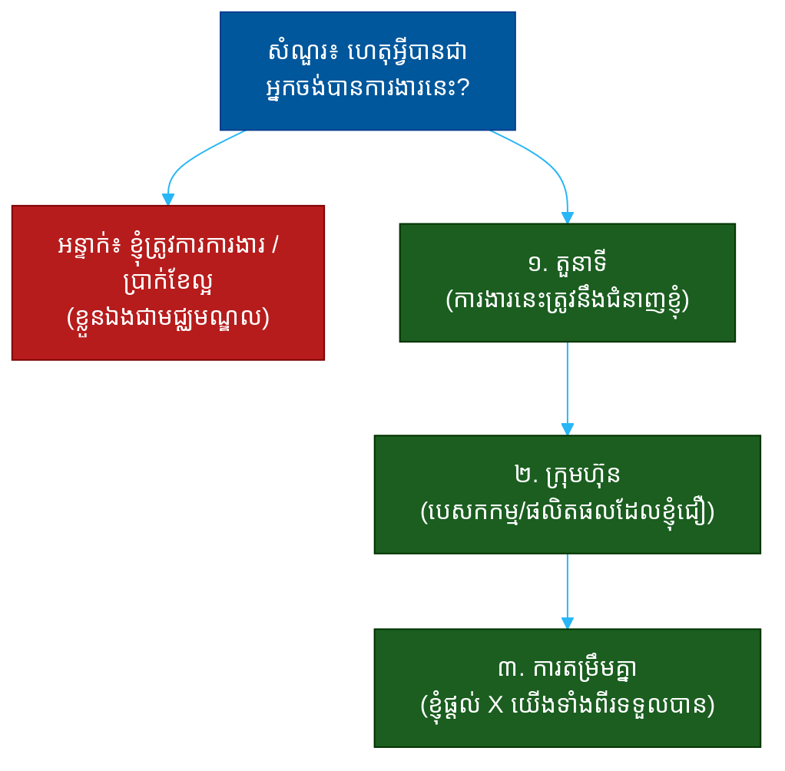

# "ហេតុអ្វីបានជាអ្នកចង់បានការងារនេះ?" (Why Do You Want This Job?)៖ សំណួរតែមួយដែលបង្ហាញពីការស្រាវជ្រាវ ការតម្រឹមគ្នា និងភាពពិតប្រាកដ

**Author:** ichamrong  
**Date:** 2026-05-30  
**Tags:** #one-question #interview #motivation #fit #research #alignment #communication  
**Category:** Concepts / One Question  
**Read Time:** ~12 min  

---

## 📌 មាតិកា (Table of Contents)
- [អន្ទាក់ (The Setup)](#the-setup)
- [១. សំណួរពិតប្រាកដ (What They Are Really Asking)](#1)
- [២. អ្វីដែលវាបង្ហាញអំពីអ្នក (The Hidden Signals)](#2)
- [៣. អន្ទាក់ — ចម្លើយខ្សោយ (The Trap: Weak Answers)](#3)
- [៤. នីតិវិធីឆ្លើយតប (The Response Procedure)](#4)
- [៥. ឧទាហរណ៍ចម្លើយខ្លាំង (Strong Sample Answer)](#5)
- [៦. សំណួរបន្ត និងរបៀបដោះស្រាយ (Follow-up Traps)](#6)
- [សេចក្តីសន្និដ្ឋាន (Conclusion)](#conclusion)
- [ឯកសារយោង (References)](#references)
- [អត្ថបទពាក់ព័ន្ធ (Related Posts)](#related-posts)

---

## អន្ទាក់ (The Setup) 

អ្នកសម្ភាសន៍ (Interviewer) ងាកមកមើលអ្នក ហើយសួរថា៖ **«ហេតុអ្វីបានជាអ្នកចង់បានការងារនេះ?»**

នេះមើលទៅដូចជាសំណួរ «កក់ក្តៅ» (warm-up) — តែវាមិនមែនទេ។ វាជាសំណួរ «តម្រឹមគ្នា» (Alignment Question)។ គេមិនបានស្តាប់ថាអ្នកនិយាយ «ខ្ញុំចង់បានណាស់» នោះទេ។ គេកំពុងស្តាប់ថា **តើអ្នកចង់បាន «ការងារនេះ» ឬ​គ្រាន់​តែ​ចង់​បាន «ការងារណាមួយ»**។

ក្នុងរយៈពេល ៣០ វិនាទីនៃចម្លើយរបស់អ្នក គេអាចអានបាន៖
* តើអ្នកបានស្រាវជ្រាវអំពីក្រុមហ៊ុននេះមែនទេ ឬគ្រាន់តែផ្ញើ CV ច្រើនកន្លែង?
* តើអ្វីដែលអ្នកចង់បានត្រូវនឹងអ្វីដែលការងារផ្តល់ឲ្យដែរឬទេ?
* តើអ្នកនិយាយពី «អ្វីដែលអ្នកនឹងផ្តល់» ឬគ្រាន់តែ «អ្វីដែលអ្នកនឹងទទួល»?
* តើនេះជាការសម្រេចចិត្តដោយយល់ដឹង (deliberate) ឬដោយចៃដន្យ?

នេះជាផែនទីបង្ហាញផ្លូវសម្រាប់ការឆ្លើយតបឲ្យបានល្អ៖

---

## ១. សំណួរពិតប្រាកដ (What They Are Really Asking) 

អ្នកសម្ភាសន៍មិនមែនកំពុងសុំ «ការសរសើរ» ក្រុមហ៊ុនរបស់គេទេ។ អ្វីដែលគេពិតជាសួរគឺ៖

> **«តើ​អ្នក​នឹង​នៅ​ជាមួយ​យើង​បាន​យូរ ហើយ​ខិតខំ​ដោយ​ស្មោះ ឬ​អ្នក​នឹង​ចាក​ចេញ​ភ្លាម​ពេល​ឃើញ​ការងារ​ផ្សេង?»**

ការជ្រើសរើសបុគ្គលិកម្នាក់ចំណាយពេលនិងថវិកាច្រើន។ បើអ្នកមកដោយសារ «ការងារណាមួយក៏បាន» នោះអ្នកនឹងចាកចេញពេលមានជម្រើសប្រសើរជាង។ គេចង់បានមនុស្សដែលការងារនេះ **ត្រូវ​នឹង​អ្វី​ដែល​គេ​ស្វែងរក​ពិត​ប្រាកដ** (genuine fit) — ដូច្នេះការលើកទឹកចិត្តរបស់គេនឹងស្ថិតស្ថេរ។

ដូច្នេះ សំណួរនេះវាស់ ៣ យ៉ាង៖
1. **ការស្រាវជ្រាវ (Research)** — តើអ្នកស្គាល់ក្រុមហ៊ុននេះច្បាស់ប៉ុណ្ណា?
2. **ការតម្រឹមគ្នា (Alignment)** — តើអ្វីដែលអ្នកចង់បានត្រូវនឹងអ្វីដែលគេផ្តល់ឲ្យដែរទេ?
3. **ភាពពិតប្រាកដ (Authenticity)** — តើនេះជាហេតុផលពិត ឬគ្រាន់តែសម្តីលក់?

---

## ២. អ្វីដែលវាបង្ហាញអំពីអ្នក (The Hidden Signals) 

| សញ្ញាដែលគេអាន | ចម្លើយខ្សោយបង្ហាញ | ចម្លើយខ្លាំងបង្ហាញ |
| :--- | :--- | :--- |
| **ការស្រាវជ្រាវ (Research)** | និយាយទូទៅ អំពីក្រុមហ៊ុនណាក៏បាន | លើកឡើងពីផលិតផល/គម្រោងជាក់លាក់ |
| **ការតម្រឹមគ្នា (Alignment)** | ផ្តោតលើខ្លួនឯងតែម្នាក់ឯង | ភ្ជាប់គោលដៅខ្លួន នឹងតម្រូវការក្រុមហ៊ុន |
| **ភាពពិតប្រាកដ (Authenticity)** | ឃ្លាស្តង់ដារ «ក្រុមហ៊ុនល្អ» | ហេតុផលផ្ទាល់ខ្លួន ដែលគេចាំ |
| **ការផ្តល់ (Contribution)** | «ខ្ញុំចង់រៀន/ទទួល...» | «ខ្ញុំអាចជួយដោះស្រាយ X» |
| **ការប្តេជ្ញាចិត្ត (Commitment)** | ការងារបណ្តោះអាសន្ន | ផ្នែកមួយនៃផ្លូវអាជីពរយៈពេលវែង |

**ចំណុចសំខាន់៖** ហេតុផល «ប្រាក់ខែ» និង «ទីតាំងជិតផ្ទះ» គឺពិត — តែ​កុំ​ដាក់​វា​ជា​ហេតុផល​ចម្បង។ ចម្លើយល្អបង្ហាញ **ការ​ត្រួត​ស៊ីគ្នា** (overlap) រវាង​អ្វី​ដែល​អ្នក​ល្អ អ្វី​ដែល​អ្នក​ចូលចិត្ត និង​អ្វី​ដែល​ក្រុមហ៊ុន​ត្រូវការ។

---

## ៣. អន្ទាក់ — ចម្លើយខ្សោយ (The Trap: Weak Answers) 

**អន្ទាក់ទី ១ — អ្នកត្រូវការ (The Needy):**
> «ខ្ញុំត្រូវការការងារ ហើយក្រុមហ៊ុនអ្នកកំពុងជ្រើសរើស»

ហេតុអ្វីបរាជ័យ៖ វាបង្ហាញថាក្រុមហ៊ុននេះគ្រាន់តែជា «កន្លែងណាមួយ» សម្រាប់អ្នក។ គ្មានការតម្រឹមគ្នា គ្មានជម្រើស — មាន​តែ​សេចក្ដី​ត្រូវការ។

**អន្ទាក់ទី ២ — អ្នកសរសើរទទេ (The Empty Flatterer):**
> «ក្រុមហ៊ុនអ្នកល្បីណាស់ ហើយជាក្រុមហ៊ុនធំ»

ហេតុអ្វីបរាជ័យ៖ ឃ្លានេះអាចប្រើនឹងក្រុមហ៊ុនណាក៏បាន។ វាបង្ហាញថាអ្នកមិនបានស្រាវជ្រាវ ហើយ​មិន​ដឹង​ពិត​ប្រាកដ​ថា​ក្រុមហ៊ុន​នេះ​ខុស​ពី​គេ​ត្រង់​ណា។

**អន្ទាក់ទី ៣ — អ្នកយក (The Taker):**
> «ខ្ញុំចង់រៀនបន្ថែម អភិវឌ្ឍខ្លួន ហើយឈានដល់តួនាទីខ្ពស់»

ហេតុអ្វីបរាជ័យ៖ គ្រប់ឃ្លាផ្តោតលើ «អ្វីដែលអ្នកទទួល»។ គ្មាន​ពាក្យ​ណា​មួយ​ស្តី​ពី​អ្វី​ដែល​អ្នក​នឹង **ផ្តល់​ឲ្យ​ក្រុមហ៊ុន​វិញ**។

---

## ៤. នីតិវិធីឆ្លើយតប (The Response Procedure) 

ចម្លើយខ្លាំងមាន **៣ ផ្នែក** តាមលំដាប់៖

**ជំហានទី ១ — តួនាទី (The Role)**
ចាប់ផ្តើមដោយការតភ្ជាប់ជំនាញរបស់អ្នកនឹងការងារជាក់លាក់នេះ។
> «តួនាទីនេះត្រូវនឹងជំនាញ X របស់ខ្ញុំយ៉ាងជិតស្និទ្ធ»

នេះបង្ហាញថាអ្នកយល់​ច្បាស់​ថា​ការងារ​នេះ​ទាមទារ​អ្វី​ខ្លះ។

**ជំហានទី ២ — ក្រុមហ៊ុន (The Company)**
ដាក់ហេតុផលជាក់លាក់ ដែលបង្ហាញការស្រាវជ្រាវ៖ ផលិតផល, បេសកកម្ម, ឬវិធីសាស្ត្រធ្វើការ។
> «ហើយ​ខ្ញុំ​ចូលចិត្ត​របៀប​ដែល​ក្រុមហ៊ុន​ដោះស្រាយ​បញ្ហា Y សម្រាប់​អតិថិជន»

នេះបង្ហាញ **ការស្រាវជ្រាវ** និង​ភាព​ពិត​ប្រាកដ។

**ជំហានទី ៣ — ការតម្រឹមគ្នា (The Alignment)**
បញ្ចប់ដោយការត្រួតស៊ីគ្នា — អ្នកផ្តល់អ្វី ហើយទាំងពីរភាគីទទួលបានអ្វី។
> «ខ្ញុំ​អាច​នាំ​មក​នូវ X ហើយ​ក្នុង​ពេល​ជាមួយ​គ្នា​នេះ​ខ្ញុំ​នឹង​រីក​ចម្រើន​ផង​ដែរ»

នេះបង្ហាញ **ការផ្តល់** និង **ការប្តេជ្ញាចិត្ត**។

---

## ៥. ឧទាហរណ៍ចម្លើយខ្លាំង (Strong Sample Answer) 

> **«តួនាទី​នេះ​ផ្តោត​លើ​ការ​សាងសង់​ប្រព័ន្ធ​ដែល​អាច​ពង្រីក​បាន (scalable systems) — នោះ​ជា​អ្វី​ដែល​ខ្ញុំ​ធ្វើ​ល្អ​បំផុត​ក្នុង​៥​ឆ្នាំ​មក​ហើយ។ ខ្ញុំ​ក៏​បាន​សិក្សា​ពី​របៀប​ដែល​ក្រុមហ៊ុន​អ្នក​ដោះស្រាយ​បញ្ហា​ការ​ទូទាត់​សម្រាប់​អ្នក​ប្រើ​ប្រាស់​ក្នុង​ស្រុក — វា​ជា​បញ្ហា​ដែល​ខ្ញុំ​ខ្លាំង​ចាប់​អារម្មណ៍។ ខ្ញុំ​ចង់​បាន​កន្លែង​ដែល​ខ្ញុំ​អាច​ប្រើ​បទពិសោធន៍​នេះ​ ហើយ​ការងារ​នេះ​ត្រូវ​នឹង​ការ​នោះ​ច្បាស់​បំផុត។»**

**ការវិភាគ (Breakdown):**
* «តួនាទីនេះផ្តោតលើ... នោះជាអ្វីដែលខ្ញុំធ្វើល្អ» → តួនាទី (role fit)
* «ខ្ញុំបានសិក្សាពីរបៀបដែលក្រុមហ៊ុនអ្នក...» → ការស្រាវជ្រាវ (research)
* «បញ្ហាដែលខ្ញុំខ្លាំងចាប់អារម្មណ៍» → ភាពពិតប្រាកដ (authenticity)
* «ខ្ញុំអាចប្រើបទពិសោធន៍នេះ» → ការផ្តល់ (contribution)
* «ការងារនេះត្រូវនឹងការនោះច្បាស់បំផុត» → ការតម្រឹមគ្នា (alignment)

**ប្រៀបធៀប៖**
* ❌ ខ្សោយ៖ «ខ្ញុំត្រូវការការងារ ហើយក្រុមហ៊ុនអ្នកល្អ»
* ✅ ខ្លាំង៖ ចម្លើយ ៣ ផ្នែកខាងលើ

---

## ៦. សំណួរបន្ត និងរបៀបដោះស្រាយ (Follow-up Traps) 

អ្នកសម្ភាសន៍ល្អនឹងសួរបន្ត ដើម្បីសាកល្បងថាហេតុផលរបស់អ្នកពិតឬគ្រាន់តែសម្តីលក់៖

**«តើអ្នកដឹងអ្វីខ្លះអំពីយើង?» (What do you know about us?)**
> កុំ​និយាយ​ទូទៅ។ លើក​ឡើង​ពី​អ្វី​ជាក់​លាក់៖ «ខ្ញុំ​បាន​អាន​ថា​អ្នក​ទើប​ដាក់​ឲ្យ​ដំណើរ​ការ​មុខ​ងារ Z កាល​ពី​ត្រី​មាស​មុន ហើយ​អ្នក​ប្រើ​ប្រាស់​កើន​ឡើង​លឿន»។ ភស្តុតាង​នៃ​ការ​ស្រាវ​ជ្រាវ​បំផ្លាញ​ការ​សង្ស័យ។

**«បើ​ការងារ​ផ្សេង​ផ្តល់​ប្រាក់​ខែ​ច្រើន​ជាង តើ​អ្នក​នឹង​ទៅ​ឬ?» (Would you leave for more money?)**
> «ប្រាក់​ខែ​សំខាន់ តែ​វា​មិន​មែន​ជា​ហេតុ​ផល​តែ​មួយ​គត់​ដែល​ខ្ញុំ​នៅ​កន្លែង​ណា​មួយ​ទេ។ ខ្ញុំ​ស្វែងរក​កន្លែង​ដែល​ការងារ​មាន​ន័យ​សម្រាប់​ខ្ញុំ — ហើយ​នោះ​ជា​អ្វី​ដែល​ខ្ញុំ​ឃើញ​នៅ​ទីនេះ»។

**ច្បាប់មាស៖** រាល់សំណួរបន្ត គឺជាការសាកល្បងថាតើ «ការតម្រឹមគ្នា» របស់អ្នកពិតប្រាកដ ឬ​គ្រាន់​តែ​ជា​ការ​សម្តែង។ បើ​អ្នក​បាន​ស្រាវ​ជ្រាវ​ពិតៗ អ្នក​នឹង​ឆ្លើយ​បាន​ដោយ​មិន​ស្ទាក់​ស្ទើរ។

---

## សេចក្តីសន្និដ្ឋាន (Conclusion) 

សំណួរ «ហេតុអ្វីបានជាអ្នកចង់បានការងារនេះ?» មិនមែនជាសំណួរកក់ក្តៅទេ។ វាជា **តេស្តតម្រឹមគ្នា** ដែលឆ្លុះបញ្ចាំងថាតើអ្នកមកដោយចេតនា ឬដោយចៃដន្យ។

ចងចាំរូបមន្ត ៣ ផ្នែក៖
1. **តួនាទី** (ការងារនេះត្រូវនឹងជំនាញខ្ញុំ...)
2. **ក្រុមហ៊ុន** (ខ្ញុំចូលចិត្តរបៀបដែលអ្នកធ្វើ...)
3. **ការតម្រឹមគ្នា** (ខ្ញុំផ្តល់ X យើងទាំងពីរទទួលបាន...)

ការ​ចង់​បាន «ការងារ​នេះ» ផ្សេង​ពី​ការ​ចង់​បាន «ការងារ​ណា​មួយ» — ហើយ​ភាព​ខុស​គ្នា​នោះ​ស្ថិត​នៅ​ក្នុង​ការ​ស្រាវ​ជ្រាវ​និង​ការ​តម្រឹម​គ្នា។

---

## ឯកសារយោង (References) 

- *Drive* — Daniel H. Pink
- *So Good They Can't Ignore You* — Cal Newport
- *What Color Is Your Parachute?* — Richard N. Bolles

---

## អត្ថបទពាក់ព័ន្ធ (Related Posts) 

- [Why Should We Hire You? (ហេតុផលជ្រើសរើស)](02-why-should-we-hire-you.md)
- [Do You Have Any Questions for Us? (សំណួររបស់អ្នក)](05-do-you-have-any-questions-for-us.md)
- [One Question Index](../README.md)
