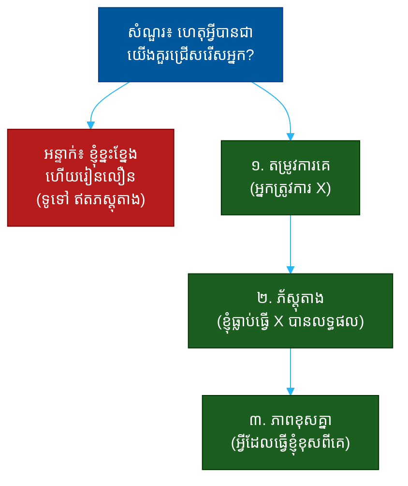

# "ហេតុអ្វីបានជាយើងគួរជ្រើសរើសអ្នក?" (Why Should We Hire You?)៖ សំណួរតែមួយដែលបង្ហាញពីតម្លៃ ភស្តុតាង និងភាពចំគោលដៅ

**Author:** ichamrong  
**Date:** 2026-05-30  
**Tags:** #one-question #interview #motivation #fit #value #evidence #communication  
**Category:** Concepts / One Question  
**Read Time:** ~12 min  

---

## 📌 មាតិកា (Table of Contents)
- [អន្ទាក់ (The Setup)](#the-setup)
- [១. សំណួរពិតប្រាកដ (What They Are Really Asking)](#1)
- [២. អ្វីដែលវាបង្ហាញអំពីអ្នក (The Hidden Signals)](#2)
- [៣. អន្ទាក់ — ចម្លើយខ្សោយ (The Trap: Weak Answers)](#3)
- [៤. នីតិវិធីឆ្លើយតប (The Response Procedure)](#4)
- [៥. ឧទាហរណ៍ចម្លើយខ្លាំង (Strong Sample Answer)](#5)
- [៦. សំណួរបន្ត និងរបៀបដោះស្រាយ (Follow-up Traps)](#6)
- [សេចក្តីសន្និដ្ឋាន (Conclusion)](#conclusion)
- [ឯកសារយោង (References)](#references)
- [អត្ថបទពាក់ព័ន្ធ (Related Posts)](#related-posts)

---

## អន្ទាក់ (The Setup) 

អ្នកសម្ភាសន៍ផ្អៀងខ្លួនមកមុខ ហើយសួរថា៖ **«ហេតុអ្វីបានជាយើងគួរជ្រើសរើសអ្នក?»**

នេះមើលទៅដូចជាការអញ្ជើញឲ្យអ្នកសរសើរខ្លួនឯង — តែវាមិនមែនទេ។ វាជាសំណួរ «ភស្តុតាង» (Evidence Question)។ គេមិនបានស្តាប់ថាអ្នកនិយាយ «ខ្ញុំល្អ» នោះទេ។ គេកំពុងស្តាប់ថា **តើ​អ្នក​ដឹង​ច្បាស់​ឬ​ទេ​ថា​គេ​ត្រូវការ​អ្វី ហើយ​អ្នក​អាច​បំពេញ​វា​បាន​ឬ​ទេ**។

ក្នុងរយៈពេល ៣០ វិនាទីនៃចម្លើយរបស់អ្នក គេអាចអានបាន៖
* តើអ្នកយល់ពីបញ្ហាដែលគេកំពុងព្យាយាមដោះស្រាយឬទេ?
* តើអ្នកមានភស្តុតាង (proof) ឬគ្រាន់តែការអះអាង (claim)?
* តើអ្នកដឹងពីអ្វីដែលធ្វើឲ្យអ្នកខុសពីបេក្ខជនផ្សេងទៀត?
* តើអ្នកមានទំនុកចិត្តដោយមិនអួត?

នេះជាផែនទីបង្ហាញផ្លូវសម្រាប់ការឆ្លើយតបឲ្យបានល្អ៖

---

## ១. សំណួរពិតប្រាកដ (What They Are Really Asking) 

អ្នកសម្ភាសន៍មិនមែនកំពុងសុំ «បញ្ជីគុណសម្បត្តិ» របស់អ្នកទេ។ អ្វីដែលគេពិតជាសួរគឺ៖

> **«ក្នុង​ចំណោម​បេក្ខជន​ដែល​មាន​ជំនាញ​ស្រដៀង​គ្នា ហេតុ​អ្វី​បាន​ជា​ការ​ជ្រើស​រើស​អ្នក​ជា​ការ​សម្រេច​ចិត្ត​ត្រឹមត្រូវ​សម្រាប់​យើង?»**

នៅពេលគេមកដល់សំណួរនេះ ជារឿយៗបេក្ខជនច្រើននាក់មានជំនាញគ្រប់គ្រាន់ស្រាប់ហើយ។ អ្វី​ដែល​គេ​ស្វែងរក​គឺ **ភាព​ខុស​គ្នា​ដែល​មាន​តម្លៃ** (differentiated value) — អ្វី​ដែល​អ្នក​នាំ​មក​ដែល​អ្នក​ដទៃ​មិន​មាន ហើយ​ដែល​ផ្គូផ្គង​នឹង​បញ្ហា​របស់​គេ​ច្បាស់​បំផុត។

ដូច្នេះ សំណួរនេះវាស់ ៣ យ៉ាង៖
1. **ការយល់ដឹងពីតម្រូវការ (Need Awareness)** — តើអ្នកដឹងថាគេត្រូវការអ្វី?
2. **ភស្តុតាង (Evidence)** — តើអ្នកមានភ័ស្តុតាងថាអ្នកអាចបំពេញវាបាន?
3. **ភាពខុសគ្នា (Differentiation)** — តើអ្នកខុសពីបេក្ខជនផ្សេងត្រង់ណា?

---

## ២. អ្វីដែលវាបង្ហាញអំពីអ្នក (The Hidden Signals) 

| សញ្ញាដែលគេអាន | ចម្លើយខ្សោយបង្ហាញ | ចម្លើយខ្លាំងបង្ហាញ |
| :--- | :--- | :--- |
| **ការយល់ដឹង (Need Awareness)** | មិនដឹងថាគេត្រូវការអ្វី | ភ្ជាប់ខ្លួនទៅនឹងបញ្ហាជាក់លាក់ |
| **ភស្តុតាង (Evidence)** | «ខ្ញុំខ្នះខ្នែង» (អះអាង) | «ខ្ញុំធ្លាប់ធ្វើ X បាន +20%» (លេខ) |
| **ភាពខុសគ្នា (Differentiation)** | គុណសម្បត្តិទូទៅ | ការផ្សំជំនាញ ឬបទពិសោធន៍ពិសេស |
| **ទំនុកចិត្ត (Confidence)** | ឥតប្រាកដ ឬអួតពេក | ច្បាស់លាស់ មិនបំផ្លើស |
| **ការផ្តោត (Focus)** | រាយគ្រប់យ៉ាង | ជ្រើស ២-៣ ចំណុចសំខាន់ |

**ចំណុចសំខាន់៖** ការ​អួត​ (arrogance) ជា​សញ្ញា​ក្រហម — តែ​ការ​បន្ទាប​ខ្លួន​ពេក (excessive modesty) ក៏​ជា​សញ្ញា​ក្រហម​ដែរ។ ចម្លើយ​ល្អ​ស្ថិត​នៅ​ចំ​កណ្តាល៖ ទំនុក​ចិត្ត​ដែល​មាន​ភ័ស្តុតាង​គាំទ្រ។

---

## ៣. អន្ទាក់ — ចម្លើយខ្សោយ (The Trap: Weak Answers) 

**អន្ទាក់ទី ១ — ឃ្លាស្តង់ដារ (The Cliché):**
> «ខ្ញុំខ្នះខ្នែង រៀនលឿន ហើយជាមនុស្សធ្វើការជាក្រុមបានល្អ»

ហេតុអ្វីបរាជ័យ៖ បេក្ខជនគ្រប់រូបនិយាយដូចគ្នា។ ឃ្លា​ទាំង​នេះ​គ្មាន​ភ័ស្តុតាង ហើយ​មិន​បាន​បែង​ចែក​អ្នក​ពី​នរណា​ម្នាក់​ឡើយ។

**អន្ទាក់ទី ២ — ការប្រកួត (The Comparison):**
> «ខ្ញុំល្អជាងបេក្ខជនផ្សេងទៀត»

ហេតុអ្វីបរាជ័យ៖ អ្នកមិនស្គាល់បេក្ខជនផ្សេងទេ ដូច្នេះការប្រៀបធៀបនេះគ្មានមូលដ្ឋាន។ វា​ក៏​បង្ហាញ​ភាព​អួត​ផង​ដែរ។

**អន្ទាក់ទី ៣ — អ្នកត្រូវការ (The Needy):**
> «ដោយសារ​ខ្ញុំ​ត្រូវ​ការ​ការងារ​នេះ ហើយ​ខ្ញុំ​នឹង​ខិតខំ​ខ្លាំង»

ហេតុអ្វីបរាជ័យ៖ ការ​ជ្រើស​រើស​មិន​មែន​ជា​សប្បុរស​ធម៌​ទេ។ គេ​ជ្រើស​អ្នក​ដោយ​សារ​អ្នក **ដោះស្រាយ​បញ្ហា​របស់​គេ** មិន​មែន​ដោយ​សារ​អ្នក​ត្រូវ​ការ​លុយ។

---

## ៤. នីតិវិធីឆ្លើយតប (The Response Procedure) 

ចម្លើយខ្លាំងមាន **៣ ផ្នែក** តាមលំដាប់៖

**ជំហានទី ១ — តម្រូវការគេ (Their Need)**
ចាប់ផ្តើមដោយការបង្ហាញថាអ្នកយល់ពីបញ្ហាដែលគេកំពុងព្យាយាមដោះស្រាយ។
> «យោងតាមការពិពណ៌នាការងារ អ្នកត្រូវការនរណាម្នាក់ដែលអាច X»

នេះបង្ហាញថាអ្នកមិនមែននិយាយពីខ្លួនឯងតែម្នាក់ឯងទេ — អ្នក​ផ្តោត​លើ **គេ**។

**ជំហានទី ២ — ភស្តុតាង (Evidence)**
ដាក់ភ័ស្តុតាងជាក់លាក់ — លទ្ធផល, លេខ, ឬគម្រោងពិត។
> «នៅ​ការ​ងារ​មុន ខ្ញុំ​បាន​ដោះស្រាយ​បញ្ហា​ដូច​គ្នា​នេះ ហើយ​បាន​លទ្ធផល Z»

នេះប្តូរ «ការអះអាង» ទៅជា «ភ័ស្តុតាង»។

**ជំហានទី ៣ — ភាពខុសគ្នា (Differentiation)**
បញ្ចប់ដោយអ្វីដែលធ្វើឲ្យអ្នកមានតែម្នាក់ — ការផ្សំជំនាញ ឬទស្សនៈពិសេស។
> «អ្វី​ដែល​ខ្ញុំ​នាំ​មក​ដែល​មិន​ងាយ​រក​បាន​គឺ​ការ​ផ្សំ​ជំនាញ A និង B»

នេះបង្ហាញ **តម្លៃ​ខុស​គ្នា** (differentiated value)។

---

## ៥. ឧទាហរណ៍ចម្លើយខ្លាំង (Strong Sample Answer) 

> **«តាម​ការ​ខ្ញុំ​យល់ អ្នក​ត្រូវ​ការ​នរណា​ម្នាក់​ដែល​អាច​បង្កើន​ការ​រក្សា​អតិថិជន (retention)។ នៅ​ការ​ងារ​មុន ខ្ញុំ​បាន​ដឹក​នាំ​គម្រោង​មួយ​ដែល​បាន​បង្កើន​ការ​រក្សា​អតិថិជន​ពី ៦០% ទៅ ៧៥% ក្នុង​៦​ខែ។ អ្វី​ដែល​ខ្ញុំ​នាំ​មក​ដែល​មិន​ងាយ​រក​បាន​គឺ​ខ្ញុំ​ចេះ​ទាំង​ផ្នែក​ទិន្នន័យ និង​ផ្នែក​ចិត្តវិទ្យា​អតិថិជន — ដូច្នេះ​ខ្ញុំ​មិន​ត្រឹម​តែ​មើល​លេខ​ទេ ខ្ញុំ​ដឹង​ថា​ហេតុ​អ្វី​អតិថិជន​ចាក​ចេញ។»**

**ការវិភាគ (Breakdown):**
* «តាមការខ្ញុំយល់ អ្នកត្រូវការ...» → ការយល់ដឹងពីតម្រូវការ (need awareness)
* «បានបង្កើនពី ៦០% ទៅ ៧៥%» → ភ័ស្តុតាង (evidence with numbers)
* «ខ្ញុំចេះទាំងទិន្នន័យ និងចិត្តវិទ្យា» → ការផ្សំជំនាញ (differentiation)
* «ខ្ញុំដឹងថាហេតុអ្វីអតិថិជនចាកចេញ» → ទស្សនៈពិសេស (unique insight)

**ប្រៀបធៀប៖**
* ❌ ខ្សោយ៖ «ខ្ញុំខ្នះខ្នែង ហើយរៀនលឿន»
* ✅ ខ្លាំង៖ ចម្លើយ ៣ ផ្នែកខាងលើ

---

## ៦. សំណួរបន្ត និងរបៀបដោះស្រាយ (Follow-up Traps) 

អ្នកសម្ភាសន៍ល្អនឹងសួរបន្ត ដើម្បីសាកល្បងថាភស្តុតាងរបស់អ្នកពិតឬមិនពិត៖

**«ចុះបើបេក្ខជនផ្សេងមានបទពិសោធន៍ច្រើនជាងអ្នក?» (What if others have more experience?)**
> កុំ​ការពារ​ខ្លួន​ដោយ​ភ័យ។ «បទពិសោធន៍​សំខាន់ តែ​អ្វី​ដែល​សំខាន់​ជាង​គឺ​លទ្ធផល។ ខ្ញុំ​ផ្តោត​លើ​អ្វី​ដែល​ខ្ញុំ​បាន​សម្រេច​មិន​មែន​ចំនួន​ឆ្នាំ​ដែល​ខ្ញុំ​នៅ»។

**«តើអ្វីជាចំណុចខ្សោយរបស់អ្នក?» (What is your weakness?)**
> ឆ្លើយ​ដោយ​ភាព​ស្មោះត្រង់ ប៉ុន្តែ​ភ្ជាប់​នឹង​ការ​កែ​លម្អ៖ «ខ្ញុំ​ធ្លាប់​ពិបាក​ប្រគល់​ការងារ​ឲ្យ​អ្នក​ដទៃ (delegation) — តែ​ខ្ញុំ​បាន​រៀន​ប្រើ​ប្រព័ន្ធ​តាម​ដាន ដែល​ឥឡូវ​ជួយ​ខ្ញុំ​ទុក​ចិត្ត​ក្រុម​បាន​ច្រើន​ឡើង»។

**ច្បាប់មាស៖** រាល់សំណួរបន្ត គឺជាការសាកល្បងថាតើ «ភ័ស្តុតាង» របស់អ្នកពិតប្រាកដ ឬ​គ្រាន់​តែ​ជា​សម្តី។ បើ​លទ្ធផល​របស់​អ្នក​ពិត អ្នក​នឹង​អាច​ពន្យល់​លម្អិត​បាន​ដោយ​មិន​ស្ទាក់​ស្ទើរ។

---

## សេចក្តីសន្និដ្ឋាន (Conclusion) 

សំណួរ «ហេតុអ្វីបានជាយើងគួរជ្រើសរើសអ្នក?» មិនមែនជាការអញ្ជើញឲ្យសរសើរខ្លួនឯងទេ។ វាជា **តេស្តភ័ស្តុតាង** ដែលឆ្លុះបញ្ចាំងថាតើអ្នកដឹងពីតម្លៃរបស់ខ្លួនច្បាស់ប៉ុណ្ណា។

ចងចាំរូបមន្ត ៣ ផ្នែក៖
1. **តម្រូវការគេ** (អ្នកត្រូវការ X...)
2. **ភស្តុតាង** (ខ្ញុំធ្លាប់ធ្វើ X បានលទ្ធផល...)
3. **ភាពខុសគ្នា** (អ្វីដែលធ្វើខ្ញុំខុសពីគេ...)

ការ​ជ្រើស​រើស​មិន​មែន​ស្តី​ពី​នរណា​ល្អ​បំផុត​ទេ — វា​ស្តី​ពី​នរណា​ដែល **ផ្គូផ្គង​នឹង​បញ្ហា​បាន​ច្បាស់​បំផុត** ហើយ​មាន​ភ័ស្តុតាង​គាំទ្រ។

---

## ឯកសារយោង (References) 

- *To Sell Is Human* — Daniel H. Pink
- *StrengthsFinder 2.0* — Tom Rath
- *Pitch Anything* — Oren Klaff

---

## អត្ថបទពាក់ព័ន្ធ (Related Posts) 

- [Why Do You Want This Job? (ហេតុផលចង់បាន)](01-why-do-you-want-this-job.md)
- [What Motivates You? (កម្លាំងជំរុញ)](03-what-motivates-you.md)
- [One Question Index](../README.md)
