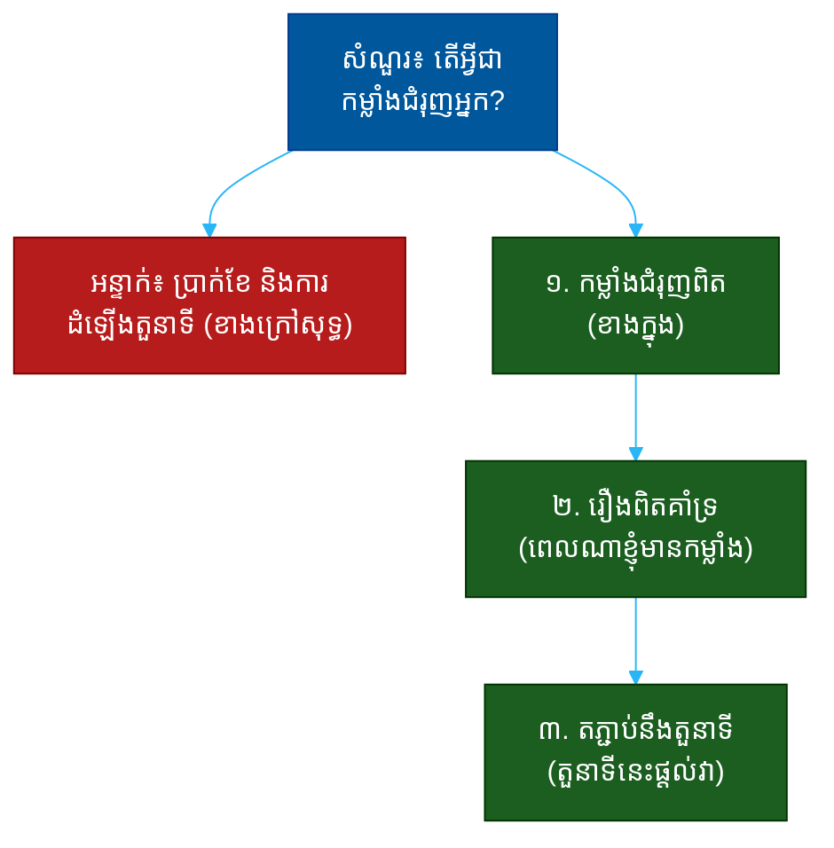

# "តើអ្វីជាកម្លាំងជំរុញអ្នក?" (What Motivates You?)៖ សំណួរតែមួយដែលបង្ហាញពីការដឹងខ្លួន ភាពយូរអង្វែង និងការតម្រឹមនឹងតួនាទី

**Author:** ichamrong  
**Date:** 2026-05-30  
**Tags:** #one-question #interview #motivation #fit #self-awareness #drive #communication  
**Category:** Concepts / One Question  
**Read Time:** ~12 min  

---

## 📌 មាតិកា (Table of Contents)
- [អន្ទាក់ (The Setup)](#the-setup)
- [១. សំណួរពិតប្រាកដ (What They Are Really Asking)](#1)
- [២. អ្វីដែលវាបង្ហាញអំពីអ្នក (The Hidden Signals)](#2)
- [៣. អន្ទាក់ — ចម្លើយខ្សោយ (The Trap: Weak Answers)](#3)
- [៤. នីតិវិធីឆ្លើយតប (The Response Procedure)](#4)
- [៥. ឧទាហរណ៍ចម្លើយខ្លាំង (Strong Sample Answer)](#5)
- [៦. សំណួរបន្ត និងរបៀបដោះស្រាយ (Follow-up Traps)](#6)
- [សេចក្តីសន្និដ្ឋាន (Conclusion)](#conclusion)
- [ឯកសារយោង (References)](#references)
- [អត្ថបទពាក់ព័ន្ធ (Related Posts)](#related-posts)

---

## អន្ទាក់ (The Setup) 

អ្នកសម្ភាសន៍ផ្អាកមួយភ្លែត ហើយសួរថា៖ **«តើអ្វីជាកម្លាំងជំរុញអ្នក?»**

នេះមើលទៅដូចជាសំណួរផ្ទាល់ខ្លួន ឥតមានចម្លើយ «ខុស» — តែវាមិនមែនទេ។ វាជាសំណួរ «ភាពយូរអង្វែង» (Sustainability Question)។ គេមិនបានស្តាប់​ត្រឹម​ថា​អ្នក​ត្រូវ​ការ​អ្វី​ទេ។ គេ​កំពុង​ស្តាប់​ថា **តើ​អ្វី​ដែល​ជំរុញ​អ្នក​នឹង​ត្រូវ​បាន​បំពេញ​ដោយ​តួនាទី​នេះ​ដែរ​ឬ​ទេ**។

ក្នុងរយៈពេល ៣០ វិនាទីនៃចម្លើយរបស់អ្នក គេអាចអានបាន៖
* តើអ្នកស្គាល់ខ្លួនឯងពិតមែនទេ ឬគ្រាន់តែនិយាយឲ្យពេញចិត្ត?
* តើកម្លាំងជំរុញរបស់អ្នកមកពីខាងក្នុង (intrinsic) ឬខាងក្រៅ (extrinsic)?
* តើតួនាទីនេះអាចផ្តល់នូវអ្វីដែលជំរុញអ្នកដែរឬទេ?
* តើអ្នកនឹងនៅមានកម្លាំងពេលរំភើបដំបូងផុតទៅ?

នេះជាផែនទីបង្ហាញផ្លូវសម្រាប់ការឆ្លើយតបឲ្យបានល្អ៖

---

## ១. សំណួរពិតប្រាកដ (What They Are Really Asking) 

អ្នកសម្ភាសន៍មិនមែនកំពុងសុំ «បញ្ជីបំណងប្រាថ្នា» របស់អ្នកទេ។ អ្វីដែលគេពិតជាសួរគឺ៖

> **«តើ​អ្វី​ដែល​ធ្វើ​ឲ្យ​អ្នក​មាន​កម្លាំង​ពេល​ការ​ងារ​លំបាក​នឹង​ត្រូវ​បាន​បំពេញ​ដោយ​តួនាទី​នេះ​ដែរ​ឬ​ទេ?»**

រាល់ការងារមានពេលរំភើបនិងពេលធុញ។ បើ​កម្លាំង​ជំរុញ​របស់​អ្នក​មក​ពី​អ្វី​ដែល​តួនាទី​នេះ​មិន​អាច​ផ្តល់​បាន អ្នក​នឹង​ធ្លាក់​ទឹក​ចិត្ត​ហើយ​ចាក​ចេញ។ គេ​ស្វែងរក **ការ​តម្រឹម​រវាង​កម្លាំង​ជំរុញ​ខាង​ក្នុង​របស់​អ្នក​នឹង​ការ​ងារ​ប្រចាំ​ថ្ងៃ** — ដ្បិត​នោះ​ជា​អ្វី​ដែល​ធ្វើ​ឲ្យ​ការ​លើក​ទឹក​ចិត្ត​យូរ​អង្វែង។

ដូច្នេះ សំណួរនេះវាស់ ៣ យ៉ាង៖
1. **ការដឹងខ្លួន (Self-Awareness)** — តើអ្នកស្គាល់អ្វីដែលជំរុញខ្លួនពិតមែនទេ?
2. **ប្រភពនៃកម្លាំង (Source)** — តើវាមកពីខាងក្នុង ឬខាងក្រៅ?
3. **ការតម្រឹមនឹងតួនាទី (Role Alignment)** — តើតួនាទីនេះអាចផ្តល់វាបានទេ?

---

## ២. អ្វីដែលវាបង្ហាញអំពីអ្នក (The Hidden Signals) 

| សញ្ញាដែលគេអាន | ចម្លើយខ្សោយបង្ហាញ | ចម្លើយខ្លាំងបង្ហាញ |
| :--- | :--- | :--- |
| **ការដឹងខ្លួន (Self-Awareness)** | ចម្លើយទូទៅ ឥតគិត | ច្បាស់លាស់ មានឧទាហរណ៍ |
| **ប្រភពកម្លាំង (Source)** | ប្រាក់, តួនាទី (ខាងក្រៅសុទ្ធ) | ការដោះស្រាយ, ផលប៉ះពាល់ (ខាងក្នុង) |
| **ភ័ស្តុតាង (Evidence)** | គ្មានរឿងគាំទ្រ | រឿងពិតពេលមានកម្លាំង |
| **ការតម្រឹម (Alignment)** | មិនទាក់ទងនឹងតួនាទី | ភ្ជាប់ត្រង់នឹងការងារនេះ |
| **ភាពយូរអង្វែង (Sustainability)** | ងាយផ្លាស់ប្តូរ | ស្ថិតស្ថេរ មានឫសគល់ |

**ចំណុចសំខាន់៖** ប្រាក់​ខែ​ជា​កម្លាំង​ជំរុញ​ពិត — តែ​បើ​វា​ជា​ចម្លើយ​តែ​មួយ វា​ជា​សញ្ញា​ក្រហម។ កម្លាំង​ជំរុញ​ខាង​ក្នុង (ការ​ដោះស្រាយ​បញ្ហា, ការ​ឃើញ​ផល​ប៉ះពាល់, ការ​រៀន) គឺ​ជា​អ្វី​ដែល​ស្ថិត​ស្ថេរ​ពេល​លំបាក។

---

## ៣. អន្ទាក់ — ចម្លើយខ្សោយ (The Trap: Weak Answers) 

**អន្ទាក់ទី ១ — អ្នកស្វែងរកប្រាក់ (The Money-Driven):**
> «ប្រាក់ខែល្អ និងការដំឡើងតួនាទីលឿន»

ហេតុអ្វីបរាជ័យ៖ កម្លាំង​ខាង​ក្រៅ​សុទ្ធ។ វា​បង្ហាញ​ថា​ពេល​ការ​ងារ​ពិបាក​ឬ​ការ​ដំឡើង​យឺត អ្នក​នឹង​ធ្លាក់​ទឹក​ចិត្ត​ភ្លាម។

**អន្ទាក់ទី ២ — ឃ្លាទូទៅ (The Generic):**
> «ខ្ញុំចូលចិត្តបញ្ហាប្រឈម និងការងារជាក្រុម»

ហេតុអ្វីបរាជ័យ៖ ស្តាប់ទៅដូចជារៀនមកនិយាយ។ គ្មាន​រឿង​ពិត​គាំទ្រ ដូច្នេះ​វា​មិន​គួរ​ឲ្យ​ជឿ​និង​មិន​ចំ​គោល​ដៅ។

**អន្ទាក់ទី ៣ — អ្នកមិនដឹង (The Clueless):**
> «អូ... ខ្ញុំមិនធ្លាប់គិតពីរឿងនេះទេ... ប្រហែលជា... គ្រប់យ៉ាងហ្នឹង?»

ហេតុអ្វីបរាជ័យ៖ ការ​មិន​ដឹង​ថា​អ្វី​ជំរុញ​ខ្លួន​បង្ហាញ​ការ​ខ្វះ​ការ​ដឹង​ខ្លួន។ បើ​អ្នក​មិន​ស្គាល់​ខ្លួន​ឯង តើ​គេ​ត្រូវ​ដឹក​នាំ​អ្នក​ដោយ​របៀប​ណា?

---

## ៤. នីតិវិធីឆ្លើយតប (The Response Procedure) 

ចម្លើយខ្លាំងមាន **៣ ផ្នែក** តាមលំដាប់៖

**ជំហានទី ១ — កម្លាំងជំរុញពិត (The True Driver)**
ចាប់ផ្តើមដោយឈ្មោះកម្លាំងជំរុញ **ខាងក្នុង** ច្បាស់លាស់មួយ។
> «អ្វី​ដែល​ជំរុញ​ខ្ញុំ​ខ្លាំង​បំផុត​គឺ​ការ​ឃើញ​អ្វី​ដែល​ខ្ញុំ​សាង​ មាន​ផល​ប៉ះពាល់​ពិត»

នេះបង្ហាញ **ការ​ដឹង​ខ្លួន** និង​ប្រភព​កម្លាំង​ស្ថិត​ស្ថេរ។

**ជំហានទី ២ — រឿងពិតគាំទ្រ (The Proof Story)**
ដាក់ឧទាហរណ៍ខ្លី ពេលដែលកម្លាំងជំរុញនោះកើតឡើងពិត។
> «ឧទាហរណ៍ ពេល​ខ្ញុំ​ឃើញ​មុខ​ងារ​ដែល​ខ្ញុំ​សាង​ត្រូវ​បាន​អ្នក​ប្រើ​ប្រាស់​ប្រើ​រាល់​ថ្ងៃ ខ្ញុំ​មាន​កម្លាំង​ធ្វើ​បន្ត»

នេះប្តូរ​ការ​អះអាង​ទៅ​ជា​ភ័ស្តុតាង។

**ជំហានទី ៣ — តភ្ជាប់នឹងតួនាទី (Connect to the Role)**
បញ្ចប់ដោយការបង្ហាញថាតួនាទីនេះផ្តល់នូវកម្លាំងជំរុញនោះ។
> «ហើយ​តួនាទី​នេះ​ផ្តល់​នូវ​ការ​នោះ​ច្បាស់ ដោយ​ខ្ញុំ​នឹង​ធ្វើ​ការ​ដោយ​ផ្ទាល់​ជាមួយ​អ្នក​ប្រើ»

នេះបង្ហាញ **ការ​តម្រឹម** និង​ភាព​យូរ​អង្វែង។

---

## ៥. ឧទាហរណ៍ចម្លើយខ្លាំង (Strong Sample Answer) 

> **«អ្វី​ដែល​ជំរុញ​ខ្ញុំ​ខ្លាំង​បំផុត​គឺ​ការ​ដោះស្រាយ​បញ្ហា​ស្មុគ​ស្មាញ ហើយ​ឃើញ​វា​មាន​ផល​ប៉ះពាល់​ពិត។ កាល​ពី​ឆ្នាំ​មុន ខ្ញុំ​ចំណាយ​ពេល​បី​សប្តាហ៍​ដោះស្រាយ​បញ្ហា​ដែល​ធ្វើ​ឲ្យ​ប្រព័ន្ធ​យឺត — ពេល​ខ្ញុំ​ដោះស្រាយ​បាន ហើយ​ឃើញ​ល្បឿន​កើន​ឡើង​៣​ដង ខ្ញុំ​មាន​អារម្មណ៍​ថា​ការ​ងារ​ខ្ញុំ​មាន​ន័យ​ពិត។ តួនាទី​នេះ​ផ្តោត​លើ​ការ​ដោះស្រាយ​បញ្ហា​ប្រភេទ​នោះ​រាល់​ថ្ងៃ — នោះ​ហើយ​ជា​មូលហេតុ​ដែល​ខ្ញុំ​រំភើប។»**

**ការវិភាគ (Breakdown):**
* «ការដោះស្រាយបញ្ហា... ផលប៉ះពាល់ពិត» → កម្លាំងជំរុញខាងក្នុង (intrinsic driver)
* «ខ្ញុំចំណាយបីសប្តាហ៍... ល្បឿនកើន ៣ ដង» → រឿងពិតគាំទ្រ (proof story)
* «ខ្ញុំមានអារម្មណ៍ថាការងារមានន័យ» → ការដឹងខ្លួន (self-awareness)
* «តួនាទីនេះផ្តោតលើ... រាល់ថ្ងៃ» → ការតម្រឹមនឹងតួនាទី (alignment)

**ប្រៀបធៀប៖**
* ❌ ខ្សោយ៖ «ប្រាក់ខែល្អ និងការដំឡើងតួនាទី»
* ✅ ខ្លាំង៖ ចម្លើយ ៣ ផ្នែកខាងលើ

---

## ៦. សំណួរបន្ត និងរបៀបដោះស្រាយ (Follow-up Traps) 

អ្នកសម្ភាសន៍ល្អនឹងសួរបន្ត ដើម្បីសាកល្បងថាកម្លាំងជំរុញរបស់អ្នកពិតឬគ្រាន់តែសម្តី៖

**«ចុះ​ប្រាក់​ខែ​មិន​សំខាន់​ទេ​ឬ?» (Doesn't money matter?)**
> កុំ​បដិសេធ​ការ​ពិត។ «ប្រាក់​ខែ​សំខាន់ — វា​ជា​ការ​ទទួល​ស្គាល់​តម្លៃ​ការងារ។ តែ​វា​មិន​មែន​ជា​អ្វី​ដែល​ធ្វើ​ឲ្យ​ខ្ញុំ​ក្រោក​ឡើង​ដោយ​រំភើប​នៅ​ព្រឹក​ច័ន្ទ​ទេ — ការ​ដោះស្រាយ​បញ្ហា​ទើប​ធ្វើ​ការ​នោះ»។

**«បើ​ការ​ងារ​ប្រ​ចាំ​ថ្ងៃ​មិន​សប្បាយ​ដូច​ការ​ដោះស្រាយ​បញ្ហា​ធំ​ៗ​ទេ?» (What about the boring parts?)**
> «រាល់​ការ​ងារ​មាន​ផ្នែក​ធុញ។ ខ្ញុំ​មើល​ផ្នែក​ទាំង​នោះ​ជា​ការ​វិនិយោគ​ឆ្ពោះ​ទៅ​រក​ផ្នែក​ដែល​មាន​ផល​ប៉ះពាល់​ធំ — ដូច្នេះ​សូម្បី​ការ​ងារ​តូច​ៗ​ក៏​មាន​គោល​ដៅ​ដែរ»។

**ច្បាប់មាស៖** រាល់សំណួរបន្ត គឺជាការសាកល្បងថាតើ «កម្លាំងជំរុញ» របស់អ្នកស្ថិតស្ថេរ ឬ​ផ្លាស់​ប្តូរ​តាម​ស្ថានភាព។ បើ​អ្នក​ស្គាល់​ខ្លួន​ឯង​ពិត អ្នក​នឹង​ស្ថិត​នៅ​ជាមួយ​ចម្លើយ​ដើម​បាន។

---

## សេចក្តីសន្និដ្ឋាន (Conclusion) 

សំណួរ «តើអ្វីជាកម្លាំងជំរុញអ្នក?» មិនមែនជាសំណួរផ្ទាល់ខ្លួនឥតគោលដៅទេ។ វាជា **តេស្តភាពយូរអង្វែង** ដែលឆ្លុះបញ្ចាំងថាតើការលើកទឹកចិត្តរបស់អ្នកនឹងស្ថិតស្ថេរនៅក្នុងតួនាទីនេះដែរឬទេ។

ចងចាំរូបមន្ត ៣ ផ្នែក៖
1. **កម្លាំងជំរុញពិត** (អ្វីដែលជំរុញខ្ញុំខាងក្នុង...)
2. **រឿងពិតគាំទ្រ** (ឧទាហរណ៍ពេលដែលវាកើតឡើង...)
3. **តភ្ជាប់នឹងតួនាទី** (តួនាទីនេះផ្តល់វា...)

កម្លាំង​ជំរុញ​ខាង​ក្នុង​ដែល​ផ្គូផ្គង​នឹង​ការ​ងារ​ប្រ​ចាំ​ថ្ងៃ — នោះ​ជា​អ្វី​ដែល​ធ្វើ​ឲ្យ​អ្នក​នៅ​មាន​កម្លាំង​ពេល​អ្នក​ដទៃ​បោះ​បង់។

---

## ឯកសារយោង (References) 

- *Drive* — Daniel H. Pink
- *Mindset* — Carol S. Dweck
- *Man's Search for Meaning* — Viktor E. Frankl

---

## អត្ថបទពាក់ព័ន្ធ (Related Posts) 

- [Why Do You Want This Job? (ហេតុផលចង់បាន)](01-why-do-you-want-this-job.md)
- [Why Should We Hire You? (ហេតុផលជ្រើសរើស)](02-why-should-we-hire-you.md)
- [One Question Index](../README.md)
