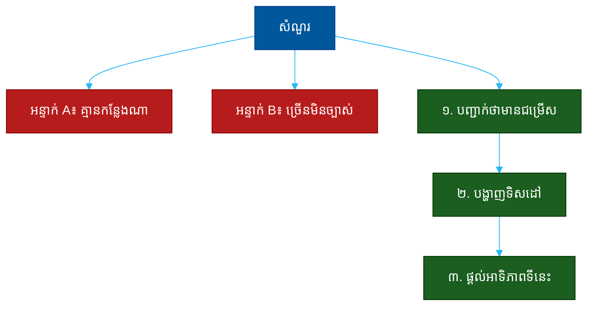

# "តើអ្នកកំពុងសម្ភាសន៍កន្លែងណាខ្លះទៀត?" (Where Else Are You Interviewing?)៖ សំណួរតែមួយដែលបង្ហាញពីភាពមានជម្រើស ភាពច្បាស់លាស់ និងភាពស្មោះត្រង់

**Author:** ichamrong  
**Date:** 2026-05-30  
**Tags:** #one-question #interview #motivation #fit #leverage #honesty #communication  
**Category:** Concepts / One Question  
**Read Time:** ~12 min  

---

## 📌 មាតិកា (Table of Contents)
- [អន្ទាក់ (The Setup)](#the-setup)
- [១. សំណួរពិតប្រាកដ (What They Are Really Asking)](#1)
- [២. អ្វីដែលវាបង្ហាញអំពីអ្នក (The Hidden Signals)](#2)
- [៣. អន្ទាក់ — ចម្លើយខ្សោយ (The Trap: Weak Answers)](#3)
- [៤. នីតិវិធីឆ្លើយតប (The Response Procedure)](#4)
- [៥. ឧទាហរណ៍ចម្លើយខ្លាំង (Strong Sample Answer)](#5)
- [៦. សំណួរបន្ត និងរបៀបដោះស្រាយ (Follow-up Traps)](#6)
- [សេចក្តីសន្និដ្ឋាន (Conclusion)](#conclusion)
- [ឯកសារយោង (References)](#references)
- [អត្ថបទពាក់ព័ន្ធ (Related Posts)](#related-posts)

---

## អន្ទាក់ (The Setup) 

អ្នកសម្ភាសន៍សួរដោយសម្លេងធម្មតា៖ **«តើអ្នកកំពុងសម្ភាសន៍កន្លែងណាខ្លះទៀត?»**

នេះមើលទៅដូចជាសំណួរធម្មតា — តែវាមិនមែនទេ។ វាជាសំណួរ «ល្បិចពីរផ្លូវ» (Double-Edged Question)។ គេ​ចង់​ដឹង​ពី​តម្លៃ​ទីផ្សារ​របស់​អ្នក ប៉ុន្តែ​ក៏​កំពុង​សាក​ល្បង​ភាព​ស្មោះត្រង់​និង​ភាព​ច្បាស់​លាស់​នៃ​ការ​ស្វែងរក​របស់​អ្នក​ផង​ដែរ។

ក្នុងរយៈពេល ៣០ វិនាទីនៃចម្លើយរបស់អ្នក គេអាចអានបាន៖
* តើអ្នកមានជម្រើស (in demand) ឬគ្មាននរណាគេចង់បាន?
* តើការស្វែងរករបស់អ្នកមានទិសដៅ (focused) ឬគ្រាន់តែផ្ញើ CV គ្រប់កន្លែង?
* តើអ្នកស្មោះត្រង់ ឬកុហកដោយឥតប្រាកដ?
* តើ​អ្នក​មាន​ភាព​អាជីព (professional) ពេល​និយាយ​ពី​ដៃ​គូ​ប្រកួត?

នេះជាផែនទីបង្ហាញផ្លូវសម្រាប់ការឆ្លើយតបឲ្យបានល្អ៖

---

## ១. សំណួរពិតប្រាកដ (What They Are Really Asking) 

អ្នកសម្ភាសន៍មិនមែនកំពុងសុំ «បញ្ជីឈ្មោះក្រុមហ៊ុន» ដែលអ្នកដាក់ពាក្យទេ។ អ្វីដែលគេពិតជាសួរគឺ៖

> **«តើ​អ្នក​ស្ថិត​ក្នុង​តម្រូវ​ការ​ទីផ្សារ​ឬ​ទេ ហើយ​តើ​ការ​ស្វែងរក​របស់​អ្នក​មាន​ទិស​ដៅ​ច្បាស់​ឬ​ទេ — ហើយ​បើ​យើង​ផ្តល់​ការ​ផ្តល់​ជូន (offer) តើ​អ្នក​នឹង​ទទួល​ឬ​ទេ?»**

សំណួរនេះមាន ៣ មុខ៖ ដឹង​ពី **ការ​ប្រកួត** (តើ​គេ​ត្រូវ​ប្រញាប់​ឬ​ទេ), ដឹង​ពី **ភាព​ស្មោះត្រង់** (តើ​អ្នក​និយាយ​ការ​ពិត​ឬ​ទេ), និង​ដឹង​ពី **ការ​ផ្តោត** (តើ​អ្នក​ដឹង​ច្បាស់​ថា​ស្វែងរក​អ្វី​ឬ​ទេ)។ ការ​ស្វែងរក​ដែល​មាន​ទិស​ដៅ​ច្បាស់​បង្ហាញ​ថា​អ្នក​ស្គាល់​ខ្លួន​ឯង​និង​ស្គាល់​ទីផ្សារ។

ដូច្នេះ សំណួរនេះវាស់ ៣ យ៉ាង៖
1. **ភាពមានជម្រើស (Demand)** — តើទីផ្សារចង់បានអ្នកឬទេ?
2. **ភាពច្បាស់លាស់ (Focus)** — តើការស្វែងរករបស់អ្នកមានទិសដៅឬទេ?
3. **ភាពស្មោះត្រង់ (Honesty)** — តើអ្នកនិយាយការពិតដោយប៉ិនប្រសប់ឬទេ?

---

## ២. អ្វីដែលវាបង្ហាញអំពីអ្នក (The Hidden Signals) 

| សញ្ញាដែលគេអាន | ចម្លើយខ្សោយបង្ហាញ | ចម្លើយខ្លាំងបង្ហាញ |
| :--- | :--- | :--- |
| **ភាពមានជម្រើស (Demand)** | «គ្មានកន្លែងណាទេ» | «មានដំណើរការមួយ-ពីរ» |
| **ភាពច្បាស់លាស់ (Focus)** | ប្រភេទការងារផ្សេងៗគ្នាឆ្ងាយ | ប្រភេទតួនាទីដូចគ្នា ទិសដៅច្បាស់ |
| **ភាពស្មោះត្រង់ (Honesty)** | កុហកថាមាន/គ្មាន | ការពិតដែលគ្រប់គ្រងបានល្អ |
| **ភាពអាជីព (Professionalism)** | ដាក់ឈ្មោះ/និយាយអាក្រក់ដៃគូ | គោរពភាពសម្ងាត់ មិននិយាយអាក្រក់ |
| **អាទិភាព (Priority)** | មិនបង្ហាញការចាប់អារម្មណ៍ | បញ្ជាក់ថាកន្លែងនេះជាជម្រើសកំពូល |

**ចំណុចសំខាន់៖** អ្នកមិនចាំបាច់ប្រាប់ឈ្មោះក្រុមហ៊ុនពិតប្រាកដទេ — នោះ​ជា​ការ​ការពារ​ភាព​សម្ងាត់​របស់​អ្នក។ ការ​បង្ហាញ​ថា​អ្នក​មាន​ជម្រើស (ដោយ​មិន​បំផ្លើស) ផ្តល់​ឲ្យ​អ្នក​នូវ **ឆ្នុក​ចរចា** (leverage) ដោយ​មិន​បាត់​បង់​ភាព​ស្មោះត្រង់។

---

## ៣. អន្ទាក់ — ចម្លើយខ្សោយ (The Trap: Weak Answers) 

**អន្ទាក់ទី ១ — អ្នកអស់សង្ឃឹម (The Desperate):**
> «គ្មានទេ កន្លែងអ្នកគឺជាកន្លែងតែមួយគត់ដែលខ្ញុំសម្ភាសន៍»

ហេតុអ្វីបរាជ័យ៖ វា​អាច​ស្តាប់​ទៅ​ស្មោះ តែ​វា​បំបាត់​ឆ្នុក​ចរចា​របស់​អ្នក ហើយ​អាច​បង្ហាញ​ថា​ទីផ្សារ​មិន​ចង់​បាន​អ្នក។

**អន្ទាក់ទី ២ — អ្នកបំផ្លើស (The Exaggerator):**
> «ខ្ញុំមានការផ្តល់ជូន ៥ កន្លែង ហើយគេទាំងអស់ប្រញាប់ឲ្យចម្លើយ»

ហេតុអ្វីបរាជ័យ៖ ស្តាប់ទៅមិនពិត ហើយបង្កើតសម្ពាធក្លែងក្លាយ។ បើ​គេ​ហៅ​ទៅ​សួរ ឬ​សុំ​ភ័ស្តុតាង អ្នក​នឹង​ជាប់​អន្ទាក់​កុហក។

**អន្ទាក់ទី ៣ — អ្នកមិនច្បាស់ (The Scattered):**
> «ខ្ញុំសម្ភាសន៍កន្លែងលក់ កន្លែងសរសេរកម្មវិធី ហើយក៏កន្លែងគ្រូបង្រៀនផង»

ហេតុអ្វីបរាជ័យ៖ ការ​ស្វែងរក​ប្រភេទ​ការងារ​ខុស​គ្នា​ឆ្ងាយ​បង្ហាញ​ថា​អ្នក​មិន​ដឹង​ថា​ខ្លួន​ឯង​ចង់​បាន​អ្វី — ដែល​ធ្វើ​ឲ្យ​ការ​ចង់​បាន «ការងារ​នេះ» របស់​អ្នក​មិន​គួរ​ឲ្យ​ជឿ។

---

## ៤. នីតិវិធីឆ្លើយតប (The Response Procedure) 

ចម្លើយខ្លាំងមាន **៣ ផ្នែក** តាមលំដាប់៖

**ជំហានទី ១ — បញ្ជាក់ថាមានជម្រើស (Confirm Demand)**
បញ្ជាក់ថាអ្នកមានដំណើរការផ្សេងៗ ដោយមិនលម្អិតពេក។
> «បាទ ខ្ញុំ​មាន​ដំណើរ​ការ​មួយ​ពីរ​កន្លែង​កំពុង​ដំណើរ​ការ»

នេះបង្ហាញ **ភាព​មាន​ជម្រើស** ដោយ​មិន​ខ្វះ​ភាព​ស្មោះត្រង់។

**ជំហានទី ២ — បង្ហាញទិសដៅ (Show Focus)**
បញ្ជាក់ថាការស្វែងរករបស់អ្នកមានទិសដៅច្បាស់ — ប្រភេទតួនាទីដូចគ្នា។
> «ខ្ញុំ​ផ្តោត​លើ​តួនាទី​ខាង​ផ្នែក X នៅ​ក្រុមហ៊ុន​ដែល​ផ្តល់​អាទិភាព​ដល់ Y»

នេះបង្ហាញ **ភាព​ច្បាស់​លាស់** និង​ការ​ស្គាល់​ខ្លួន​ឯង។

**ជំហានទី ៣ — ផ្តល់អាទិភាព (Signal Priority)**
បញ្ចប់ដោយការបង្ហាញថាកន្លែងនេះត្រូវនឹងគោលដៅរបស់អ្នកល្អបំផុត។
> «ក្នុង​ចំណោម​ទាំង​អស់ កន្លែង​នេះ​ត្រូវ​នឹង​អ្វី​ដែល​ខ្ញុំ​ស្វែងរក​ច្បាស់​បំផុត»

នេះផ្តល់​ឆ្នុក​ចរចា ហើយ​ក៏​បង្ហាញ​ការ​ចាប់​អារម្មណ៍​ពិត​ប្រាកដ។

---

## ៥. ឧទាហរណ៍ចម្លើយខ្លាំង (Strong Sample Answer) 

> **«បាទ ខ្ញុំ​មាន​ដំណើរ​ការ​សម្ភាសន៍​មួយ​ពីរ​កន្លែង​កំពុង​ដំណើរ​ការ — ទាំង​អស់​សុទ្ធ​តែ​ជា​តួនាទី​វិស្វករ​ផ្នែក​មុខ (frontend) នៅ​ក្រុមហ៊ុន​ផលិតផល​ដែល​ផ្តោត​លើ​បទពិសោធន៍​អ្នក​ប្រើ​ប្រាស់។ ខ្ញុំ​សុំ​មិន​បញ្ចេញ​ឈ្មោះ​ដោយ​ការ​គោរព​ភាព​សម្ងាត់​ជាមួយ​គេ។ ប៉ុន្តែ​ត្រង់ៗ ក្នុង​ចំណោម​ទាំង​អស់ កន្លែង​នេះ​ត្រូវ​នឹង​អ្វី​ដែល​ខ្ញុំ​ស្វែងរក​ច្បាស់​បំផុត ដោយ​សារ​ផលិតផល​និង​ក្រុម​នៅ​ទីនេះ។»**

**ការវិភាគ (Breakdown):**
* «ខ្ញុំមានដំណើរការមួយពីរកន្លែង» → ភាពមានជម្រើស (demand, not desperate)
* «ទាំងអស់សុទ្ធតែជាតួនាទីវិស្វករផ្នែកមុខ» → ភាពច្បាស់លាស់ (focus)
* «សុំមិនបញ្ចេញឈ្មោះ... គោរពភាពសម្ងាត់» → ភាពអាជីព (professionalism)
* «កន្លែងនេះត្រូវនឹងអ្វីដែលខ្ញុំស្វែងរកច្បាស់បំផុត» → អាទិភាព (priority signal)

**ប្រៀបធៀប៖**
* ❌ ខ្សោយ៖ «គ្មានទេ» ឬ «ច្រើនណាស់!»
* ✅ ខ្លាំង៖ ចម្លើយ ៣ ផ្នែកខាងលើ

---

## ៦. សំណួរបន្ត និងរបៀបដោះស្រាយ (Follow-up Traps) 

អ្នកសម្ភាសន៍ល្អនឹងសួរបន្ត ដើម្បីសាកល្បងភាពស្មោះត្រង់និងអាទិភាពរបស់អ្នក៖

**«តើអ្នកនៅដំណាក់កាលណាជាមួយកន្លែងផ្សេង?» (How far along are you elsewhere?)**
> ឆ្លើយ​ដោយ​ការ​ពិត​ប៉ុន្តែ​មិន​លម្អិត​ពេក៖ «មួយ​ចំនួន​នៅ​ដំណាក់​កាល​ដើម មួយ​ចំនួន​ឈាន​ដល់​ដំណាក់​ចុង​ក្រោយ»។ កុំ​បង្កើត​សម្ពាធ​ក្លែង​ក្លាយ​ដែល​អ្នក​មិន​អាច​បញ្ជាក់​បាន។

**«បើ​យើង​ផ្តល់​ការ​ផ្តល់​ជូន​ថ្ងៃ​នេះ តើ​អ្នក​នឹង​ទទួល​ឬ?» (If we offer today, will you accept?)**
> កុំ​ប្តេជ្ញា​ភ្លាម​បើ​មិន​ប្រាកដ៖ «ខ្ញុំ​ចាប់​អារម្មណ៍​ខ្លាំង។ ខ្ញុំ​ចង់​ពិនិត្យ​ការ​ផ្តល់​ជូន​ឲ្យ​ច្បាស់​មុន​សម្រេច​ចិត្ត ប៉ុន្តែ​ត្រង់ៗ កន្លែង​នេះ​ស្ថិត​នៅ​កំពូល​បញ្ជី​របស់​ខ្ញុំ»។

**ច្បាប់មាស៖** រាល់សំណួរបន្ត គឺជាការសាកល្បងថាតើ «ភាពមានជម្រើស» របស់អ្នកពិត ឬ​គ្រាន់​តែ​ការ​សម្តែង។ ការ​ស្មោះត្រង់​ដែល​គ្រប់​គ្រង​បាន​ល្អ​តែង​តែ​ឈ្នះ​លើ​ការ​បំផ្លើស។

---

## សេចក្តីសន្និដ្ឋាន (Conclusion) 

សំណួរ «តើអ្នកកំពុងសម្ភាសន៍កន្លែងណាខ្លះទៀត?» មិនមែនជាសំណួរធម្មតាទេ។ វាជា **តេស្តពីរផ្លូវ** ដែលវាស់ទាំងតម្លៃទីផ្សារ ភាពច្បាស់លាស់ និងភាពស្មោះត្រង់របស់អ្នកក្នុងពេលតែមួយ។

ចងចាំរូបមន្ត ៣ ផ្នែក៖
1. **បញ្ជាក់ថាមានជម្រើស** (ខ្ញុំមានដំណើរការមួយពីរ...)
2. **បង្ហាញទិសដៅ** (ខ្ញុំផ្តោតលើតួនាទីប្រភេទនេះ...)
3. **ផ្តល់អាទិភាព** (កន្លែងនេះត្រូវនឹងគោលដៅខ្ញុំបំផុត...)

ភាព​មាន​ជម្រើស​ដែល​ស្មោះត្រង់​ផ្តល់​ឆ្នុក​ចរចា — តែ​ការ​បំផ្លើស​ឬ​ការ​អស់​សង្ឃឹម​ទាំង​ពីរ​បំផ្លាញ​ឆ្នុក​នោះ។

---

## ឯកសារយោង (References) 

- *Never Split the Difference* — Chris Voss
- *Getting to Yes* — Roger Fisher & William Ury
- *Negotiating Your Salary* — Jack Chapman

---

## អត្ថបទពាក់ព័ន្ធ (Related Posts) 

- [Why Do You Want This Job? (ហេតុផលចង់បាន)](01-why-do-you-want-this-job.md)
- [Do You Have Any Questions for Us? (សំណួររបស់អ្នក)](05-do-you-have-any-questions-for-us.md)
- [One Question Index](../README.md)
