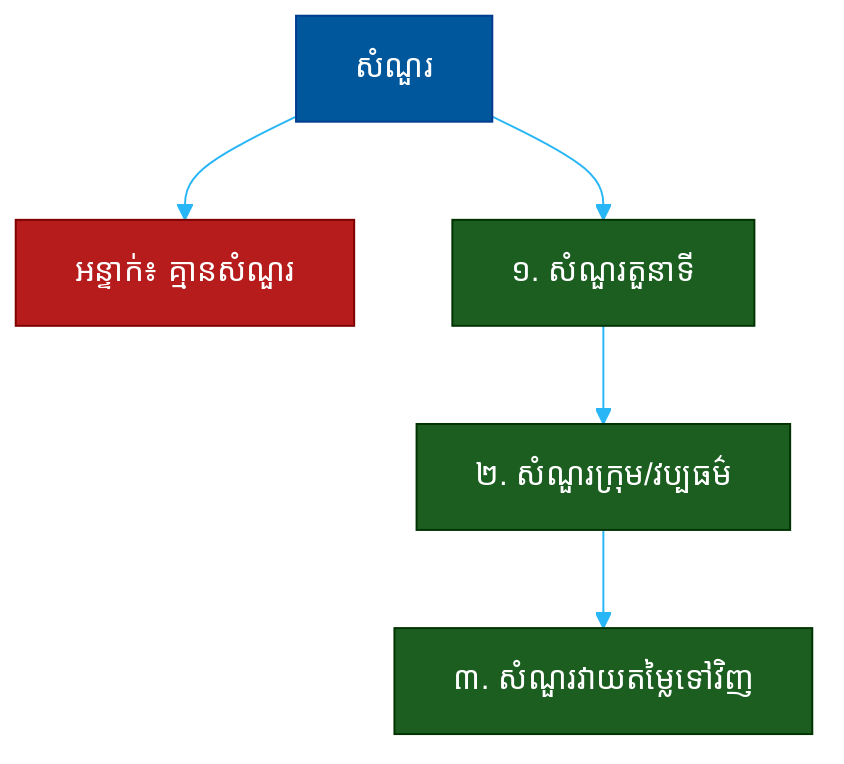

# "តើអ្នកមានសំណួរអ្វីសម្រាប់យើងទេ?" (Do You Have Any Questions for Us?)៖ សំណួរតែមួយដែលបង្ហាញពីការត្រៀមខ្លួន ការគិតបែបម្ចាស់ និងការវាយតម្លៃទៅវិញ

**Author:** ichamrong  
**Date:** 2026-05-30  
**Tags:** #one-question #interview #motivation #fit #curiosity #ownership #communication  
**Category:** Concepts / One Question  
**Read Time:** ~12 min  

---

## 📌 មាតិកា (Table of Contents)
- [អន្ទាក់ (The Setup)](#the-setup)
- [១. សំណួរពិតប្រាកដ (What They Are Really Asking)](#1)
- [២. អ្វីដែលវាបង្ហាញអំពីអ្នក (The Hidden Signals)](#2)
- [៣. អន្ទាក់ — ចម្លើយខ្សោយ (The Trap: Weak Answers)](#3)
- [៤. នីតិវិធីឆ្លើយតប (The Response Procedure)](#4)
- [៥. ឧទាហរណ៍ចម្លើយខ្លាំង (Strong Sample Answer)](#5)
- [៦. សំណួរបន្ត និងរបៀបដោះស្រាយ (Follow-up Traps)](#6)
- [សេចក្តីសន្និដ្ឋាន (Conclusion)](#conclusion)
- [ឯកសារយោង (References)](#references)
- [អត្ថបទពាក់ព័ន្ធ (Related Posts)](#related-posts)

---

## អន្ទាក់ (The Setup) 

ការសម្ភាសន៍ជិតបញ្ចប់ហើយ។ អ្នកសម្ភាសន៍ងាកមកសួរ៖ **«តើអ្នកមានសំណួរអ្វីសម្រាប់យើងទេ?»**

នេះមើលទៅដូចជាការបញ្ចប់បែបពិធីការ — តែវាមិនមែនទេ។ វាជា **ការសម្ភាសន៍ផ្នែកចុងក្រោយ** ដែលឆ្លាស់តួនាទី។ ឥឡូវ **អ្នកជាអ្នកនិយាយ** ហើយ​សំណួរ​ដែល​អ្នក​សួរ​បង្ហាញ​ច្រើន​ជាង​ចម្លើយ​ដែល​អ្នក​បាន​ផ្តល់​ពេញ​ការ​សម្ភាសន៍។

ក្នុងរយៈពេលពីរបីនាទីនេះ គេអាចអានបាន៖
* តើអ្នកបានស្រាវជ្រាវ និងគិតយ៉ាងជ្រៅអំពីតួនាទីនេះឬទេ?
* តើអ្នកគិតបែប «ម្ចាស់» (សួរពីផលប៉ះពាល់) ឬបែប «និយោជិត» (សួរតែពីអត្ថប្រយោជន៍)?
* តើអ្នកក៏កំពុងវាយតម្លៃ **គេ** ដែរឬទេ (ការសម្ភាសន៍ពីរផ្លូវ)?
* តើអ្នកស្តាប់ការសន្ទនាមកដែរឬទេ (សួរបន្តពីអ្វីដែលគេនិយាយ)?

នេះជាផែនទីបង្ហាញផ្លូវសម្រាប់ការឆ្លើយតបឲ្យបានល្អ៖

---

## ១. សំណួរពិតប្រាកដ (What They Are Really Asking) 

អ្នកសម្ភាសន៍មិនមែនកំពុងបញ្ចប់ដោយសុជីវធម៌ទេ។ អ្វីដែលគេពិតជាសួរគឺ៖

> **«ឥឡូវ​ដល់​វេន​អ្នក​ដឹក​នាំ — តើ​អ្នក​គិត​អំពី​តួនាទី​នេះ​យ៉ាង​ជ្រៅ​ប៉ុណ្ណា ហើយ​តើ​អ្នក​ក៏​កំពុង​វាយ​តម្លៃ​យើង​ដែរ​ឬ​ទេ?»**

ការ​មិន​សួរ​សំណួរ​ណា​មួយ​បង្ហាញ​ការ​ខ្វះ​ការ​ចាប់​អារម្មណ៍ ឬ​ការ​ខ្វះ​ការ​ត្រៀម។ ការ​សួរ​សំណួរ​ល្អ​បង្ហាញ​ថា​អ្នក​បាន​គិត​ដូច​ជា​អ្នក​ដែល​នឹង **ធ្វើ​ការ​ងារ​នេះ​ពិត​ៗ** មិន​មែន​គ្រាន់​តែ​ចង់​ទទួល​ការ​ផ្តល់​ជូន​ហើយ​ចប់។ ការ​សម្ភាសន៍​ល្អ​គឺ​ជា​ផ្លូវ​ពីរ — អ្នក​ក៏​ត្រូវ​សម្រេច​ថា​កន្លែង​នេះ​សក្តិសម​នឹង​អ្នក​ដែរ​ឬ​ទេ។

ដូច្នេះ ឱកាសនេះវាស់ ៣ យ៉ាង៖
1. **ការត្រៀមខ្លួន (Preparation)** — តើអ្នកបានគិតយ៉ាងជ្រៅឬទេ?
2. **ការគិតបែបម្ចាស់ (Ownership Mindset)** — តើអ្នកសួរពីផលប៉ះពាល់ ឬតែអត្ថប្រយោជន៍?
3. **ការវាយតម្លៃទៅវិញ (Mutual Evaluation)** — តើអ្នកក៏កំពុងជ្រើសរើសគេដែរទេ?

---

## ២. អ្វីដែលវាបង្ហាញអំពីអ្នក (The Hidden Signals) 

| សញ្ញាដែលគេអាន | ចម្លើយខ្សោយបង្ហាញ | ចម្លើយខ្លាំងបង្ហាញ |
| :--- | :--- | :--- |
| **ការត្រៀម (Preparation)** | «ទេ អត់ទេ» | សំណួរគិតមកជាមុន |
| **ការគិតបែបម្ចាស់ (Ownership)** | សួរតែប្រាក់ខែ-ច្បាប់ឈប់ | សួរពីផលប៉ះពាល់/ភាពជោគជ័យ |
| **ការស្តាប់ (Listening)** | សួររឿងដែលគេបាននិយាយរួច | សួរបន្តពីការសន្ទនា |
| **ការវាយតម្លៃ (Evaluation)** | ទទួលអ្វីៗដោយឥតសួរ | សួរពីបញ្ហាប្រឈមពិត |
| **ការចាប់អារម្មណ៍ (Interest)** | សំណួររាក់ ឥតថាមពល | សំណួរបង្ហាញការខ្នះខ្នែង |

**ចំណុចសំខាន់៖** សំណួរ​អំពី​ប្រាក់​ខែ, ច្បាប់​ឈប់​សម្រាក, និង​ម៉ោង​ធ្វើ​ការ — ទាំង​នេះ​ត្រឹមត្រូវ តែ​ទុក​វា​សម្រាប់​ដំណាក់​កាល​ផ្តល់​ជូន (offer stage)។ នៅ​ការ​សម្ភាសន៍ សួរ​អ្វី​ដែល​បង្ហាញ​ថា​អ្នក​គិត​អំពី **ការ​ងារ​ខ្លួន​ឯង** និង **ផល​ប៉ះពាល់**។

---

## ៣. អន្ទាក់ — ចម្លើយខ្សោយ (The Trap: Weak Answers) 

**អន្ទាក់ទី ១ — អ្នកគ្មានសំណួរ (The Blank):**
> «ទេ អត់ទេ អ្នកបានពន្យល់ច្បាស់ល្អណាស់ហើយ»

ហេតុអ្វីបរាជ័យ៖ វា​បង្ហាញ​ការ​ខ្វះ​ការ​ត្រៀម ឬ​ការ​ខ្វះ​ការ​ចាប់​អារម្មណ៍​ពិត។ បេក្ខជន​ដែល​ខ្នះខ្នែង​តែង​មាន​សំណួរ​ជានិច្ច។

**អន្ទាក់ទី ២ — អ្នកយក (The Taker):**
> «តើ​មាន​ច្បាប់​ឈប់​សម្រាក​ប៉ុន្មាន​ថ្ងៃ? តើ​ខ្ញុំ​ធ្វើ​ការ​ពី​ផ្ទះ​បាន​ទេ?»

ហេតុអ្វីបរាជ័យ៖ មុន​ពេល​គេ​ផ្តល់​ការ​ផ្តល់​ជូន​ផង សំណួរ​ទាំង​នេះ​បង្ហាញ​ថា​អ្នក​គិត​ពី «អ្វី​ខ្ញុំ​ទទួល» ច្រើន​ជាង «អ្វី​ខ្ញុំ​ផ្តល់»។

**អន្ទាក់ទី ៣ — អ្នកមិនបានស្តាប់ (The Inattentive):**
> «តើ​ក្រុមហ៊ុន​អ្នក​ផលិត​អ្វី?» (ក្រោយ​ពេល​គេ​ពន្យល់​៣​ដង)

ហេតុអ្វីបរាជ័យ៖ ការ​សួរ​អ្វី​ដែល​គេ​បាន​ឆ្លើយ​រួច ឬ​អ្វី​ដែល​ងាយ​រក​ឃើញ​លើ​គេហទំព័រ បង្ហាញ​ថា​អ្នក​មិន​បាន​ស្តាប់ ឬ​មិន​បាន​ស្រាវ​ជ្រាវ។

---

## ៤. នីតិវិធីឆ្លើយតប (The Response Procedure) 

ត្រៀមសំណួរ **៣ កម្រិត** ជាមុន (ហើយជ្រើស ២-៣ ដែលសមនឹងការសន្ទនា)៖

**ជំហានទី ១ — សំណួរតួនាទី (The Role Question)**
សួរអំពីភាពជោគជ័យក្នុងតួនាទីនេះ — បង្ហាញការគិតបែបម្ចាស់។
> «ក្នុង ៩០ ថ្ងៃ​ដំបូង តើ​អ្វី​ដែល​អ្នក​ដែល​ជោគជ័យ​ក្នុង​តួនាទី​នេះ​ត្រូវ​សម្រេច?»

នេះបង្ហាញ​ថា​អ្នក​គិត​ពី **ការ​ផ្តល់​លទ្ធផល** មិន​មែន​គ្រាន់​តែ​ទទួល​ការងារ។

**ជំហានទី ២ — សំណួរក្រុម/វប្បធម៌ (The Team Question)**
សួរអំពីរបៀបធ្វើការ — បង្ហាញការវាយតម្លៃនូវភាពសក្ដិសម។
> «តើ​ក្រុម​ដែល​ខ្ញុំ​នឹង​ធ្វើ​ការ​ជាមួយ​ធ្វើ​ការ​សម្រេច​ចិត្ត​យ៉ាង​ដូចម្តេច?»

នេះបង្ហាញ **ការ​វាយ​តម្លៃ​ទៅ​វិញ** និង​ភាព​ចាប់​អារម្មណ៍​ពិត។

**ជំហានទី ៣ — សំណួរវាយតម្លៃទៅវិញ (The Reverse Question)**
សួរអំពីបញ្ហាប្រឈមពិត — បង្ហាញភាពចាស់ទុំ និងភាពមិនខ្លាចការពិត។
> «តើ​អ្វី​ជា​បញ្ហា​ប្រឈម​ធំ​បំផុត​ដែល​ក្រុម​នេះ​កំពុង​ប្រឈម​ឥឡូវ?»

នេះបង្ហាញ​ថា​អ្នក​ចង់​ដឹង​ការ​ពិត​ មិន​មែន​ត្រឹម​ផ្នែក​ស្អាត​ៗ។

---

## ៥. ឧទាហរណ៍ចម្លើយខ្លាំង (Strong Sample Answer) 

> **«បាទ មាន​បី​សំណួរ។ ទី​មួយ — ក្នុង ៩០ ថ្ងៃ​ដំបូង តើ​អ្វី​ដែល​អ្នក​ដែល​ជោគជ័យ​ក្នុង​តួនាទី​នេះ​ត្រូវ​សម្រេច? ខ្ញុំ​ចង់​ដឹង​ច្បាស់​ថា​លទ្ធផល​មើល​ទៅ​យ៉ាង​ណា។ ទី​ពីរ — អ្នក​បាន​លើក​ឡើង​មុន​នេះ​ថា​ក្រុម​កំពុង​ផ្លាស់​ប្តូរ​ទៅ​ប្រព័ន្ធ​ថ្មី — តើ​ការ​ផ្លាស់​ប្តូរ​នោះ​ឈាន​ដល់​ណា​ហើយ? ហើយ​ទី​បី — ត្រង់ៗ តើ​អ្វី​ជា​បញ្ហា​ប្រឈម​ធំ​បំផុត​ដែល​ក្រុម​នេះ​កំពុង​ប្រឈម​ឥឡូវ?»**

**ការវិភាគ (Breakdown):**
* «ក្នុង ៩០ ថ្ងៃ... ត្រូវសម្រេចអ្វី?» → ការគិតបែបម្ចាស់ (ownership / outcomes)
* «អ្នកបានលើកឡើងមុននេះ...» → ការស្តាប់ (active listening, follow-up)
* «ត្រង់ៗ... បញ្ហាប្រឈមធំបំផុត?» → ការវាយតម្លៃទៅវិញ (mutual evaluation, maturity)
* «បាទ មានបីសំណួរ» → ការត្រៀមខ្លួន (preparation)

**ប្រៀបធៀប៖**
* ❌ ខ្សោយ៖ «ទេ អត់ទេ» ឬ «ច្បាប់ឈប់សម្រាកប៉ុន្មានថ្ងៃ?»
* ✅ ខ្លាំង៖ ចម្លើយ ៣ សំណួរខាងលើ

---

## ៦. សំណួរបន្ត និងរបៀបដោះស្រាយ (Follow-up Traps) 

ការសួរសំណួរល្អនឹងនាំទៅរកការសន្ទនាបន្ត — ត្រូវត្រៀមដោះស្រាយ៖

**«ហេតុ​អ្វី​អ្នក​សួរ​ពី​បញ្ហា​ប្រឈម?» (Why do you ask about challenges?)**
> «ដោយ​សារ​ខ្ញុំ​ចង់​ដឹង​ថា​ខ្ញុំ​អាច​ជួយ​ត្រង់​ណា​បាន​លឿន​បំផុត។ បើ​ខ្ញុំ​ដឹង​បញ្ហា​ធំ​បំផុត ខ្ញុំ​អាច​គិត​ពី​របៀប​ដែល​បទពិសោធន៍​ខ្ញុំ​អនុវត្ត​បាន»។

**«តើ​អ្នក​មាន​ការ​បារម្ភ​អ្វី​អំពី​តួនាទី​នេះ​ទេ?» (Any concerns about the role?)**
> ឆ្លើយ​ដោយ​ភាព​ស្មោះត្រង់​ដែល​បង្ហាញ​ការ​គិត៖ «មិន​មែន​ការ​បារម្ភ​ទេ តែ​ខ្ញុំ​ចង់​យល់​ច្បាស់​ពី​របៀប​ដែល​អាទិភាព​ត្រូវ​បាន​កំណត់ ដ្បិត​ខ្ញុំ​ឃើញ​មាន​គម្រោង​ច្រើន​ដំណើរ​ការ​ស្រប​គ្នា»។ នេះ​បង្ហាញ​ការ​គិត​ជ្រៅ មិន​មែន​ការ​ភ័យ។

**ច្បាប់មាស៖** ឱកាសសួរសំណួរនេះ គឺ​ជា **ការ​សម្ភាសន៍​ខ្លី​បំផុត​ដែល​អ្នក​ដឹក​នាំ**។ សំណួរ​ដែល​អ្នក​សួរ​បង្ហាញ​ពី​អ្វី​ដែល​អ្នក​ឲ្យ​តម្លៃ — ដូច្នេះ​សួរ​អ្វី​ដែល​ម្ចាស់​ការងារ​នឹង​សួរ។

---

## សេចក្តីសន្និដ្ឋាន (Conclusion) 

សំណួរ «តើអ្នកមានសំណួរអ្វីសម្រាប់យើងទេ?» មិនមែនជាការបញ្ចប់បែបពិធីការទេ។ វាជា **ការសម្ភាសន៍ឆ្លាស់តួនាទី** ដែលឆ្លុះបញ្ចាំងថាតើអ្នកគិតយ៉ាងជ្រៅ និងគិតបែបម្ចាស់ប៉ុណ្ណា។

ចងចាំរូបមន្ត ៣ កម្រិត៖
1. **សំណួរតួនាទី** (ភាពជោគជ័យមើលទៅយ៉ាងណា?)
2. **សំណួរក្រុម/វប្បធម៌** (របៀបធ្វើការ?)
3. **សំណួរវាយតម្លៃទៅវិញ** (បញ្ហាប្រឈមធំបំផុត?)

កុំ​ភ្លេច​ថា​ការ​សម្ភាសន៍​គឺ​ជា​ផ្លូវ​ពីរ — សំណួរ​ដែល​អ្នក​សួរ​អាច​ធ្វើ​ឲ្យ​អ្នក​ផ្លាស់​ពី «បេក្ខជន​ម្នាក់» ទៅ​ជា «ដៃ​គូ​ដែល​គេ​ចង់​បាន»។

---

## ឯកសារយោង (References) 

- *The First 90 Days* — Michael D. Watkins
- *A More Beautiful Question* — Warren Berger
- *Cracking the Coding Interview* — Gayle Laakmann McDowell

---

## អត្ថបទពាក់ព័ន្ធ (Related Posts) 

- [Why Do You Want This Job? (ហេតុផលចង់បាន)](01-why-do-you-want-this-job.md)
- [Where Else Are You Interviewing? (កន្លែងផ្សេង)](04-where-else-are-you-interviewing.md)
- [One Question Index](../README.md)
