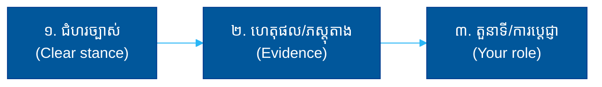

# សំណួរតែមួយ (The One Question): Index

**Author:** ichamrong  
**Category:** Concepts / One Question  
**Read Time:** ~10 min  

---

## ១. ទស្សនវិជ្ជាស្នូល (The Core Philosophy)

ពេលខ្លះ អ្នកសម្ភាសន៍ ស្ថាបនិក ឬវិនិយោគិន សួរអ្នកត្រឹមតែ **សំណួរមួយ** — ប៉ុន្តែតាមរយៈចម្លើយរបស់អ្នក គេ​អាច​អាន​បាន​យ៉ាង​ច្បាស់​អំពី​អ្នក៖ ទំនុកចិត្ត (confidence), ជំនឿ​លើ​ចក្ខុវិស័យ (belief in vision), ភាព​ច្បាស់​នៃ​ការ​គិត (clarity), ជម្រៅ​ចំណេះដឹង (depth of knowledge), និង​ចរិត​លក្ខណៈ (character)។

This library collects **high-signal questions** — single questions where *how* you answer matters more than *what* you answer. គេ​មិន​បាន​វាស់​ថា​ចម្លើយ​ត្រូវ​ឬ​ខុស​ទេ — គេ​វាស់ **របៀប​ដែល​អ្នក​គិត** ឆ្លង​កាត់​សំណួរ​នោះ។

រាល់ឯកសារនីមួយៗ បំបែកសំណួរទៅជា៖
1. **សំណួរពិតប្រាកដ** (What they are really asking)
2. **សញ្ញាលាក់កំបាំង** (The hidden signals you reveal)
3. **អន្ទាក់** (Weak answers that fail)
4. **នីតិវិធីឆ្លើយតប** (A step-by-step procedure to respond)
5. **ឧទាហរណ៍ចម្លើយខ្លាំង** (A strong sample answer with breakdown)
6. **សំណួរបន្ត** (Follow-up traps)

---

## ២. គោលការណ៍សកល (The Universal Principle)

រាល់ «សំណួរតែមួយ» ទាំងអស់ ចែករំលែករូបមន្តឆ្លើយតបដូចគ្នា៖

**ច្បាប់មាស (The Golden Rule):** កុំ​ឆ្លើយ​ឲ្យ​ពេញ​ចិត្ត (flattery) ហើយ​ក៏​កុំ​សង្ស័យ​ខ្លួន​ឯង​ខ្លាំង​ពេក (over-doubt) ដែរ។ ចម្លើយ​ល្អ​ស្ថិត​នៅ​ចំ​កណ្តាល៖ **ជឿ ប៉ុន្តែ​ស្មោះត្រង់​នឹង​ហានិភ័យ​**។

---

## ៣. ប្រភេទសំណួរ (The Categories)

| ប្រភេទ (Category) | តើគេវាស់អ្វី? (What it tests) | ឯកសារ (Folder) |
| :--- | :--- | :--- |
| **🚀 ស្ថាបនិក Startup** | ជំនឿ, ភាពជាម្ចាស់, ការទ្រាំទ្រនឹងភាពមិនច្បាស់ | [01-startup-founder](./01-startup-founder/) |
| **💰 វិនិយោគិន / VC** | ភាពច្បាស់, ការដឹងពីហានិភ័យ, ទំហំទីផ្សារ | [02-investor-vc](./02-investor-vc/) |
| **🧭 ភាពជាអ្នកដឹកនាំ / ចក្ខុវិស័យ** | ការគិតយុទ្ធសាស្ត្រ, ភាពចាស់ទុំ | [03-leadership-vision](./03-leadership-vision/) |
| **🪞 ការដឹងខ្លួនឯង** | ភាពស្មោះត្រង់, EQ, ភាពចាស់ទុំ | [04-self-awareness](./04-self-awareness/) |
| **🔥 កម្លាំងជំរុញ / ភាពសមស្រប** | ការប្តេជ្ញាចិត្ត, ភាពសមនឹងវប្បធម៌ | [05-motivation-fit](./05-motivation-fit/) |

---

## ៤. បញ្ជីសំណួរទាំងអស់ (Full Question List)

### 🚀 ស្ថាបនិក Startup (Startup Founder)
- [តើអ្នកជឿថាវាអាចជោគជ័យបានទេ? (Do you believe this can succeed?)](./01-startup-founder/01-do-you-believe-this-can-succeed.md)
- [ហេតុអ្វីបានជាអ្នកចង់ចូលរួម startup? (Why join a startup?)](./01-startup-founder/02-why-do-you-want-to-join-a-startup.md)
- [តើអ្នកនឹងធ្វើអ្វីក្នុង ៩០ ថ្ងៃដំបូង? (Your first 90 days?)](./01-startup-founder/03-what-would-you-do-in-your-first-90-days.md)
- [តើអ្នកទទួលយកភាពមិនច្បាស់លាស់បានទេ? (Okay with uncertainty?)](./01-startup-founder/04-are-you-okay-with-uncertainty.md)
- [តើអ្នកគិតថាផលិតផលយើងមានអ្វីខុស? (What's wrong with our product?)](./01-startup-founder/05-what-do-you-think-is-wrong-with-our-product.md)

### 💰 វិនិយោគិន / VC (Investor / VC)
- [ហេតុអ្វីបានជាអ្នកនឹងឈ្នះ? (Why will you win?)](./02-investor-vc/01-why-will-you-win.md)
- [តើអ្វីជារបាំងការពាររបស់អ្នក? (What is your moat?)](./02-investor-vc/02-what-is-your-moat.md)
- [តើវាអាចធំប៉ុណ្ណា? (How big can this get?)](./02-investor-vc/03-how-big-can-this-get.md)
- [តើអ្វីអាចសម្លាប់ក្រុមហ៊ុននេះ? (What could kill this company?)](./02-investor-vc/04-what-could-kill-this-company.md)
- [ហេតុអ្វីបានជាពេលនេះ? (Why now?)](./02-investor-vc/05-why-now.md)

### 🧭 ភាពជាអ្នកដឹកនាំ / ចក្ខុវិស័យ (Leadership / Vision)
- [តើអ្នកមើលឃើញវានៅ ៥ ឆ្នាំទៀតយ៉ាងណា? (Where in 5 years?)](./03-leadership-vision/01-where-in-five-years.md)
- [តើអ្នកធ្វើការសម្រេចចិត្តពិបាកៗយ៉ាងណា? (How do you make hard decisions?)](./03-leadership-vision/02-how-do-you-make-hard-decisions.md)
- [ប្រាប់ខ្ញុំពីពេលដែលអ្នកបរាជ័យ (A time you failed?)](./03-leadership-vision/03-tell-me-about-a-time-you-failed.md)
- [តើអ្នកដោះស្រាយការមិនយល់ស្របយ៉ាងណា? (Handling disagreement?)](./03-leadership-vision/04-how-do-you-handle-disagreement.md)
- [តើជោគជ័យមើលទៅយ៉ាងណាសម្រាប់អ្នក? (What does success look like?)](./03-leadership-vision/05-what-does-success-look-like-to-you.md)

### 🪞 ការដឹងខ្លួនឯង (Self-Awareness)
- [តើអ្វីជាចំណុចខ្សោយធំបំផុតរបស់អ្នក? (Biggest weakness?)](./04-self-awareness/01-what-is-your-biggest-weakness.md)
- [តើមិត្តរួមការងារនិយាយយ៉ាងណាអំពីអ្នក? (What would coworkers say?)](./04-self-awareness/02-what-would-your-coworkers-say-about-you.md)
- [ប្រាប់ខ្ញុំពីមតិកែលម្អដែលពិបាកស្តាប់ (Hard feedback?)](./04-self-awareness/03-tell-me-about-feedback-that-was-hard-to-hear.md)
- [ហេតុអ្វីបានជាអ្នកចាកចេញពីការងារចាស់? (Why did you leave?)](./04-self-awareness/04-why-did-you-leave-your-last-job.md)
- [តើមានអ្វីដែលអ្នកមិនពូកែ? (What are you not good at?)](./04-self-awareness/05-what-are-you-not-good-at.md)

### 🔥 កម្លាំងជំរុញ / ភាពសមស្រប (Motivation / Fit)
- [ហេតុអ្វីបានជាអ្នកចង់បានការងារនេះ? (Why this job?)](./05-motivation-fit/01-why-do-you-want-this-job.md)
- [ហេតុអ្វីបានជាយើងគួរជ្រើសរើសអ្នក? (Why should we hire you?)](./05-motivation-fit/02-why-should-we-hire-you.md)
- [តើអ្វីជាកម្លាំងជំរុញអ្នក? (What motivates you?)](./05-motivation-fit/03-what-motivates-you.md)
- [តើអ្នកកំពុងសម្ភាសន៍កន្លែងណាខ្លះទៀត? (Where else interviewing?)](./05-motivation-fit/04-where-else-are-you-interviewing.md)
- [តើអ្នកមានសំណួរអ្វីសម្រាប់យើងទេ? (Any questions for us?)](./05-motivation-fit/05-do-you-have-any-questions-for-us.md)

---

## ៥. របៀបប្រើ (How to Use This Library)

1. **មុនពេលសម្ភាសន៍** — អាន​ប្រភេទ​ដែល​ពាក់ព័ន្ធ​នឹង​តួនាទី​អ្នក (startup? leadership?)។
2. **អនុវត្តន៍ខ្លាំងៗ** — និយាយ​ចម្លើយ​ឧទាហរណ៍​ឲ្យ​ឮ ហើយ​ប្តូរ​ឲ្យ​ត្រូវ​នឹង​រឿង​ពិត​របស់​អ្នក​ផ្ទាល់។
3. **ផ្តោតលើ «ហេតុអ្វី»** — រាល់​ចម្លើយ​ល្អ​ត្រូវ​មាន​ហេតុផល​ផ្ទាល់​ខ្លួន មិន​មែន​ចម្លង​ពាក្យ​ស្តង់ដារ​ទេ។

---

## 🔗 អត្ថបទពាក់ព័ន្ធ (Cross-References)

- [Career Paths & Team Roles](../career-paths/README.md)
- [Parables (រឿងប្រស្នា)](../parables/)
- [Concepts Index](../README.md)
